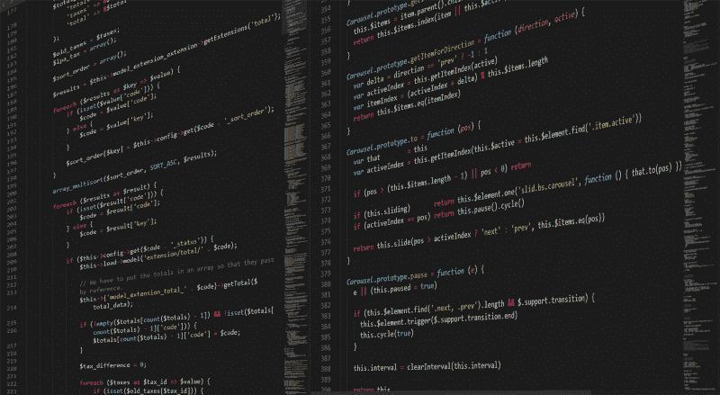

# 如何学习 Java 编码:为什么应该学习以及从哪里开始

> 原文：<https://www.freecodecamp.org/news/learn-to-code-in-java-why-you-should-and-where-to-start-39022d15655d/>

作者约翰·塞拉斯基

# **如何学习 Java 编程:为什么要学，从哪里开始**

The pic by [Boskampi](https://pixabay.com/ru/users/boskampi-3788146/) on [Pixabay](https://pixabay.com/)

**明确职业目标，选择语言。对于任何一个没有编程经验，并打算加入开发者社区的人来说，这是最重要的建议。但是，在不知道哪种语言最适合您的目的的情况下，您如何做出选择呢？**

**如果所有编程语言中有一个“市场领导者”岂不是很容易？那么所有的新来者都可以有一个安全的选择——学习这种语言，你肯定会有很高的需求。当然，不可能。语言是解决众多任务的“工具”。但是，仍然有一个可以被认为是最佳选择 Java。**

Java 是一种结构良好的面向对象的语言，对于初学者来说可以认为是很容易的。你可以很快掌握它，因为有许多过程是自动运行的。你不必深究“那里的东西是如何工作的”。Java 是一种跨平台的语言。它允许程序员创建可以部署在任何设备上的应用程序。它是物联网的首选语言，也是构建企业级应用的合适工具。

对一个“新生”来说重要的是，Java 有一个最大的全球社区和高质量的文档。如果你有问题，很可能答案已经准备好了，就在那里等着你。Java 的另外两个好处是庞大的集合和框架，涵盖了初级开发人员必须面对的大部分挑战。

最后，它是一门有着体面背景和光明未来的语言。两个最新版本，增加了新的特性，在六个月内相继发布。这有助于 Java 站在前沿，并在令人尊敬的专业排名中保持最高位置。

但是，即使当我们谈论一种学习曲线很低的编程语言时，对于初学者来说也有很多隐藏的障碍。你需要多少时间来学习？哪些消息来源值得信任？要避免哪些错误？让我们一路走过你的学习经历。

# **确保绕过常见障碍**

你是编程新手。祝贺你:因为你可以利用其他程序员的经验，避免自学中的常见错误。以下是一些常见的失误。

## **没有设定具体目标的学习**

要估算某种编程语言的知识规模和期望水平，首先你要回答一个简单的问题:你为什么需要编程？

如果你对编码很认真，并打算成为一名 Java 开发人员，你需要每天至少学习 4-5 个小时。但是如果你只是想扩大你的范围，你可以选择一个更放松的节奏。无论如何，尽量不要在未来几年延长你的教育，因为技术在发展。当你学习某种框架或开发工具来找工作时，它就过时了。

阅读弹出的“任何有用的东西”并不是最好的学习策略。对总体规划进行调整是可以的。然而，完全不遵循它将不可避免地挫伤你的积极性。

## **试图一次学习太多技术**

这是一个后续的错误，导致学习永无止境。不要试图用太多的技术和工具来填充你的教育计划，以免精疲力尽。你需要时间来处理信息，看看实践中一切是如何进行的。

## **太多没有实践的研究和理论**

编程是一项只有通过大量练习才能获得的技能。理论上你需要一个严肃的背景，但是只要你只是阅读(或观看)讲座和课程，你就不能真正编码。想想吧。没有人不试一试就能学会游泳。你需要解释，但最重要的是，你需要行动。

只有大量的实践才能教会你如何处理程序员的日常问题。例如，你会养成定期检查代码的习惯，不会让相关的问题堆积起来。你也将从最简单的解决方案开始。然后转向更精致的，不断改进你的代码。最重要的是，你将习惯于每天编写代码。

## **学习独立编码**

初学者经常犹豫，是否应该加入在线编程社区或参加活动，主要是因为冒名顶替综合症。但是请记住:没有人想打倒你。编程社区是协作的。这就是众多开放数据源的出现方式。他们习惯于在团队中工作，当然，在人生的某个阶段，他们都是新手。

看一看:有很多关于编程的论坛和网络资源。开发人员热切地分享他们的知识，并对合作持开放态度。你可以开始在线学习，从更有经验的同事那里获得有用的提示，然后找到你的第一个编码项目。

## 确信有一天你会完全理解编程的所有方面

如果有人发现了一种药丸，服用后立即精通任何编程语言，他将是这个星球上最富有的人(抱歉，杰夫·贝索斯)。但在那之前，如果你选择成为一名程序员，你的教育没有终点。即使你有工作，也不要停止学习。在编程世界里，事情变化很快。

另一方面，当你还在学习如何编码时，试着接受一些事实。不要深究每一个主题，因为它的背景可能太“沉重”。

# **制定完美的训练计划**

逐步实现你的目标更容易。现在，当你知道了常见的错误，你就可以避免它们。下面是学习 Java 的五个步骤。

1.  ****设定目标，选择语言。****

用 Java 你几乎可以做任何事情。您可以构建应用程序服务器、桌面和移动应用程序、企业应用程序，并运行单元测试。但是当然，编程语言并不是成为专业人士所需要知道的一切。试着想出具体的活动领域。

今天的趋势是构建基于云的应用程序(您还需要学习云计算基础知识和用于云开发的特定工具)、使用物联网、执行大数据分析、创建游戏等。

****2。创建一个教育计划。****

你准备好把 Java 编程作为你的职业了吗？然后每天至少花 2-3 小时(工作日)到 5 小时(周末)学习。在这种情况下，你可能需要 3 到 6 个月的时间来准备初级开发人员的职位。

一般来说，你的学习过程会分为几个阶段:

*   从 Oracle 网站安装 JDK (Java 开发工具包)，安装 Java 运行时环境(IntelliJ IDEA、Eclipse 或 NetBeans)；
*   学习 Java 语法；
*   学习 Java 核心；
*   学习 Java 集合；
*   学习流行的库和框架；
*   探索常用的 API(例如 servlets、JSP、JDBC、JUnit)；
*   掌握 Git
*   诸如此类。

试着遵循你的计划，保持理论和实践的平衡。编程是一个需要每天训练的技能。如果你完成了某个科目的学习，继续做一些编码任务(3 到 10 个，取决于它们的难度)。

你可以很容易地将众所周知的帕累托法则(80/20 法则)调整到 Java 学习中。“20”代表研究，“80”代表实践。这并不夸张:你需要比阅读多四倍的编码来记住你所学的知识并发展你的编码技能。不幸的是，如果你不马上写你的代码，你会在第二天忘记你读过的所有东西。幸运的是，如果你有正确的来源，你不需要发明自己的培训计划。

****3。选择合适的工具并加入编程社区。****

实话实说:完美的 Java 课程是不存在的。有些会给你一个深刻的基础知识，有些会提供大量的实践。选择一些教育、交流和实践的平台。选择一门结合了简单的理论解释和真实编码的在线课程。

加入社区，在这里你可以问任何关于 Java 编码方面的问题，分享你的想法并找到志同道合的人。下面列出了 Java 开发人员的顶级社区。

# **使用多种资源学习 Java**

你需要很多工具来完成你的目标。这里有一套帮助你成功的“工具”。

1.  ****严格练习:****[****CodeAcademy****](https://www.codecademy.com/learn)

这可能是学习多种语言的最著名的在线平台之一。当然，也有一个面向 Java 学习者的部分。这里你从第一课开始编码。这里有一些非常有用的提示，如果某项任务看起来很难(当你是初学者时这很正常)，你可以得到这些提示。逻辑很简单:读取任务，编写代码并运行它以查看结果，然后进入下一步。任务逐渐变得更加复杂，直到您开始从头开始编写代码。FAQ 部分非常有用，你可以选择与其他学生讨论每个任务。

这门课程可以成为学习 Java 的一个很好的辅助工具。如前所述，你需要编码来掌握 Java 编程。

****2。从头玩和码:****[****codegym . cc****](https://codegym.cc/)

这些是面向 Java 学习者的在线课程，有一个特点——游戏化。如今，在线课程普遍采用游戏化的元素，因为它们能带来即时的动力、持续的成就感，并使你更容易达到目标。

在 CodeGym，你可以从未来世界的 0 级开始，体验太空旅行、机器人和其他很酷的东西。你的目标是通过四个教育任务来提升一个角色——一个机器人。每个任务包括 10 个级别，每个级别有多达 10-12 节课，由银河船的船员讲授。一节课由一个基本理论和一系列任务组成，包括即时验证和如何改进代码的提示。你从头开始编码，解决非常简单的任务，直到你准备好更复杂和大量的编码项目。

整个故事让你不要停留在某个主题或任务上，向前迈进，稍后再回到“困境”。总而言之，一门课有令人印象深刻的 1200+任务。在至少 300-500 小时的编码中转换的数量。

****3。挑战程序员:****[****Codewars****](https://www.codewars.com/)

这是另一个有大量实践的在线平台。虽然它更适合至少有少量编程背景的学习者。通过训练形，代码战使你能够提高某种语言的技能。

您可以在浏览器中编写代码，并使用测试用例来逐步检查它。您还可以将您的解决方案与其他解决方案进行比较，以拓宽您的知识面并讨论最佳实践。每个形都有等级，每个形都是对其他程序员的挑战。当你解决更困难的任务时，你可以获得更复杂的挑战来提高编码技能。这个平台与其他平台的不同之处在于，它允许在一个小组中学习和练习。

****4。听一个“亲”级的讲座:****[****EdX****](https://www.edx.org/learn/java)

EdX 是由哈佛大学和麻省理工学院创办的教育平台。它涵盖了许多研究领域，包括 Java 编程和许多相关主题。大学提供大量经过验证的入门课程和证书课程。

每门课程都有明确的时间框架，包括视频讲座和文字记录。很容易回到以前的课程，并修改材料。有几十种不同的课程，其中一些是免费的。但是，这仍然是学习 Java 理论的严格来源。一定要用几个小时的编码来强化那些课程。

想了解 Java 世界的最新消息、评论和更新吗？这是正确的做法。Java 在不断发展、升级并带来新的特性。确保有几个你可以每天阅读的媒体。其中最大的是:

*   [Javaworld](https://www.javaworld.com/) (新闻、有用的教程、“how to’s”和其他一切让你跟上 Java 编程的东西)；
*   [Java 代码极客](https://www.javacodegeeks.com/)(一个资源中心，为学习 Java 的人提供教育教程、文章和如何获得 Java 程序员工作的技巧)；
*   [DZone](https://dzone.com/java-jdk-development-tutorials-tools-news) (针对初学者和有经验的开发者的大量文章和指南)；
*   【Java 访问了(一个每日更新的博客，涵盖众多 Java 学习主题)。

你还记得加入社团让你的教育更有效的建议吗？你可以在 [Stack Overflow 的](https://stackoverflow.com/questions/tagged/java) Java 部分或者[code branch](https://coderanch.com/c/java)中提出任何问题。此外，Reddit 上至少有三个大型社区，如 [learnprogramming](https://www.reddit.com/r/learnprogramming/) 、 [java](https://www.reddit.com/r/java/) 和 [learnjava](https://www.reddit.com/r/learnjava/) ，在那里你可以找到学习 java 和编程的有用技巧。如果你需要更具体的信息，例如，在某些任务中改进代码的提示，尝试 CodeGym 的特殊[帮助部分](https://codegym.cc/help)，在那里其他学生和“编码教练”将帮助你解决任何问题。最后，Oracle 有一个巨大的 Java 社区，对新手和有经验的开发者开放。

作为一名程序员意味着不断的进步和获得新的知识。如果你从一开始就掌握了自学的诀窍，你一定会成功的。你准备好尝试了吗？