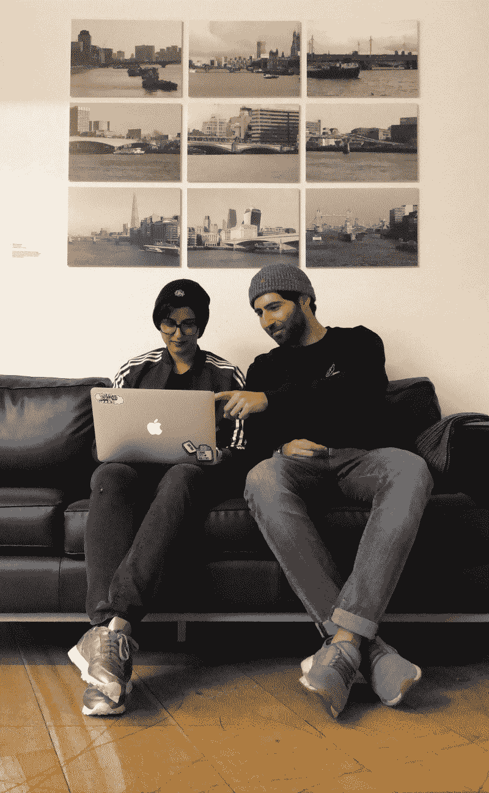
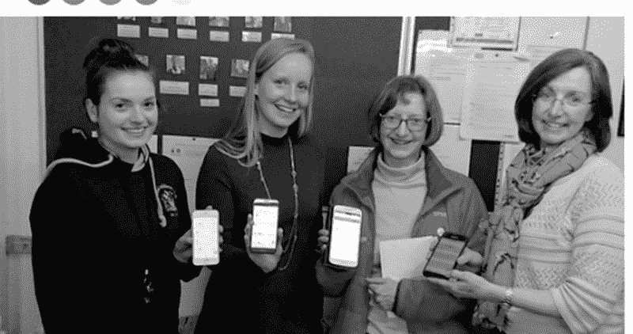
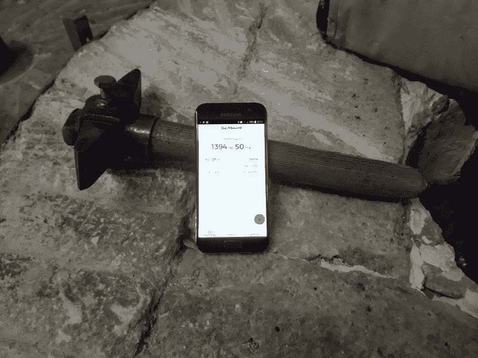
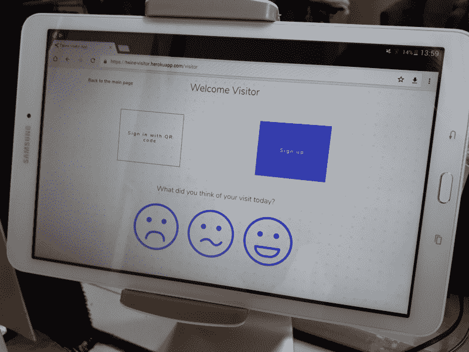
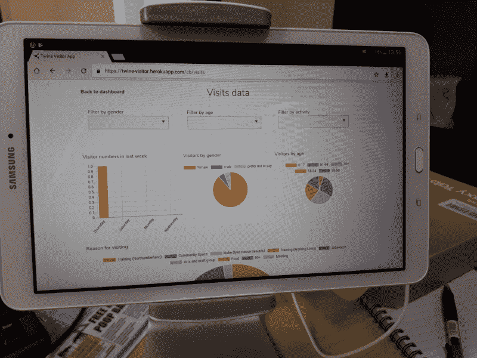

# 一个非营利组织如何在为用户构建更好的数字平台的同时节省资金

> 原文：<https://www.freecodecamp.org/news/how-one-nonprofit-saved-money-while-building-a-better-digital-platform-for-their-users-de06b1b7ec62/>

丽贝卡·帕丁

# 一个非营利组织如何在为用户构建更好的数字平台的同时节省资金

#### 对“改变的力量”项目经理索尼娅·温克以及创始人和程序员毕业生埃利亚斯·马利克和艾莎·纳西尔的采访

*自 2016 年以来，[改变的力量](https://www.powertochange.org.uk/)一直在开发 [Twine](https://www.twine-together.com/) ，这是一个帮助社区企业为其社区带来改变的数字平台。起初,“改变的力量”很难弄清楚如何确保软件满足忙碌的变革者的需求。*

在这次采访中，你将听到 Twine 项目的原经理 Sonja Wiencke 和 Elias Malik 和 Aisha Nasir,[的创始人和程序员](http://www.foundersandcoders.com)的毕业生帮助 Power to Change 开发了一个更好的工具。

Aisha Nasir and Elias Malik working on Twine

丽贝卡:我们先来了解一下背景。你们每个人能告诉我一点你们的职业轨迹吗？

**索尼娅:**当然。虽然我的背景是外交，但在完成硕士学位后，我决定进入社会部门，并开始参加[慈善工作研究生计划](http://www.charity-works.co.uk/graduate-programme/)。在这个项目中，我注意到各种规模的慈善机构都在努力理解他们的数据。我从未将自己视为数据或分析专家，但我意识到，通过分享我在这一领域的技能，我可以为该行业做出贡献。当 Twine 项目官员的工作出现时，我抓住了这个机会，以改善慈善机构对如此大规模数据的访问。

丽贝卡:索尼娅，你能告诉我们一些关于 Twine 的事情吗？它到底是做什么的？

**Sonja:** Twine 是一个企业和慈善机构从数据中学习的平台，由支持英格兰社区企业的独立信托机构 Power to Change 出资建立。

我们一直在与创始人和编码人员合作，开发这个平台的一部分，帮助社区或社交企业收集企业日常运营所需的数据，例如志愿者贡献的工作，以及访问他们服务的人数。

丽贝卡:伊利亚和艾莎，你们每个人呢？

我在大学学的是数学，然后在航天工业做了三年的控制工程师。这是一个非常好的技术教育，但是由于各种原因，我决定改变方向，所以我转向了软件开发。在我 2016 年完成创始人和程序员课程后，我在一家名为 [IP Cortex](https://www.ipcortex.co.uk/) 的公司做了大约一年的自由职业者。

大约在那个时候，Founders and Coders 在中东设立了项目。我决定离开开发部门一段时间，这样我就可以出去帮忙了。2017 年夏天，我在第一批学员、当地员工和一些来自伦敦的导师的帮助下，为第二批加沙学员提供了课程。当我回到伦敦时，我与第一批中的四名加沙人一起远程工作了几个月。

艾莎:我在大学学习电影制作，然后获得了小学教育的研究生证书，并担任了两年的小学教师。当编码被加入到英国的课程中时，我在学校找到了一份 IT 顾问的工作，教授和规划他们的计算机科学课程。

虽然我喜欢和年轻人一起工作，但我对学校课程对教师的限制感到沮丧，所以我离开了教室，去追求开发人员的职业生涯。我做过创始人和程序员，然后受雇在伦敦帮助下一批人。我是在兼职支持[演职人员](https://wearecast.org.uk/)数字团队的时候做的。我的团队为慈善机构设计并建造了解决组织挑战的原型，与索尼娅最初参加的黑客日的风格相同。项目结束后，我去了国外，在我们的拿撒勒和加沙项目中担任导师。

**丽贝卡:**索尼娅，回来缠绕**，**这个想法是怎么来的？

**Sonja:** 两年前，我们在 Power to Change 的评估和影响负责人决定投资开发一个更好的数据工具。我们自己的研究和政策工作需要这些数据，我们也希望小型社区组织能够为自己收集重要的数据。

因为 Power to Change 是一个相对较小的赠款组织，没有软件开发方面的内部专业知识，所以我们求助于软件开发机构——实际上是几家——它们各自构建了平台的不同部分。但这变成了一个真正令人头痛的问题，因为每组开发人员都使用不同的框架为他们的项目部分编写代码，在某些情况下，这些框架不是特别兼容。

丽贝卡:听起来真令人沮丧！

索尼娅:果然是！代理商和他们的开发人员也同时从事许多不同的项目，所以他们并不总是有时间完全了解用户和他们对每个用户的要求。此外，我们的用户并不是应用程序开发人员心目中的那种人——他们通常更喜欢纸质电子表格，而不是应用程序，并且没有太多时间来学习新技术。

最后，因为代理机构同时在这么多项目上工作，他们可能需要一段时间来安排 bug 修复，所以有时当我们的用户报告一个 bug 时，他们必须等待几个星期才能看到它被修复。

**Rebecca:** 你最初是怎么遇到创始人和程序员的？

**索尼娅:**出于纯粹的运气！就在我开始工作两周后，我当时的经理建议我参加一个由 [Yoti](http://www.yoti.com) 主办的、由创始人和程序员支持的“慈善黑客日”。我带着一个明确的问题去参加活动:我们的用户想要测量他们社区业务的访客流量。我的希望是，我们会提出一个应用程序的想法，可以成为 Twine 平台的一部分，该平台已经包括一个面向志愿者的应用程序和相关的管理仪表板。

“改变的力量”已经尝试了几个没有成功的想法，所以我今天的挑战是与来自创始人和编码者的开发人员合作，制定一个简单的技术解决方案，收集有价值的数据，并易于技术知识有限的人使用。和我们一起工作的学生非常棒，他们有如此好的想法！在我们一起度过的最后一天，在便利贴上诞生了在 Twine visitor 应用上使用平板电脑和可扫描“会员卡”的想法。

**Rebecca:** 很高兴听到你发现这个过程很有用！事实上，基于你参加的 hack day 和其他类似活动的成功，创始人和程序员最近为想要建立数字服务的非营利组织推出了 [Tech for Better 项目](https://www.foundersandcoders.com/techforbetter)。

索尼娅:这真是个好消息。

丽贝卡:那么，索尼娅，你对创始人和程序员的第一印象是什么？

在为期 16 周的训练营的最后三周，我们与三名学生合作，他们创建了一个 MVP——一个最小可行的产品，或者说是最基本的版本，允许我与访问者应用的用户一起测试应用。他们非常有动力，真心渴望开发一个好的应用程序。他们还兑现了自己的承诺，并建立了一些足够有效的东西，以说服变革力量投资于全面发展。

**丽贝卡:**接下来发生了什么？说说从 MVP 到完整产品的过渡？

Sonja: 在他们毕业后的七个月里，我们与一个由三名创始人和程序员组成的团队合作，其中包括 Aisha，直到我们在 5 月份推出了 visitor footfall 应用程序，该应用程序受到了我们用户的好评。

Sonja with a group of volunteers at an organisation that uses Twine

Aisha: 在加沙的时候，我实际上在兼职做这个项目。这是我的第一份 JavaScript 工作，我真的很喜欢做代码库。

宋佳:艾莎很谦虚。以我的经验来看，创始人和程序员并不是那种老套的“编码呆子”，他们住在妈妈的地下室里，和电脑说话，但不和人说话。创始人和程序员毕业生是一群非常乐于助人、开放、有创造力的人，他们对自己编写的代码非常感兴趣，但对他们的技术解决的现实问题也同样感兴趣。

**Rebecca:** Sonja，你是如何说服组织中的其他利益相关者让你继续聘用创始人和程序员的？

Sonja: 这实际上是一个非常容易的销售——我担心改变权力的利益相关者大多被这样一个事实所说服，即从代理机构转向两个创始人和代码开发者仅在 2018 年就能为我们节省数万英镑。创始人和程序员团队在开发和修复 bug 方面明显更快，这也是一个优点。

丽贝卡:伊利亚，你什么时候加入麻线团队的？

**Elias:** 在最初的团队构建了 MVP 之后，他们开始寻找更有经验的开发人员加入项目。Aisha 找到我，我决定兼职加入这个项目。一旦我更好地理解了客户和他们对产品的期望，我就变得更加感兴趣了。

丽贝卡:索尼娅，告诉我从最初的学生项目到开发完整产品的过渡过程。

**索尼娅:**当然！6 月份，我们聘请了 Elias 和 Aisha 作为全职麻线开发人员。这意味着他们现在负责维护游客脚步应用程序，包括移动和网络版本以及最初由代理机构制作的相应后端，以及由我前面提到的代理机构制作的志愿者移动应用程序和相关管理仪表板。

从那以后，他们花了相当多的时间将所有独立的 Twine 应用程序的代码转换成更加集成的东西，从长远来看，可以由一个小团队来维护。

This photo was taken at Castleford Heritage Trust, a community business and stoneground flour mill operating in West Yorkshire. When Sonja heard the Head Miller (a volunteer) say how many hours he had logged in the last 12 months, she was stunned. As he was explaining the process of the milling, she couldn’t help but ask to take a quick picture of his Twine Volunteer app against the hammer used to work on the mill stone, which both “tools” (the phone and the hammer) are resting on.

丽贝卡:伊莱亚斯和艾莎，告诉我你们在这个项目上的经历。

Aisha: 从一开始就参与进来并帮助设计这个平台，这是一件非常有趣的事情。我也喜欢在一个小团队中作为一名全栈开发人员工作，因为这意味着我能够为所有的代码库做出贡献。我也很感激有机会学习新技术。

**Elias:** 对我来说，我喜欢混合遗产(在别人已经工作过的现有代码基础上工作)和绿地(从零开始)工作。

开发该产品也提出了一些有趣的用户体验(UX)挑战，因为它的许多用户对技术感到不舒服，如果出现问题就会责怪自己，并完全放弃使用它！

**Rebecca:** 你说的“对技术不适应”是什么意思？你不是在说人们会查看脸书和 WhatsApp。

索尼娅:我有一个关于这个的故事！在他们开始使用 Twine 应用程序来跟踪志愿者的时间几周后，我去拜访了其中一位客户，我遇到了几名志愿者，他们说，“你知道这个应用程序不存在”。他们在 App Store 上找不到应用的原因是他们没有联网(他们的手机上没有数据)！我温和地解释说，他们需要连接到互联网才能访问应用程序商店，于是其中一名妇女从包里拿出一个手机充电器，说:“现在我们可以连接到互联网了”。

在我参加的培训中，至少有 30%的人不得不向人们解释，你是从应用商店下载应用的。Elias 和 Aisha 是如何为连 app 怎么找都不知道的人设计的？当我们谈论数字鸿沟时，这就是我们实际上在谈论的。

伊莱亚斯:这里还有一个例子。追踪游客流量的最初计划是让游客扫描保存在手机或打印件上的二维码。事实证明，这个想法对我们的很多用户来说并不适用，他们要么不想输入电子邮件地址，要么没有电子邮件地址，要么就是不记得了！为了应对这个问题，社区企业正在创建假账户，并在前台保留二维码以供重复扫描，他们的数据不可靠。

因此，我们想出了前台员工登记访客流量的替代方法，例如批量登记，以跟踪访客的广泛人口统计数据。不太理想，但总比假数据好。

The Twine welcome screen

**Rebecca:** Sonja，告诉我与创始人和程序员开发人员一起工作的经历，如果有的话，是什么让它与以前的开发人员的经历不同。

**Sonja:** 日复一日，他们给 Twine 项目带来了巨大的变化！我们的用户现在可以在几个小时内修复他们的错误，而不是像以前那样需要几个星期。我们可以更灵活地改变我们的功能，并在需要时改变优先级。最重要的是，因为我们的两个开发人员全职工作在 Twine 上，并且不需要在一天之内处理多个项目，他们对我们的用户需求有了很好的了解，并且能够做出响应。

Rebecca: Elias 和 Aisha，你们会如何描述你们与 Sonja 的工作关系？

Elias: 我认为我是我的前任们在项目早期建立的诚信的受益者。有一种隐含的信任，这种信任表现在几个方面，尤其是公开和直接的沟通。Sonja(现在是接替她的 Edward)相信我们是在为产品着想，所以如果出现了 bug，我不担心我会因为某件事受到责备——一个 bug——那只是开发过程的一部分。

Sonja: 我的合作伙伴实际上是一名软件开发人员，所以我知道如果我们开发软件，总会有错误。就在你以为已经全部找到的时候，你的客户又会找到一个！但有时用户并不理解这一点——他们认为，如果“完成”了，它就应该工作，如果没有，产品就是坏的。

您认为您的计算机为什么会向您发送软件更新？即使是苹果、微软这样的大公司，也在不断的找 bug，修复 bug，让你更新电脑。

**伊利亚:**这么想吧。数字产品的本质和具体的物体有着本质的区别。一张桌子就是一张桌子——一个静态的物体——而一个数字产品总是在进化。下周或下个月，它可能会呈现出与今天截然不同的形态。

丽贝卡:是什么品质让索尼娅成为如此杰出的项目经理？

艾莎:她是最棒的，总是很友好，容易交谈。Sonja 也给了我们作为开发团队所需要的自主权。

她理解规划的价值，并花时间与我们会面讨论收集需求，这时我们试图从 Sonja 的头脑中挤出尽可能多的关于用户和软件需要做什么的信息。然后，我们使用这些信息为软件的结构和设计提出一个总体计划。

Twine dashboard showing visitor footfall data

丽贝卡:索尼娅，我很想听听非营利客户和数字机构之间的关系在现实世界中是如何发展的，它们有时是如何出错的以及为什么会出错。

Sonja: 我认为真正的问题是，对于非营利组织来说,“真实世界”看起来与软件开发人员非常不同。要将“衡量社会影响”这样的概念转化为开发人员能够做出决定的有形事物并不容易，例如，数据输入字段是可选的还是必需的。与此同时，非营利部门的一些人对技术了解甚少，以至于关于技术决策的对话可能相当具有挑战性。当客户有疑问时，他们可能不会质疑开发人员的决定，即使开发人员自己只是在猜测。

机构同时有一系列不同的客户，由于非营利组织通常支付较低的利率，他们不太可能成为机构的最高优先级。因此，一些机构通常不会花时间来充分理解所有用户需求，并与其客户共同创建解决方案。

丽贝卡:你认为你的组织与创始人和程序员之间的关系是如何避免这些陷阱的？

**Sonja:** Elias 和 Aisha 没有义务同时处理六个项目，因此有时间专注于 Twine 项目及其非常具体的用户需求。他们也足够耐心地用通俗的语言解释所有的技术决策，这样我就能理解每一个案例中每个选择对用户体验的影响。

他们也比我遇到的大多数开发者更透明，我们在 Github 上进行所有的活动和讨论。

丽贝卡:【Twine 和你 Sonja 的下一步是什么？

**Sonja:** Twine 永远需要一个小的开发者团队来支撑，不断适应用户需求。我们很高兴有我们的创始人和编码团队来做这件事，并希望我们能继续与他们合作。至于我，我实际上已经换了一个新的角色，由 Edward 接替我担任 Twine 项目经理。

丽贝卡:伊利亚和艾莎，你们的下一步计划是什么？

**艾莎:**很难说，我现在真的很喜欢这个项目。

**伊利亚:**伸缩麻线！

Tech for Better 是一个公益性项目，旨在帮助非营利组织利用伦敦和加沙的开发者设计、测试和构建新的数字服务理念，该项目得到了 Intersticia 的支持。要了解更多信息，请访问 www.foundersandcoders.com/techforbetter 的。