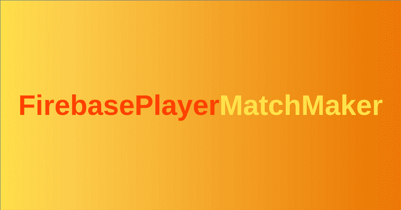

# 如何使用 Firebase 构建多人 Android 游戏

> 原文：<https://www.freecodecamp.org/news/match-making-with-firebase-hashnode-de9161e2b6a7/>

舒坎特·帕尔

# 如何使用 Firebase 构建多人 Android 游戏

你刚刚为 Android 开发了你的桌面游戏吗？想拿到网上？你来对地方了——让我们一起建造它吧！



在本文中，我们将使用 Firebase 实时数据库实现匹配。为此，你需要在你的 Android 项目中设置 Firebase 见这里的[如何做。](https://firebase.google.com/docs/database/android/start)

### 先决条件

*   **Firebase 用户** —这里，我们假设您能够使用任何方法让您的用户登录 Firebase。这对于在配对完成后确定与谁通信是必要的。
*   **等级依赖** —将这些添加到应用程序模块等级文件的`dependencies`块中。

```
implementation 'com.google.firebase:firebase-core:16.0.6' implementation 'com.google.firebase:firebase-auth:16.1.0' implementation 'com.google.firebase:firebase-database:16.0.6'
```

*   实施配对后，您还没有完成。这是因为你只找到了两个会玩的玩家，但还没有实现他们的移动将如何在网络上传播。

### 我们的模型

我们将使用 Firebase 数据库中的一个名为游戏室的节点，它将存储用户提出的所有活动挑战。每个用户将在游戏室内搜索现有的挑战，并接受找到的第一个挑战。否则，用户将上传他们自己的挑战，并等待直到有人接受挑战。

您将能够在您的匹配实现中添加更多功能，如基于相似的性能评级、朋友、区域偏好等进行匹配。

### 我们到底要怎么实施呢？

我把我们的问题分成三个对象:

*   匹配器(Matcher):在游戏室中寻找任何现存的匹配。
*   **SelfChallengeManager** :管理匹配器找不到用户时用户上传的挑战。
*   **self challenge canceler**:如果该用户不想再玩了，取消配对过程。

此外，我们将需要一个“挑战”对象，它有两个属性——通信节点引用和挑战者的用户 ID(了解为什么我们现在需要登录 Firebase？).此物品将由`SelfChallengeManager`上传至游戏室。

### 首先编写我们的组件

在编写我们的三个组件之前，我们需要理解什么是 Firebase [事务](https://firebase.google.com/docs/database/android/read-and-write#save_data_as_transactions)。我们不希望两个用户同时接受相同的挑战——这会破坏我们的数据库，让我们宝贵的用户生气。事务通过防止数据库中的一个节点(将是游戏室)上的并发操作来提供帮助。

这与我们的组件有什么关系？—我们的组件将被建模为事务，作为我们的“FirebasePlayerMatchMaker”类中的内部类。

[https://gist . github . com/sukuntapal/2c 1 F5 dadfae 784 bfeb 622 D4 e 26736 e](https://gist.github.com/SukantPal/2c1f5daedfaee784bfeb622d4e26736e)

我们使用两个回调接口— `OnMatchMadeCallback`和内部`OnFailCallback`。工厂方法采用一个`OnMatchMadeCallback`，每当匹配成功时就会调用这个函数。每当**媒人**找不到匹配时，就会调用`OnFailCallback`。

在这里，`findMatch`在一个单独的线程上运行，如果`Matcher`没有找到匹配，就创建一个`OnFailCallback`。在这种情况下，我们必须创建一个`SelfChallengeManager`并将其作为一个事务运行。

1.  **匹配**

这里，`doTransaction()`方法遍历游戏室节点的所有子节点，并搜索与我们的用户兼容的`Challenge`。默认情况下，`isChallengeCompat`返回`true`，但是您可以通过添加额外的约束来改变这一点，比如评级。然后存储第一个兼容的挑战，并删除数据库中的挑战节点(通过将值设置为`null`)。注意，通过删除节点，其他玩家将被通知接受。

2.**自我挑战管理者**

这里，`doTransaction`方法向数据库中的`GAME_RECORD`节点添加了一个子节点。这是在配对完成后，游戏移动将被交流的地方。然后它将一个`Challenge`上传到游戏室，并将自己添加为一个`ValueEventListener`。每当另一个用户接受请求时，他们将删除这个节点，这个用户将在我们监听时得到通知。

3.**自我挑战取消者**

我们的代码只是通过遍历整个游戏室并找到我们的挑战来删除由`SelfChallengeManager`创建的节点。但是不完整！！你(可选)应该添加一个功能，这个用户自动退出游戏，如果比赛已经被接受。

在您提供给`FirebasePlayerMatchMaker.newInstance`的`OnMatchMadeCallback`中，您必须初始化要在节点(通过路径)`mGamePath`中完成的游戏通信。

哟，你做到了。感谢阅读！

*最初发表于[hashnode.com](https://hashnode.com/post/match-making-with-firebase-cjrzgoi6k0010ads2xqojc7a1)。*