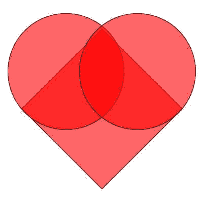

# 如何用纯 CSS 为你的情人创建一个跳动的心脏

> 原文：<https://www.freecodecamp.org/news/how-to-create-a-beating-heart-with-pure-css-for-your-valentine-2aeb05e2d36e/>

每年的 2 月 14 日，许多人和他们特别的“情人节”交换卡片、糖果、礼物或鲜花。我们称之为情人节的浪漫的一天是以一位基督教殉道者的名字命名的，可以追溯到 5 世纪，但起源于罗马节日牧神节。

到目前为止还好。但是程序员能为他们的情人节做些什么呢？

我的回答是:用 CSS，有创意！

我真的很爱 CSS。它不是一种真正复杂的语言(大多数时候它甚至不被认为是一种编程语言)。但是通过一些几何学、数学和一些基本的 CSS 规则，你可以把你的浏览器变成你创造力的画布！

那我们开始吧。你将如何用纯几何图形创建一个心脏？



A heart made of a square and two circles

你只需要一个正方形和两个圆形。对吗？

由于有了`::after`和`::before`伪元素，我们可以用单个元素来绘制。说到伪元素，`::after`是一个伪元素，它允许你从 CSS 中插入内容到页面中(不需要在 HTML 中)。`::before`完全相同，只是它在 HTML 中的任何其他内容之前而不是之后插入了`content`。

对于这两个伪元素，最终结果实际上并不在 DOM 中，但它似乎会出现在页面上。

所以让我们创造我们的心。

```
.heart {
  background-color: red;
  display: inline-block;
  height: 50px;
  margin: 0 10px;
  position: relative;
  top: 0;
  transform: rotate(-45deg);
  position: absolute; 
  left: 45%; top: 45%;
  width: 50px;
}

.heart:before,
.heart:after {
  content: "";
  background-color: red;
  border-radius: 50%;
  height: 50px;
  position: absolute;
  width: 50px;
}

.heart:before {
  top: -25px;
  left: 0;
}

.heart:after {
  left: 25px;
  top: 0;
}
```

您可以很容易地注意到，我们通过使用主“heart”类和带有`::before`和`::after`伪元素的两个圆来定义正方形及其位置。圆圈实际上只是两个正方形，它们的边界半径缩小了一半。

但是一颗没有跳动的心脏是什么呢？

让我们创造一个脉冲。这里我们将使用@keyframes 规则。@keyframes CSS at-rule 用于定义 CSS 动画的一个循环的行为。

当我们使用关键帧规则时，我们可以将一个时间段划分为更小的部分，并通过将其拆分为多个步骤来创建变换/动画(每个步骤对应于时间段完成的百分比)。

所以让我们创造心跳。我们的心跳动画由 3 个步骤组成:

```
@keyframes heartbeat {
  0% {
    transform: scale( 1 );    
  }
  20% {
    transform: scale( 1.25 ) 
      translateX(5%) 
      translateY(5%);
  } 
  40% {
    transform: scale( 1.5 ) 
      translateX(9%) 
      translateY(10%);
  }
}
```

1.  在 0%的时间段，我们开始时没有转换。
2.  在 20%的时间里，我们将形状缩放到初始大小的 125%。
3.  在 40%的时间里，我们将我们的形状缩放到初始大小的 150%。

在剩下的 60%时间里，我们给心脏留出时间，让它回到初始状态。

最后，我们必须将动画分配给我们的心。

```
.heart {
  animation: heartbeat 1s infinite; // our heart has infinite heartbeat :)
  ...
}
```

**就是这样！**

我们有一颗跳动的心脏，它将永远跳动。或者也许只要你自己的爱持续…

请随意查看相关代码:

祝你情人节快乐！