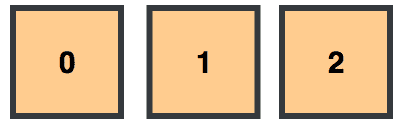
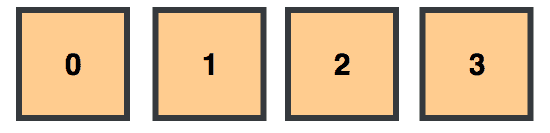
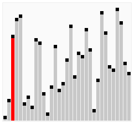
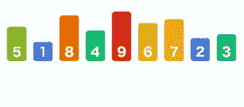
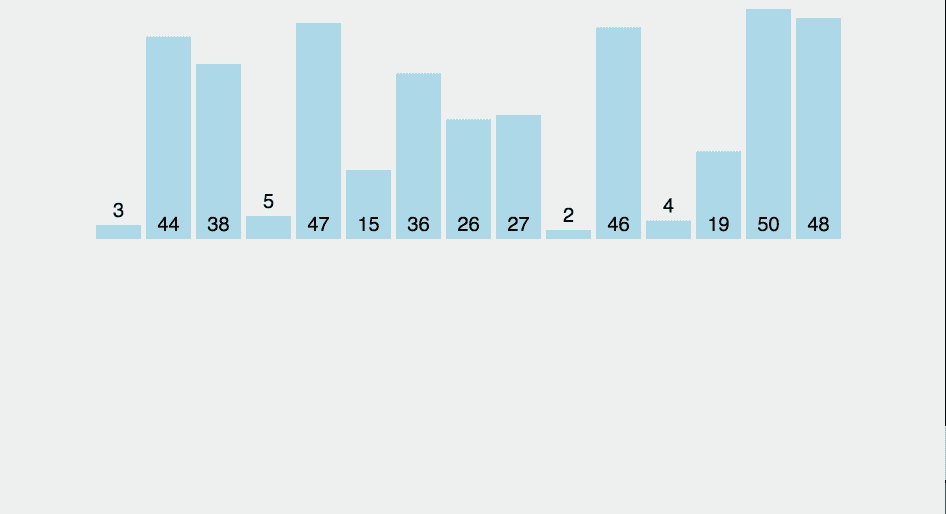
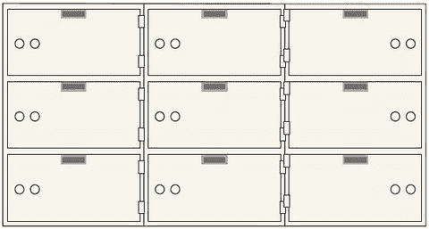

# 将计算作为一门科学的一步

> 原文：<https://www.freecodecamp.org/news/a-step-towards-computing-as-a-science-algorithms-data-structures-4c0e2d6ae79a/>

作者:梁荣立

# 将计算作为一门科学的一步

#### JS 中的简单算法和数据结构

Photo by J. Craig on [Un-splash](https://unsplash.com/photos/HH4WBGNyltc)

一个**算法**就是解决一个问题所采取的步骤。一个**数据结构**是为了高效访问而组织的数据。对于给定的数据结构，您可以使用算法来解决各种问题(例如，搜索一段数据或对一组数据进行排序)。

所以对于计算机来说，**算法**是你正在做的事情的方法(例如，线性搜索、二分搜索法、冒泡排序、选择排序、插入排序等等)。)，而**数据结构**是你正在做的事情(例如，数组、键值对对象等)。).因此，您可以有条不紊地搜索、排序或创建一个有组织的数据集。

### 简单的数据结构

#### 排列

一个**数组**就像从最低(0)到最高(2)标签排序的编号盒子(**索引**)。每个盒子都固定在适当的位置，并根据其标签保持有序。

您可以跳转到任何带标签的框来查看其内容(arrayName[2])、添加内容或替换其内容(array name[2]=“Sherlock Holmes”)。你可以**把**新装箱的内容推到你收藏的末尾(arrayName.push("夏洛克·福尔摩斯回忆录"))。

这将为接收箱提供序列中的下一个标签(3)。要返回到最初的盒装收藏，您可以将从末尾弹出(arrayName.pop())。

你也可以将第一个盒子(arrayName.shift())的**移出，但是这需要重新标记所有其他的盒子。**

你的夏洛克·福尔摩斯收藏现在在标有 1 的盒子里。如果您**卸载**您的盒子收藏，您可以在收藏的开头添加一个新的盒子内容(arrayName.shift("Dr. Strange "))。

这给了我们标有 0 & 2 的盒子里的奇异博士&夏洛克·福尔摩斯系列。

### 搜索数据结构

#### 线性搜索

一个**线性搜索**就像沿着一排盒子(即 0 — 16)走，打开每一个盖子，看看里面的内容是否是你要找的(即 37)。

[source](https://www.mathwarehouse.com/programming/images/binary-vs-linear-search/binary-and-linear-search-animations.gif)

因此，对于一个从集合开始(假设为 0)到结束(长度减 1)的索引，我们可以在一个框中搜索我们想要的内容，然后继续下一个。我们可以从一个盒子到下一个盒子递增，直到找到匹配为止。

#### 二进位检索

一个**二分搜索法**就像在一系列盒子中搜索，盒子的内容是有序的(即数字或字母)，通过跳到中间的一个盒子并检查它的内容来找到你想要的项目。如果你超越了，你**向后**跳，在你当前位置和起点的中间。否则，你**向前跳跃**，在你当前位置和终点的中间。

[source](https://www.mathwarehouse.com/programming/images/binary-vs-linear-search/binary-and-linear-search-animations.gif)

所以，你能做的就是跟踪你的低位(最初是 T0 0 T1)、中位(T2 8 T3)、高位(最初是 T4 16 T5)指数仓位。中间位置始终是低&高指数总和的一半。您检查匹配的中间框(即 **37** )。如果它比你期望的要少，那么你就向前一跃。你重置你的低位指数，使其比你当前的中间位置高一位(8 + 1 = 9)。然后，重新计算一个新的中间位置((9 + 16) / 2 **≈** 12)。

换句话说，你可以通过重置你的低指数&重新计算一个新的中间指数，在你的搜索中向前跃进。相反，如果你越界了，你可以通过重置你的高指数&重新计算一个新的中间指数*来向后跳。*

与线性搜索不同，这种类型是二进制的。您总是在猜测您的物品是位于盒装系列的前半部分还是后半部分。

### 对数据结构排序

#### 冒泡排序

**冒泡排序**是通过不断地将一个较高的值与相邻的一个较小的值交换来对一个集合进行排序，从而产生最高值冒泡到顶部的效果。

[source](https://upload.wikimedia.org/wikipedia/commons/5/54/Sorting_bubblesort_anim.gif)

因此，对于集合的长度，从索引 0 开始，如果前一个索引的值更大，则用后一个索引(i + 1)的内容交换当前索引(I)的内容。然后，移动到下一组索引(i + 1 对 i + 2)，以此类推。

在某个时间点，你会发现你的收藏中有一个价值最高的盒子。因此，它将是不断向前交换的内容。因此它向上冒泡。重复此过程，直到您的收藏按价值从低到高排序。

因为每次迭代的最后一个盒子将以最高值结束，所以通过排除最后的盒子来重复该过程。

#### 选择排序

一个**选择排序**是通过连续*选择最低值的*并将其交换到一端来排序集合。

[source](https://codepumpkin.com/selection-sort-algorithms/)

所以，在这里，你扫描你的整个集合，找到最低的价值。一旦找到它，您就可以将它的内容与标有最低索引(最初是索引 0)的盒子交换。您从下一个最低的索引(索引 1)开始重复这个过程，因为您的最低值在其正确的位置。每次迭代，扫描的长度范围减少 1，直到整个集合从最低值到最高值排序。

#### 插入排序

一个**插入排序**是通过*将每个遇到的值*插入到正确的位置来对集合进行排序。

[source](https://gfycat.com/densebaggyibis)

所以在这里，不是每次迭代扫描整个集合(即冒泡&选择排序)，而是从索引 0 & 1 开始比较它们的值。如果后者的值更低，如果索引 1 的内容的值比索引 0 的值低，则交换它们的内容。您移动到索引 2 处的下一个框，并与先前排序的框进行比较(索引 1，然后索引 0)。

每当遇到更高的值时，就将其内容交换到右边。找到正确的位置后，将内容(之前在索引 2 处)插入正确的框中。所以，这就好像你“拿出”一个后一个盒子里的东西，然后走到一个前一个盒子里。

如果前一个盒子的值比你现在拿着的大，你就把它的内容移到后一个盒子里。你一直这样做，直到你找到正确的地方插入你拿着的东西。

### 另一个简单的数据结构

#### 键值对对象

一个**键-值配对对象**就像一组未标记的存放盒。每个唯一的键打开一个特定的数据。与数组不同，它是可以通过唯一键访问的无序数据。

[source](https://cdn.shopify.com/s/files/1/1147/6518/products/safeandvaultstore-sdbx9-safe-deposit-boxes_large.jpg?v=1495593363)

因此，您可以通过使用其密钥(objectName['s'])来访问存放箱，更改其内容或创建一个可打开指定内容的密钥(object name[' s ']= " Sherlock Holmes ")。您可以访问为您的所有存款箱(Object.keys(objectName)或 Object.values(objectName))制作的所有密钥或存储的所有内容。

### 结论

基本**算法**(线性&二进制搜索；冒泡，选择&插入排序)& **数据结构**(数组&键值对象)引出关于数据管理的时间&空间问题。考虑到搜索、分类或访问数据所花费的**时间**以及这些过程所需的内存**空间**，可以将软件开发人员从计算机编程提升到计算机科学。它带你从为效率而编程到为效率而编程。