# 逻辑回归:好的部分

> 原文：<https://www.freecodecamp.org/news/logistic-regression-the-good-parts-55efa68e11df/>

泰勒·席尔瓦

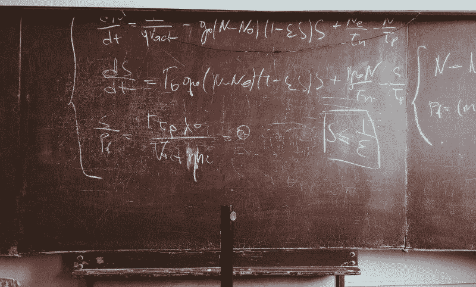

在上一篇文章中，我们通过降维的视角解决了[机器学习分类的问题。我们看到了 Fisher 的线性判别式是如何将数据点从更高的维度投射到更低的维度的。该预测遵循两个原则。](https://medium.freecodecamp.org/an-illustrative-introduction-to-fishers-linear-discriminant-9484efee15ac?source=friends_link&sk=842b291dc6304d477b278c7aa622ec23)

*   它使类间方差最大化。
*   它最小化了类内方差。

尽管 Fisher 的方法(本质上)不是判别式，但我们通过使用高斯模型对类别条件分布进行建模，建立了一个判别式。首先，我们找到了先验类概率 p(Ck)。然后，我们用贝叶斯定理求出后验类概率 p(Ck|x)。这里，x 是输入向量，Ck 是类 k 的标签。

简而言之，我们可以根据 ML 模型对数据进行分类的方式对它们进行分类。有两种类型:生成方法和判别方法。

生成方法明确地学习后验类概率。与之相反，判别算法直接学习后验类概率。

直观上，它有一个很好的几何解释。对于每一类，生成模型被关注来寻找数据的概率表示。相反，判别算法侧重于通过决策边界来分离数据。

换句话说，生成模型试图通过为每个类建立一个统计模型来解释数据。

另一方面，判别算法的目标是找到分隔类别的最佳决策边界。因此，只要存在决策面，这种模型就不关心数据的分布。

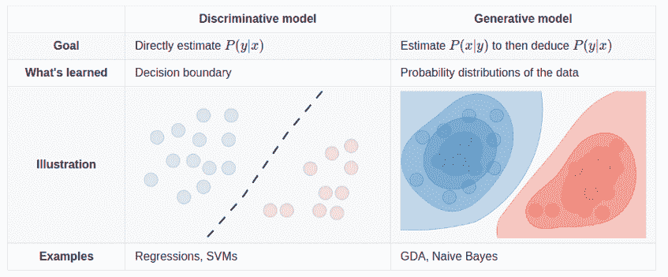

以一个二元分类问题为例。给定一个输入向量 ****x**** ，我们需要决定 Ck、 ****x**** 最有可能属于哪个类。为了做出这个决定，两种类型的 ML 算法都需要一种从训练数据计算后验概率 p(Ck|x)的方法。

对于 Fisher 的，我们明确学习后验类概率使用高斯。一旦我们找到它，我们使用决策理论来确定 ****x**** 的类成员。

对于判别模型，将直接导出后验 p(Ck|x)。在这种情况下，一旦我们有了后验概率，我们就可以使用决策理论，将 ****x**** 分配给最可能的类。

## 逻辑回归

**在我们开始之前，请确保您跟随这些** [**Colab 笔记本**](https://github.com/sthalles/logistic-regression) 。

逻辑回归可能是最著名的判别模型。这样，它隐式地导出后验类概率 p(Ck| ****x**** )。

对于二元分类，后验概率由应用于输入 **ϕ.的线性组合的 sigmoid 函数σ给出**

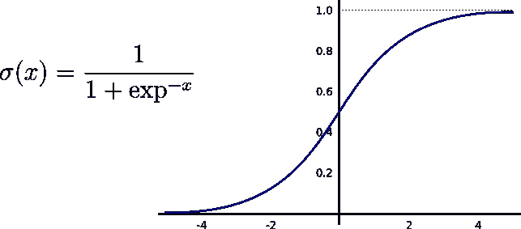

Sigmoid function

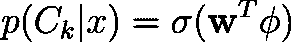

For binary classification, the posterior probabilities are represented by the logistic Sigmoid function.

同样，对于多类问题，我们可以使用 softmax 函数来估计后验概率。像 sigmoid 一样，softmax 将给定向量归一化为概率，即 0 到 1 之间的值。

让我们从二进制分类的情况开始。

## 二元逻辑回归

对于 M 维输入特征向量，逻辑回归必须学习 M 个参数。

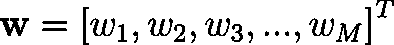

Trainable parameters for binary logistic regression.

以 SVHN 数据集为例。每个 RGB 图像的形状为 32x32x3。因此，逻辑回归需要学习 32x32x3=3072 个参数。

为了找到这些参数，我们通常优化交叉熵误差函数。

交叉熵测量**模型的预测与标签的距离。当预测值偏离真实值时 ****增加**** ，否则 ****减少**** 。**

**假设目标值 ****t**** 为 0 或 1，交叉熵被定义为:**

**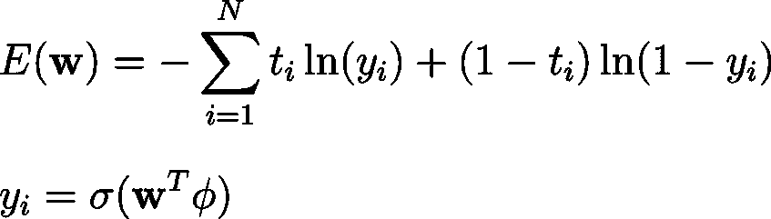**

**这里， ****N**** 表示数据集中实例的总数，**是模型的概率。****

****交叉熵比较两种概率分布。因此，重要的是要注意逻辑回归的输出被解释为概率——甚至在学习期间。****

****取交叉熵相对于权重向量 ****w**** 的导数，得到梯度。****

**

The gradient of the cross-entropy** 

**注意，为了计算这个导数，我们需要 sigmoid 函数 w.r.t weights ****w**** 的导数。幸运的是，sigmoid 的一个很好的特性是，我们可以用它自己来表示它的导数。**

**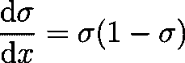

The derivative of the sigmoid function.** 

**梯度是一个向量值函数。实际上，渐变是一种线性变换，将输入向量映射到其他相同形状的向量。**

**梯度捕捉整个多变量函数的导数。它的每一个值都表示我们可以改变一个特定权重的方向，这样我们就可以达到一个函数的最大值。因此，梯度代表最陡上升的方向。**

## **Softmax 回归**

**对于多类分类，只有一些事情会发生变化。现在，我们可以使用 softmax 函数来模拟后验概率。**

**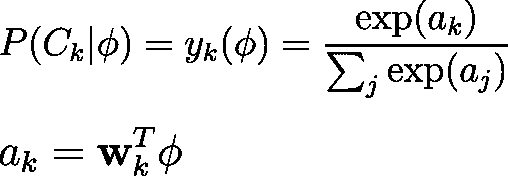

Here ak are the activations.** 

**由于逻辑回归将其预测视为概率，我们需要改变表示标签的方式。至此，目标/标签向量通常被表示为整数向量。每个值代表一个不同的类。如果我们希望它们是同等价值的概率，它们需要在 0 和 1 之间。要做到这一点，我们可以将它们的表示方式改为 one-hot-encoding。**

**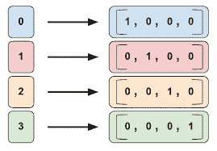

One-hot-encoding representation.** 

**这一次，对于具有 M 个特征和 K 个不同类的输入，逻辑回归学习 MxK 个参数。我们可以把它看作一个矩阵。**

**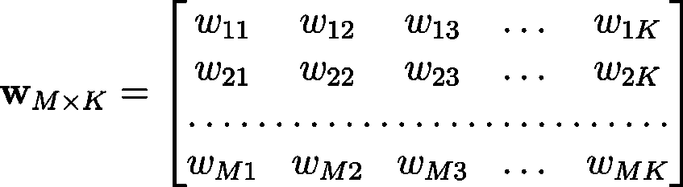

Trainable parameters for multiclass logistic regression.** 

**现在，我们可以进行类似的二进制分类的情况。首先，我们对激活的 softmax 求导。然后，似然的负对数给出了多类分类的交叉熵函数。**

**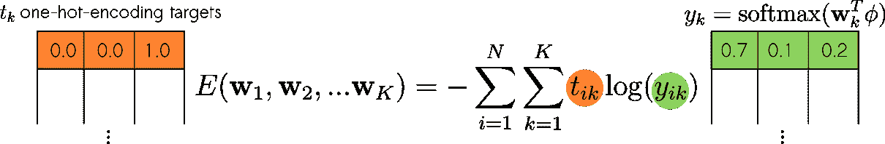**

**实际上，交叉熵度量两个概率向量之间的距离。一，那是从 ****softmax**** 出来的。第二个包含真实目标值的独热编码表示。**

**请注意用于二分类和多分类的误差函数之间的差异。实际上，它们真的是一回事。**

**二元交叉熵将目标视为标量。他们要么接受 0 要么接受 1。对于多类分类，目标被表示为一个热点编码向量。**

**最后，我们取误差函数 w.r.t .权重 ****w**** 的梯度，并获得以下梯度向量。**

**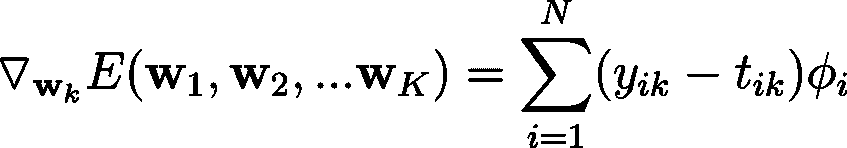**

## **迭代加权最小二乘法**

**与线性回归不同，逻辑回归没有封闭形式的解。换句话说，对于线性回归，我们可以用下面的等式求解梯度等于 0 的点:**

**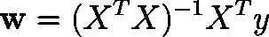

Closed-form solution for linear regression.** 

**对于逻辑回归，这样一个封闭形式的方程是不存在的。由于非线性，我们应用于输入的线性组合。**

**但是损失函数和参数 ****w**** 的关系还是给了我们一个 ****凹误差函数**** 。因此，我们可以放心，在误差曲面上只有一个唯一的最小值。**

**因此，我们可以使用迭代技术(如梯度下降法或牛顿-拉夫森法)来求解。**

**如果我们选择梯度下降，就万事俱备了。**

*   **顺着梯度的反方向走就行了。**

**说白了就是最陡下降的方向。这样，我们可以迭代地更新权重**为:****

********

****但是，我们可以做得更好一点。****

****梯度下降提供了到下一个临界点的最陡下降方向。而学习速度控制着我们在那个方向上所走的一步的长度(幅度)。看看下面的图片。****

****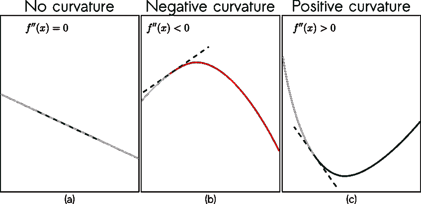

Image based on [Deep Learning](https://www.deeplearningbook.org/contents/numerical.html) book by Ian Goodfellow and Yoshua Bengio and Aaron Courville.**** 

****特别是在(c)中，根据我们所采取的步骤的大小，我们可能会使我们的损失函数增加。为了避免这个警告，我们利用二阶导数给出的信息。****

****在实践中，我们不是只对交叉熵求导，而是对它的导数求导。由 f″(x)描述的二阶导数给出了函数曲率的信息。****

****直觉上，如果:****

*   ****f''(x)=0，则不存在曲率。****
*   ****f''(x)<0，表示函数向下弯曲。****
*   ****f''(x)>0，函数中存在向上的曲率。****

****利用该信息，用于最小化交叉熵的更新步骤采取以下形式:****

****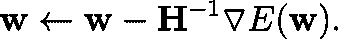****

****这个更新方程被称为牛顿-拉夫逊方程。****

****注意，它将矩阵 ****的逆 H⁻**** 乘以梯度。 ****H**** 或 Hessian，存储交叉熵 w.r.t 的二阶导数权重**。******

****现在让我们深入研究代码。****

****以这个玩具数据集为例。****

****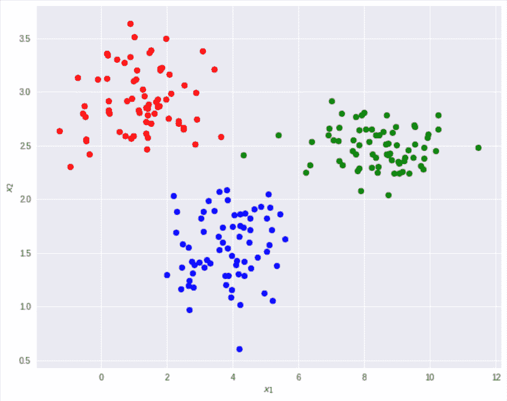****

****在这个 2D 坐标系中有 210 个点，分为三个等级:蓝圈、红圈和绿圈。由于类的数量大于 2，我们可以使用 Softmax 逻辑回归。****

****首先，为了将偏差变量引入我们的模型，我们可以执行一个简单的转换，称为:固定基函数。这可以通过简单地在输入中添加一个充满 1 的列来实现。对于二元分类，它使得相应的权值 w₀起着偏向的作用。对于多类，权重矩阵的第一列作为偏差。****

****然后，我们可以创建一个逻辑回归对象。****

```
**`clf = LogisticRegression(fit_intercept=True, method="newton")
clf.fit(x_train,y_train,iterations=10)
print("Test acc:",clf.score(x_test,y_test))`**
```

****create_log_reg.py****

****遵循 sklearn 的基础 API，我们可以 ****拟合**** 和 ****eval**** 模型:****

```
`for i in range(iterations):
  logits = self._forward(X)

  if self.method == 'newton':
    # calculate the hesssian
    for i in range(k):
      for j in range(k):
        r = np.multiply(logits[:,i],((i==j)-logits[:,j]))  ## r has negative value, so cannot use sqrt
        HT[:,i,:,j] = np.dot(np.multiply(X.T,r),X) # 4.110      
    H = np.reshape(HT,(dk,dk))

  # calculate the gradient of the cross-entropy
  G = np.dot(X.T,(logits-y))

  if self.method == 'newton':
    # Newton's update
    self.W = self.W.reshape(-1) - np.dot(pinv(H), G.reshape(-1)) # 4.92
    self.W = np.reshape(self.W,W_shape)
  else:
    # follow the gradient with GD
    self.W = self.W - self.learning_rate * G`
```

**softmax_lr.py**

**注意，我们可以在牛顿和梯度下降更新规则之间进行选择。虽然牛顿法往往收敛更快，但它需要在每次迭代中计算并存储一个完整的 Hessian。此外，Hessian 需要是可逆的——用于参数更新。**

**对于可逆矩阵，有一些约束条件必须为真。**

**首先， ****H**** 必须是方阵。第二，**T5【H】T6**的列需要线性无关。这意味着对于任何一列******I******of****H****，******I******不能表示为其他任何一列******j******的线性组合。**

**也就是说 ****H**** 的列跨越了坐标系。或者说**H**的行列式是非零的**

**因为对于非常大的矩阵，这些约束可能不成立，所以我们可以在这里使用伪逆技术。这就是上面代码中的函数******pinv(H)******的作用。**

**尽管对于较小的数据集来说，这可能不是问题，但 Hessian 往往会随着要素和类数量的增加而增加。为了有一个概念，使用具有 M 个要素的输入和具有 K 个类的数据集。全麻布有形状[M*K，M * K]；在本例中，这意味着:[9x9] —记住，我们在输入中添加了一个新的特性列。**

**对于 CIFAR-10 数据集，每个 RGB 图像的形状为 32x32x3。这意味着存储和倒置一个形状为[30720x30720]的正方形矩阵。使用浮点 32 位精度，Hessian 需要 3.775 GB(千兆字节)。**

**最后，用玩具数据集和牛顿法看一下拟合的模型。十字是测试数据。**

**享受吧。**

**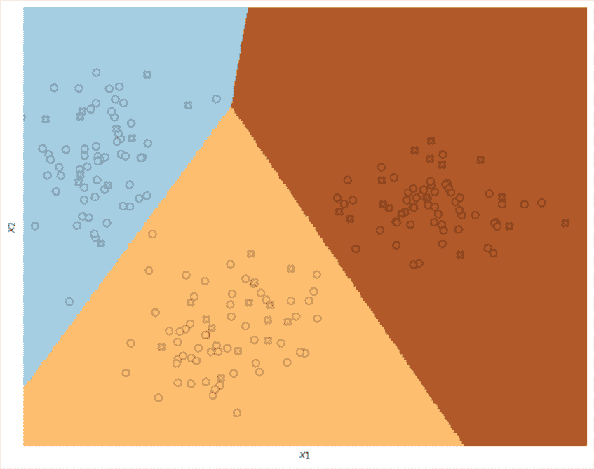

Decision boundaries for Logistic Regression using Newton’s method. Circles represent training data and crosses test instances.** 

**总之，生成模型是一类明确学习类别概率的 ML 算法。**

*   **他们通常在训练样本较少的情况下表现良好。**
*   **他们可以处理丢失的数据。**
*   **并且可以用于监督和非监督学习。**

**判别模型隐含地学习类别概率。**

*   **一般来说，它们需要更多的标记数据。**
*   **他们通常有较少的假设和参数。**
*   **但是，只能用于监督训练。**

**对于二元分类，逻辑回归使用 sigmoid 函数来表示后验概率。对于多类分类，它使用 softmax。**

**想了解更多关于机器学习的有趣内容，请看:**

*   **[高维超参数调谐简介](https://www.freecodecamp.org/news/an-introduction-to-high-dimensional-hyper-parameter-tuning-df5c0106e5a4/)**
*   **[费希尔线性判别式的说明性介绍](https://www.freecodecamp.org/news/an-illustrative-introduction-to-fishers-linear-discriminant-9484efee15ac/)**

## **参考**

**克里斯托弗·贝肖普。2006.模式识别和机器学习(信息科学和统计学)。施普林格出版社，柏林，海德堡。**

******感谢阅读。******