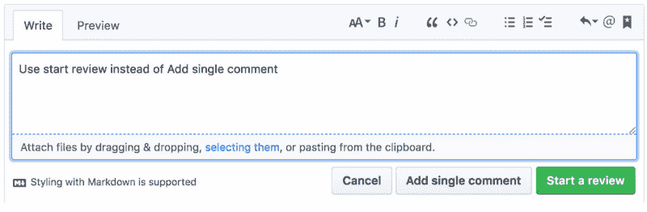

# 代码审查——终极指南

> 原文：<https://www.freecodecamp.org/news/code-review-the-ultimate-guide-aa45c358bbf5/>

阿萨夫·埃洛维奇

# 代码审查——终极指南

#### 构建团队代码评审过程的终极指南

在进行了数百次代码审查，领导 R&D 团队，并亲自推动了几个无意的错误之后，我决定分享我为您的团队构建最终代码审查过程的结论。

本文假设您知道什么是代码评审。因此，如果你不知道，请[点击此处](https://en.wikipedia.org/wiki/Code_review)观看精彩介绍。

让我们快速陈述一下为什么您应该进行代码评审的一些简单的理由:

1.  可以帮助减少代码中的错误。
2.  验证所有编码要求都已满足。
3.  向同行学习和熟悉代码库的有效方法。
4.  帮助维护整个团队的代码风格。
5.  团队凝聚力——鼓励开发人员就最佳实践和编码标准进行交流。
6.  由于同行的压力，提高了整体代码质量。

然而，代码审查可能是软件开发过程中最困难和最耗时的部分之一。

我们都经历过。您可能已经等了几天，直到您的代码被审查。一旦它被审查，你就开始与重新提交你的拉请求的审查者打乒乓。突然间你花了几个星期来来回回。您正在新特性和仍需改进的旧提交之间进行上下文切换。

> 如果代码审查过程没有被正确地计划，它可能会有更多的成本而不是价值。

这就是为什么在你的工程团队中为代码评审构建一个定义良好的过程是极其重要的。

一般来说，在创建拉动式请求之前和被审查期间，您需要为审查者和被审查者制定明确的指导方针。更具体地说:

#### 定义创建拉式请求的额外条件。

我发现以下方法可以大大减少摩擦:

1.  确保代码编译成功。
2.  阅读并注释你的代码。
3.  构建并运行验证代码范围的测试。
4.  应该测试代码库中的所有代码。
5.  将您的任务管理工具(例如 JIRA)中的相关票证/项目链接到您的拉动式请求。
6.  在您完成上述工作之前，不要指派审核人。

#### 定义已审核的职责

虽然审核者是整合你的公关的最后一环，但被审核者提交的越好，你长期面临的风险就越小。以下是一些很有帮助的指导方针:

1.  **与你的评审者沟通** —向你的评审者介绍你的任务背景。因为我们大多数拉式请求的作者可能已经是评审者了，简单地把你自己放在评审者的位置上，然后问，“这对我来说怎么会更容易呢？”
2.  **提出更小的拉动式请求** —提出更小的拉动式请求是加快你复习时间的最佳方式。保持你的拉取请求较小，这样你可以更快更准确地迭代。一般来说，较小的代码变化也更容易测试和验证为稳定的。当一个拉请求很小时，评审者更容易理解上下文和逻辑推理。
3.  **避免代码评审过程中的变更** —代码评审过程中的重大变更基本上会重置整个评审过程。如果您需要在提交审核后进行重大更改，您可能需要发送现有的审核并跟进其他更改。如果您需要在开始代码评审过程后进行重大更改，请确保在过程的早期就与评审者进行沟通。
4.  **回应所有可行的代码评审反馈**——即使你没有实现他们的反馈，也要回应并解释你的理由。如果有不明白的地方，可以在代码评审内部或外部提问。
5.  代码评审是讨论，而不是口述——你可以把大多数代码评审反馈看作是建议而不是命令。不同意评审者的反馈是可以的，但你需要解释原因，并给他们一个回应的机会。

#### 定义审核者的职责

因为在合并代码之前，评审者是链中的最后一个，所以减少错误的大部分责任都在他身上。审查者应该:

1.  了解任务描述和要求。
2.  确保完全理解代码。
3.  评估所有的架构权衡。
4.  将你的评论分为三类:批评、选择和积极。第一个是开发者必须接受修改的注释，第二个是让开发者知道你对代码的欣赏的注释。

此外，避免过多的评论，而使用 Github review(见下面的例子)。

当你有几条评论时，你应该使用 Github 中的 review 选项，而不是分别评论每一条，并在完成后通知开发者(PR owner)。

最后，我发现问以下问题是一个很好的工具，可以让整个复习过程变得更好更简单:

*   我理解这段代码有困难吗？
*   代码中是否有任何复杂性可以通过重构来降低？
*   代码在一个有意义的包结构中组织得好吗？
*   类名是直观的吗？它们做什么是显而易见的吗？
*   有特别大的班级吗？
*   有没有特别长的方法？
*   所有的方法名称看起来都清晰直观吗？
*   代码文档化了吗？
*   代码测试得好吗？
*   有没有方法可以让这段代码更有效率？
*   代码符合我们团队的风格标准吗？

有各种有效的不同的代码评审实践，根据团队的需求而变化。所以假设这是我个人的观点，还有其他方法可能对你的团队有用。最后，建立这样一个敏感的过程应该是基于你公司的目标、团队文化和整体 R&D 结构的。

如果您对改进这些指南有任何问题或反馈，请随时在下面添加评论！