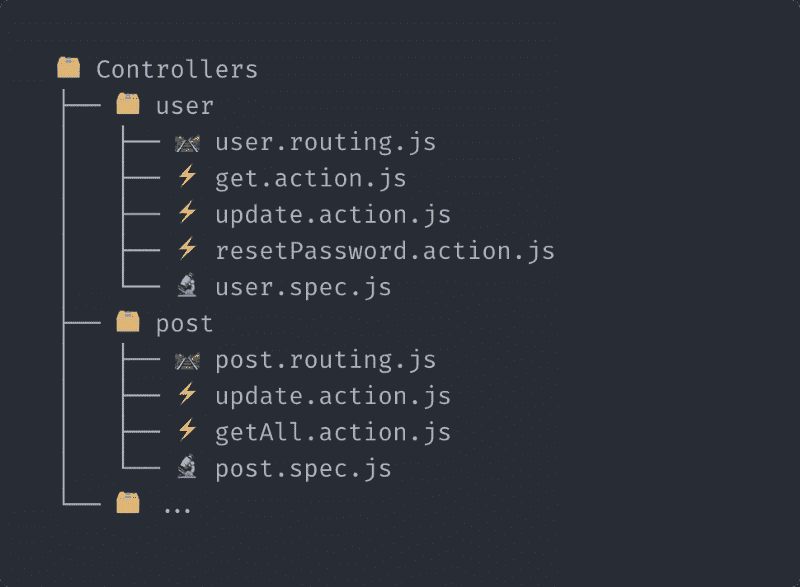

# 如何组织大型代码库的快速控制器

> 原文：<https://www.freecodecamp.org/news/how-to-organize-express-controllers-for-large-codebases-2d8284bbf817/>

亚历山大·莱瓦彻

# 如何组织大型代码库的快速控制器

三年前，我开始为一家公司开发 Express.js API。我想知道随着代码库的增长，保持有组织的最佳控制器架构是什么。

受帆或轨道以及我的研究的影响，我开始创造自己的系统。我不想使用像 Sails 这样的完整框架让我的项目过载，而是在需要的时候选择较轻的依赖项。

所以我为应用程序的控制器创建了一个组织系统，并与一个自制的加载器**配对。**从那以后，由于我在其他项目中实施它所获得的经验，我改进了它们。

今天，我有足够的信心用这个方法来分享它，因为结果是令人信服的。

据我所知，它被一些大公司使用。它简化了新开发人员的入职，因为它使代码库更容易阅读。

✅这里是如何建立一个干净的控制器架构。

### **结构**

如果你没有预料到你的应用程序的增长，你很快就会有一个无组织的代码库。我将组织方法设计成具有广泛的兼容性，这意味着有一天你不会被锁定在一种你无法用这种方法解决的用例中。

#### 设置您的文件树

*   在控制器中对路线进行分组
*   为每个控制器创建文件夹
*   在每个控制器中创建一个路由文件，描述每个路由的**路径**、要调用的**方法、**其可选关联的**中间件、**和**限制级别。**
*   为每个控制器的动作创建一个文件，其中包含执行的**方法和**中间件**。**
*   为测试创建一个**规格文件**

让我们看看它看起来怎么样。

? Example of controllers structure

**不要害怕创建大量文件**。它不会减慢开发速度，而且会使你的代码库整洁、流畅。✨

### **载入您的路线**

为了按照上面定义的结构工作，我们需要使用我创建的一个简单的加载器: [Lumie](https://github.com/Alex-Levacher/Lumie) 。它将通过您的控制器，读取定义文件，并加载您的路线。

这是一个小软件包，你可以在 GitHub 上查看源代码。

#### 路由文件

它们被设计成易于阅读。目的是能够通过快速浏览您的**来识别开发中要更新的方法。路由**文件。在以下示例中，将创建三条路线:

*   【上传】**/用户**
*   【获取】**/用户**
*   【获取】**/用户/重置密码**

您可能想知道为什么路由会以“ **user** 为前缀，尽管在路由定义中没有描述。Lumie 使用路由文件所在文件夹的名称作为路由前缀。

在这里，我们处于`controllers/user/user.routing.js`。例如，如果`user`文件夹位于子文件夹`admin`中，那么路由将会以`admin/user`为前缀。

请注意，您可以向路由定义传递一个可选的`path`字段，以便使用它来代替默认字段。

#### 动作和中间件

正如您在上面看到的，每个 routes 配置都有一个 action 方法，它只不过是我们调用 API route 时要执行的逻辑。我建议保存在一个文件中:**一个动作方法**和**它可选的关联中间件**。

#### 限制

对于每个路径配置，您将选择关联的限制级别。级别值将被传递到您将创建的限制函数，以使 Lumie 工作。参见[如何用自己的限制函数初始化 Lumie](https://github.com/Alex-Levacher/Lumie#%EF%B8%8F-configuration) 。

这应该只是一个返回经典 express 中间件的函数。

### 结论

我用这个方法已经有一段时间了。我喜欢在开发时有这种固执己见的框架可以遵循。在一天结束的时候，它帮助我保持一个良好的代码库，而不是走捷径，比如在一个文件中写太多的逻辑或者在一个不合适的文件中定义一条路线。

感谢阅读。请在评论中告诉我你对这样组织控制器的看法。

如果你觉得这篇文章有帮助，掉一些？？