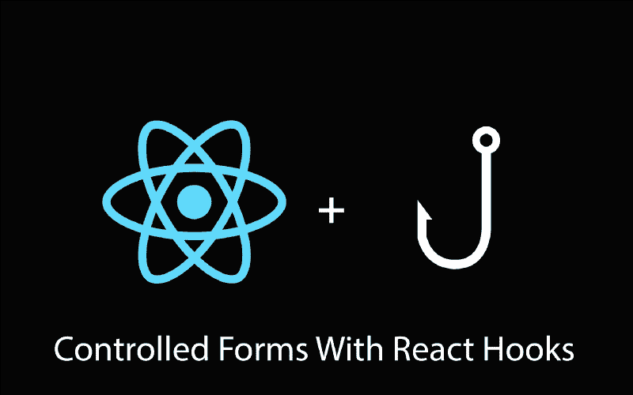
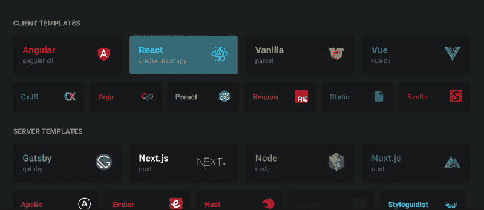
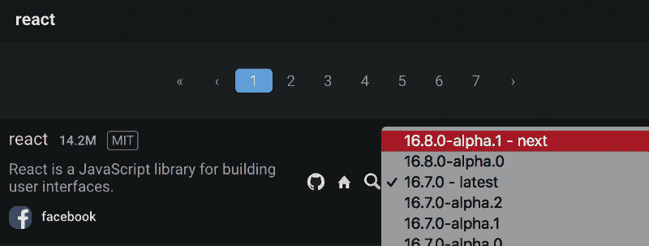

# 如何开始使用 React 钩子:控制窗体

> 原文：<https://www.freecodecamp.org/news/how-to-get-started-with-react-hooks-controlled-forms-826c99943b92/>

凯文·奥克

# 如何开始使用 React 钩子:控制窗体



React 钩子是一个闪亮的新提议,它将允许你编写 90%干净的 React。据[丹·阿布拉莫夫](https://overreacted.io/)、[胡克](https://reactjs.org/docs/hooks-intro.html)是 React 的未来。

这听起来不错，但是什么是钩子，它们如何帮助我写出更好的代码？很高兴你问了。

钩子允许你访问功能组件中的`state`和生命周期方法。如果前一句话对你来说听起来很奇怪，那么你应该刷新一下你对 React [here](https://medium.freecodecamp.org/the-react-handbook-b71c27b0a795#b70b) 的记忆。

React 团队表示，它将帮助您编写干净的代码，而没有有状态组件的包袱。在使用钩子实现了一个准系统表单之后，我同意他们的观点。

让我们先在有状态组件中编写一个简单的表单。我们将使用钩子重写同一个表单，您可以决定更喜欢哪一个。

### 设置

前往 [codesandbox.io](https://codesandbox.io/) ，创建一个帐户，登录并创建一个新的沙箱。创建沙箱时选择“反应”。



select React from the list of templates

现在沙盒打开了，我们必须确保使用支持钩子的 React 版本。这是因为钩子目前只能在 Alpha 版本中使用。

**更新:钩子现已公开，[React v 16.8](https://t.co/didbtI06Ie)稳定版。**

查看沙箱左侧的文件编辑器，并:

*   点击“依赖项”
*   删除“react”和“react-dom”
*   现在点击“添加依赖项”
*   在输入框中输入“react ”,然后点击第一个结果右侧的下拉菜单。
*   选择版本 16 . 8 . 0-alpha 1
*   现在点击描述来安装它。



make sure to select the latest alpha version

对“react-dom”重复相同的步骤，我们应该准备好了。

### 密码

现在我们已经完成了设置，是时候写一些代码了。跳到您创建的沙箱，创建一个名为 Form.jsx 的新文件，并将以下代码粘贴到:

```
import React, { Component } from "react";
```

```
class Form extends Component {  constructor(props) {    super(props);
```

```
this.state = {      firstName: "",      lastName: "",      email: "",      password: "",    };
```

```
this.handleInputChange = this.handleInputChange.bind(this);  }
```

```
handleInputChange(event) {    this.setState({      [event.target.name]: event.target.value    });  }
```

```
render() {    const { firstName, lastName, email, password } = this.state;
```

```
return (      <form>        <input          value={firstName}          onChange={this.handleInputChange}          placeholder="First name"          type="text"          name="firstName"          required        />        <input          value={lastName}          onChange={this.handleInputChange}          placeholder="Last name"          type="text"          name="lastName"          required        />        <input          value={email}          onChange={this.handleInputChange}          placeholder="Email address"          type="email"          name="email"          required        />        <input          value={password}          onChange={this.handleInputChange}          placeholder="Password"          type="password"          name="password"          required        />
```

```
<button type="submit">Submit</button>      </form>    );  }}
```

```
export default Form;
```

现在打开 index.js，用以下代码替换内容:

```
import React from "react";import ReactDOM from "react-dom";
```

```
import Form from "./Form.jsx";import "./styles.css";
```

```
function App() {  return (    <div className="App">      <h1>A Simple Form in React</h1>      <Form />    </div>  ); }
```

```
const rootElement = document.getElementById("root");
```

```
ReactDOM.render(<App />, rootElement);
```

测试这个表单，看看是否一切正常。这是 React 中实现控件表单的“老派”方式。

注意我们需要设置状态的样板文件的数量，以及在每次输入变化时更新状态的方法。

让我们使用 React Hooks 对同一个表单进行编码(最后！)但是首先，删除 Form.jsx 中的所有代码，让我们重新开始。

首先将下面一行添加到文件的顶部:

```
import React, { useState } from 'react';
```

所以这里引入了一个不熟悉的方法叫做`useState`。它是什么，我们如何使用它？

嗯，`useState`是 React 钩子，它允许我们访问和操作组件中的`state`。这意味着我们不必像之前的代码那样`extend Component` 。

它是 React API 的几个新挂钩之一，可以帮助我们编写更干净的代码。现在让我们使用它。

```
import React, { useState } from "react";import "./styles.css";
```

```
function Form() {  const [firstName, setFirstName] = useState("");  const [lastName, setLastName] = useState("");  const [email, setEmail] = useState("");  const [password, setPassword] = useState("");
```

```
return (    <form>      <input        value={firstName}        onChange={e => setFirstName(e.target.value)}        placeholder="First name"        type="text"        name="firstName"        required      />      <input        value={lastName}        onChange={e => setLastName(e.target.value)}        placeholder="Last name"        type="text"        name="lastName"        required      />      <input        value={email}        onChange={e => setEmail(e.target.value)}        placeholder="Email address"        type="email"        name="email"        required      />      <input        value={password}        onChange={e => setPassword(e.target.value)}        placeholder="Password"        type="password"        name="password"        required      />
```

```
<button type="submit">Submit</button>    </form>  );}
```

```
export default Form;
```

我们已经创建了我们的功能组件，但是还有一些我将解释的不熟悉的代码。特别是组件顶部的四个声明。

虽然这部分代码乍一看很奇怪，但很容易理解。我们不再声明一个名为`state`的对象来保存组件的状态。相反，我们现在将`state`分成多个声明。

假设我们想以熟悉的方式声明一个名为`firstName`的状态变量，我们通常在构造函数中这样做，然后通过写`this.state.firstName`来访问它。

但是用`useState`，我们初始化了两个变量叫做`firstName`和`setFirstName`。然后我们将它们的值设置为`useState()`返回的值。

为什么我们也要声明`setFirstName`呢？

好吧，因为这是一个功能组件，我们没有`setState`来帮助我们修改状态变量的值。我们所拥有的是`setFirstName`,它的唯一目的是在我们每次调用它时更新`firstName`。

所以当你看到:

```
const [firstName, setFirstName] = useState("")
```

我们基本上声明了一个状态变量和一个函数，允许我们以后修改状态变量。`useState`调用中的空字符串是`firstName`的初始值，可以设置为任何需要的值。我们现在将它设置为一个空字符串。

注意，您可以随意命名`setFirstName`函数。然而，在我们正在修改的状态变量名称前附加“set”是一个惯例。

我们现在知道如何在功能组件中创建状态变量，以及如何更新它。让我们继续解释代码的其余部分。

在我们的第一个输入标签中，我们将其值设置为在组件顶部声明的状态变量。至于`onChange`处理程序，我们将其设置为一个[箭头函数](https://developer.mozilla.org/en-US/docs/Web/JavaScript/Reference/Functions/Arrow_functions)，该函数调用为我们更新状态变量的函数。

在之前的类组件中我们有一个名为`handleInputChange`的方法，现在我们有了一个匿名函数来更新我们的状态。

通过尝试在表单中输入文本来检查一切是否正常。如果一切正常，恭喜你，你刚刚使用了一个反应钩。如果没有，那么再次浏览本教程，并确保你没有跳过任何指示。

添加您认为合适和喜欢的样式。

### 反光

更新:想到在 onClick 处理程序中使用内联函数，我们中的一些人可能会感到惊慌。我给丹·阿布拉莫夫发了推特，他回复说[钩子文档的这一部分](https://reactjs.org/docs/hooks-faq.html#are-hooks-slow-because-of-creating-functions-in-render)解释了为什么在钩子中使用内联函数并不是一件坏事。

浏览我们的新代码并与旧代码进行比较，很明显 React Hooks 可以帮助我们写出更好的代码。

并排比较类组件和功能组件，很明显功能组件更容易推理，使用更少的代码，并且通常看起来更干净。

如果你喜欢 React Hooks，你可以通过探索官方文档来了解更多，并尝试使用它们来重新实现你的一些项目。

也就是说，我想听听你的想法。你认为钩子是 React 的未来，还是觉得它们只是不必要的噱头？请在下方留言评论。

这篇文章最先出现在《安德拉之路》上。