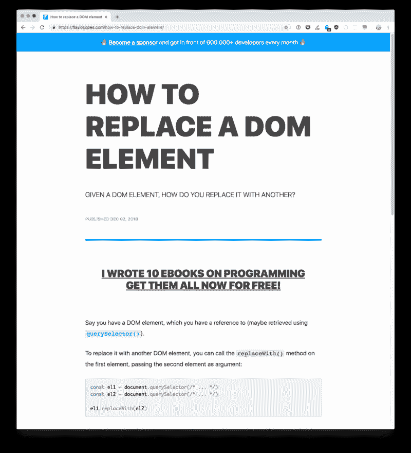
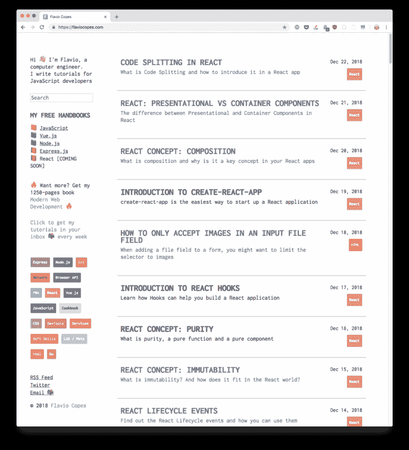
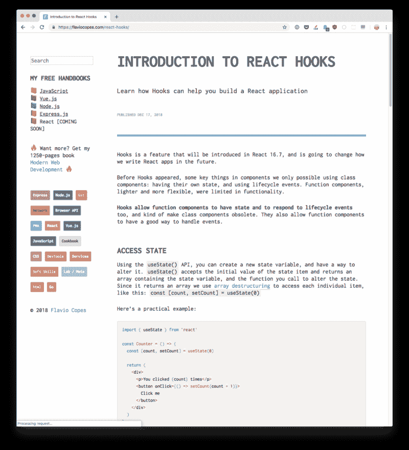
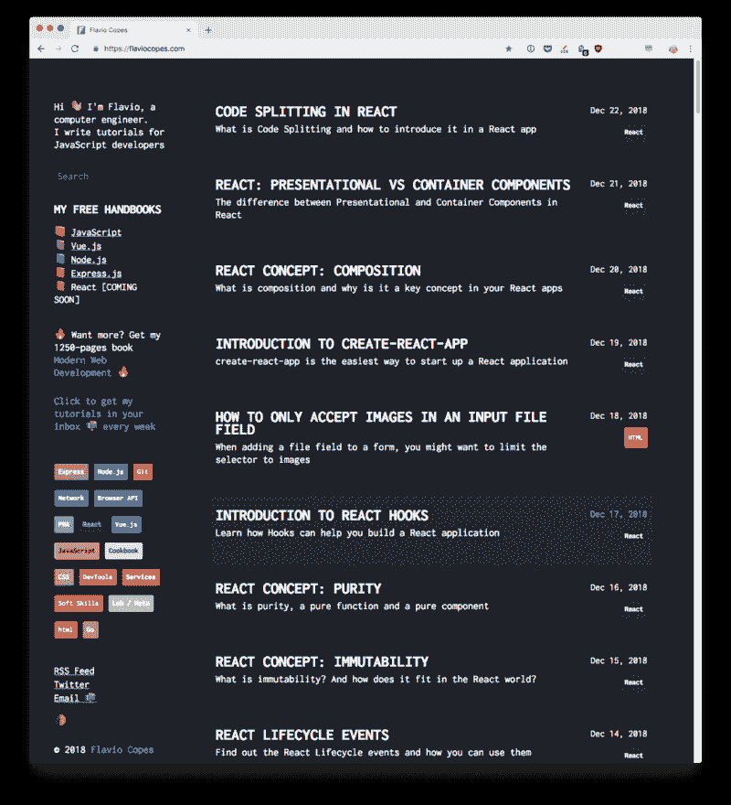
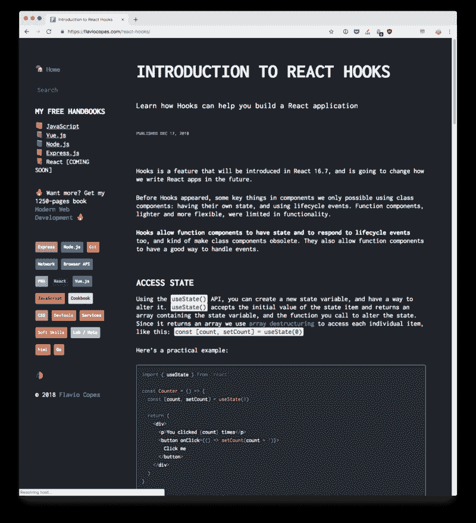
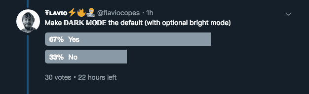

# 我是如何在我的网站上添加黑暗模式的

> 原文：<https://www.freecodecamp.org/news/how-i-added-dark-mode-to-my-website-33611d246425/>

我最近重新设计了我的网站。这里有两张*看起来*的照片，供参考:



我差不多一年前设计了这个网站，并做了很多修改，就像我们做任何网站一样。

最终我厌倦了这种设计:标题太大，太多的空间丢失而不是立刻显示内容，等等。

我昨天晚上坐下来，开始重新想象这个网站，今天早上我完成了重新设计:



好多了！内容，最重要的，更加突出。

我使用了等宽字体(Inconsolata ),因为作为一个编程博客，这是一个很好的字体，尽管由于字体的使用降低了可读性并增加了页面大小，因为我希望在我的网站上使用这种字体。我更喜欢它，因为我的网站是我日常活动的一大部分，我希望它是我想要的。

我刚刚错过了一件事:**黑暗模式**。当我在重新设计的过程中，我想到了黑暗模式选项。

我是怎么做到的？首先我加了月亮表情符号？在侧边栏中，作为一种让人们将模式从亮变暗的方式。

然后，我添加了一个单击时运行的 JavaScript 片段。我只是将它添加到 HTML 中的`onclick`事件处理程序中，没有做什么特别的改动:

```
<p>  <a href="#" onclick="localStorage.setItem('mode', (localStorage.getItem('mode') || 'dark') === 'dark' ? 'light' : 'dark'); localStorage.getItem('mode') === 'dark' ? document.querySelector('body').classList.add('dark') : document.querySelector('body').classList.remove('dark')" title="Dark/light</p>
```

这是 onclick 中运行的 JavaScript:

```
localStorage.setItem('mode', (localStorage.getItem('mode') || 'dark') === 'dark' ? 'light' : 'dark'); localStorage.getItem('mode') === 'dark' ? document.querySelector('body').classList.add('dark') : document.querySelector('body').classList.remove('dark')
```

这有点复杂，但基本上我会检查本地存储中的`mode`属性是否为‘dark’(如果还没有设置，默认为 dark，使用`||`操作符)，并在本地存储中设置与之相反的属性。

然后我将`dark`类分配给`body` HTML 元素，这样我们就可以使用 CSS 在黑暗模式下设计页面样式。

另一个脚本在 DOM 加载后立即运行，并检查模式是否是黑暗的。如果是，它将把`dark`类添加到`body` HTML 元素中:

```
document.addEventListener('DOMContentLoaded', (event) => {  ((localStorage.getItem('mode') || 'dark') === 'dark') ? document.querySelector('body').classList.add('dark') : document.querySelector('body').classList.remove('dark')})
```

现在，如果人们改变模式，他们的选择会在下次加载页面时被记住。

然后我在 CSS 里面加了很多 CSS 指令，都加了前缀`body.dark`。像这些:

```
body.dark {  background-color: rgb(30,34,39);  color: #fff;}body.dark code[class*=language-],body.dark table tbody>tr:nth-child(odd)>td,body.dark table tbody>tr:nth-child(odd)>th {  background: #282c34}
```

现在事情应该已经在运作了！这是我在黑暗模式下的网站:



默认情况下，我将`dark`类添加到`body`元素中，使黑暗模式成为默认模式:

```
<body class="dark"> ... &lt;/body>
```

为什么？首先，我更喜欢它。然后，我在 Twitter 上做了一个民意调查，人们更喜欢它。



但也是因为一个技术原因，一个非常简单的原因。我不在服务器端存储用户选择，所以在本地存储可用之前，我无法知道模式。

如果站点是在服务器端生成的，我也可以这样做，但它是一个静态站点，所以我总是为每个请求它的人提供相同的页面。即使我得到了一个 cookie，我也没有地方处理它(另一方面，这意味着我的页面加载得更快)。

因此，当有人导航到我的网站上的另一个页面，或者在第二次访问时第一次加载该页面时，我不想在确定模式时显示明亮的页面。也许来访者半夜在一个黑暗的房间里编码。

我更愿意在浅色模式下这样做:显示深色页面几毫秒，然后再变白。

*媒体查询第 5 级*规范仍在制定中，包含一个新的`[prefers-color-scheme](https://drafts.csswg.org/mediaqueries-5/#prefers-color-scheme)`媒体特性。[MAC OS 上的 Safari 技术预览版](https://developer.apple.com/safari/technology-preview/)已经支持它，我们可以用它来判断用户是在暗模式还是亮模式下浏览页面:

```
@media (prefers-color-scheme: dark) {  body {    background-color: black;    color: white;  }}@media (prefers-color-scheme: light) {  body {    background-color: white;    color: black;  }}
```

希望这将很快在 Safari 中稳定下来，将来 Chrome 和 Firefox 也会支持它。

*最初发表于[flaviocopes.com](https://flaviocopes.com/dark-mode/)。*