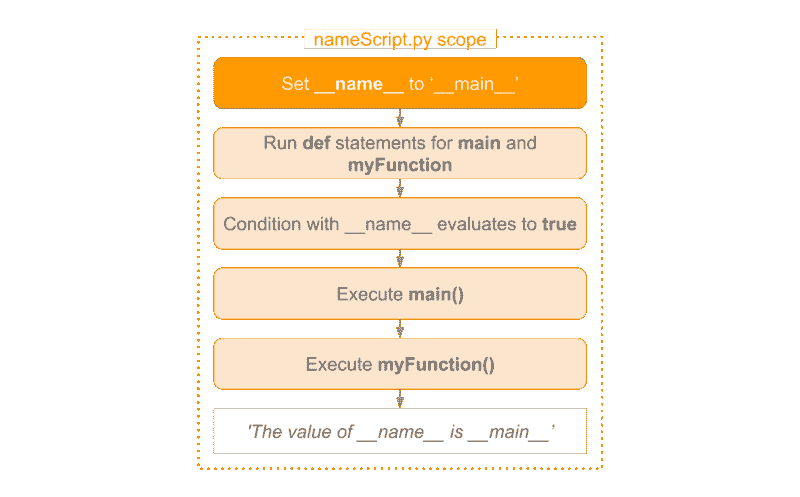
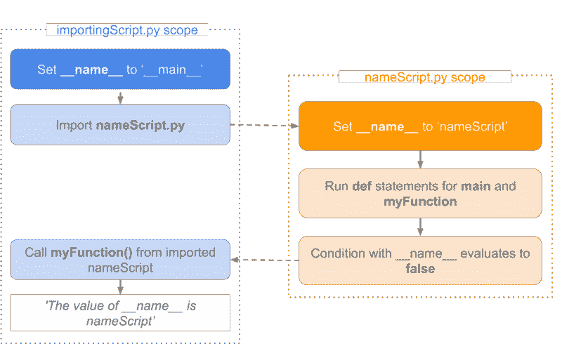

# (Python 的)__name_ 里面有什么？

> 原文：<https://www.freecodecamp.org/news/whats-in-a-python-s-name-506262fe61e8/>

#### _ _name_ _ 变量及其在 Python 中的用法介绍

当你浏览 Python 代码时，你很可能见过`__name__`变量。下面你会看到一个示例代码片段:

```
if __name__ == '__main__':    main()
```

在本文中，我想向您展示如何利用这个变量在 Python 中创建模块。

#### 为什么要使用 _ _name_ _ 变量？

`__name__`变量(前后两个下划线)是一个特殊的 Python 变量。它的值取决于我们如何执行包含它的脚本。

有时，您编写的脚本中的函数可能对其他脚本也有用。在 Python 中，您可以将该脚本作为一个模块导入另一个脚本中。

由于这个特殊的变量，您可以决定是否要运行脚本。或者您希望导入脚本中定义的函数。

#### __name__ 变量可以包含哪些值？

当您运行脚本时，`__name__`变量等于`__main__`。当您导入包含脚本时，它将包含脚本的名称。

让我们看看这两个用例，并用两个例子来描述这个过程。

#### 场景 1 -运行脚本

假设我们写了脚本`nameScript.py`如下:

```
def myFunction():    print 'The value of __name__ is ' + __name__
```

```
def main():    myFunction()
```

```
if __name__ == '__main__':    main()
```

如果运行 nameScript.py，将遵循以下过程。



在所有其他代码运行之前，`__name__`变量被设置为 __main__。之后，运行`main` 和`myFunction` def 语句。因为条件评估为 true，所以调用主函数。这又调用了 myFunction。这将打印出`__main__`的值。

#### 场景 2 -在另一个脚本中导入脚本

如果我们想在另一个脚本中重用 myFunction，例如`importingScript.py`，我们可以将`nameScript.py`作为一个模块导入。

`importingScript.py`中的代码可能如下:

```
import nameScript as ns
```

```
ns.myFunction()
```

然后我们有两个作用域:一个是`importingScript`，另一个是`nameScript`。在插图中，您将看到它与第一个用例的不同之处。



在 importingScript.py 中，`__name__`变量被设置为 __main__。通过导入 nameScript，Python 开始通过在模块名中添加`.py`来查找文件。然后，它运行导入文件中包含的代码。

但是这次它被设置为 nameScript。再次运行 main 和 myFunction 的 def 语句。但是，现在条件评估为 false 并且 main 没有被调用。

在 importingScript.py 中，我们调用输出 nameScript 的 myFunction。在定义函数时，myFunction 知道 NameScript。

如果在 importingScript 中打印`__name__`，将会输出`__main__`。原因是 Python 使用了 importingScript 范围内已知的值。

#### 结论

在这篇短文中，我解释了如何使用`__name__`变量来编写模块。您也可以单独运行这些模块。这可以通过利用这些变量的值如何根据它们出现的位置而变化来实现。