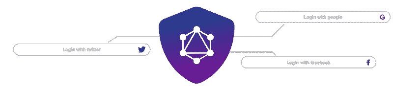
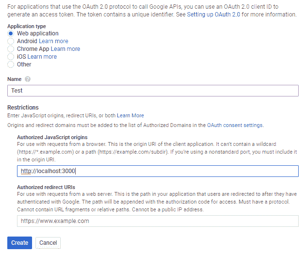
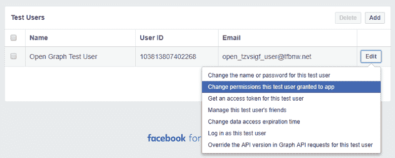
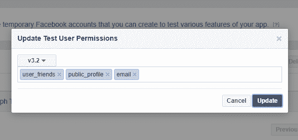
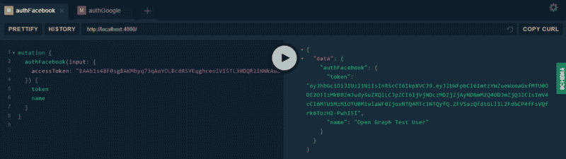
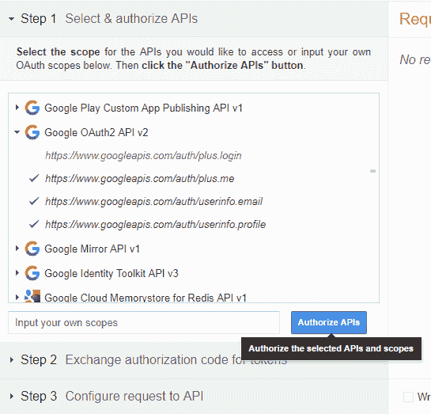
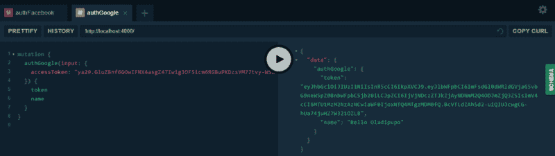

# 如何在 GraphQL 中钉钉社交认证

> 原文：<https://www.freecodecamp.org/news/how-to-nail-social-authentication-in-graphql-27943aee5dce/>

作者奥拉迪普波·贝洛

# 如何在 GraphQL 中钉钉社交认证



Illustration by [kemzy73](https://www.instagram.com/kemzyscreativespace/)

在本文中，你将学习如何使用 **Passport 在 **GraphQL** 服务器中执行**社交认证**。JS** 。

也许您已经有了一个身份验证系统，使用指令或解析器包装器来保护您的模式免受未经授权的访问，并且想知道如何通过 Google、脸书或任何 oauth 提供者向您的 API 添加身份验证。

好了，系好安全带，因为几行代码，你就有了。

我不会深入探讨 jwt 是如何工作的，或者如何从提供者那里获得一个*访问令牌*。本教程将重点介绍如何使用在客户机上获得的*访问令牌*从提供者那里获取用户数据以进行注册和登录。

我也不会深入讨论如何为你的模式设置授权，因为已经有很多关于这个主题的令人惊奇的教程了。

### 在 GraphQL 之前，沿着记忆之路进行一次短暂的旅行⏰

REST 中的身份验证非常简单:将您的中间件放在一个端点上，就可以了。然而，在 graphQL 中，只有一个端点，所以我们需要不同的方法。

### 迷雾

一旦你理解了如何实现社交登录，你最终会选择使用哪种框架、语言或数据库。所以现在开始:

**步骤 1** :在前端，弹出第三方认证提供商登录窗口。

**步骤 2** :(仍在前端)获取提供商同意登录后返回的访问令牌。

**步骤 3** :(是的，仍然是前端)将令牌作为变异输入参数的一部分发送到后端。

**第四步**:在后端，验证令牌。

**步骤 5** :如果令牌是可信的，您将收到用户作为验证响应的一部分(至少 Passport.js 是这样的，我们将使用它)。

**第六步**:将用户的数据保存到你的数据库中。

**第七步**:返回一个 JWT 到前端。如何使用这个令牌超出了本教程的范围，但是它应该用于验证每个登录用户的操作。

这就是用 graphQL 创建社交登录的框架。

我将省略步骤 1、2 和 3，因为它们已经在[这里](https://medium.com/@alexanderleon/implement-social-authentication-with-react-restful-api-9b44f4714fa)讨论过了。实际上，在前端使用什么样的框架/库并不重要。重要的是获取一个访问代码并用它进行变异。

闲聊到此为止。让我们开始吧。

首先，您需要从不同的提供者那里获取身份验证 id 和秘密。

### 脸谱网

**第一步**:进入 https://developers.facebook.com/apps/，选择‘添加新应用’

**第二步**:给你的应用取个名字，完成安全问题。

**第三步**:选择“整合脸书登录”，点击确认。

**第四步**:抄下隐藏在同一页面某处的 *App Id* 和 *App Secret* 值。

### 谷歌

**第一步**:进入开发者控制台:【https://console.developers.google.com/】T2，创建一个项目

**第二步**:在搜索栏中查找 oauth 凭证’，点击弹出的单选按钮。

**步骤 3** :尝试找到“创建凭证”按钮。如果你找到了，就点击它。选择“Oauth 客户端 Id”。

对于应用程序类型，选择' *web 应用程序'*。

对于授权来源，请添加 http://localhost:3000。在生产中，您可能希望更具体一点。



**第四步**:点击创建，将隐藏在同一页面某处的*客户端 Id* 和*客户端秘密*复制下来。

### **API 服务器**

为您的服务器创建一个文件夹:

```
mkdir graphql-social-auth && cd graphql-social-auth
```

用初始化应用程序

```
npm init
```

或者如果你用的是[纱](https://yarnpkg.com/lang/en/docs/cli/init/)

```
yarn init
```

让我们运行一个 API 服务器。我将在这里使用阿波罗服务器。

```
npm install --save apollo-server graphql
```

或者如果你用的是纱线

```
yarn add apollo-server graphql
```

只要你提供`typeDefs`和`resolvers`，阿波罗服务器就会为你设置一个快递服务器。

typeDefs 代表定义数据“形状”的类型定义。另一方面，解析器负责获取这些类型的数据。

创建文件 src/app.js 并添加以下代码:

此时，我们可以通过运行以下命令来启动服务器

```
node src/app.js
```

启动服务器后，它应该向控制台打印一条消息，表明它准备好了。

```
? Server ready at http://localhost:4000/ 
```

想知道如何更改端口或将服务器连接到现有的 node.js 应用程序吗？查看 apollo-server [文档](https://www.apollographql.com/docs/apollo-server)了解更多信息。

要浏览新创建的 GraphQL API，请打开浏览器，打开控制台中显示的链接`http://localhost:4000/`。Apollo Server 为您设置了 GraphQL Playground，这样您就可以开始快速运行查询和探索模式。

要运行查询，请复制以下查询，然后按“▶️”按钮:

```
query {  hello}
```

服务器应该返回一个简单的响应:

```
{  "data": {    "hello": "world"  }}
```

耶！服务器工作正常。现在有趣的部分来了。

1.  我们必须设置我们的 graphQL 模式和解析器。
2.  我们必须设置 Passport 并将其连接到我们的解析器，以便从前端验证我们的令牌。
3.  我们还需要设置 Mongo 来处理存储我们的用户。

我将使用 MongoDB，因为它更容易设置，但用 MySQL 替换它应该不成问题。

首先让我们安装必要的依赖项:

```
npm install --save passport passport-facebook-token passport-google-token mongoose jsonwebtoken
```

或者如果你用的是纱线

```
yarn add passport passport-facebook-token passport-google-token mongoose jsonwebtoken
```

接下来，打开 src 文件夹并创建以下文件:

```
mongoose.jspassport.jstypeDefs.jsresolvers.js
```

将以下内容添加到 src/mongose . js 中:

这将把应用程序连接到数据库，并设置用户模式。

它还将创建生成 jwt 的方法，并在我们的数据库中找到来自脸书和谷歌的用户。

将以下内容添加到 src/passport.js 中:

不要忘了用脸书和谷歌的用户名和密码来替换虚拟的用户 id 和密码。

说完这些，剩下的就是更新 graphQL 类型和解析器了。

让我们将 typeDefs 和 resolvers 移到单独的文件中，以保持 app.js 的整洁。将以下内容添加到 src/typeDefs.js 中:

接下来是 src/resolver.js:

接下来，我们重构 src/app.js，从单独的文件中导入模式。

最后，我们将来自 express 的请求和响应对象添加到我们的 graphQL *上下文*中。这将使它们可以在我们的突变解析器中与**护照一起使用。JS** 。

我们结束了。

### **试用**

在单独的窗口中运行以下命令，让 Mongo 守护程序运行:

```
mongod
```

现在重新启动 API 服务器:

```
node src/app.js
```

为了确保一切正常工作，让我们拿一些*访问令牌*并做一些测试运行。

### **脸书**

**第一步:**在【https://developers.facebook.com/apps/】的[上打开你的应用设置，在左侧边栏选择角色- >测试用户。](https://developers.facebook.com/apps/)

**步骤 2:** 点击“编辑”并选择“更改该测试用户授予应用的权限”



**第三步:**给权限添加邮箱，点击更新。



**第 4 步:**点击“编辑”并选择“获取该测试用户的访问令牌”

**步骤 5:** 复制*访问令牌*并在 graphQL Playground 中用它运行 authFacebook 变异。



mutation and response from graphql playground

### 谷歌

据我所知，谷歌没有针对他们的 API 的测试用户等价物。但是我们可以使用 Oauth Playground 为自己获取一个有效的*访问令牌。*

**步骤 1:** 转到 https://developers.google.com/oauthplayground，选择“Google OAuth2 API v2”范围并点击“授权 API”:



Auth scopes for Google OAuth2 API v2

您将被重定向到谷歌同意屏幕。

**第 2 步:**同意后，在页面上找到“代币兑换授权码按钮”并点击它。这将为登录用户生成有效的*刷新*和*访问令牌*。

**第三步:**复制生成的*访问令牌*，用它在 graphQL Playground 中运行 authGoogle 变异。



mutation and response from graphql playground

### 就是这样！

你一直坚持到最后！如果您在这个过程中遇到了困难，可以随时查看这个[库](https://github.com/DavyBello/graphql-social-auth-tutorial)中的代码。如果你有任何问题或反馈，请在下面的评论中告诉我。

干杯！

[拉迪贝洛](https://ladi-bello.netlify.com)