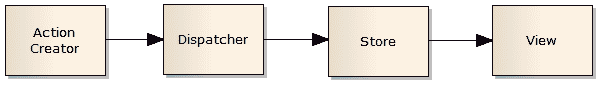
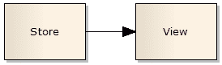
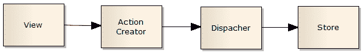
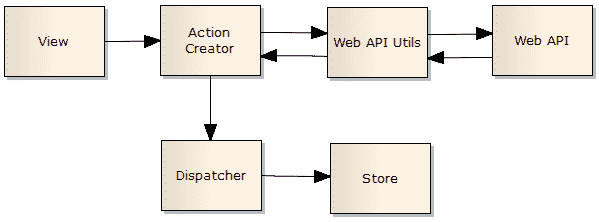

# Flux 架构模式简介

> 原文：<https://www.freecodecamp.org/news/an-introduction-to-the-flux-architectural-pattern-674ea74775c9/>

[****发现函数式 JavaScript****](https://read.amazon.com/kp/embed?asin=B07PBQJYYG&preview=newtab&linkCode=kpe&ref_=cm_sw_r_kb_dp_cm5KCbE5BDJGE) 被 book authority****评为 [****最佳函数式编程新书之一！****](https://bookauthority.org/books/new-functional-programming-books?t=7p46zt&s=award&book=1095338781)****

通量是由脸书提出的一种建筑模式，用于建造温泉。它建议将应用程序分成以下几个部分:

*   商店
*   分配器
*   视图
*   动作/动作创建者

### 商店

商店管理状态。它可以存储域状态和用户界面状态。

存储和状态是不同的概念。状态是数据值。Store 是一个通过方法管理状态的行为对象。在管理图书的情况下:图书列表是状态，书店管理该列表。

一个存储管理多个对象。它是关于那些特定对象的真理的唯一来源。在一个应用程序中可以有许多商店。比如:书店，AuthorStore，UserStore。

存储区上没有 setter 方法。您只能通过向调度程序传递操作来请求状态更改。

商店听取所有的行动，并决定采取哪一项行动。这通常意味着一个`switch`语句。一旦存储进行了状态更改，它将发出一个更改事件。存储是一个事件发射器。

商店不把其他商店作为依赖。

### 分配器

Dispatcher 是一个向所有注册的存储广播动作/事件的对象。应用程序启动时，商店需要注册事件。

当一个动作进来时，它会将该动作传递给所有注册的商店。

### 视角

视图是用户界面组件。它负责呈现用户界面和处理用户交互。视图是树状结构。

视图监听存储更改并重新呈现。

视图可以进一步分为表示视图和容器视图。

演示视图不连接到 dispatcher 或商店。他们只能通过自己的属性进行交流。

容器视图连接到商店和调度程序。它们监听来自商店的事件，并为表示组件提供数据。他们使用商店的公共 getter 方法获取新数据，然后将数据向下传递到视图树。

容器视图响应用户迭代调度动作。

### 行动

一个动作是一个普通的对象，它包含了完成这个动作所需的所有信息。

动作有一个标识动作类型的`type`属性。

当动作对象在应用程序中移动时，我建议让它们不可变。

行动可能来自不同的地方。它们可能来自作为用户交互结果的视图。它们可能来自其他地方，如初始化代码，其中数据可能来自 Web API，并触发操作来更新视图。动作可能来自需要屏幕更新的计时器。

### 动作创建者

实践是封装代码，在函数中创建动作。这些创建和调度动作的功能称为动作创建器。

#### Web API 调用

当执行 Web API 调用来更新用户界面时，Web API 调用之后将会有一个更新商店的操作。当存储被更新时，它将发出一个 change 事件，结果监听该事件的视图将重新呈现。

Web API 调用是在动作创建器中进行的。我们可以提取出在 Web API Utils 函数中执行 API 调用的代码。

### 单向数据流

更新视图单向流动:

视图不会修改它们接收到的数据。它们监听数据的变化，用新值创建动作，但不更新数据。

商店、视图和任何其他动作不能直接改变(其他)商店中的状态。他们必须通过调度程序发送一个动作

存储读取中的数据流比写入中的数据流短。存储写入中的数据流在异步和同步操作之间有所不同。

存储读取

在同步操作中存储写入

在异步操作中存储写入

### 赞成的意见

Flux 架构在视图不直接映射到域存储的应用程序中更好。换句话说，当视图可以创建更新许多商店的操作，而商店可以触发更新许多视图的更改时。

动作可以被持久化，然后被重放。

### 骗局

Flux 会给每个视图映射到一个商店的应用程序增加不必要的复杂性。在这种应用程序中，视图和存储之间的分离就足够了。

看看[中的例子，如何用 React](https://medium.freecodecamp.org/how-to-create-a-three-layer-application-with-react-8621741baca0) 创建一个三层应用程序。

### 结论

存储管理状态。它们只通过监听动作来改变状态。存储要更新的通知视图。

视图呈现用户界面并处理用户交互。容器视图监听存储更改。

dispatcher 向所有注册的商店广播操作。

动作是简单的对象。

[****发现函数式 JavaScript****](https://read.amazon.com/kp/embed?asin=B07PBQJYYG&preview=newtab&linkCode=kpe&ref_=cm_sw_r_kb_dp_cm5KCbE5BDJGE&source=post_page---------------------------) 被 book authority****评为[****最佳函数式编程新书之一！****](https://bookauthority.org/books/new-functional-programming-books?t=7p46zt&s=award&book=1095338781&source=post_page---------------------------)****

****关于在 React 中应用函数式编程技术的更多信息，请看一下**** [****函数式 React****](https://read.amazon.com/kp/embed?asin=B07S1NLFTS&preview=newtab&linkCode=kpe&ref_=cm_sw_r_kb_dp_Pko5CbA30383Y) ****。****

学习 ****功能性 React**** ，以基于项目的方式，用 [****功能性架构用 React****](https://read.amazon.com/kp/embed?asin=B0846NRJYR&preview=newtab&linkCode=kpe&ref_=cm_sw_r_kb_dp_o.hlEbDD02JB2)****。****

[在 Twitter 上关注](https://twitter.com/cristi_salcescu)