# 如何将 React 应用程序部署到 Netlify

> 原文：<https://www.freecodecamp.org/news/how-to-deploy-a-react-application-to-netlify-363b8a98a985/>

Abhishek Jakhar


我将教你如何使用 Netlify 部署和托管 React 应用程序。Netlify 是一项自动构建、部署和管理网站的服务。这是目前最快、最简单的部署解决方案之一。

[**Netlify**](https://www.netlify.com/) 提供免费计划。所以首先，我们将使用登录页面上给出的任意一个选项(Github、Gitlab、Bitbucket、Email)登录到 [**Netlify**](https://www.netlify.com/) 。

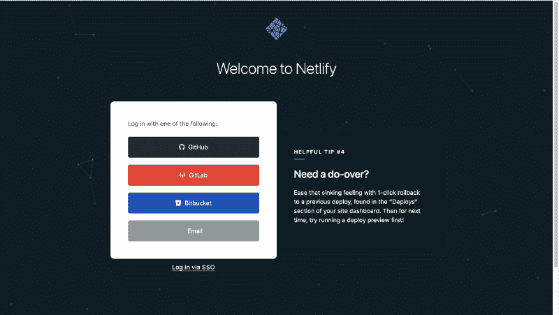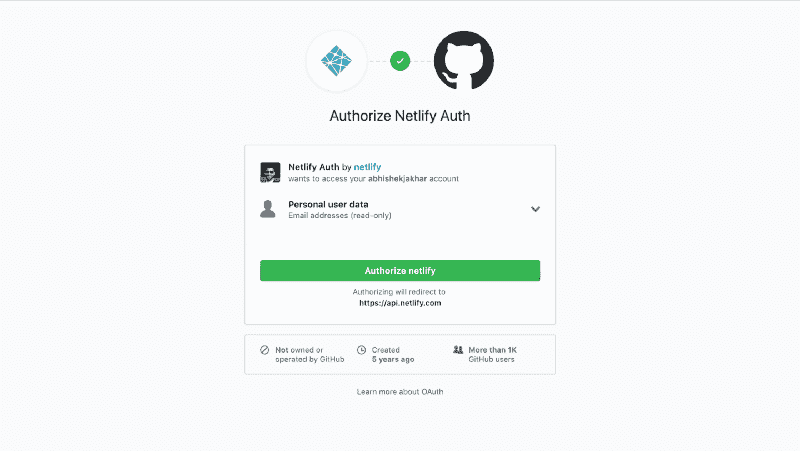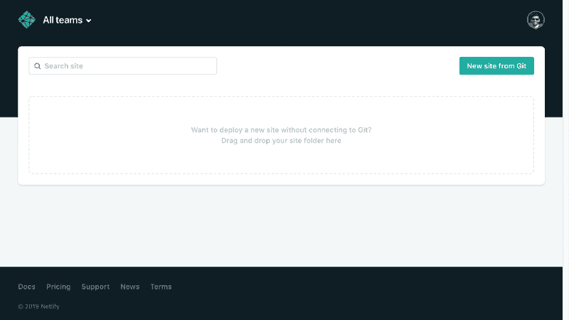

**Left**(Login Page) **Center**(Authorization) **Right**(Netlify Online App)

我们将通过运行以下命令来创建应用程序的内部版本:

```
npm run build
```

因此，现在我们的构建文件夹将被生成，其中将包含所有生产就绪文件。

现在，有两种方法可以将我们的应用程序部署到 Netlify。

#### **拖动&放下**

Netifly 让它变得如此简单，我们只需**拖放**我们的**构建文件夹**到他们的**在线应用**(上面最右边的图片)，我们的应用就会被部署到一个活动的 URL。

> **注意:** Netlify 在线应用程序是您登录 Netlify 帐户后出现的屏幕。

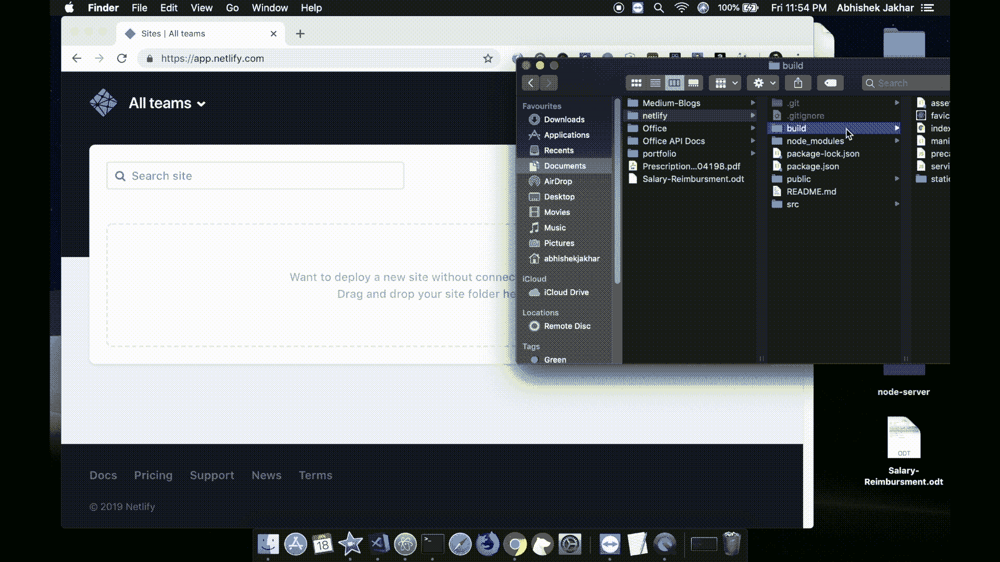

**Drag & Drop build** folder to **Netlify Online Application** to Deploy

#### 网络生活客户端

Netifly 还提供了一个命令行界面，让您可以直接从命令行部署应用程序。这就是我们现在要做的。

首先，我们将使用以下命令安装 CLI:

```
npm install netlify-cli -g
```

现在，我们准备部署它。要部署应用程序，我们必须确保我们在项目文件夹中，然后我们将运行以下命令:

```
netlify deploy
```

我们可能会看到一个弹出窗口，要求我们使用 Netlify 登录，并授予对 **Netlify CLI** 的访问权限。

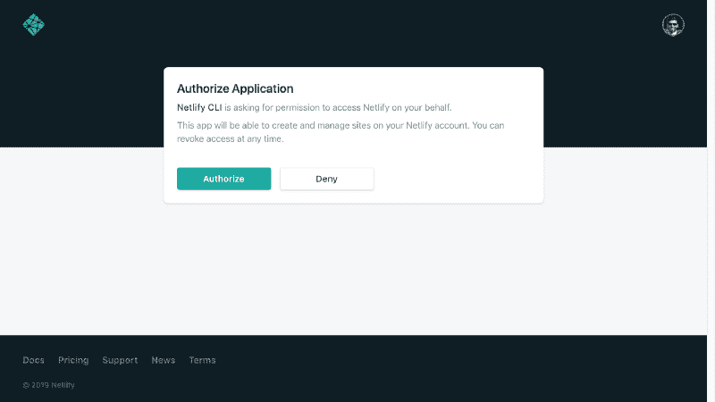

Pop-Up window asking you to log in with Netlify and grant access to the Netlify CLI

现在，我们将单击授权。现在我们已经获得授权，我们可以按照命令行提示来部署应用程序。

#### 命令行提示

1.  在控制台中，它显示"**该文件夹尚未链接到网站。你想做什么？”**它想知道我们是要将该目录链接到现有站点，还是要创建和配置一个新站点。由于这是一个新站点，我们将选择**创建&配置一个新站点。**

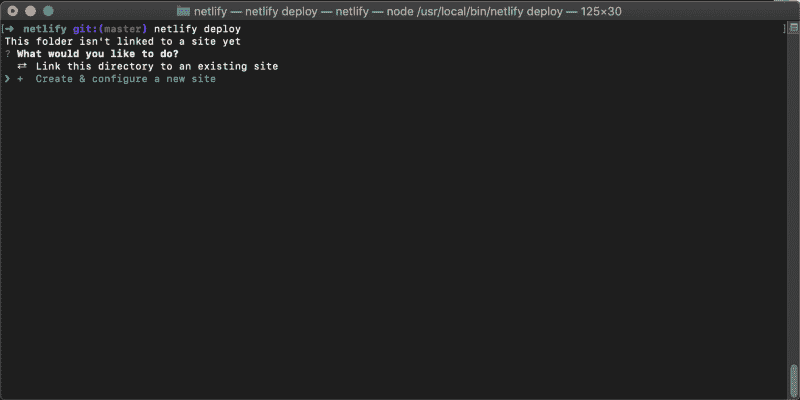

2.它让我们可以选择给我们的网站命名。我将在 netlify 上键入 **portfolio(您可以键入任何您喜欢的可用名称)。**

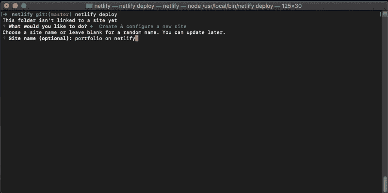

3.现在它会询问您想要使用的 Netlify 帐户，因此我将选择**我的帐户(Abhishek Jakhar)** ，您可以选择您的帐户。

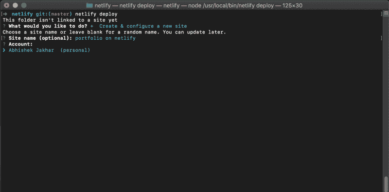

4.现在，作为部署路径，我们需要指定项目的构建目录，该目录包含用于部署的资产。因此，我们将在那里键入 **build** 并按回车键。

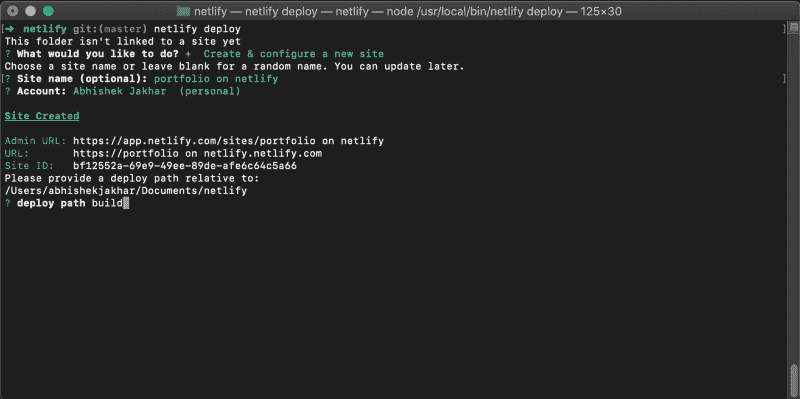

5.现在，我们的站点将被创建，并将首先被部署到一个草稿 URL，我们可以通过在浏览器中复制和粘贴 URL 来查看它。

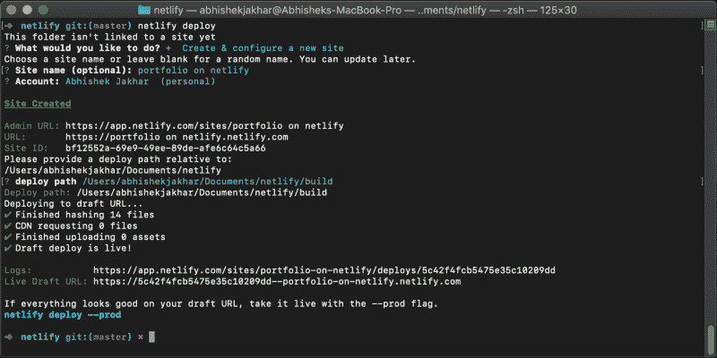

现在，回到控制台，它说**“如果你的草稿 URL 看起来一切正常，就用- prod 标志来标记它吧”**。

因此，为了让我们的应用程序运行起来，我们将运行命令行上显示的命令

```
netlify deploy --prod
```

它将再次要求我们指定实时构建的部署路径，这也是我们的构建文件夹。

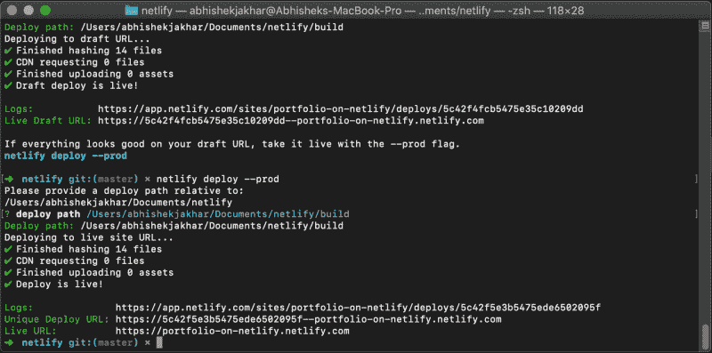

现在，在控制台输出中，我们得到两个 URL。一个**唯一部署 URL，**代表每个单独部署的唯一 URL，一个**实时 URL** 总是显示您的最新部署。

所以每次你更新和部署你的网站时，你都会得到一个唯一的 URL。基本上，如果我们部署多次，我们将拥有多个唯一的 URL，这样你就可以将用户指向你的应用的一个 T2 版本。但是**直播网址**总是在同一个网址显示你的**最新变化**。

> **注意:** Netlify 自动保护你的网站在**【HTTPS】****免费**。

#### 找不到页面错误

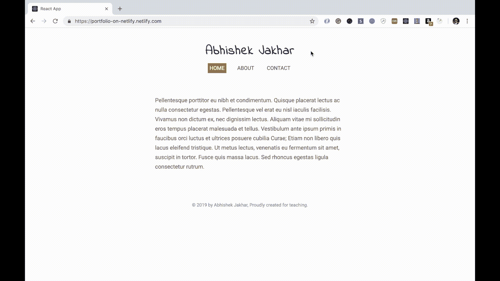

**404 Error** when we refresh application after navigating to a different route

如果你要发布一个使用 React Router 这样的路由器的应用，你需要为你的 URL 配置重定向和重写规则。因为当我们点击任何导航项改变页面(路线)刷新浏览器时，都会得到 404 错误页面。

所以 Netlify 使得为你的 URL 配置重定向和重写规则变得非常容易。我们需要在应用程序的构建文件夹中添加一个名为 _redirects 的文件。在文件内部，我们需要包含以下重写规则。

```
/*    /index.html  200
```

这个重写规则将服务于 index.html 文件，而不是给出一个 404，无论浏览器请求什么 URL。

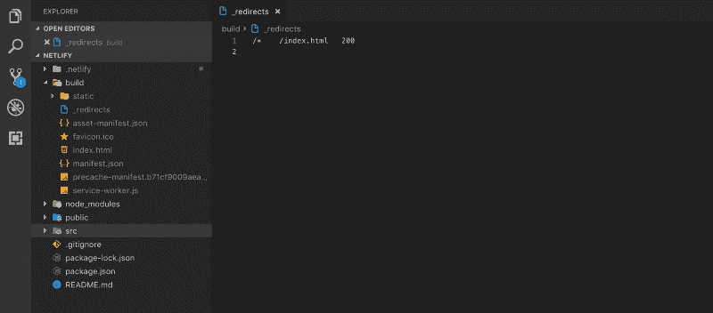

The **_redirects** file inside the build folder containing **redirect rule**

所以现在，要查看实时 URL 的最新变化，我们需要使用`netlify deploy`进行部署。同样，我们将指定 build 作为部署路径。现在，当我们看到实时网址并在更改路线后刷新应用程序时，我们将不再看到 404 错误页面。

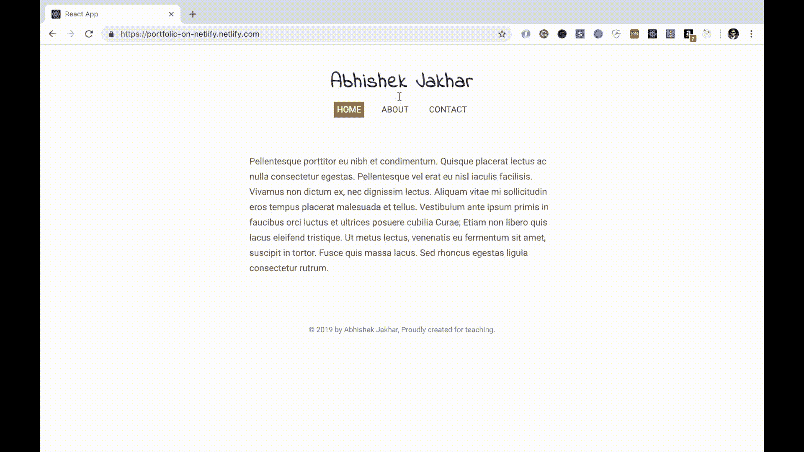

这就是全部了。在 netlify.com 上，你可以看到你的网站设置。在那里，你可以做一些事情，比如建立一个自定义域，或者将网站连接到 GitHub 库。

[**Netlify:自动化现代 web 项目的一体化平台**](https://www.netlify.com/)
[*用 Netlify 部署现代静态网站。获得 CDN、持续部署、一键式 HTTPS 以及您需要的所有服务……*www.netlify.com](https://www.netlify.com/)

我希望这篇文章对你有所帮助。我希望听到您的反馈！

**感谢您的阅读！**