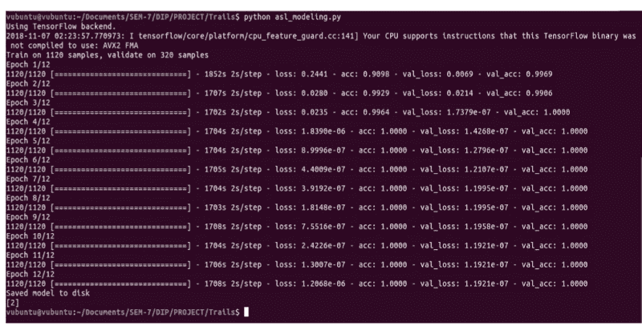

# 如何建立一个识别手语手势的卷积神经网络

> 原文：<https://www.freecodecamp.org/news/asl-using-alexnet-training-from-scratch-cfec9a8acf84/>

来了

# 如何建立一个识别手语手势的卷积神经网络

手语一直是听力和语言障碍者的一大福音。但是，只有当对方能够理解手语时，它才能达到目的。因此，如果有一个系统能够将手势图像转换成相应的英文字母，那就太好了。所以这篇文章的目的就是要建立这样一个美国手语识别系统。


维基百科对美国手语的定义如下:

> **美国手语** ( **美国手语**)是一种[自然语言](https://en.wikipedia.org/wiki/Natural_language)，是美国[聋人社区](https://en.wikipedia.org/wiki/Deaf_communities)和加拿大大部分英语国家的主要[手语。](https://en.wikipedia.org/wiki/Sign_language)

首先，数据:记住图像类别的多样性对于像照明条件、变焦条件等有影响的因素是非常重要的。ASL 上的 Kaggle 数据具有所有这些不同的变体。对这些数据的训练确保了我们的模型对每个类都有很好的了解。所以，让我们继续研究 K [聚集数据](https://www.kaggle.com/grassknoted/asl-alphabet)。

该数据集由英文字母表中每个字母的手势图像组成。同一类别的图像有不同的变体，即缩放版本、昏暗和明亮的光线条件等。对于每个类，有多达 3000 个图像。为了简单起见，让我们考虑在我们的工作中对“A”、“B”和“C”图像进行分类。这里有[训练](https://github.com/vagdevik/American-Sign-Language-Recognition-System/blob/master/2_AlexNet/asl_full.py)和[测试](https://github.com/vagdevik/American-Sign-Language-Recognition-System/blob/master/2_AlexNet/predict_full.py)的完整代码的链接。


An image for the letter ‘A’ from the dataset

我们将构建一个 [AlexNet](https://www.learnopencv.com/understanding-alexnet/) 来实现这个分类任务。既然是训练 CNN，就要确保有 GPU 这样的计算资源支持。

我们从导入必要的模块开始。

```
import warningswarnings.filterwarnings("ignore", category=DeprecationWarning) 
```

```
import osimport cv2import randomimport numpy as npimport kerasfrom random import shufflefrom keras.utils import np_utilsfrom shutil import unpack_archive
```

```
print("Imported Modules...")
```

从 K [aggle data](https://www.kaggle.com/grassknoted/asl-alphabet) 下载数据 zip 文件。现在，让我们选择 A、B 和 C 的手势图像，并将获得的数据分成训练数据、验证数据和测试数据。

```
# data folder pathdata_folder_path = "asl_data/new" files = os.listdir(data_folder_path) 
```

```
# shuffling the images in the folderfor i in range(10):   shuffle(files)
```

```
print("Shuffled Data Files")
```

```
# dictionary to maintain numerical labelsclass_dic = {"A":0,"B":1,"C":2}
```

```
# dictionary to maintain countsclass_count = {'A':0,'B':0,'C':0}
```

```
# training listsX = []Y = []
```

```
# validation listsX_val = []Y_val = []
```

```
# testing listsX_test = []Y_test = []
```

```
for file_name in files:  label = file_name[0]  if label in class_dict:    path = data_folder_path+'/'+file_name    image = cv2.imread(path)    resized_image = cv2.resize(image,(224,224))    if class_count[label]<2000:      class_count[label]+=1      X.append(resized_image)      Y.append(class_dic[label])    elif class_count[label]>=2000 and class_count[label]<2750:      class_count[label]+=1      X_val.append(resized_image)      Y_val.append(class_dic[label])    else:      X_test.append(resized_image)      Y_test.append(class_dic[label])
```

数据集中的每个图像都是根据命名约定命名的。A 类的第 34 张图片命名为“A_34.jpg”。因此，我们只考虑文件字符串名称的第一个元素，并检查它是否属于所需的类。

此外，我们根据计数分割图像，并将这些图像存储在 X 和 Y 列表中——X 表示图像，Y 表示相应的类。这里，计数指的是我们希望分别放入训练集、验证集和测试集中的图像数量。这里，在每个类的 3000 幅图像中，我将 2000 幅图像放在训练集中，750 幅图像放在验证集中，其余的放在测试集中。

有些人也更喜欢基于总数据集(而不是像我们在这里做的那样针对每个类)进行划分，但这并不保证所有类都被正确学习。图像被读取并以 Numpy 数组的形式存储在列表中。

现在标签列表(Y)被编码成数字的独热向量。这是由 np _ utils.to _ categorical 完成的。

```
# one-hot encodings of the classesY = np_utils.to_categorical(Y)Y_val = np_utils.to_categorical(Y_val)Y_test = np_utils.to_categorical(Y_test)
```

现在，让我们以。npy 文件。基本上，我们创建单独的。npy 文件来存储属于每个集合的图像。

```
if not os.path.exists('Numpy_folder'):    os.makedirs('Numpy_folder')
```

```
np.save(npy_data_path+'/train_set.npy',X)np.save(npy_data_path+'/train_classes.npy',Y)
```

```
np.save(npy_data_path+'/validation_set.npy',X_val)np.save(npy_data_path+'/validation_classes.npy',Y_val)
```

```
np.save(npy_data_path+'/test_set.npy',X_test)np.save(npy_data_path+'/test_classes.npy',Y_test)
```

```
print("Data pre-processing Success!")
```

现在我们已经完成了数据预处理部分，让我们在这里看一下完整的数据预处理代码:

```
# preprocess.py
```

```
import warningswarnings.filterwarnings("ignore", category=DeprecationWarning)
```

```
import osimport cv2import randomimport numpy as npimport kerasfrom random import shufflefrom keras.utils import np_utilsfrom shutil import unpack_archive
```

```
print("Imported Modules...")
```

```
# data folder pathdata_folder_path = "asl_data/new" files = os.listdir(data_folder_path)
```

```
# shuffling the images in the folderfor i in range(10):   shuffle(files)
```

```
print("Shuffled Data Files")
```

```
# dictionary to maintain numerical labelsclass_dic = {"A":0,"B":1,"C":2}
```

```
# dictionary to maintain countsclass_count = {'A':0,'B':0,'C':0}
```

```
# training listsX = []Y = []
```

```
# validation listsX_val = []Y_val = []
```

```
# testing listsX_test = []Y_test = []
```

```
for file_name in files:  label = file_name[0]  if label in class_dict:    path = data_folder_path+'/'+file_name    image = cv2.imread(path)    resized_image = cv2.resize(image,(224,224))    if class_count[label]<2000:      class_count[label]+=1      X.append(resized_image)      Y.append(class_dic[label])    elif class_count[label]>=2000 and class_count[label]<2750:      class_count[label]+=1      X_val.append(resized_image)      Y_val.append(class_dic[label])    else:      X_test.append(resized_image)      Y_test.append(class_dic[label])
```

```
# one-hot encodings of the classesY = np_utils.to_categorical(Y)Y_val = np_utils.to_categorical(Y_val)Y_test = np_utils.to_categorical(Y_test)
```

```
if not os.path.exists('Numpy_folder'):    os.makedirs('Numpy_folder')
```

```
np.save(npy_data_path+'/train_set.npy',X)np.save(npy_data_path+'/train_classes.npy',Y)
```

```
np.save(npy_data_path+'/validation_set.npy',X_val)np.save(npy_data_path+'/validation_classes.npy',Y_val)
```

```
np.save(npy_data_path+'/test_set.npy',X_test)np.save(npy_data_path+'/test_classes.npy',Y_test)
```

```
print("Data pre-processing Success!")
```

现在是训练部分！让我们从导入基本模块开始，这样我们就可以构建和训练 CNN AlexNet。这里主要是使用 Keras 完成的。

```
# importing from keras.optimizers import SGDfrom keras.models import Sequentialfrom keras.preprocessing import imagefrom keras.layers.normalization import BatchNormalizationfrom keras.layers import Dense, Activation, Dropout, Flatten,Conv2D, MaxPooling2D
```

```
print("Imported Network Essentials")
```

我们接下来要加载以。npy:

```
X_train=np.load(npy_data_path+"/train_set.npy")Y_train=np.load(npy_data_path+"/train_classes.npy")
```

```
X_valid=np.load(npy_data_path+"/validation_set.npy")Y_valid=np.load(npy_data_path+"/validation_classes.npy")
```

```
X_test=np.load(npy_data_path+"/test_set.npy")Y_test=np.load(npy_data_path+"/test_classes.npy")
```

然后我们开始定义 CNN 的结构。假设预先了解 AlexNet 架构，这里是 Keras 代码。

```
model = Sequential()
```

```
# 1st Convolutional Layermodel.add(Conv2D(filters=96, input_shape=(224,224,3), kernel_size=(11,11),strides=(4,4), padding='valid'))model.add(Activation('relu'))
```

```
# Max Pooling model.add(MaxPooling2D(pool_size=(2,2), strides=(2,2), padding='valid'))
```

```
# Batch Normalisation before passing it to the next layermodel.add(BatchNormalization())
```

```
# 2nd Convolutional Layermodel.add(Conv2D(filters=256, kernel_size=(11,11), strides=(1,1), padding='valid'))model.add(Activation('relu'))
```

```
# Max Poolingmodel.add(MaxPooling2D(pool_size=(2,2), strides=(2,2), padding='valid'))
```

```
# Batch Normalisationmodel.add(BatchNormalization())
```

```
# 3rd Convolutional Layermodel.add(Conv2D(filters=384, kernel_size=(3,3), strides=(1,1), padding='valid'))model.add(Activation('relu'))
```

```
# Batch Normalisationmodel.add(BatchNormalization())
```

```
# 4th Convolutional Layermodel.add(Conv2D(filters=384, kernel_size=(3,3), strides=(1,1), padding='valid'))model.add(Activation('relu'))
```

```
# Batch Normalisationmodel.add(BatchNormalization())
```

```
# 5th Convolutional Layermodel.add(Conv2D(filters=256, kernel_size=(3,3), strides=(1,1), padding='valid'))model.add(Activation('relu'))
```

```
# Max Poolingmodel.add(MaxPooling2D(pool_size=(2,2), strides=(2,2), padding='valid'))
```

```
# Batch Normalisationmodel.add(BatchNormalization())
```

```
# Passing it to a dense layermodel.add(Flatten())
```

```
# 1st Dense Layermodel.add(Dense(4096, input_shape=(224*224*3,)))model.add(Activation('relu'))
```

```
# Add Dropout to prevent overfittingmodel.add(Dropout(0.4))
```

```
# Batch Normalisationmodel.add(BatchNormalization())
```

```
# 2nd Dense Layermodel.add(Dense(4096))model.add(Activation('relu'))
```

```
# Add Dropoutmodel.add(Dropout(0.6))
```

```
# Batch Normalisationmodel.add(BatchNormalization())
```

```
# 3rd Dense Layermodel.add(Dense(1000))model.add(Activation('relu'))
```

```
# Add Dropoutmodel.add(Dropout(0.5))
```

```
# Batch Normalisationmodel.add(BatchNormalization())
```

```
# Output Layermodel.add(Dense(24))model.add(Activation('softmax'))
```

```
model.summary()
```

`Sequential`模型是层的线性堆叠。我们添加卷积层(应用过滤器)、激活层(用于非线性)、最大池层(用于计算效率)和批量标准化层(用于标准化从上一层到下一层的输入值),并且该模式重复五次。

批规范化层是由 Ioffe 和 Szegedy 在 2014 年引入的。它通过标准化前一层的输出来解决消失梯度问题，通过减少所需的迭代次数来加速训练，并且能够训练更深层次的神经网络。

最后，添加 3 个完全连接的密集层以及漏失层(以避免过拟合)。

要获得模型的概要描述，请使用 model.summary()。

下面是模型编译部分的代码。我们将优化方法定义为 SGD 并设置参数。

```
# Compile sgd = SGD(lr=0.001)
```

```
model.compile(loss='categorical_crossentropy', optimizer=sgd, metrics=['accuracy'])
```

```
checkpoint = keras.callbacks.ModelCheckpoint("Checkpoint/weights.{epoch:02d}-{val_loss:.2f}.hdf5", monitor='val_loss', verbose=0, 
```

```
save_best_only=False, save_weights_only=False, mode='auto', period=1)
```

`lr`在 SGD 中是学习率。由于这是一个范畴分类，我们使用 categorical _ crossentropy 作为`model.compile`中的损失函数。我们将优化器设置为`sgd` *，*我们定义的 SGD 对象，并将评估指标设置为准确性。

在使用 GPU 时，有时可能会发生中断其运行的情况。使用检查点是存储到中断点为止的权重的最佳方式，以便我们以后可以使用它们。第一个参数是设置存储的位置:在 Checkpoints 文件夹中保存为`weights.{epoch:02d}-{val_loss:.2f}.hdf5`。

最后，我们以 json 格式保存模型，以. h5 格式保存权重。因此，这些文件保存在本地指定的文件夹中。

```
# serialize model to JSONmodel_json = model.to_json()with open("Weights_Full/model.json", "w") as json_file:    json_file.write(model_json)
```

```
# serialize weights to HDF5model.save_weights("Weights_Full/model_weights.h5")print("Saved model to disk")
```

让我们看看定义和训练网络的整个代码。请将此视为一个单独的文件“training.py”。

```
# training.py
```

```
from keras.optimizers import SGDfrom keras.models import Sequentialfrom keras.preprocessing import imagefrom keras.layers.normalization import BatchNormalizationfrom keras.layers import Dense, Activation, Dropout, Flatten,Conv2D, MaxPooling2D
```

```
print("Imported Network Essentials")
```

```
# loading .npy datasetX_train=np.load(npy_data_path+"/train_set.npy")Y_train=np.load(npy_data_path+"/train_classes.npy")
```

```
X_valid=np.load(npy_data_path+"/validation_set.npy")Y_valid=np.load(npy_data_path+"/validation_classes.npy")
```

```
X_test=np.load(npy_data_path+"/test_set.npy")Y_test=np.load(npy_data_path+"/test_classes.npy")
```

```
X_test.shape
```

```
model = Sequential()# 1st Convolutional Layermodel.add(Conv2D(filters=96, input_shape=(224,224,3), kernel_size=(11,11),strides=(4,4), padding='valid'))model.add(Activation('relu'))# Pooling model.add(MaxPooling2D(pool_size=(2,2), strides=(2,2), padding='valid'))# Batch Normalisation before passing it to the next layermodel.add(BatchNormalization())
```

```
# 2nd Convolutional Layermodel.add(Conv2D(filters=256, kernel_size=(11,11), strides=(1,1), padding='valid'))model.add(Activation('relu'))# Poolingmodel.add(MaxPooling2D(pool_size=(2,2), strides=(2,2), padding='valid'))# Batch Normalisationmodel.add(BatchNormalization())
```

```
# 3rd Convolutional Layermodel.add(Conv2D(filters=384, kernel_size=(3,3), strides=(1,1), padding='valid'))model.add(Activation('relu'))# Batch Normalisationmodel.add(BatchNormalization())
```

```
# 4th Convolutional Layermodel.add(Conv2D(filters=384, kernel_size=(3,3), strides=(1,1), padding='valid'))model.add(Activation('relu'))# Batch Normalisationmodel.add(BatchNormalization())
```

```
# 5th Convolutional Layermodel.add(Conv2D(filters=256, kernel_size=(3,3), strides=(1,1), padding='valid'))model.add(Activation('relu'))# Poolingmodel.add(MaxPooling2D(pool_size=(2,2), strides=(2,2), padding='valid'))# Batch Normalisationmodel.add(BatchNormalization())
```

```
# Passing it to a dense layermodel.add(Flatten())# 1st Dense Layermodel.add(Dense(4096, input_shape=(224*224*3,)))model.add(Activation('relu'))# Add Dropout to prevent overfittingmodel.add(Dropout(0.4))# Batch Normalisationmodel.add(BatchNormalization())
```

```
# 2nd Dense Layermodel.add(Dense(4096))model.add(Activation('relu'))# Add Dropoutmodel.add(Dropout(0.6))# Batch Normalisationmodel.add(BatchNormalization())
```

```
# 3rd Dense Layermodel.add(Dense(1000))model.add(Activation('relu'))# Add Dropoutmodel.add(Dropout(0.5))# Batch Normalisationmodel.add(BatchNormalization())
```

```
# Output Layermodel.add(Dense(24))model.add(Activation('softmax'))
```

```
model.summary()
```

```
# (4) Compile sgd = SGD(lr=0.001)model.compile(loss='categorical_crossentropy', optimizer=sgd, metrics=['accuracy'])checkpoint = keras.callbacks.ModelCheckpoint("Checkpoint/weights.{epoch:02d}-{val_loss:.2f}.hdf5", monitor='val_loss', verbose=0, save_best_only=False, save_weights_only=False, mode='auto', period=1)# (5) Trainmodel.fit(X_train/255.0, Y_train, batch_size=32, epochs=50, verbose=1,validation_data=(X_valid/255.0,Y_valid/255.0), shuffle=True,callbacks=[checkpoint])
```

```
# serialize model to JSONmodel_json = model.to_json()with open("Weights_Full/model.json", "w") as json_file:    json_file.write(model_json)# serialize weights to HDF5model.save_weights("Weights_Full/model_weights.h5")print("Saved model to disk")
```

当我们运行 training.py 文件时，我们会看到如下内容:



例如，考虑 12 的第一个时期(时期 1/12):

*   1852 年才完成这个时代
*   训练损失为 0.2441
*   验证数据的准确度为 0.9098
*   0.0069 是验证损失，并且
*   验证准确度为 0.9969。

所以基于这些值，我们知道哪些时期的参数表现更好，在哪里停止训练，以及如何调整超参数值。

现在是测试的时候了！

```
# test.py
```

```
import warningswarnings.filterwarnings("ignore", category=DeprecationWarning) from keras.preprocessing import imageimport numpy as npfrom keras.models import model_from_jsonfrom sklearn.metrics import accuracy_score 
```

```
# dimensions of our imagesimage_size = 224 
```

```
# load the model in json formatwith open('Model/model.json', 'r') as f:    model = model_from_json(f.read())    model.summary()model.load_weights('Model/model_weights.h5')model.load_weights('Weights/weights.250-0.00.hdf5') 
```

```
X_test=np.load("Numpy/test_set.npy")Y_test=np.load("Numpy/test_classes.npy")
```

```
Y_predict = model.predict(X_test)Y_predict = [np.argmax(r) for r in Y_predict]
```

```
Y_test = [np.argmax(r) for r in Y_test] 
```

```
print("##################")acc_score = accuracy_score(Y_test, Y_predict)print("Accuracy: " + str(acc_score))print("##################")
```

从上面的代码中，我们加载了保存的模型架构和最佳权重。此外，我们加载。npy 文件(测试集的 Numpy 形式)并去预测这些测试集的图像。简而言之，我们只需加载保存的模型架构，并为其分配学习到的权重。

现在近似函数连同学习的系数(权重)都准备好了。我们只需要通过向模型提供测试集图像并评估它在这个测试集上的性能来测试它。其中一个著名的评估指标是准确性。精度由`sklearn.metrics`的`*accuracy_score*` 给出。

感谢您的阅读！快乐学习！:)