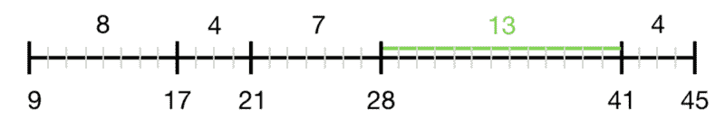

# 我最喜欢的线性时间排序算法

> 原文：<https://www.freecodecamp.org/news/my-favorite-linear-time-sorting-algorithm-f82f88b5daa1/>

弗兰西斯卡辛克曼

# 我最喜欢的线性时间排序算法

#### 扭曲计数排序

**问题:** 给定一个未排序的数字数组，求其排序形式中连续元素之间的最大差值。数字可以是负数或小数。



*Given [21, 41, 17, 45, 9, 28], the maximum difference is 13.*

### 简单算法

```
const maxGap = input =>  input    .sort((a, b) => a — b)    .reduce((acc, cur, idx…
```