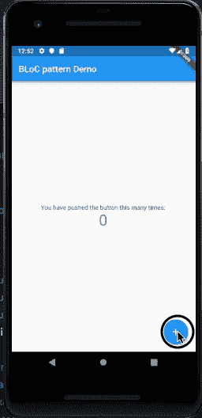

# 如何使用阻塞模式处理颤振中的状态

> 原文：<https://www.freecodecamp.org/news/how-to-handle-state-in-flutter-using-the-bloc-pattern-8ed2f1e49a13/>

去年，我拿起了 [Flutter](https://flutter.io/) ，我必须说，到目前为止，这是一个令人敬畏的旅程。Flutter 是谷歌为 Android 和 iOS 制作高质量应用程序的令人敬畏的框架。

与构建几乎任何应用程序一样，总是需要处理应用程序状态。有效地处理状态管理是很重要的，这样可以避免累积技术债务，特别是当您的应用程序增长并变得更加复杂时。

在 Flutter 中，所有的 UI 组件都是小部件。当您开始组合这些小部件来创建您的令人敬畏的应用程序时，您将最终得到一个嵌套很深的小部件树。这些小部件很可能需要彼此共享应用程序状态。

在本文中，我们将看到如何使用 BLoC 模式处理 Flutter 中的状态。

颤振中的状态管理可以通过几种不同的方式实现:

**继承的窗口小部件**:它允许你将数据传播给它的子窗口小部件，当应用程序的状态发生变化时，窗口小部件会被重新构建。使用 InheritedWidget 基类的缺点是您的状态是最终的，如果您想改变您的状态，这就产生了一个问题。

作用域模型(Scoped Model):这是一个构建在 InheritedWidget 之上的外部包，它提供了一种稍微好一点的方法来访问、更新和改变状态。它允许您轻松地将数据模型从父部件向下传递到其子部件。此外，当模型更新时，它还会重建使用该模型的所有子模型。

这可能会引发一个性能问题，这取决于一个模型有多少 ScopedModelDescendants，因为当有更新时它们会被重新构建。

这个问题可以通过将 ScopedModel 分解成多个模型来解决，这样就可以获得更细粒度的依赖关系。将`rebuildOnChange`标志设置为`false`也解决了这个问题，但是它带来了决定什么小部件应该重建或者不重建的认知负担。

**Redux** :对！与 React 一样，有一个 Redux 包可以帮助您在 Flutter 中轻松创建和使用 Redux 存储。像它的 JavaScript 对应物一样，通常有几行样板代码和*动作*和*减少器*的往返。

#### 输入阻塞模式

业务逻辑组件(BLoC)模式是 Google 创建的一种模式，并在[Google I/O’18](https://www.youtube.com/watch?v=RS36gBEp8OI)发布。阻塞模式使用反应式编程来处理应用程序中的数据流。

BLoC 是应用程序中数据源(例如 API 响应)和需要数据的小部件之间的中间人。它从数据源接收事件/数据流，处理任何所需的业务逻辑，并将数据流的更改发布给感兴趣的小部件。

一个 BLoC 有两个简单的组件:*和 ***流*** ，这两个组件都由一个 ***流控制器*** 提供。您将事件/数据输入流添加到*接收器*中，并通过*流*将其作为数据输出流进行监听。*

*一个*流控制器*可以通过`‘dart:async’`库访问，或者通过`[rxdart](https://pub.dartlang.org/packages/rxdart)`包作为*发布主题*、*重放主题*或*行为主题*访问。*

*下面的代码片段显示了一个简单的块:*

```
*`import 'dart:async';
// import 'package:rxdart/rxdart.dart'; if you want to make use of PublishSubject, ReplaySubject or BehaviourSubject.
// make sure you have rxdart: as a dependency in your pubspec.yaml file to use the above import

class CounterBloc {
  final counterController = StreamController();  // create a StreamController or
  // final counterController = PublishSubject() or any other rxdart option;
  Stream get getCount => counterController.stream; // create a getter for our Stream
  // the rxdart stream controllers returns an Observable instead of a Stream

  void updateCount() {
    counterController.sink.add(data); // add whatever data we want into the Sink
  }

  void dispose() {
    counterController.close(); // close our StreamController to avoid memory leak
  }
}

final bloc = CounterBloc(); // create an instance of the counter bloc

//======= end of CounterBloc file

//======= somewhere else in our app
import 'counter_bloc.dart'; // import the counter bloc file here

@override
void dispose() {
  bloc.dispose(); // call the dispose method to close our StreamController
  super.dispose();
}

...
@override
Widget build(BuildContext context) {
  return StreamBuilder( // Wrap our widget with a StreamBuilder
    stream: bloc.getCount, // pass our Stream getter here
    initialData: 0, // provide an initial data
    builder: (context, snapshot) => Text('${snapshot.data}'), // access the data in our Stream here
  );
}
...`*
```

*BLoC 是一个简单的 Dart 类。在上面的代码片段中，我们创建了一个`CounterBloc`类，并在其中创建了一个我们称之为`counterController`的`StreamController`。我们为名为`getCount`的流创建了一个 *getter* ，一个在被调用时将数据添加到接收器的`updateCount`方法，以及一个关闭 StreamController 的`dispose`方法。*

*为了访问流中的数据，我们创建了一个`StreamBuilder`小部件，将流传递给它的`stream`属性，并在它的`builder`函数中访问数据。*

#### *实施集团*

*我们将把默认的 Flutter 示例应用程序转换成使用 BLoC。让我们继续生成一个新的颤振应用程序。在您的终端中运行以下命令:*

```
*`$ flutter create bloc_counter && cd bloc_counter`*
```

*在你最喜欢的编辑器中打开应用程序，在 lib 文件夹中创建三个文件:`counter.dart`、`counter_provider.dart`和`counter_bloc.dart`。*

*我们的`CounterProvider`将包含一个整数和一个增加它的方法。将以下代码添加到`counter_provider.dart`文件中:*

```
*`class CounterProvider {
  int count = 0;
  void increaseCount() => count++;
}`*
```

*接下来，我们将实现我们的反集团。将以下代码添加到您的`counter_block.dart`文件中:*

*在我们的`CounterBloc`类中，我们使用了上面的部分初始示例代码。在第 7 行，我们实例化了我们的`CounterProvider`类，在`updateCount`方法中，我们调用 provider 方法来增加计数，然后在第 13 行，我们将计数传递给我们的接收器。*

*用下面的代码替换您的`main.dart`文件中的代码。在下面的代码中，我们简单地删除了大部分默认的计数器代码，我们将把它们移到我们的`counter.dart`文件中。每当调用`incrementCounter`方法时，我们调用 BLoC 的`updateCount`方法，它更新计数并将其添加到我们的接收器中。*

*现在，我们的集团正在接收和传输数据。我们可以通过 ***StreamBuilder*** 访问这些数据并将其显示在屏幕上。我们将任何需要数据的小部件包装在 StreamBuilder 小部件中，并将包含数据的流传递给它。将以下代码添加到`counter.dart`文件中:*

*在上面的代码中，我们有一个有状态的小部件。在我们的 state 类中，在第 13 行，我们调用了 bloc 的 dispose 方法，这样每当小部件从树中移除时，流控制器就可以关闭。*

*在第 19 行，我们返回一个 StreamBuilder 小部件，在第 20 行，我们将流的 getter 传递给它，并且在第 21 行传递一个初始数据。StreamBuilder 还有一个`builder`，它让我们可以通过一个`snapshot`来访问数据。在第 30 行，我们访问并显示快照中的数据。*

*通过运行下面的命令来运行应用程序。确保您有一个模拟器正在运行。*

```
*`$ flutter run`*
```

*在应用程序运行时，单击加号图标，观察计数器随着每次单击而增加。*

*

demo app* 

*总之，我们已经能够在 Flutter 中实现最简单形式的 BLoC。不管你的用例是什么，这个概念都是一样的。*

*我希望这篇文章对你有用。请做并分享，这样其他人就可以找到这篇文章。如有问题或需要聊天，请通过 Twitter @d [evelopia_](https://twitter.com/developia_) 联系我。*