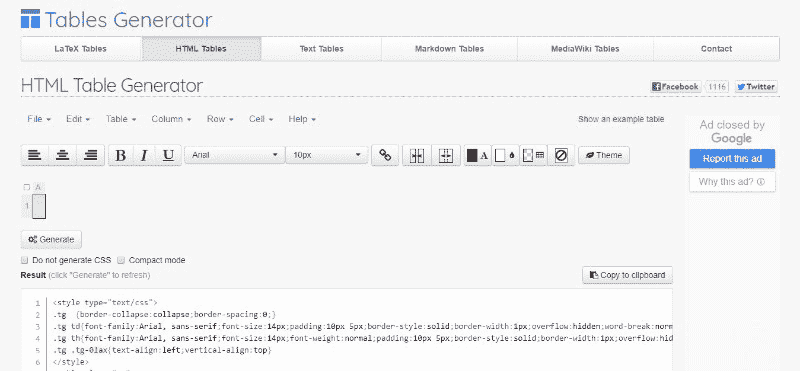
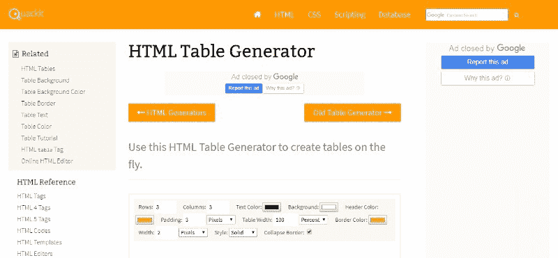
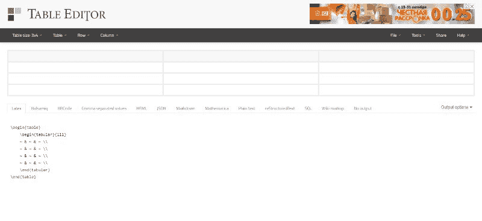
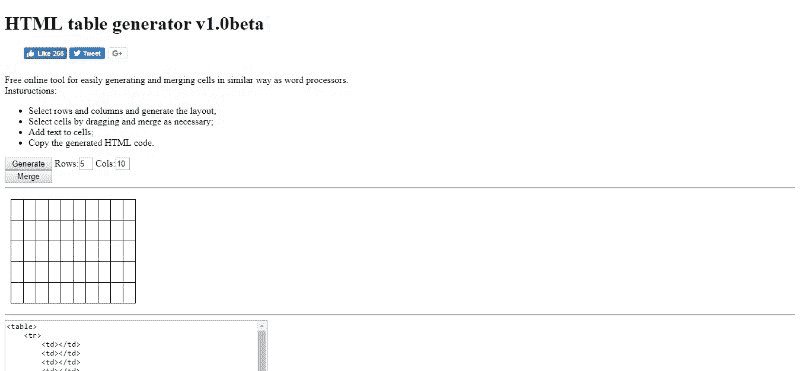
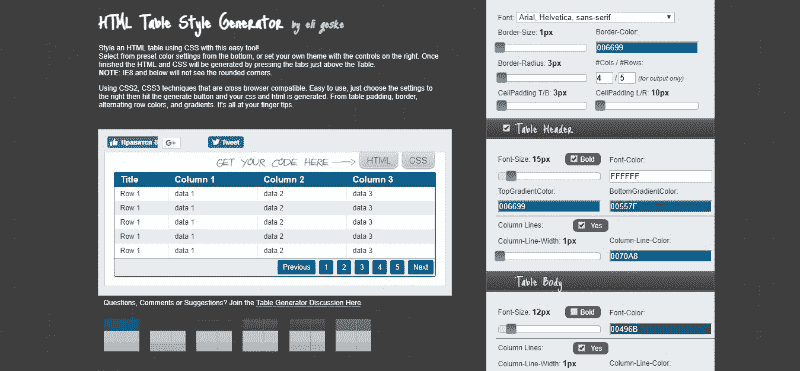
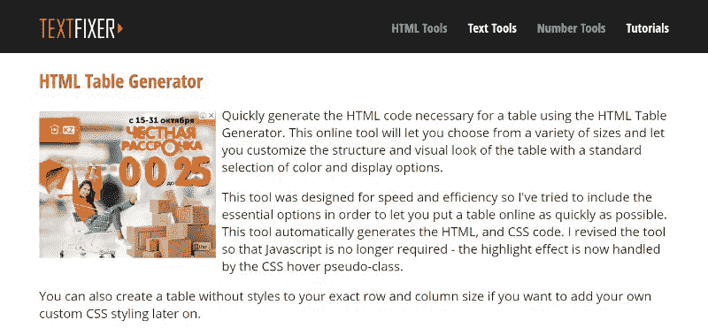
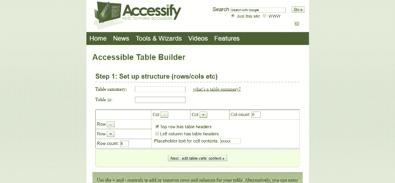
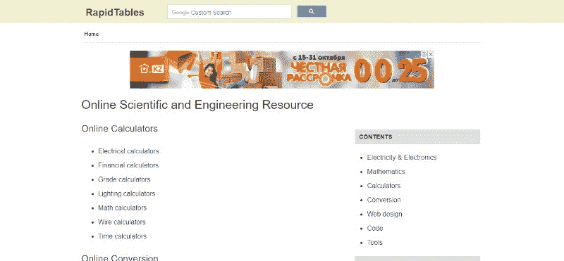
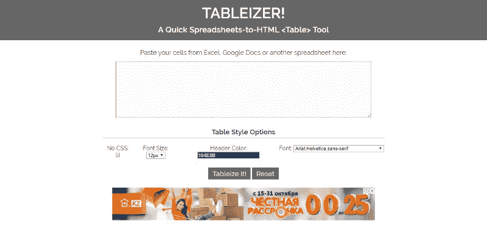

# HTML 表格:关于它们的所有知识

> 原文：<https://www.freecodecamp.org/news/html-tables-all-there-is-to-know-about-them-d1245980ef96/>

亚历山大·吉尔马诺夫

# HTML 表格:关于它们的所有知识


从我们创建了 [wpDataTables](https://wpdatatables.com/) 这个事实来判断，我们喜欢表格已经不是什么秘密了。以至于我们写了这篇关于它们的长篇文章来帮助那些初学者和想学习 HTML 表格的人。

HTML 表格用于显示在电子表格软件中有意义的数据。它们由行和列组成，通常在网站上用于有效显示表格数据。

那么如何用 HTML 制作表格呢？什么时候用，为什么？有哪些好的 HTML 表格示例？今天，我们将回答这些问题以及更多的问题，来帮助你理解所有关于 HTML 表格的知识。

### 目录

*   表格简介
*   表格样式
*   HTML 表格常见问题
*   HTML 表格生成器工具

### 表格简介

HTML 表格用于排列数据(如文本、图像、链接等)。)到表格设计中—基本上就是行和列。

#### 何时使用表格

当您想要在电子表格中最好地组织数据时，HTML 中的表格非常有用。HTML 表格是显示财务数据、日历、价格、功能比较、营养事实信息面板、保龄球得分和许多其他表格数据的好方法。

你可能听说过这些桌子不够美观。然而，事实并非如此。表在语义上表示表格数据，它们是显示这种数据的最佳选择。

#### 何时不使用表格

虽然有些数据在表格中看起来很棒，但有些东西不应该以这种方式排列，因为这没有任何意义。如果可能的话，还应该避免其他一些不适当的 CSS 表格用法。

例如，**你不应该使用表格来布局**。事实是，表元素在语义上描述了表格数据，将它们用于其他目的违反了语义职责。

一般规则是网站应该是可访问的。辅助功能的一部分是屏幕阅读器，它从上到下、从左到右读取表格。对于 HTML 中的表格，站点呈现的顺序是由视觉选择决定的，而不是由可访问性选择决定的。在这种情况下，屏幕阅读器并不总是像你希望的那样工作。

### 表格元素

HTML 表格通常附有对其用途的简短描述。有时，为了方便使用语音或基于盲文的用户代理，会通过 summary 属性提供更详细的描述。

表格行可以分为头、脚和主体部分(通过 **THEAD** 、 **TFOOT** 和 **TBODY** 元素)。用户代理可以利用头/身体/脚划分来支持独立于头和脚部分的身体部分的滚动。当我们打印长的 HTML 表格时，通常在包含表格的每一页上都显示页眉和页脚信息。

如果希望提供更多的结构信息，还可以对列进行分组。除此之外，可以在表定义的开始使用 **COLGROUP** 和 **COL** 元素声明列属性。

表格单元格包含标题信息和/或数据，它们可以跨越多列和多行。当您用 HTML 4 表格模式标记每个单元格时，非可视用户代理可以更容易地将信息传达给用户。这不仅对残疾用户有用，而且使显示能力有限的模态无线浏览器能够处理 HTML 表格。

我们已经提到，HTML 表格不应该用于布局。相反，只要有必要，就应该使用样式表来获得更好的结果和更好的可访问性。

#### 头和身体

让我们来看一个 HTML 表格样式的基本例子:

想象一下，看一行(水平的)来看一个人和关于他们的相关信息。当你上下看一列(垂直的)时，你会感觉到数据的变化或模式。

第一行是表格的标题，它不包含任何数据，只包含列的标题。您可以从语义上指出，**<**ad>元素就是这种情况，它将包装 **firs** t < tr >(它可以包装所有标题信息所需的任意多的行)。

当你使用**<**ad>时，必须有**n**o<tr>即<表>中的 **ct chil** d。所有行必须在 ei**th**e<内**；thead&**gt；，< tbody >，或< tfoot >。

#### 表格页脚

连同 **<公元**>**；和&**lt；tbody>**；，ther** e 为< tfoot >用于换行表格行，表示表格的页脚**。像< thead >，最好在语义上表明这些不是数据行而是辅助信息。**

**< tfo** ot >的位置在 HTML 中是独一无二的，因为它出现在& lt 之后**；头>和身>前**！因此，尽管在<表>的末尾找到 **it 看起来是合理的，但事实并非如此。由于页脚包含了理解表格所必需的信息，所以为了更好的可访问性，它在源顺序中被放在数据之前。**

例如，表格页脚可以在长的 HTML 表格中用来重复页眉。但是，它也可以用于其他目的，例如，在布局中，元素的位置根据需要从下到上跳跃。

### 表格元素及其属性

#### HTML 标签

**< tfo** ot >元素将一个或多个 **mor** e < tr >元素标识为包含表格 c **列的汇总内容。**tfoot>元素必须是<表>元素的 direct**descend**元素。

在 HTML5 中， **< tfo** ot >可以放在& lt 之前，也可以放在**之后；TB**ody&gt；和< tr >元素，但**必须出现一个** ft **er 任意<；在>、**、<列组>和<元素上的 capti **。******

#### HTML 标签

**< tbo** dy >元素必须是& lt 的直接后代**；表>元素，用于**标识构成**表体**的< tr >元素。< tbody >元素 sho **总是跟在< thead >元素 a **之后，并且**可能在< tfoot >元素之前或之后。******

#### HTML 标签

**属性**

**<** tr >元素用于分组 tog**ethe**r&l**t；th** >或< td >的值放入单列的表格标题或 **dat** a 的值中。< tr >元素可能是< table > elem **ent 或**ne**sted with**thin**parent**t<thead>、< tfoot >或< tbody >元素的直接子元素。****

#### HTML 标签

**属性**

>元素上的 **< capti** 用于给 HTML 标签 **le 添加标题。一个<**；标题>必须作为 pa rent < table >的第一个后代**出现在 HTML 文档中，但是它可以用 CSS 直观地定位在表的底部。**

#### 山口

**属性**

**< c** ol >元素，通常实现为 p**parent<**colgroup>的子元素，可用于定位 HTML 表格中的列。

#### colgroup

**属性**

**< colgro** up >元素用作一个或多个**<col>元素的父容器，这些元素用于定位 HTML 表格中的列。**

### **基本造型**

**如果桌子有不同的颜色和线条，就很容易区分桌子的不同部分。CSS 表格边框是另一个常见的元素。默认情况下，所有表格单元格之间的间距为 2px。在第一行和其余行之间，您会注意到由于默认的边框间距被应用于**<**ad>**而导致的微小的额外间隙；和&l**t；将它们分开一点点。**

**您可以控制间距:**

**`table {border-spacing: 0.5rem;}`**

**或者您可以简单地删除该空格:**

**`table {border-collapse: collapse;}`**

**HTML 表格填充、HTML 表格标题、边框以及使Left alignment of elements is a simple and effective way to style HTML tables.**

### **表格的重要样式规则**

**如果使用得当，CSS 表格和它们的属性会非常有用。然而，有一些细节需要记住。例如，如果您将某个字体系列应用于表格，然后将另一个字体系列应用于单元格，则单元格会胜出，因为它是包含文本的实际元素。**

**这些属性要么是表格元素特有的，要么是表格元素特有的。**

#### **垂直对齐**

****可能值**:基线、sub、super、文本顶部、文本底部、中间、顶部、底部、%、长度**

**对齐单元格内的内容。在表格中效果特别好，尽管在这种情况下只有顶部/底部/中间才有意义。**

#### **空白**

****可能的值:**正常、预、立即换行、预换行、预行**

**控制文本在单元格中的换行方式。有些数据可能需要全部在一行上才有意义。**

#### **边界塌陷**

****可能值:**折叠，分离**

**应用于表格，以确定边框是否折叠到自身(有点像仅双向折叠的边距)。如果两个相互折叠的边框有冲突的样式(比如颜色)会怎样？应用于这些类型元素的样式将“胜出”，按照“强度”的顺序:单元格、行、行组、列、列组、表格。**

#### **边框间距**

****可能值:**长度**

**如果边框折叠是独立的，您可以指定单元格之间的间距。cellspacing 属性的现代版本。说到这里，padding 是 cellpadding 属性的现代版本。**

#### **宽度**

****可能值:**长度**

**宽度对表格单元格的作用就像你所想的那样，除非有某种冲突。**

**例如，如果您告诉表格本身为 400px 宽，那么三个单元格行的第一个单元格为 100px 宽，而不考虑其他单元格，则第一个单元格将为 100px 宽，其他两个单元格将分割剩余的空间。**

**但是如果你告诉他们三个的宽度都是 20000 像素，那么这个表仍然是 400 像素，这就给了他们三个三分之一的空间。这是假设空白或图像等元素不发挥作用。**

#### **边界**

****可能值:**长度**

**Border 适用于任何表格元素，就像您所期望的那样。当你折叠边框时，奇怪的事情就出现了。**

**在这种情况下，所有表格单元格之间只有一个边框宽度，而不是您预期的两个宽度(第一个单元格右边框，下一个单元格左边框)。**

**为了在折叠环境中移除边界，两个单元需要“同意”移除它。像这样:**

```
`td:nth-child(2) { border-right: 0; } td:nth-child(3) { border-left: 0; }`
```

**否则，源顺序/特异性决定了哪个边界显示在哪个边上。**

#### **表格布局**

****可能值:**自动，固定**

**默认为自动。表格及其单元格的宽度取决于里面的内容。**

**如果将其更改为“固定”，则表格和列的宽度由表格和列元素的宽度设置，或者由第一行单元格的宽度设置。**

**后续行中的单元格不影响列宽，这可以加快渲染速度。如果后续单元格中的内容放不下，overflow 属性将决定会发生什么情况。**

#### **表格边框**

**表格边框 CSS 使得查看表格更加容易，也是显示边框的最佳方法。在 head 元素的标签中添加样式，以显示 HTML 文档中 table、th 和 td 元素的边框。**

#### **连接单元格**

**为了理解连接的单元格是如何工作的，我们需要解释可以在任何表格单元格元素上使用的两个属性:HTML rowspan 和 HTML colspan。如果 td 的 colspan 为 2(即), will occupy the space of two cells in a row horizontally, even if it is still one cell. The same applies to rowspan, but in the vertical direction.**

**Rowspan 有点难以理解，因为列和行的分组方式不同。例如，使用 colspan，只需将行中每个表格单元格的值相加，就可以得到最终值。另一方面，使用 rowspan，其下一行的表格单元格计数为+1，并且需要少一个表格单元格来完成该行。**

#### **嵌套表格**

**“嵌套表格”仅仅意味着将一个表格放入另一个表格中，这是可行的，但是您需要用元素包含完整的结构。然而，由于混乱的标记和较差的可访问性，这可能不是最好的主意。** 

**然而，在有些情况下这是绝对必要的，是的，也是可行的。例如，如果您需要从其他来源导入内容，您可以导入一个表格并将其放入您的表格中。**

#### **斑马条纹表**

**颜色非常有助于用户在表格中轻松找到他们想要的内容。您可以为表格单元格元素设置背景颜色，也可以在表格行本身设置背景颜色。**

**这是最基本的例子:**

**`tbody tr:nth-child(odd) {background: #eee; }`**

**如果不想对页眉和页脚行进行条带化，使用 tbody 会很有用。如果你不想让底下的东西显露出来，你也可以设置偶数行。**

**如果您需要支持不理解 nth-child()(非常老)的浏览器，您可以使用 jQuery 来完成。**

#### **突出显示行和列**

**突出显示行相当容易；所要做的就是向一行中添加一个类名。**

**另一方面，突出显示列需要更多的努力。您可以使用 **< c** ol >元素，这将允许您为出现在所选列中的单元格设置样式。例如，一个每行有 4 列的表需要有 4 个 < col >元素。**

#### **如何使 HTML 表格居中**

**如何在 HTML 中将表格居中？这个问题在设计他们的第一个 HTML 表格的人中很常见。问题是 text-align:center 不会将整个表格居中，它只是将单元格内的文本居中。**

**将整个表格居中需要将左右边距设置为*自动*，并将上下边距设置为您需要的值。**

**假设您希望表格的上边距和下边距为一个空行(1em)。 **<标签** le >标签中的 CSS 代码简单来说就是:**

**`<table style=”margin:1em auto`；">**

**如果您希望表格旁边的文本换行，使用 *float:left* 将表格浮动到后续文本的左侧。要在表格和文本之间留出一点空间，您也可以在表格上留出右边距，如下所示:**

**`<table style=”float:left; margin-right:10px`；">**

**如果您希望表格位于相邻文本的右侧，请使用 *float:right* 来代替。您也可以设置左边距:**

**`<table style=”float:right; margin-left:10px`；">**

**需要记住的是:确保将应该在表格旁边的文本放在表格的结束标签之后。浮动在代码中的后续内容旁边浮动，而不是浮动之前的内容。**

### **HTML 表格常见问题**

****

#### **我可以在表格中嵌套表格吗？**

**是的，您可以将现有的表格放置在另一个表格的单元格内。本文前面提到过一个例子。**

**请记住，如果您不显式关闭您的 **TR** 、 **TD** 和 **TH** 元素，旧浏览器会出现嵌套表格的问题。为了避免这些问题，包含每一个 **< /** tr **>，**</**TD>**；，和< /th >标签，尽管 HTML 规范并不要求它们。**

**此外，尽量不要将表嵌套在表中超过几行的深度，因为旧版本的浏览器经常会出现这种问题。您可以使用**行跨度**和**列跨度**属性来最小化表格嵌套。**

**最后，无论何时使用嵌套表，都要特别确保验证您的标记。**

#### **如何使用表格来构建表单？**

**在一个表格的 **TD** 元素中，如果您想要相对于其他内容定位一个表单，可以放置一些小表单。但是，如果您想相对于彼此定位与表单相关的元素，这实际上没有什么帮助。**

**如果要这样做，整个表格必须在表单中。你不能在一个 **TH** 或 **TD** 元素中开始一个表单，然后在另一个元素中结束。如果不将表单放在一个 **TH** 或 **TD** 元素中，就不能将它放在表格中。您可以将表格放入表单内，然后使用表格来定位**输入**、**文本区**、**选择**以及其他与表单相关的元素，如下例所示。**

#### **我可以对Use a percentage value?**

**HTML 3.2 和 HTML 4.0 规范只允许 TD 元素的 WIDTH 属性为整数值(代表一定数量的像素)。另一方面，HTML 4.0 DTD 允许非整数值(比如百分比)，所以 HTML 验证器不会抱怨。**

**请记住，网景和微软的浏览器对The interpretation of the percentage value is different. On the other hand, when combined with , their interpretations (and those of other browsers that support tables) match. In this case, percentage values can be safely used, even if they are prohibited by public specifications.** 

#### **为什么不使用全浏览器宽度？** 

**使用图形浏览器时，内容和显示区域边缘之间的边距非常窄。导航器总是在右边留出滚动条的空间。然而，当文档不够长而不需要滚动时，滚动条不会出现，这就给你留下了右边的空白，不能被删除。**

#### **为什么我的桌子前后有多余的空间？**

**无效的 HTML 语法会导致 HTML 表格前后出现额外的空格。最常见的原因是表格中的松散内容(即不在 **TD** 或 **TH** 元素中的内容)。**

**谈到松散的内容，没有一个标准的方法来处理它。一些浏览器在表格之前或之后显示它。当松散内容仅包含多个换行符或空段落时，所有这些空白将显示在表格本身之前或之后。**

**解决方案是修复 HTML 语法错误。表格内的所有内容必须在一个 **TD** 或 **TH** 元素内。**

#### **使用表格进行布局有什么问题吗？**

**简单的回答是— **是的**。**

**为了让浏览器显示表格，需要知道 HTML 表格的属性，特别是**高度**或**宽度**属性。问题是，在呈现之前，整个表必须下载已知的维度。如果不知道上述属性，渲染过程可能会延迟。**

**除此之外，如果表格的任何内容对于可用的显示区域来说太宽，表格必须拉伸以显示过大的内容。然后，剩余的内容会进行调整，以适合过大的表格，而不是适合可用的显示区域。因此，用户需要水平滚动才能阅读内容。印刷版本也可能被裁剪掉。**

**如果在比预期窄的显示器上观看内容，固定宽度的表格会导致与其他超大表格相同的问题。如果显示比预期的要宽，那么显示的大部分将会由于极宽的页边空白而被浪费。如果读者需要更大的字体，内容将显示为每行只有几个字。**

**要记住的最重要的事情之一是正确的语法。浏览器不能很好地处理无效语法。在 Netscape Navigator 的旧版本中，嵌套表可能无法以正确的语法正确显示。**

**还有一些浏览器完全忽略表格，这意味着它们也会忽略用 HTML 表格创建的布局。除此之外，搜索引擎也会忽略它们。您通常在搜索结果中看到的通常是文档开头的文本。因此，如果一个表格用于布局，而不是实际内容，导航链接会出现在搜索中。**

**有些版本的 Navigator 在使用 **ALIGN** 属性的表中链接到命名锚点时会出现问题。它们将命名的锚与表格的顶部相关联，而不是锚的内容。如果不在表上使用 **ALIGN** 属性，这个问题可以完全避免。**

**尽管如此，如果您坚持使用 HTML 表格进行布局，仔细的标记可以帮助您最小化相关问题。避免在表格中放置宽的内容，比如宽的图像、 **PRE** 元素以及长行、长 URL 等等。**

**使用几个独立的表格，而不是一个完整的页面布局。例如，您可以使用表格在页面的顶部或底部布置导航栏，并将主要内容完全放置在任何布局表格之外。**

#### **如何用给你的表格添加标题？**

**通过将标题放入>元素上的 [< capti](https://developer.mozilla.org/en-US/docs/Web/HTML/Element/caption) 中并嵌套在 id**e&**lt 中，可以为表格添加标题；表>元素。你应该把它放在**开**宁<表>标签的正下方。**

```
`<table> <caption>Your caption should be here</caption> ... </table>`
```

**标题的目的是包含对表格内容的描述。这使读者可以快速了解该表是否包含他们正在搜索的内容。但是，它对视力有障碍的用户特别有用，他们可以避免让屏幕阅读器在了解表格内容之前阅读大量表格内容。**

**标题直接放在 **<标签** le >标签的下面。**

**注意:summary 属性也可以在 **<选项卡** le >元素上使用，以提供描述—这也可以由屏幕阅读器读出。我们建议使用**g<T3；caption >元素，因为 HTML5 表格规范不赞成使用该摘要，它不会出现在页面上。****

### **最佳 HTML 表格生成器工具**

**如果你不想处理一堆 HTML 表格代码，使用一个好的表格生成器工具可能会非常有用。用这样的工具在 HTML 中创建一个表格不需要任何开发语言的知识，而且非常快速简单。**

**除此之外，大多数这类最好的工具都是完全免费的，每个人都可以使用它们。基本上，你所要做的就是导入数据，并定制表格(例如，HTML 表格边框样式、HTML 表格格式、CSS 表格宽度、CSS 表格背景颜色、单元格间距、单元格填充等)。**

**一旦你这样做了，生成器会给你你的表格 HTML 代码，你只需复制并粘贴到你的网站。很简单。**

#### **为什么应该使用 HTML 表格生成器工具**

**从头开始设计一张桌子不是一件容易的事情。让它完美运行是一场艰苦的战斗，需要花费大量的时间和精力——更不用说结果往往不尽如人意。**

**不用用记事本写一行又一行的代码，使用合适的 HTML 表格生成器工具，你可以节省很多时间和麻烦。这不仅更容易，而且结果往往比你试图自己构建整个系统要好。更不用说它能为你节省多少时间，我们都知道时间就是金钱。**

### **HTML 表格生成器工具**

#### **[表格生成器](http://www.tablesgenerator.com/html_tables)**

****

**非常有用的 HTML 表格生成器工具。易于使用，它允许你选择你最喜欢的主题。可以在官网了解更多。**

#### **[Quackit](http://www.quackit.com/html/html_table_generator.cfm)**

****

**一个简单易用的工具，碰巧也是免费的。**

#### **[管](http://truben.no/latex/table/)**

****

**Truben 允许您快速轻松地制作各种 HTML 表格。**

#### **[Html-表格](http://html-tables.com/)**

****

**一个类似于文字处理器的便捷工具。它可以让你免费创建漂亮的表格。**

#### **[CSS 表格生成器](http://www.csstablegenerator.com/)**

****

**不使用图像创建时尚表格的伟大工具。**

#### **[表格泰勒](http://tablestyler.com/)**

****

**使用表格 CSS 元素，用这个在线工具创建漂亮的 HTML 表格。**

#### **[Textfixer](http://www.textfixer.com/html/html-table-generator.php)**

****

**创建您喜欢的表格样式的简单工具。**

#### **[接入](http://accessify.com/tools-and-wizards/accessibility-tools/table-builder/)**

****

**最简单的工具之一；非常适合缺乏技术知识和/或互联网连接缓慢的人。**

#### **[快速表格](https://www.rapidtables.com/)**

****

**这个工具带有多种生成选项，创建优秀的 HTML 表格就是其中之一。**

#### **[制表器](http://tableizer.journalistopia.com/)**

****

**一个有用的生成器，用于从电子表格数据中设计 HTML 表格。**

### **结束学习 HTML 表格的思考**

**创建美观实用的 HTML 表格绝非易事。如果您想从头开始构建它们，您必须具备一定的编码知识和开发经验，因为如果您想让表格正确显示内容，有许多事情需要考虑。**

**另一方面，如果您正在寻找一个不需要编码经验的快速解决方案，您可以考虑使用许多方便的表格生成器工具之一。他们不仅会帮你省下很多时间和麻烦，而且效果也会很惊人。**

**如果您喜欢阅读这篇关于 HTML 表格的文章，您也应该阅读以下内容:**

*   **[可以使用的 CSS 表格及其代码](https://wpdatatables.com/css-tables/)**
*   **用 CSS & HTML 或 WordPress 构建响应式表格**
*   **[你应该看看的 jQuery 表插件](https://wpdatatables.com/jquery-table-plugins/)**

***最初发布于 2018 年 10 月 31 日[wpdatatables.com](https://wpdatatables.com/html-tables/)。***