# MFractor 的(超级)力量以及它们如何让你的生活更轻松

> 原文：<https://www.freecodecamp.org/news/the-super-power-of-mfractor-558deeb8ed66/>

让你能弯下腰

# MFractor 的(超级)力量以及它们如何让你的生活更轻松

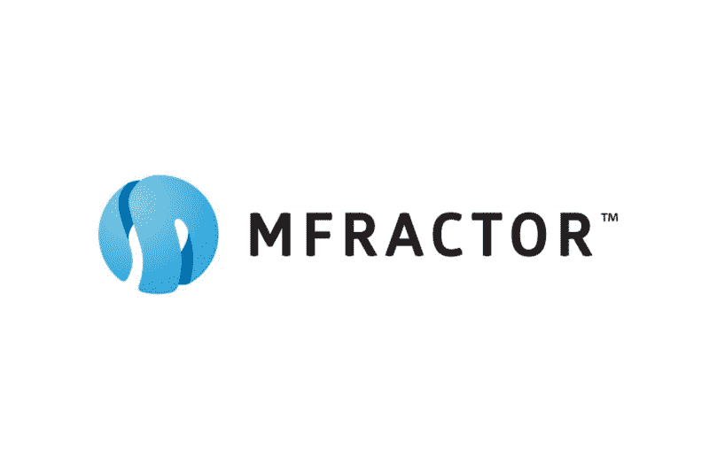

taken from: [http://docs.mfractor.com/](http://docs.mfractor.com/)

如果你问一个 Xamarin 开发者在 Xamarin 开发中有什么可以改变的，他们肯定会提到以下其中之一:

*   构建时间
*   表演
*   应用程序开始时间
*   预视者
*   从 IDE 中删除 bin/obj
*   Visual Studio for Mac 中缺少图像向导
*   没有 XAML 智能感知，

等等...如果我是诚实的，上面的答案是正确的。但是，嘿，我们是开发者！如果微软不给我们这些功能，那就让我们自己想办法或者发明点什么。

有几个库和 IDE 扩展使我们的生活变得更容易。其中一个肯定是 MFR actor——一个针对 Mac 版 Visual Studio 的超级强大的扩展。

### 那么什么是 MFractor 呢？

MFractor 是 Visual Studio for Mac 的扩展。它于 2015 年在澳大利亚成立。上市 3.5 年，获得了人们的信任和喜爱。“它是怎么做到的？”—你可能会问。这是因为它扩展了 Visual Studio for Mac 的一些日常功能。

*   你想要 XAML 智能感知吗？完成了。只需安装 MFractor。
*   是否要删除 IDE 中的 bin/obj 文件夹？MFractor 可以做到。(顺便说一句——在我看来，我们要么为此需要扩展，要么需要不时地删除它们，这似乎很愚蠢。肯定有东西不行了……)
*   **炸弹来了:**你想在 Visual Studio for Mac 中有一个图像向导，这样你就可以管理资源了吗？

我知道你会想要的！我跟你说过我的演员吗？哦，我做到了！

让我们明确一下:**当你在 Mac 上用 Visual Studio 开发应用时，MFractor 是一个超级强大的工具。**

你可能不相信我的话，所以让我们来看看它在现实生活中是如何工作的。

### 装置

这很容易。在 VS4Mac 中，只需打开 Visual Studio 菜单下的**扩展 *…*** ，点击**图库**，搜索 **MFractor** 。

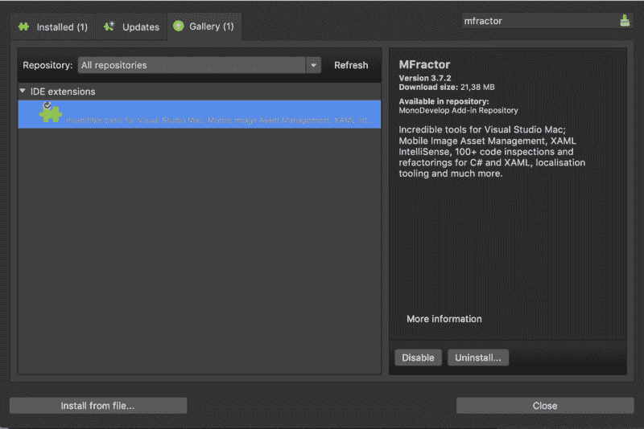

瞧。需要注意的一点是:您将安装而不是**禁用/卸载…** 只需安装它并按照要求的步骤操作，一个弹出窗口就会打开。安装完成后，让我们进入有趣的部分。

### 图像管理器

让我们从这个非常棒的功能开始。最近才出的，所以还是挺新鲜的。

让我们假设您想要管理项目中的图像资产，但是您非常讨厌手动操作。

了解 MFractor 的能力:

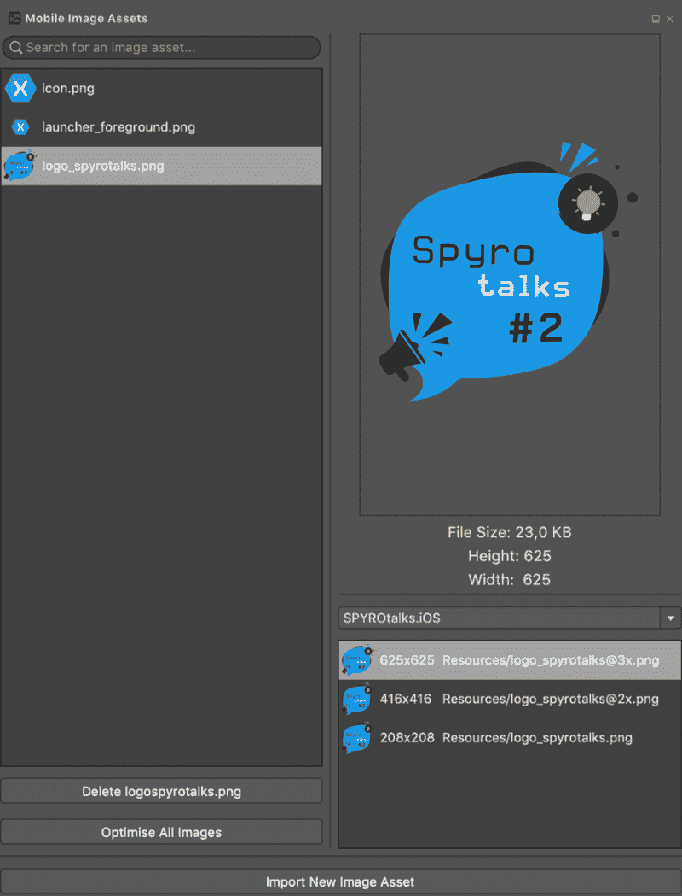

正如您所看到的，您有一个包含在缩略图项目中的所有图标的列表。当你点击该项目时，你可以看到一个更大的图像。此外，您可能会注意到有一个下拉菜单，您可以在其中选择您的项目并检查项目中包含哪些图标(SPYROtalks 是我的项目的名称)。

#### 在图像管理器中可以做什么？

**导入新的图像资产**

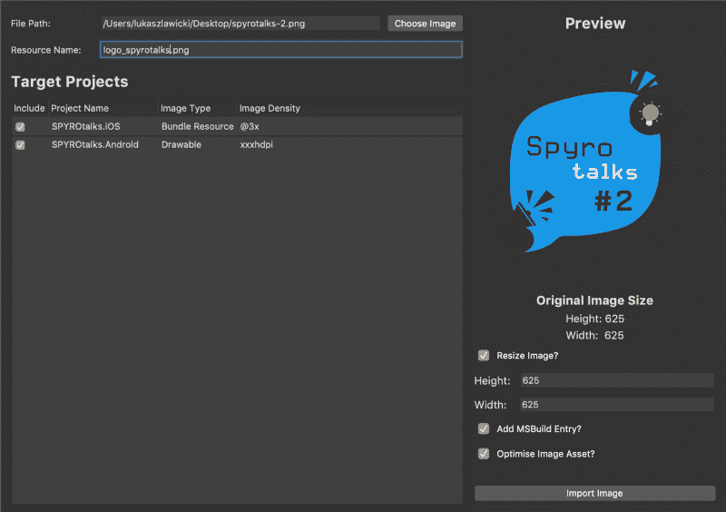

添加资产非常简单。

1.  你只需从你的电脑中选择图像。MFractor 应该自动检测图像密度。如果你不同意，你可以改变它。
2.  完成后，需要提供**资源名称**。很公平，对吧？
3.  现在，您需要决定将资产添加到哪个项目中。

基本上，这就是你必须提供的全部。如果你愿意，你可以调整图像大小或优化它。在写这篇文章的时候，我决定检查一下图像优化有多好。为了检查它，我拍了 10 张照片，并对它们进行了优化。结果如下:

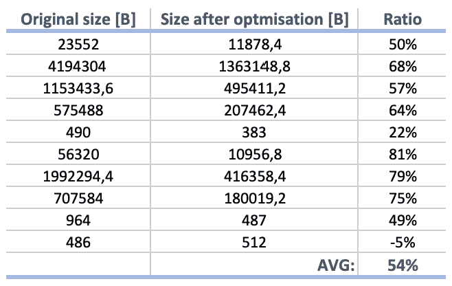

Results of optimisation

正如您在上表中看到的，总的来说，结果相当不错。平均 54%是个好成绩。然而，有趣的是，一张图片在优化后比其他的更大。为什么？我不知道。

#### 删除图像

在 Image manager 中，您还可以删除资源。它的优点和省时之处在于，它将一次性移除所有资产密度。不需要删除 6 次(甚至更多)。真正节省时间。

#### 优化所有图像

如果您在添加资产时忘记优化资产，您可以稍后优化所有图像。很高兴知道。

如果你想了解更多关于图像资产的信息，请阅读 Matthew 的文章，这篇文章可以在 MFractor [博客上找到。](https://www.mfractor.com/blogs/news/simplified-image-asset-management-for-xamarin-apps)

### XAML 智能感知

如果您在使用 Xamarin 进行开发方面没有那么丰富的经验。表单，您可能会发现开发 XAML ui 是一场噩梦。另一方面，即使你是一个经验丰富的 Xamarin。表单开发人员，使用 XAML 时，您可能会感到非常沮丧。

首先，因为缺少一个预览器(有一个，但是老实说，它对复杂的视图不起作用)，您几乎是在盲目地创建 UI。你必须运用你的想象力。如果我们有一个内置的 LiveXAML 之类的不是更好吗？不幸的是，看起来微软目前不会给我们提供什么东西。可惜了。

其次，因为缺乏 XAML 的智能感知。有它就好了，所以当您创建 ViewModel 的绑定时，您可以从下拉列表中选择属性，而不是自己输入。谁从来没有在财产的名称上打错字，编译代码，然后想知道为什么它不工作？

#### 拯救行动者！

MFractor 的另一大特色是 XAML 智能感知。它可以向您建议 ViewModel 中属性的名称，因此您可以绑定到它们。此外，它还可以提示您在参考资料中拥有的图像的名称等等。不相信我？继续检查这些 gif:

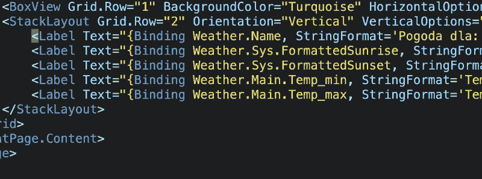

只是解释一下:在我的项目中，我有三个图标:*Icon.png，Launcher_Foreground.png，*和*logo _ spyrotals . png .*正如你所看到的，MFractor 正在给我一个选择的选项。不错！

让我们继续讨论绑定。您可能会怀疑，MFractor 建议属性的方式与建议图像的方式类似。

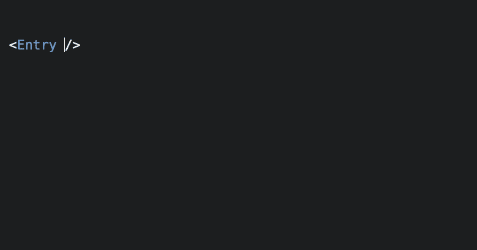

正如您在我的视图模型中看到的，我有 5 个可绑定的属性。我真正喜欢的是，使用 MFractor，几乎不可能在属性名称中出现拼写错误。

#### **生成视图模型属性**

你是一个喜欢先写观点的人吗？如果是的话，我有好消息告诉你:使用 MFractor，你可以从你的视图中生成视图模型属性。

创建视图时，您可能会发现忘记创建一个或另一个属性。使用 MFractor，您可以在不更改文件的情况下创建它们。不错吧。

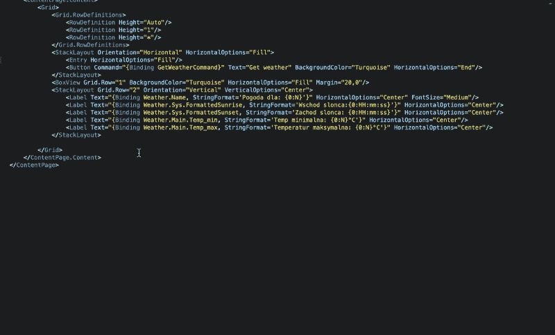

#### **转到 ViewModel 属性的用法**

有时，您可能需要检查属性的使用位置。不幸的是，当你在 Visual Studio 中查找参考资料时，它不会找到你在 XAML 找到的参考资料。当然，正如您可能会想到的，MFractor 可以为您找到这些参考资料。

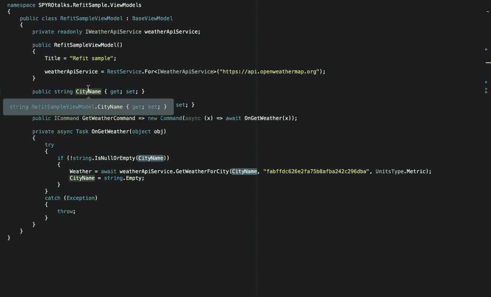

### MVVM 巫师

这是本博客开始时没有说明的事情，因为它还没有发布。根据 3.7.3 版本的市场公告， **MVVM 向导**将会推出。

根据马修·罗宾斯(MFractor 的创始人)的推文，你将能够(几乎)一键创建视图和视图模型。

这个特性的好处在于，它让您可以控制文件的存放位置和基类。这听起来很有希望，但我有一些问题:它会支持 Xamarin 吗？土人也？如果我们用 BaseContentPage 添加 XAML，它能开箱即用吗？

于是我就装了 3.7.3 版本，还有 **MVVM 经理**。看起来就像上图中的那个。有三种方法可以访问它:从 MFractor 菜单，从 Solution options，以及用一个 **Cmd + Shift +M** 快捷键。现在，经理为 Xamarin 工作。仅窗体项目。

如果您希望 ViewModel 从 BaseClass 派生，您可能需要先编写带有命名空间的类。否则，您将需要在创建 VM 时导入该类。

#### 更新 31.01

你将在下面读到的不再有效(XAML 问题)。上面的问题我已经提出来了，33h 后解决了。3.7.5 版应该已经修复了。正如我在推文中所写的——这就是解决 bug 的方法！更新结束；-)

问题在于 XAML 的档案。如我所料，从 BaseContentPage 派生不会那么容易。当您希望视图从您的 BaseContentPage 派生时，您需要向 MVVM 管理器提供以下内容:

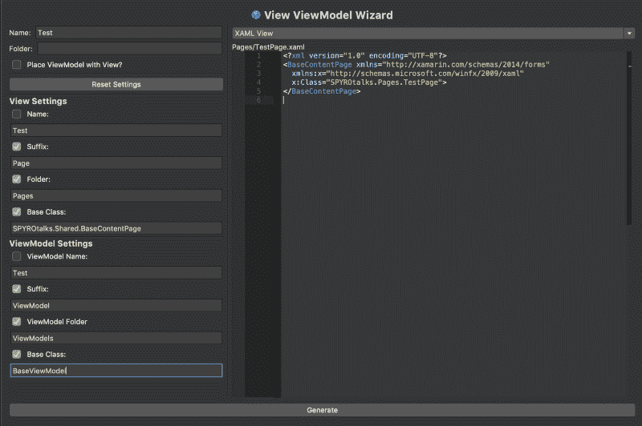

我们需要的代码是否可见？不完全是。它与我们想要的相似，但不完全相同。我们需要这样的代码:

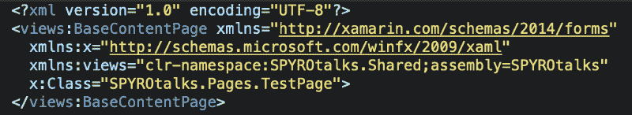

这不是一个大的变化，但我们需要自己处理它。我完全理解这不是一件容易实现的任务。我相信稍微调整一下创建的文件比从头开始创建要好。

如果你感兴趣，在 MFR factor[博客](https://www.mfractor.com/blogs/news/generating-viewmodels-in-xamarin-forms-with-the-mvvm-wizard)上你可以读到更多关于 MVVM 经理的信息。

### bin/obj

正如我在本文开头所说的，我不确定如何看待 bin/obj 文件夹。首先，在开发 Xamarin 应用程序时，你必须经常删除它们。我认为这是一个问题。

我们为什么要这么做？如果这是一个已知的问题(根据我和我同事的谈话，我相信是这样)，难道不应该给我们提供一个在 IDE 中删除这些文件夹的选项吗？手动操作需要很长时间。当然，你可以有一个脚本来做这件事，但是我们需要自己实现它吗？

幸运的是，MFractor 有一个功能可以帮你删除那些文件夹。怎么会？很简单。看看这个:

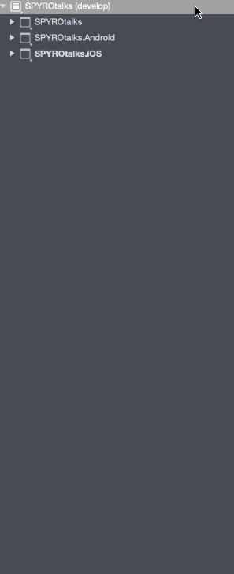

在这里你可以选择:删除输出文件夹(删除 bin/obj & NuGet 包)或者你可以只清除 NuGet 包。

### 结论

那么使用 MFractor 的缺点是什么呢？有些人可能会说专业演员的价格(每年 200 澳元)是个问题。但是嘿！终身执照要那么多吗？我不这么认为。尤其是当你考虑到由于 XAML 中的一个打字错误或添加图像资产而浪费的时间时。

最初发布在我的[博客](http://lukaszlawicki.pl/mfractor/)？