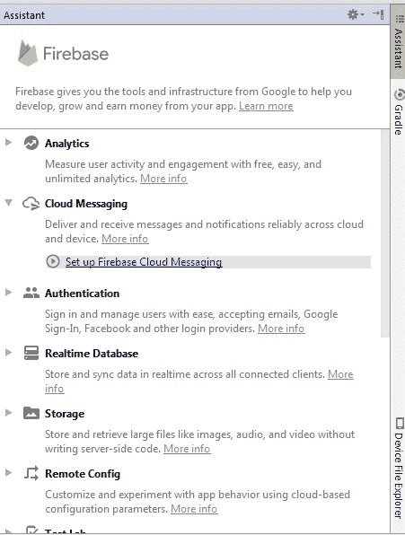
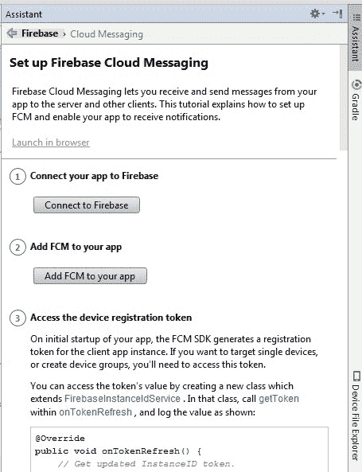
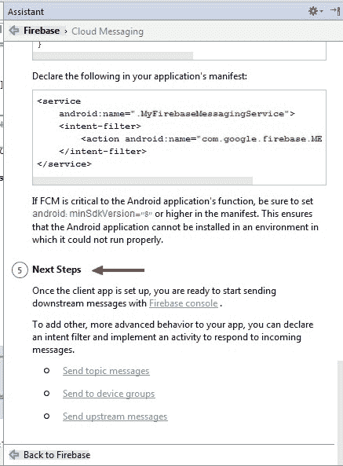

# 如何将 Firebase 与您的应用程序集成

> 原文：<https://www.freecodecamp.org/news/how-to-integrate-firebase-with-your-application-74fdde01dfe2/>

您可能听说过 Firebase，但可能不太了解它是如何工作的，以及它如何适应您的应用程序。嗯，你来对地方了。我们将讨论什么是 Firebase，以及如何直接从 Android Studio 将它与您的 Android 项目集成。 ***扣起*** 。

#### 火-什么？

从本质上来说，Firebase 属于 [MBaaS](https://en.wikipedia.org/wiki/Mobile_backend_as_a_service) 的范畴，也就是说， ***移动后端即服务*** 。如果你是一个前端开发人员，你将需要各种可能需要后端功能的服务。想想文件存储、数据库、推送通知、分析、广告等等。您可以使用 Firebase 来帮助您将应用程序与这些服务连接起来。要了解更多信息，请点击[这里](https://firebase.google.com/)。

### 遵循以下步骤

1.  在 Android Studio 中打开你的项目后，点击 ***工具*** 标签，选择 ***Firebase***
2.  右边会弹出一个新窗口， ***助手*** 标签，上面有 Firebase 提供的所有服务。

Firebase Assistant

3.通过单击选择要添加到应用程序中的服务。我们将选择 ***云消息*** 作为例子。

4.点击显示的链接，具体来说， ***设置 Firebase 云消息。***

5.助手窗口将转换成一个新菜单:

Follow the steps above

遵循助手中概述的步骤，确保注意任何需要添加的代码(以及需要添加的位置)。

第一步总是要求您将应用程序与 Firebase 连接起来。为此，您必须在 [***Firebase 控制台***](https://console.firebase.google.com) 中为您的应用程序创建一个项目。

第二个将引导您添加您想要的特定服务。所以对于我们的例子，FCM 代表**F**irebase**C**loud**M**essaging。

以下是我们需要做的事情:

*   创建一个扩展 FirebaseMessagingService 的新类
*   覆盖两种方法: ***onNewToken*** 和***on message received***

*   在您的清单中声明服务:

6.你将遇到的最后一步叫做 ***下一步叫做*** 。这里会提示您转到 Firebase 控制台。这是为了让您与刚刚添加的服务进行交互。

现在，您有能力为您创建的任何应用程序提供一个强大的后端组件，它可以在几分钟内启动并运行。这将大大缩短你的开发时间，使你能够专注于对你来说重要的事情。

评论？有问题吗？请随意联系。

如果你喜欢这篇文章，请鼓掌让其他人也能欣赏它！？