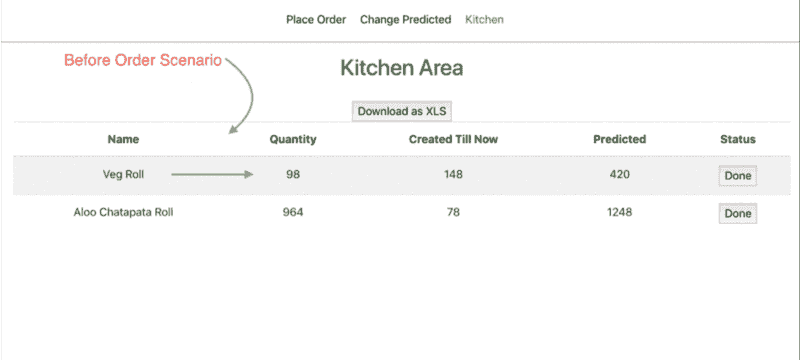

# 如何使用 Socket.io，React，Node & MongoDB 创建实时应用程序

> 原文：<https://www.freecodecamp.org/news/how-to-create-a-realtime-app-using-socket-io-react-node-mongodb-a10c4a1ab676/>

想知道实时应用程序是如何构建的吗？有没有注意到实时应用的重要性和用例？

如果你对以上问题很好奇，需要一个答案，那么这篇博文就是为你准备的。

首先，让我们确定一些需要实时应用的用例:

1.  在出租车预订应用程序的地图上获取出租车的位置更新。
2.  在您最喜爱的聊天应用程序上即时获取新消息。
3.  将食物订购信息更新到您最喜欢的餐厅的厨房。

这些都是我们日常生活中的常见场景，我们不能容忍信息更新的延迟，因此需要实时通信。

**可用于**实时通信**的技术**有:

1.  **短轮询** : AJAX，产生大流量。
2.  **长轮询**:类似 AJAX，但是服务器会等待响应，直到有更新。收到请求后，客户端发送另一个请求，需要来回遍历额外的报头，从而导致额外的开销。
3.  **Web Sockets** :使客户端和服务器之间的交互通信成为可能。用户可以向服务器发送请求并接收事件驱动的响应，而无需轮询服务器的回复，这使得 web sockets 成为我们用例的**最佳选择**。

关于以上三种技术的更深入的信息可以在这里阅读[。](https://stackoverflow.com/questions/12555043/my-understanding-of-http-polling-long-polling-http-streaming-and-websockets)

我们将通过以下场景学习创建一个实时应用程序。

想象一下，你坐在你最喜欢的餐馆里，手里拿着一份电子菜单。你下单后，厨房会实时更新你的订单。厨房处理完订单后，他们也会实时更新。

详细功能:

1.  **下单**:选择数量并向厨房下单的界面。
2.  **厨房**:可以在多个厨房之间打开的界面，可以实时更新厨师和厨师关于创建的总订单和食物项目预测数量的信息，使他们能够灵活地进行更新。还具有下载 excel 表格形式的报告的功能。
3.  **变更预测**:更新食品项目预测数量的界面。



**可以在[这里](https://faasos-honey.herokuapp.com/)找到这个场景的现场演示**。

为了更好地理解，请同时在不同的选项卡/设备中打开它，以实时查看数据变化。

**源代码**就是这里的。在它的基础上随意创造一些创新/有用的东西。

所以让我们开始吧。

### 技术堆栈:

**前端** : React.js，Reactstrap，Socket.io

**后端** : Node.js (Express)，MongoDB，Socket.io

### 文件夹结构:

```
/*
Go to the root directory in the source code and find out the below-mentioned files. This architecture helps in creating a big modular App.
*/
backend-my-app/ /* Backend code of the app */
 server.js       /* Socket and backend code resides here*/
 build/      /* Optional for deployment of Frontend Build */ 
 package.json /* Backend dependency */
 ...
public/
src/  /*      Frontend Sourcecode      */
 global/      /*   Components getting used everywhere   */
  header.css
  header.js     
 main/           
  Kitchen.js
  PlaceOrder.js
  UpdatePredicted.js
 App.js   /* Routing logic and component assembly part */
package.json /* Frontend dependency */ 
 ............
```

### 源代码解释:

#### 前端:

```
git clone https://github.com/honey93/OrderKitchen.git
cd OrderKitchen
npm install
npm start
```

使用的包:

1.  [Reactstrap](https://reactstrap.github.io/) :易于使用的 bootstrap4 组件
2.  [Socket.io](https://socket.io/docs/) : Socket.io 是一个库，支持浏览器和服务器之间的实时、双向和基于事件的通信。
3.  [react-html-table-to-excel](https://www.npmjs.com/package/react-html-table-to-excel):提供客户端生成 Excel(。xls)文件从 HTML 表格元素。
4.  [react-router-dom](https://www.npmjs.com/package/react-router-dom):react 路由器的 DOM 绑定。它由许多重要的组件组成，如 BrowserRouter，当有服务器处理动态请求、交换机、路由等时使用。

#### **App 组件**

**路径** : src/App.js

该组件包含前端的主要路由逻辑。该文件在浏览器路由器模块内的 src/index.js 中使用。下面的代码演示了保持你的应用模块化的方法之一。

```
import React, { Component } from "react";
import "./App.css";
import { Header } from "./global/header";
import { Switch, Route } from "react-router-dom";
import PlaceOrder from "./main/PlaceOrder";
import UpdatePredicted from "./main/UpdatePredicted";
import Kitchen from "./main/Kitchen";
/*The <Route> component is the main part of React Router. Anywhere that you want to only render content based on the location’s pathname, you should use a <Route> element. */
/* The Route component expects a path prop, which is a string that describes the pathname that the route matches */
/* The <Switch> will iterate over routes and only render the first one that matches the current pathname */
class App extends Component {
  render() {
    return (
      <div className="App">
        <Header />
        <Switch>
          <Route exact path="/" component={PlaceOrder} />
          <Route path="/updatepredicted" component={UpdatePredicted} />
          <Route path="/kitchen" component={Kitchen} />
        </Switch>
      </div>
    );
  }
}
export default App;
```

#### **割台组件**

**路径** : src/global/header.js

该组件将是通用的，并在诸如“下订单”、“变更预测”、“厨房”等部分使用。这种方法有助于避免代码重复，并保持应用程序的模块化。

```
import React, { Component } from "react";
import { NavLink } from "react-router-dom";
import socketIOClient from "socket.io-client";
import "./header.css";
// The Header creates links that can be used to navigate
// between routes.
var socket;
class Header extends Component {
/* Creating a Socket client and exporting it at the end to be used across the Place Order, Kitchen, etc components*/
  constructor() {
    super();
    this.state = {
      endpoint: 'http://localhost:3001/'
    };
socket = socketIOClient(this.state.endpoint);
  }
render() {
    return (
      <header>
        <nav>
          <ul className="NavClass">
            <li>
              <NavLink exact to="/">
                Place Order
              </NavLink>
            </li>
            <li>
              <NavLink to="/updatepredicted">Change Predicted </NavLink>
            </li>
            <li>
              <NavLink to="/kitchen"> Kitchen </NavLink>
            </li  >
          </ul>
        </nav>
      </header>
    );
  }
}
export { Header, socket };
```

#### **厨房组件**

**路径** : src/main/Kitchen.js

厨房屏幕 UI 逻辑和 html 代码驻留在该组件中:

```
import React, { Component } from "react";
import { Button, Table, Container } from "reactstrap";
import { socket } from "../global/header";
import ReactHTMLTableToExcel from "react-html-table-to-excel";
class Kitchen extends Component {
  constructor() {
    super();
    this.state = {
      food_data: []
      // this is where we are connecting to with sockets,
    };
  }
getData = foodItems => {
    console.log(foodItems);
    this.setState({ food_data: foodItems });
  };
changeData = () => socket.emit("initial_data");
/*As soon as the component gets mounted ie in componentDidMount method, firing the initial_data event to get the data to initialize the Kitchen Dashboard */
/* Adding change_data listener for listening to any changes made by Place Order and Predicted Order components*/ 
componentDidMount() {
    var state_current = this;
    socket.emit("initial_data");
    socket.on("get_data", this.getData);
    socket.on("change_data", this.changeData);
  }

/* Removing the listener before unmounting the component in order to avoid addition of multiple listener at the time revisit*/
componentWillUnmount() {
    socket.off("get_data");
    socket.off("change_data");
  }
/* When Done gets clicked, this function is called and mark_done event gets emitted which gets listened on the backend explained later on*/
markDone = id => {
    // console.log(predicted_details);
    socket.emit("mark_done", id);
  };
getFoodData() {
    return this.state.food_data.map(food => {
      return (
        <tr key={food._id}>
          <td> {food.name} </td>
          <td> {food.ordQty} </td>
          <td> {food.prodQty} </td>
          <td> {food.predQty} </td>
          <td>
            <button onClick={() => this.markDone(food._id)}>Done</button>
          </td>
        </tr>
      );
    });
  }
render() {
    return (
      <Container>
        <h2 className="h2Class">Kitchen Area</h2>
        <ReactHTMLTableToExcel
          id="test-table-xls-button"
          className="download-table-xls-button"
          table="table-to-xls"
          filename="tablexls"
          sheet="tablexls"
          buttonText="Download as XLS"
        />
<Table striped id="table-to-xls">
          <thead>
            <tr>
              <th>Name</th>
              <th>Quantity</th>
              <th>Created Till Now</th>
              <th>Predicted</th>
              <th>Status</th>
            </tr>
          </thead>
          <tbody>{this.getFoodData()}</tbody>
        </Table>
      </Container>
    );
  }
}
export default Kitchen;
```

#### **下单组件**

**路径** : src/main/PlaceOrder.js

```
import React, { Component } from "react";
import { Button, Table, Container } from "reactstrap";
import { socket } from "../global/header";
class PlaceOrder extends Component {
  constructor() {
    super();
    this.state = {
      food_data: []
      // this is where we are connecting to with sockets,
    };
  }
getData = foodItems => {
    console.log(foodItems);
    foodItems = foodItems.map(food => {
      food.order = 0;
return food;
    });
    this.setState({ food_data: foodItems });
  };
componentDidMount() {
    socket.emit("initial_data");
    var state_current = this;
    socket.on("get_data", state_current.getData);
  }
componentWillUnmount() {
    socket.off("get_data", this.getData);
  }
//Function to place the order.
sendOrder = id => {
    var order_details;
    this.state.food_data.map(food => {
      if (food._id == id) {
        order_details = food;
      }
      return food;
    });
    console.log(order_details);
    socket.emit("putOrder", order_details);
    var new_array = this.state.food_data.map(food => {
      food.order = 0;
      return food;
    });
    this.setState({ food_data: new_array });
  };
// Changing the quantity in the state which is emitted to the backend at the time of placing the order.
changeQuantity = (event, foodid) => {
    if (parseInt(event.target.value) < 0) {
      event.target.value = 0;
    }
    var new_array = this.state.food_data.map(food => {
      if (food._id == foodid) {
        food.order = parseInt(event.target.value);
      }
      return food;
    });
    this.setState({ food_data: new_array });
  };
// To get the initial data
getFoodData() {
    return this.state.food_data.map(food => {
      return (
        <tr key={food._id}>
          <td> {food.name} </td>
          <td>
            <input
              onChange={e => this.changeQuantity(e, food._id)}
              value={food.order}
              type="number"
              placeholder="Quantity"
            />
          </td>
          <td>
            <button onClick={() => this.sendOrder(food._id)}>Order</button>
          </td>
        </tr>
      );
    });
  }
render() {
    return (
      <Container>
        <h2 className="h2Class">Order Menu</h2>
        <Table striped>
          <thead>
            <tr>
              <th>Product</th>
              <th>Quantity</th>
              <th>Order</th>
            </tr>
          </thead>
          <tbody>{this.getFoodData()}</tbody>
        </Table>
      </Container>
    );
  }
}
export default PlaceOrder;
```

代码存储库中还有一个类似于上一节的叫做 Update Predicted Path:src/main/Update Predicted . js 的部分。

### 后端

启动后端:

```
cd backend-my-app
npm install
node server.js
```

使用的包:

1.  [**Monk**](https://www.npmjs.com/package/monk) :一个微小的层，为 Node.JS 中 MongoDB 的使用提供了简单但实质性的可用性改进
2.  [**socket . io**](https://socket.io/docs/):socket . io 是一个库，可以实现浏览器和服务器之间的实时、双向和基于事件的通信。

3. [**Express**](https://www.npmjs.com/package/express) :快速、极简的[节点](http://nodejs.org/)web 框架。

#### **主代码**

**路径** : backend-my-app/server.js

```
const express = require("express");
const http = require("http");
const socketIO = require("socket.io");
// Connection string of MongoDb database hosted on Mlab or locally
var connection_string = "**********";
// Collection name should be "FoodItems", only one collection as of now.
// Document format should be as mentioned below, at least one such document:
// {
//     "_id": {
//         "$oid": "5c0a1bdfe7179a6ca0844567"
//     },
//     "name": "Veg Roll",
//     "predQty": 100,
//     "prodQty": 295,
//     "ordQty": 1
// }
const db = require("monk")(connection_string);
const collection_foodItems = db.get("FoodItems");
// our localhost port
const port = process.env.PORT || 3000;
const app = express();
// our server instance
const server = http.createServer(app);
// This creates our socket using the instance of the server
const io = socketIO(server);
io.on("connection", socket => {
//  console.log("New client connected" + socket.id);
  //console.log(socket);
// Returning the initial data of food menu from FoodItems collection
  socket.on("initial_data", () => {
    collection_foodItems.find({}).then(docs => {
      io.sockets.emit("get_data", docs);
    });
  });
// Placing the order, gets called from /src/main/PlaceOrder.js of Frontend
  socket.on("putOrder", order => {
    collection_foodItems
      .update({ _id: order._id }, { $inc: { ordQty: order.order } })
      .then(updatedDoc => {
        // Emitting event to update the Kitchen opened across the devices with the realtime order values
        io.sockets.emit("change_data");
      });
  });
// Order completion, gets called from /src/main/Kitchen.js
  socket.on("mark_done", id => {
    collection_foodItems
      .update({ _id: id }, { $inc: { ordQty: -1, prodQty: 1 } })
      .then(updatedDoc => {
        //Updating the different Kitchen area with the current Status.
        io.sockets.emit("change_data");
      });
  });

// Functionality to change the predicted quantity value, called from /src/main/UpdatePredicted.js
  socket.on("ChangePred", predicted_data => {
    collection_foodItems
      .update(
        { _id: predicted_data._id },
        { $set: { predQty: predicted_data.predQty } }
      )
      .then(updatedDoc => {
        // Socket event to update the Predicted quantity across the Kitchen
        io.sockets.emit("change_data");
      });
  });

// disconnect is fired when a client leaves the server
  socket.on("disconnect", () => {
    console.log("user disconnected");
  });
});
/* Below mentioned steps are performed to return the Frontend build of create-react-app from build folder of backend Comment it out if running locally*/
app.use(express.static("build"));
app.use("/kitchen", express.static("build"));
app.use("/updatepredicted", express.static("build"));
server.listen(port, () => console.log(`Listening on port ${port}`));
```

**数据库** : MongoDB

[**Mlab**](https://mlab.com/):MongoDB 的数据库即服务

**收藏名称**:食品

**文档格式**:food items 集合中至少需要一个具有下述格式的文档。

```
{
"name": "Veg Roll",  // Food Name
"predQty": 100,  // Predicted Quantity
"prodQty": 295,  // Produced Quantity
"ordQty": 1   // Total Order Quantity
}
```

希望你已经理解了如何使用趋势 MERN 堆栈创建一个模块化的实时应用程序。如果你觉得有帮助的话**拍拍下面的**，把**明星**送给项目[回购](https://github.com/honey93/OrderKitchen)，也和你的朋友们分享。