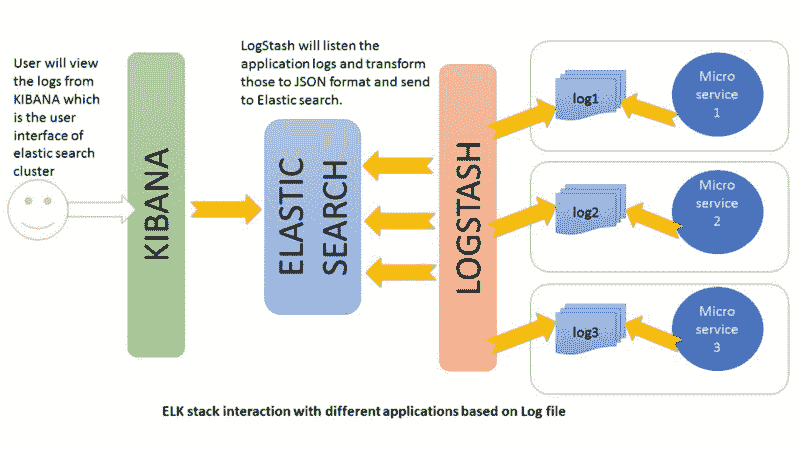
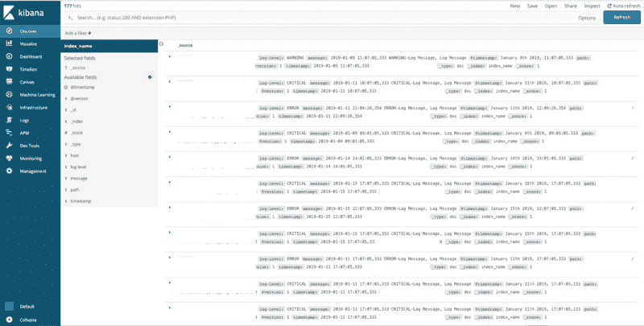
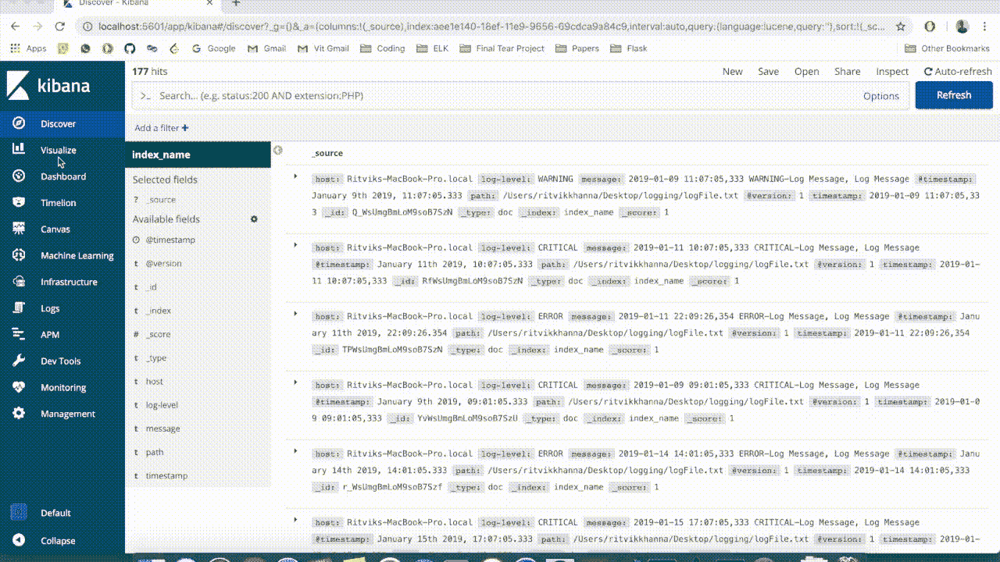
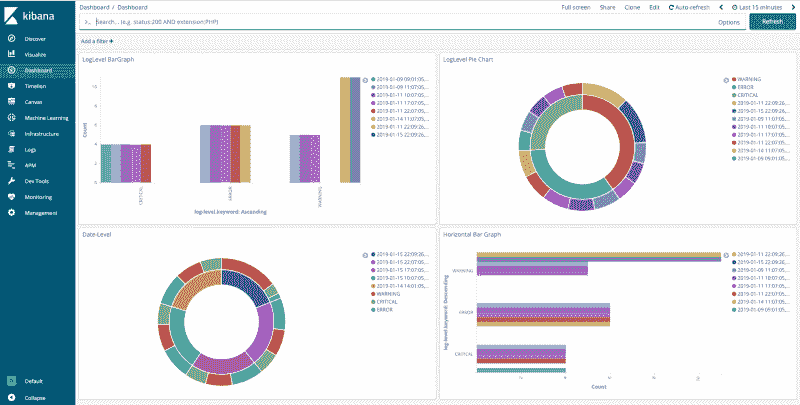

# 如何使用 Elasticsearch、Logstash 和 Kibana 实时可视化 Python 中的日志

> 原文：<https://www.freecodecamp.org/news/how-to-use-elasticsearch-logstash-and-kibana-to-visualise-logs-in-python-in-realtime-acaab281c9de/>

作者:里特维克·卡纳

# 如何使用 Elasticsearch、Logstash 和 Kibana 实时可视化 Python 中的日志


[source](http://boopathi.me/blog/wp-content/uploads/2016/03/logging-in-your-python-apps-1280x640.jpg)

### 什么是日志记录？

假设你正在开发一个软件产品。它远程工作，与不同的设备交互，从传感器收集数据，并向用户提供服务。有一天，出了问题，系统没有按预期工作。它可能没有识别设备，或者没有从传感器接收到任何数据，或者可能只是由于代码中的错误而出现了运行时错误。你怎么能确定？

现在，想象一下，如果系统代码中有检查点，如果系统返回一个意外的结果，它只是简单地标记它并通知开发人员。这就是日志的概念。

日志记录使开发人员能够理解代码实际在做什么，以及工作流程是怎样的。软件开发人员的生活很大一部分是监控、故障排除和调试。日志记录使这个过程变得更加容易和流畅。

### 日志的可视化


[source](https://www.datalabsagency.com/wp-content/uploads/2014/11/Interactive-Data-Visualisation-Service.png)

现在，如果你是一个开发和创建软件已经有一段时间的开发专家，那么你会认为日志不是一件大事，我们的大部分代码都包含在一个`**Debug.Log('____')**`语句中。这很好，但是我们还可以利用日志记录的其他方面。

特定记录数据的可视化有以下好处:

*   远程监控系统的运行。
*   通过统计图、图表和信息图清晰有效地传达信息。
*   从以不同图表形式显示的数据中提取知识。
*   采取必要措施改善系统。

我们有很多方法可以将原始数据可视化。Python 和 R 编程语言中有许多库可以帮助绘制图形。你可以在这里 了解更多 [**。但是在这篇文章中，我不打算讨论上面提到的方法。你听说过**](https://towardsdatascience.com/5-quick-and-easy-data-visualizations-in-python-with-code-a2284bae952f) **[**麋栈**](https://www.elastic.co/elk-stack) 吗？**

### 每个人都离开了

E — [**Elasticsearch**](https://www.elastic.co/products/elasticsearch) ，L — [**Logstash**](https://www.elastic.co/products/logstash) **，** K — [**Kibana**](https://www.elastic.co/products/kibana)

我来简单介绍一下。ELK stack 是三个开源软件的集合，有助于提供关于结构化或非结构化数据的实时见解。人们可以使用它的工具极其轻松有效地搜索和分析数据。

[**Elasticsearch**](https://www.elastic.co/products/elasticsearch) 是一个分布式的 RESTful 搜索和分析引擎，能够解决越来越多的用例。作为弹性堆栈的核心，它集中存储您的数据，因此您可以发现预期的数据，发现意外的数据。Elasticsearch 允许您执行和组合多种类型的搜索——结构化、非结构化、地理、度量等。它建立在 Java 编程语言之上，这使得 Elasticsearch 可以在不同的平台上运行。它使用户能够以非常高的速度探索大量的数据。

[**Logstash**](https://www.elastic.co/products/logstash) 是一个开源的服务器端数据处理管道，它可以同时从多个来源获取数据，对其进行转换，然后将其发送到您最喜欢的“stash”(如 Elasticsearch)。数据通常以多种格式分散或孤立在多个系统中。Logstash 支持各种输入，这些输入可以同时从多个公共源获取事件。从您的日志、指标、web 应用程序、数据存储和各种 AWS 服务中轻松获取信息，所有这些都以连续的流式方式进行。Logstash 有一个可插拔的框架，包含 200 多个插件。混合、匹配和编排不同的输入、过滤和输出，以在管道中和谐地工作。

[**Kibana**](https://www.elastic.co/products/kibana) 是一个开源的分析和可视化平台，旨在与 Elasticsearch 协同工作。您可以使用 Kibana 来搜索、查看和交互存储在 Elasticsearch 索引中的数据。您可以轻松执行高级数据分析，并在各种图表、表格和地图中显示您的数据。Kibana 使理解大量数据变得容易。其简单的基于浏览器的界面使您能够快速创建和共享动态仪表板，实时显示对 Elasticsearch 查询的更改。

要更好地了解三个软件如何相互作用的工作流程，请参考下图:



[source](http://Howtodoinjava.com)

### 履行

#### 在 Python 中登录

在这里，我选择用 Python 来解释日志的实现，因为它是涉及多台机器和物联网之间通信的项目中使用最多的语言。这将有助于您对它的工作原理有一个总体的了解。

Python 提供了一个日志系统作为其标准库的一部分，因此您可以快速地将日志添加到您的应用程序中。

```
import logging
```

在 Python 中，可以在 5 个不同的级别进行日志记录，每个级别分别指示事件的类型。具体如下:

*   **Info** —指定在粗粒度级别突出应用程序进度的信息性消息。
*   **调试** —指定对调试应用程序最有用的细粒度信息事件。
*   **警告** —表示潜在的有害情况。
*   **错误** —指明可能仍然允许应用程序继续运行的错误事件。
*   **Critical** —表示可能导致应用程序中止的非常严重的错误事件。

因此，根据需要记录的问题，我们相应地使用定义的级别。

> **注意**:默认情况下不记录信息和调试，因为只记录警告级别及以上的日志。

现在，为了给出一个例子并创建一组可视化的日志语句，我创建了一个 Python 脚本来记录特定格式的语句和一条消息。

```
import logging
import random

logging.basicConfig(filename="logFile.txt",
                    filemode='a',
                    format='%(asctime)s %(levelname)s-%(message)s',
                    datefmt='%Y-%m-%d %H:%M:%S')
for i in xrange(0,15):
    x=random.randint(0,2)
    if(x==0):
        logging.warning('Log Message')
    elif(x==1):
        logging.critical('Log Message')
    else:
        logging.error('Log Message')
```

log_gen.py

这里，日志语句将以指定的格式附加到名为 *logFile.txt* 的文件中。我在不同的时间间隔运行脚本三天，随机创建一个包含日志的文件，如下所示:

```
2019-01-09 09:01:05,333 ERROR-Log Message
2019-01-09 09:01:05,333 WARNING-Log Message
2019-01-09 09:01:05,333 ERROR-Log Message
2019-01-09 09:01:05,333 CRITICAL-Log Message
2019-01-09 09:01:05,333 WARNING-Log Message
2019-01-09 09:01:05,333 ERROR-Log Message
2019-01-09 09:01:05,333 ERROR-Log Message
2019-01-09 09:01:05,333 WARNING-Log Message
2019-01-09 09:01:05,333 WARNING-Log Message
2019-01-09 09:01:05,333 ERROR-Log Message
2019-01-09 09:01:05,333 CRITICAL-Log Message
2019-01-09 09:01:05,333 CRITICAL-Log Message
2019-01-09 09:01:05,333 CRITICAL-Log Message
2019-01-09 11:07:05,333 ERROR-Log Message
2019-01-09 11:07:05,333 WARNING-Log Message
2019-01-09 11:07:05,333 ERROR-Log Message
2019-01-09 11:07:05,333 ERROR-Log Message
2019-01-09 11:07:05,333 WARNING-Log Message
2019-01-09 11:07:05,333 CRITICAL-Log Message
2019-01-09 11:07:05,333 WARNING-Log Message
2019-01-09 11:07:05,333 ERROR-Log Message
```

logFile.txt

#### 设置 Elasticsearch、Logstash 和 Kibana

首先让我们从它们各自的链接[ [elasticsearch](https://www.elastic.co/downloads/elasticsearch) 、[ [logstash](https://www.elastic.co/downloads/logstash) 、[ [kibana](https://www.elastic.co/downloads/kibana) ]下载这三款开源软件。解压缩文件，并将这三个文件都放在项目文件夹中。

让我们开始吧。

**步骤 1** —在本地系统上设置 Kibana 和 Elasticsearch。我们在 Kibana 的 bin 文件夹中通过以下命令运行 Kibana。

```
bin\kibana
```

类似地，Elasticsearch 的设置如下:

```
bin\elasticsearch
```

现在，在两个独立的终端中，我们可以看到两个模块都在运行。为了检查服务是否正在运行，打开 **localhost:5621** 和 **localhost:9600** *。*

在这两个服务成功运行之后，我们使用 Logstash 和 Python 程序来解析原始日志数据，并将其传输到 Elasticsearch，Kibana 从 elastic search 查询数据。

第二步 —现在让我们继续学习 Logstash。在启动 Logstash 之前，会创建一个 Logstash 配置文件，其中指定了输入文件、输出位置和过滤方法的详细信息。

```
input{
 file{
 path => "full/path/to/log_file/location/logFile.txt"
 start_position => "beginning"
 }
}
filter
{
 grok{
 match => {"message" => "%{TIMESTAMP_ISO8601:timestamp} %{LOGLEVEL:log-level}-%{GREEDYDATA:message}"}
 }
    date {
    match => ["timestamp", "ISO8601"]
  }
}
output{
 elasticsearch{
 hosts => ["localhost:9200"]
 index => "index_name"}
stdout{codec => rubydebug}
}
```

logstash-simple.conf

这个配置文件在 ELK 堆栈中起着重要的作用。看一下**滤镜{grok{…}}** 行。这是一个 Grok 过滤器插件。Grok 是将非结构化日志数据解析成结构化和可查询数据的好方法。这个工具非常适合 syslog 日志、apache 和其他 web 服务器日志、mysql 日志，以及通常为人类而非计算机使用而编写的任何日志格式。代码中提到的这个 grok 模式告诉 Logstash 如何解析日志文件中的每一行条目。

现在将文件保存在 Logstash 文件夹中，并启动 Logstash 服务。

```
bin\logstash –f logstash-simple.conf
```

> 为了了解更多关于配置 logstash 的信息，点击[ [**此处**](https://www.elastic.co/guide/en/logstash/current/configuration.html) 。

**步骤 3** —之后，来自日志文件的解析数据将在 **localhost:5621** 的 Kibana 管理中可用，用于创建不同的视觉效果和仪表板。要检查 Kibana 是否正在接收任何数据，请在 Kibana 的“管理”选项卡中运行以下命令:

```
localhost:9200/_cat/indices?v
```

这将显示所有的索引。对于每个可视化，必须从开发工具中选择一个新的索引模式，然后使用各种可视化技术来创建一个仪表板。

#### 使用 Kibana 的仪表板

设置好一切之后，现在是时候创建图表来可视化日志数据了。

打开 Kibana 管理主页后，我们将被要求创建一个新的索引模式。在**索引模式字段**中输入`index_name*`，在**时间过滤字段**名称下拉菜单中选择**@时间戳**。



现在，为了创建图表，我们转到**可视化**选项卡。

选择一个新的可视化，选择图形类型和索引名称，并根据您的 axis 要求创建一个图形。我们可以创建一个直方图，用 **y 轴**作为**计数**，用**日志级关键字**或**时间戳作为 **x 轴**。**



Creating a graph

创建一些图表后，我们可以添加所有需要的可视化，并创建一个**仪表板**，如下所示:



> 注意——每当日志文件中的日志被更新或追加到以前的日志中时，只要这三个服务正在运行，elasticsearch 中的数据和 kibana 中的图形就会根据新数据自动更新。

#### 包扎

日志记录可以代替打印语句，有助于防止错误和调试程序。日志模块根据不同的级别划分消息。这有助于在不中断程序的情况下更好地理解代码和调用流程。

在每时每刻都会产生大量数据的情况下，数据的可视化是一个必要的步骤。数据可视化工具和技术为管理人员和其他知识工作者提供了新的方法，大大提高了他们掌握隐藏在数据中的信息的能力。快速识别错误日志、轻松理解数据和高度可定制的数据可视化是一些优势。这是组织原始数据的最有建设性的方式之一。

> 要了解更多信息，您可以参考官方的 ELK 文档，从这里开始—[https://www.elastic.co/learn](https://www.elastic.co/learn)以及关于 python 日志记录—[https://docs.python.org/2/library/logging.html](https://docs.python.org/2/library/logging.html)