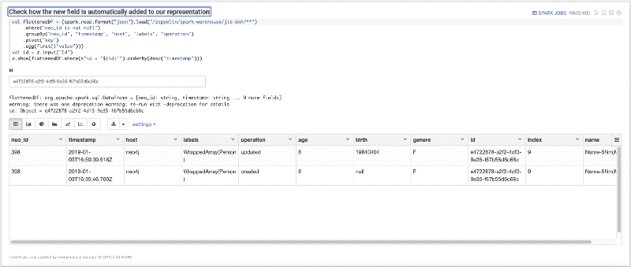
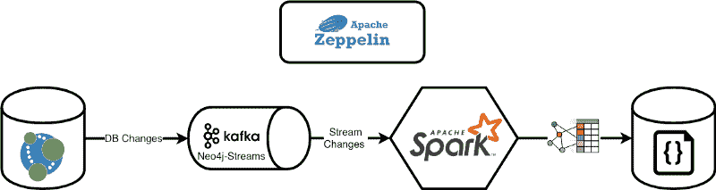
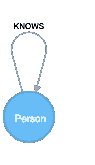
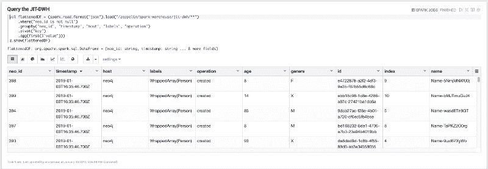
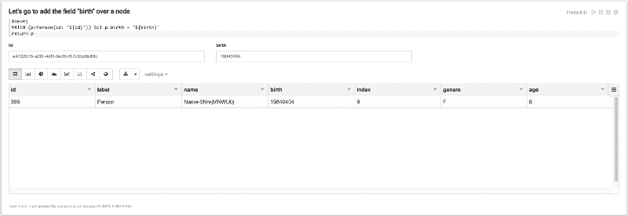

# 如何利用 Neo4j 流并构建即时数据仓库

> 原文：<https://www.freecodecamp.org/news/how-to-leverage-neo4j-streams-and-build-a-just-in-time-data-warehouse-64adf290f093/>

安德烈·桑图尔班诺

# 如何利用 Neo4j 流并构建即时数据仓库


Photo by [Vanessa Ochotorena](https://unsplash.com/photos/iZ4yhyDB-dQ?utm_source=unsplash&utm_medium=referral&utm_content=creditCopyText) on [Unsplash](https://unsplash.com/search/photos/streams?utm_source=unsplash&utm_medium=referral&utm_content=creditCopyText)

在本文中，我们将展示如何使用 [**Neo4j**](https://neo4j.com/) **和 [Neo4j Streams](https://medium.com/neo4j/a-new-neo4j-integration-with-apache-kafka-6099c14851d2)** 模块以及 **Apache Spark** 的结构化流 API 和 **Apache Kafka 来创建[实时数据仓库](https://databricks.com/blog/2015/11/30/building-a-just-in-time-data-warehouse-platform-with-databricks.html)。**

为了展示如何集成它们，简化集成，并让您手工测试整个项目，我将使用一个笔记本运行程序[**Apache Zeppelin**](https://towardsdatascience.com/building-a-graph-data-pipeline-with-zeppelin-spark-and-neo4j-8b6b83f4fb70)**，它只允许[与 Neo4j](https://towardsdatascience.com/building-a-graph-data-pipeline-with-zeppelin-spark-and-neo4j-8b6b83f4fb70) 进行本地交互。**



The final result: how a kafka event streamed by Neo4j gets collected by Apache Spark

### 利用 Neo4j 流

Neo4j Streams 项目由三个主要支柱组成:

*   **变更数据捕获**(这是第一篇文章的主题)，它允许我们对 Kafka 主题的数据库变更进行流式处理
*   允许消费来自 Kafka 主题的数据流的**接收器**
*   一套**程序**，允许我们向/从 Kafka 主题产生/消费数据

### 什么是变更数据捕获？

它是一个自动从源系统(例如，数据库)捕获变更，并自动将这些变更提供给下游系统以用于各种用例的系统。

CDC 通常构成 ETL 管道的一部分。这是确保数据仓库(DWH)与任何记录变化保持同步的一个重要组成部分。

此外，传统上，CDC 应用程序使用事务日志，从而允许我们复制数据库，而不会对其操作产生太大的性能影响。

### Neo4j Streams CDC 模块如何处理数据库变化？

Neo4j 中的每个事务都被捕获和转换，以便流式传输事务的一个原子元素。

假设我们简单地创建了两个节点以及它们之间的一种关系:

```
CREATE (andrea:Person{name:"Andrea"})-[knows:KNOWS{since:2014}]-&gt;(michael:Person{name:"Michael"})
```

CDC 模块将把这个事务转换成 3 个事件(2 个节点创建，1 个关系创建)。

事件结构受 [Debezium](https://debezium.io/) 格式的启发，具有以下一般结构:

```
{  "meta": { /* transaction meta-data */ },  "payload": { /* the data related to the transaction */    "before": { /* the data before the transaction */},    "after": { /* the data after the transaction */}  }}
```

节点源`(andrea)`:

```
{  "meta": {    "timestamp": 1532597182604,    "username": "neo4j",    "tx_id": 1,    "tx_event_id": 0,    "tx_events_count": 3,    "operation": "created",    "source": {      "hostname": "neo4j.mycompany.com"    }  },  "payload": {    "id": "1004",    "type": "node",    "after": {      "labels": ["Person"],      "properties": {        "name": "Andrea"      }    }  }}
```

节点目标`(michael)`:

```
{  "meta": {    "timestamp": 1532597182604,    "username": "neo4j",    "tx_id": 1,    "tx_event_id": 1,    "tx_events_count": 3,    "operation": "created",    "source": {      "hostname": "neo4j.mycompany.com"    }  },  "payload": {    "id": "1006",    "type": "node",    "after": {      "labels": ["Person"],      "properties": {        "name": "Michael"      }    }  }}
```

关系`knows`:

```
{  "meta": {    "timestamp": 1532597182604,    "username": "neo4j",    "tx_id": 1,    "tx_event_id": 2,    "tx_events_count": 3,    "operation": "created",    "source": {      "hostname": "neo4j.mycompany.com"    }  },  "payload": {    "id": "1007",    "type": "relationship",    "label": "KNOWS",    "start": {      "labels": ["Person"],      "id": "1005"    },    "end": {      "labels": ["Person"],      "id": "106"    },    "after": {      "properties": {        "since": 2014      }    }  }}
```

默认情况下，所有数据将在`neo4j`主题上流动。CDC 模块允许控制将哪些节点发送到 Kafka，以及您希望将它们的哪些属性发送到主题:

```
streams.source.topic.nodes.<TOPIC_NAME>=<PATTERN>
```

以下面的例子为例:

```
streams.source.topic.nodes.products=Product{name, code}
```

CDC 模块将向`products`主题发送所有具有标签`Product`的节点。然后，它只向该主题发送关于`name`和`code`属性的更改。请查阅官方文档，了解关于[标签过滤如何工作的完整描述](https://neo4j-contrib.github.io/neo4j-streams/#_patterns)。

关于 Neo4j Streams 项目以及我们如何/为什么在 [**LARUS**](http://www.larus-ba.it/) 和 [**Neo4j**](https://neo4j.com/) 构建它的更深入的描述，请查看这篇提供了[深入描述](https://medium.com/neo4j/a-new-neo4j-integration-with-apache-kafka-6099c14851d2)的文章。

### 超越传统的数据仓库

传统的 DWH 需要数据团队不断构建多个昂贵且耗时的提取转换加载(ETL)管道，以最终获得业务洞察。

最大的痛点之一是，由于其**僵化的架构难以改变**，企业数据仓库**天生僵化。**那是因为:

*   它们是基于 **写模式架构的**:**首先，你定义你的模式，然后你写你的数据，然后你读你的数据，它回到你预先定义的模式中**
*   它们是**基于**基于【昂贵】**的批量/预定作业**

**这导致必须构建昂贵且耗时的 ETL 管道**来访问和操作数据。随着**新数据类型**和数据源的引入，增加 ETL 管道**的需求加剧了问题**。

由于流数据处理的**组合**与 Apache Spark 提供的 **Neo4j 流 CDC 模块**和**模式读取**方法，我们可以**克服这种僵化**并构建一种新的(灵活的)DWH。

### 范式转变:即时数据仓库

JIT-DWH 解决方案旨在轻松处理来自不同来源的各种各样的数据，并从如何处理和管理数据的不同方法开始。

### 读取时模式

[读模式](https://www.marklogic.com/blog/schema-on-read-vs-schema-on-write/)遵循不同的顺序:**它只是按原样加载数据，并在你读回数据时应用你自己的视角**。使用这种方法，您可以用最适合发出查询的模式来表示数据。您不会被一刀切的模式所束缚。使用读取模式，您可以将数据返回到与当前任务最相关的模式中。

#### 设置环境

转到下面的 [**Github repo**](https://github.com/conker84/leveraging-neo4j-streams) 你会找到复制我在这篇文章中介绍的内容所需的一切。你需要启动的是 [**Docker**](https://docs.docker.com/) **。**然后，您可以通过进入目录并从终端执行以下命令来简单地启动堆栈:

```
$ docker-compose up
```

这将启动整个环境，包括:

*   Neo4j + Neo4j 流模块+ APOC 程序
*   阿帕奇卡夫卡
*   阿帕奇火花
*   阿帕奇齐柏林飞艇



The whole architecture based on Docker containers

进入 Apache Zeppelin @ `http://localhost:8080`你会在目录`Medium/Part 1`中找到两个笔记本:

*   **创建即时数据仓库**:在本笔记本中，我们将构建 JIT-DWH
*   **查询 JIT-DWH** :在本笔记本中，我们将对 JIT-DWH 进行一些查询

### 使用案例:

我们将创建一个类似数据集的假社交网络。这将激活 Neo4j 流的 CDC 模块，通过 Apache Spark，我们将截获该事件，并将它们作为 JSON 保存在文件系统中。

然后，我们将演示添加到节点中的新字段如何自动添加到我们的 JIT-DWL 中，而无需修改 ETL 管道，这要归功于读取模式方法。

我们将执行以下步骤:

1.  创建假数据集
2.  构建我们的数据管道，拦截 Neo4j Streams CDC 模块发布的 Kafka 事件
3.  在 Spark 上对我们的 JIT-DWH 进行第一次查询
4.  在我们的图形模型中添加一个新字段
5.  展示如何通过 Neo4j Streams CDC 模块实时自动公开新字段(由于采用了读取模式的方法，无需更改我们的 ETL 管道)。

### 笔记本 1:创建即时数据仓库

我们将通过使用每 15 秒执行一次查询的 APOC `apoc.periodic.repeat`过程来创建一个假的社交网络:

```
WITH ["M", "F", ""] AS genderUNWIND range(1, 10) AS idCREATE (p:Person {id: apoc.create.uuid(), name: "Name-" +  apoc.text.random(10), age: round(rand() * 100), index: id, gender: gender[toInteger(size(gender) * rand())]})WITH collect(p) AS peopleUNWIND people AS p1UNWIND range(1, 3) AS friendWITH p1, people[(p1.index + friend) % size(people)] AS p2CREATE (p1)-[:KNOWS{years: round(rand() * 10), engaged: (rand() > 0.5)}]-&gt;(p2)
```

如果你需要更多关于 APOC 项目的细节，请点击此[链接](https://neo4j-contrib.github.io/neo4j-apoc-procedures/)。

所以最终的图形模型非常简单:



The Graph Model

让我们在 Person 节点上创建一个索引:

```
%neo4jCREATE INDEX ON :Person(id)
```

现在让我们在 Neo4j 中设置后台作业:

```
%neo4jCALL apoc.periodic.repeat('create-fake-social-data', 'WITH ["M", "F", "X"] AS gender UNWIND range(1, 10) AS id CREATE (p:Person {id: apoc.create.uuid(), name: "Name-" +  apoc.text.random(10), age: round(rand() * 100), index: id, gender: gender[toInteger(size(gender) * rand())]}) WITH collect(p) AS people UNWIND people AS p1 UNWIND range(1, 3) AS friend WITH p1, people[(p1.index + friend) % size(people)] AS p2 CREATE (p1)-[:KNOWS{years: round(rand() * 10), engaged: (rand() > 0.5)}]->(p2)', 15) YIELD nameRETURN name AS created
```

这个后台查询带来了 Neo4j-Streams CDC 模块，以通过“Neo4j”Kafka 主题(CDC 的默认主题)流式传输相关事件。

现在，让我们创建一个结构化流数据集，该数据集使用“neo4j”主题中的数据:

```
val kafkaStreamingDF = (spark    .readStream    .format("kafka")    .option("kafka.bootstrap.servers", "broker:9093")    .option("startingoffsets", "earliest")    .option("subscribe", "neo4j")    .load())
```

`kafkaStreamingDF`数据帧基本上是一个`ProducerRecord`表示。事实上它的模式是:

```
root|-- key: binary (nullable = true)|-- value: binary (nullable = true)|-- topic: string (nullable = true)|-- partition: integer (nullable = true)|-- offset: long (nullable = true)|-- timestamp: timestamp (nullable = true)|-- timestampType: integer (nullable = true)
```

现在，让我们使用 Spark APIs 创建 CDC 传输的数据结构，以便读取传输的数据:

```
val cdcMetaSchema = (new StructType()    .add("timestamp", LongType)    .add("username", StringType)    .add("operation", StringType)    .add("source", MapType(StringType, StringType, true)))    val cdcPayloadSchemaBeforeAfter = (new StructType()    .add("labels", ArrayType(StringType, false))    .add("properties", MapType(StringType, StringType, true)))    val cdcPayloadSchema = (new StructType()    .add("id", StringType)    .add("type", StringType)    .add("label", StringType)    .add("start", MapType(StringType, StringType, true))    .add("end", MapType(StringType, StringType, true))    .add("before", cdcPayloadSchemaBeforeAfter)    .add("after", cdcPayloadSchemaBeforeAfter))    val cdcSchema = (new StructType()    .add("meta", cdcMetaSchema)    .add("payload", cdcPayloadSchema))
```

`cdcSchema`适用于节点和关系事件。

我们现在需要的是从数据帧中只提取 CDC 事件，所以让我们在 Spark 上执行一个简单的转换查询:

```
val cdcDataFrame = (kafkaStreamingDF    .selectExpr("CAST(value AS STRING) AS VALUE")    .select(from_json('VALUE, cdcSchema) as 'JSON))
```

`cdcDataFrame`只包含一列 **JSON** ，这是来自 Neo4j-Streams CDC 模块的数据流。

让我们执行一个简单的 ETL 查询来提取感兴趣的字段:

```
val dataWarehouseDataFrame = (cdcDataFrame    .where("json.payload.type = 'node' and (array_contains(nvl(json.payload.after.labels, json.payload.before.labels), 'Person'))")    .selectExpr("json.payload.id AS neo_id", "CAST(json.meta.timestamp / 1000 AS Timestamp) AS timestamp",        "json.meta.source.hostname AS host",        "json.meta.operation AS operation",        "nvl(json.payload.after.labels, json.payload.before.labels) AS labels",        "explode(json.payload.after.properties)"))
```

这个查询非常重要，因为它代表了数据将如何在文件系统中持久化。每个节点都将被分解成多个 JSON 片段，每个节点属性一个，就像这样:

```
{"neo_id":"35340","timestamp":"2018-12-19T23:07:10.465Z","host":"neo4j","operation":"created","labels":["Person"],"key":"name","value":"Name-5wc62uKO5l"}
```

```
{"neo_id":"35340","timestamp":"2018-12-19T23:07:10.465Z","host":"neo4j","operation":"created","labels":["Person"],"key":"index","value":"8"}
```

```
{"neo_id":"35340","timestamp":"2018-12-19T23:07:10.465Z","host":"neo4j","operation":"created","labels":["Person"],"key":"id","value":"944e58bf-0cf7-49cf-af4a-c803d44f222a"}
```

```
{"neo_id":"35340","timestamp":"2018-12-19T23:07:10.465Z","host":"neo4j","operation":"created","labels":["Person"],"key":"gender","value":"F"}
```

这种结构可以很容易地转换成表格形式(我们将在接下来的几个步骤中看到如何实现)。

现在让我们编写一个 Spark 连续流查询，它将数据作为 JSON 保存到文件系统中:

```
val writeOnDisk = (dataWarehouseDataFrame    .writeStream    .format("json")    .option("checkpointLocation", "/zeppelin/spark-warehouse/jit-dwh/checkpoint")    .option("path", "/zeppelin/spark-warehouse/jit-dwh")    .queryName("nodes")    .start())
```

我们现在已经创建了一个简单的 JIT-DWH。在第二个笔记本中，我们将学习如何查询它，以及由于读模式，处理数据结构中的动态变化是多么简单。

### 笔记本 2:查询 JIT-DWH

第一段让我们查询并显示我们的 JIT-DWH

```
val flattenedDF = (spark.read.format("json").load("/zeppelin/spark-warehouse/jit-dwh/**")    .where("neo_id is not null")    .groupBy("neo_id", "timestamp", "host", "labels", "operation")    .pivot("key")    .agg(first($"value")))z.show(flattenedDF)
```

还记得我们如何将数据保存在 JSON 的上面某一行吗？`flattenedDF`简单地将 JSONs 转换到`key`字段上，从而将数据分组到代表“唯一键”的 5 列上(“T2”、“neo_id”、“时间戳”、“主机”、“标签”、“操作”)。这使我们可以将源数据以表格形式表示如下:



The result of the query

现在假设我们的 Person 数据集获得了一个新字段: **birth。**让我们将这个新字段添加到一个节点；在这种情况下，您必须从数据集中选择一个 id，并用以下段落更新它:



Just fill the form with your data and execute the paragraph

现在是最后一步:重复使用相同的查询，并通过我们之前更改过的 id 过滤 DWH，以检查我们的数据集是如何根据 Neo4j 上的更改而更改的。


The birth field is present without changes to our queries

### 结论

在第一部分中，我们学习了如何利用 Neo4j Stream CDC 模块产生的事件来构建一个简单的(实时)JIT DWL，它使用了读取模式的方法。

在第 2 部分中，我们将了解如何使用 Sink 模块将数据直接从 Kafka 接收到 Neo4j 中。

如果您已经测试过 Neo4j-Streams 模块或通过这些笔记本进行过测试，请填写我们的 [**反馈调查**](https://goo.gl/forms/VLwvqwsIvdfdm9fL2) 。

如果您遇到任何问题或有改进我们工作的想法，[请提出 GitHub 问题](http://github.com/neo4j-contrib/neo4j-streams/issues)。