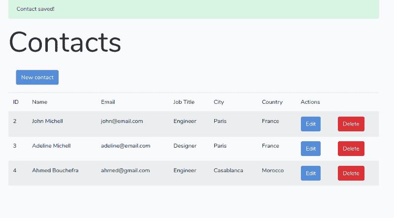

# 如何用 Laravel 和 MySQL 构建你的第一个 CRUD 应用

> 原文：<https://www.freecodecamp.org/news/laravel-5-7-tutorial-build-your-first-crud-app-with-laravel-and-mysql-15cbd06c6cef/>

在这篇初学者教程中，您将学习使用 Laravel 5.7——最流行的 PHP 框架之一的最新版本——用 MySQL 数据库从头开始创建 CRUD web 应用程序。我们将一步一步地完成这个过程，从安装 Composer (PHP 包管理器)开始，一直到实现和服务您的应用程序。

### 先决条件

本教程假设您的系统上安装了 PHP 和 MySQL。按照操作系统的说明安装这两个软件。

您还需要熟悉 Linux/macOS bash，我们将在这里执行本教程中的命令。

熟悉 PHP 是必需的，因为 Laravel 是基于 PHP 的。

对于开发，我将使用 Ubuntu 16.04 机器，所以本教程中的命令是针对这个系统的，但是您应该能够在您使用的任何操作系统中遵循本教程。

### 安装 PHP 7.1

Laravel v5.7 要求 PHP 7.1 或更高版本，因此您需要在系统上安装最新版本的 PHP。在大多数系统上，这个过程很简单。

在 Ubuntu 上，你可以按照这些说明去做。

首先添加包含 PHP 最新版本的`ondrej/php` PPA:

```
$ sudo add-apt-repository ppa:ondrej/php $ sudo apt-get update
```

接下来，使用以下命令安装 PHP 7.1:

```
$ sudo apt-get install php7.1
```

如果您使用的是 Ubuntu 18.04，PHP 7.2 包含在 18.04 的默认 Ubuntu 存储库中，因此您应该能够使用以下命令安装它:

```
$ sudo apt-get install php
```

> 本教程是用 PHP 7.1 测试的，但你也可以使用更近的版本，如 PHP 7.2 或 PHP 7.3

### 安装所需的 PHP 7.1 模块

Laravel 需要一堆模块。您可以使用以下命令安装它们:

```
$ sudo apt-get install php7.1 php7.1-cli php7.1-common php7.1-json php7.1-opcache php7.1-mysql php7.1-mbstring php7.1-mcrypt php7.1-zip php7.1-fpm php7.1-xml
```

### 安装 PHP Composer

让我们从安装 PHP 包管理器 Composer 开始我们的旅程。

在您的主目录中导航，然后使用`curl`从官方网站下载安装程序:

```
$ cd ~ $ curl -sS https://getcomposer.org/installer -o composer-setup.php
```

然后，您可以使用以下命令在您的系统上全局安装`composer`:

```
$ sudo php composer-setup.php --install-dir=/usr/local/bin --filename=composer
```

在撰写本文时，Composer 1.8 将安装在您的系统上。您可以通过在终端中运行`composer`来确保您的安装按预期运行:

您应该得到以下输出:

```
______  / ____/___  ____ ___  ____  ____  ________  _____ / /   / __ \/ __ `__ \/ __ \/ __ \/ ___/ _ \/ ___// /___/ /_/ / / / / / / /_/ / /_/ (__  )  __/ /\____/\____/_/ /_/ /_/ .___/\____/____/\___/_/                    /_/Composer version 1.8.0 2018-12-03 10:31:16Usage:  command [options] [arguments]Options:  -h, --help                     Display this help message  -q, --quiet                    Do not output any message  -V, --version                  Display this application version      --ansi                     Force ANSI output      --no-ansi                  Disable ANSI output  -n, --no-interaction           Do not ask any interactive question      --profile                  Display timing and memory usage information      --no-plugins               Whether to disable plugins.  -d, --working-dir=WORKING-DIR  If specified, use the given directory as working directory.  -v|vv|vvv, --verbose           Increase the verbosity of messages: 1 for normal output, 2 for more verbose output and 3 for debug
```

欲了解更多信息，请查看本[教程](https://www.digitalocean.com/community/tutorials/how-to-install-and-use-composer-on-ubuntu-18-04)。

如果您已经在系统中成功安装了 Composer，那么您就可以创建一个 Laravel 5.7 项目了。

### 安装和创建 Laravel 5.7 项目

在本节中，我们将介绍 Laravel，然后继续安装并创建一个 Laravel 5.7 项目。

### 关于拉勒维尔

[Laravel docs](https://packagist.org/packages/laravel/framework) 将其描述为:

> Laravel 是一个 web 应用程序框架，具有丰富、优雅的语法。我们相信，发展必须是一种愉快的、创造性的体验，才能真正令人满意。Laravel 试图通过简化大多数 web 项目中使用的常见任务来减轻开发的痛苦，例如:

> Laravel 易于访问，但功能强大，为大型健壮的应用程序提供了所需的工具。

生成 Laravel 5.7 项目既简单又直接。在您的终端中，运行以下命令:

```
$ composer create-project --prefer-dist laravel/laravel laravel-first-crud-app
```

这将安装`laravel/laravel` **v5.7.19** 。

> ***注意*** *:确保你的系统上至少安装了 PHP 7.1。否则，composer 将为您的项目使用 Laravel 5.5。*

您可以使用以下命令来验证项目中安装的版本:

```
$ cd laravel-first-crud-app $ php artisan -V Laravel Framework 5.7.22
```

### 安装前端依赖项

在您生成的项目中，您可以看到生成了一个`package.json`文件，其中包含许多您的项目可以使用的前端库:

*   阿克斯，
*   自举，
*   跨环境，
*   jquery，
*   laravel-mix，
*   洛达什，
*   popper.js，
*   解析 url 加载程序，
*   萨斯，
*   sass-loader，
*   vue。

> ***注意*** *:你可以使用你喜欢的库与 Laravel 一起使用，而不是专门添加到`package.json`中的那些。*

> *您的 Laravel 项目中的`package.json`文件包含一些包，比如`vue`和`axios`，帮助您开始构建您的 JavaScript 应用程序。*

> *它还包括`bootstrap`来帮助你开始使用 Bootstrap 来设计你的 UI。*

> 它包括 [Laravel Mix](https://laravel.com/docs/5.7/mix#working-with-stylesheets) 来帮助你将你的 SASS 文件编译成普通的 CSS。

您需要使用`npm`来安装前端依赖项:

```
$ npm install
```

运行此命令后，将创建一个`node_modules`文件夹，并将依赖项安装到其中。

> ***注意*** *:需要在系统上安装 Node.js 和 npm，才能安装前端依赖项。*

### 创建 MySQL 数据库

现在让我们创建一个 MySQL 数据库，用于在 Laravel 应用程序中持久存储数据。在您的终端中，运行以下命令来运行`mysql`客户端:

```
$ mysql -u root -p
```

出现提示时，请在安装 MySQL 服务器后输入密码。

接下来，运行以下 SQL 语句来创建一个`db`数据库:

```
mysql> create database db;
```

打开`.env`文件并更新凭证以访问您的 MySQL 数据库:

```
DB_CONNECTION=mysql DB_HOST=127.0.0.1 DB_PORT=3306 DB_DATABASE=db DB_USERNAME=root DB_PASSWORD=******
```

您需要输入数据库名称、用户名和密码。

此时，您可以运行`migrate`命令来创建您的数据库和 Laravel 所需的一系列 SQL 表:

> ***注意*** *:您可以在开发的任何其他点运行`migrate`命令，在您的数据库中添加其他 SQL 表，或者如果您以后需要添加任何更改，也可以在以后添加。*

### 创建您的第一个 Laravel 模型

Laravel 使用 MVC 架构模式将您的应用程序组织成三个分离的部分:

*   封装数据访问层的模型，
*   封装表示层的视图，
*   控制器，封装代码以控制应用程序，并与模型和视图层通信。

[MDN](https://developer.mozilla.org/en-US/docs/Glossary/MVC) 将 MVC 定义为:

> MVC (模型-视图-控制器)是软件设计中的一种模式，通常用于实现用户界面、数据和控制逻辑。它强调软件的业务逻辑和显示之间的分离。这种“关注点分离”提供了更好的分工和改进的维护。

现在，让我们创建我们的第一个 Laravel 模型。在您的终端中，运行以下命令:

```
$ php artisan make:model Contact --migration
```

这将创建一个联系模型和一个迁移文件。在终端中，我们得到类似如下的输出:

```
Model created successfully. Created Migration: 2019_01_27_193840_create_contacts_table
```

打开`database/migrations/xxxxxx_create_contacts_table`迁移文件并相应地更新它:

```
<?phpuse Illuminate\Support\Facades\Schema;use Illuminate\Database\Schema\Blueprint;use Illuminate\Database\Migrations\Migration;class CreateContactsTable extends Migration{    /**     * Run the migrations.     *     * @return void     */    public function up()    {        Schema::create('contacts', function (Blueprint $table) {            $table->increments('id');            $table->timestamps();            $table->string('first_name');            $table->string('last_name');            $table->string('email');            $table->string('job_title');            $table->string('city');               $table->string('country');                    });    }    /**     * Reverse the migrations.     *     * @return void     */    public function down()    {        Schema::dropIfExists('contacts');    }}
```

我们在`contacts`表中增加了`first_name`、`last_name`、`email`、`job_title`、`city`和`country`字段。

现在，您可以使用以下命令在数据库中创建`contacts`表:

```
$ php artisan migrate
```

现在，让我们看看我们的`Contact`模型，它将用于与`contacts`数据库表进行交互。打开`app/Contact.php`并更新它:

```
<?phpnamespace App;use Illuminate\Database\Eloquent\Model;class Contact extends Model{    protected $fillable = [        'first_name',        'last_name',        'email',        'city',        'country',        'job_title'           ];}
```

### 创建控制器和路线

在创建了模型并迁移了数据库之后，现在让我们创建控制器和使用`Contact`模型的路径。在您的终端中，运行以下命令:

```
$ php artisan make:controller ContactController --resource
```

> *Laravel 资源路由使用单行代码将典型的“CRUD”路由分配给控制器。例如，您可能希望创建一个控制器来处理对应用程序存储的“照片”的所有 HTTP 请求。使用`make:controller` Artisan 命令，我们可以快速创建这样一个控制器。*

> *该命令将在`app/Http/Controllers/PhotoController.php`生成一个控制器。控制器将包含每个可用资源操作的方法。*

打开`app/Http/Controllers/ContactController.php`文件。这是最初的内容:

```
<?phpnamespace App\Http\Controllers;use Illuminate\Http\Request;class ContactController extends Controller{    /**     * Display a listing of the resource.     *     * @return \Illuminate\Http\Response     */    public function index()    {        //    }    /**     * Show the form for creating a new resource.     *     * @return \Illuminate\Http\Response     */    public function create()    {        //    }    /**     * Store a newly created resource in storage.     *     * @param  \Illuminate\Http\Request  $request     * @return \Illuminate\Http\Response     */    public function store(Request $request)    {        //    }    /**     * Display the specified resource.     *     * @param  int  $id     * @return \Illuminate\Http\Response     */    public function show($id)    {        //    }    /**     * Show the form for editing the specified resource.     *     * @param  int  $id     * @return \Illuminate\Http\Response     */    public function edit($id)    {        //    }    /**     * Update the specified resource in storage.     *     * @param  \Illuminate\Http\Request  $request     * @param  int  $id     * @return \Illuminate\Http\Response     */    public function update(Request $request, $id)    {        //    }    /**     * Remove the specified resource from storage.     *     * @param  int  $id     * @return \Illuminate\Http\Response     */    public function destroy($id)    {        //    }}
```

`ContactController`类扩展了可从 Laravel 获得的`Controller`类，并定义了一系列方法，这些方法将用于对`Contact`模型进行 CRUD 操作。

你可以在上面的评论里读到这个方法的作用。

现在我们需要为这些方法提供实现。

但在此之前，让我们添加路由。打开`routes/web.php`文件并相应更新:

```
<?phpRoute::get('/', function () {    return view('welcome');});Route::resource('contacts', 'ContactController');
```

使用`Route`的`resource()`静态方法，您可以创建多个路由来公开资源上的多个动作。

这些路线被映射到各种`ContactController`方法，我们将需要在下一节中实现这些方法:

*   GET `/contacts`，映射到`index()`方法，
*   GET `/contacts/create`，映射到`create()`方法，
*   POST `/contacts`，映射到`store()`方法，
*   GET `/contacts/{contact}`，映射到`show()`方法，
*   GET `/contacts/{contact}/edit`，映射到`edit()`方法，
*   PUT/PATCH `/contacts/{contact}`，映射到`update()`方法，
*   删除`/contacts/{contact}`，映射到`destroy()`方法。

这些路由被用来提供 HTML 模板，也作为 API 端点来使用`Contact`模型。

> ***注意*** *:如果你想创建一个只公开 RESTful API 的控制器，你可以使用`apiResource`方法来排除用于服务 HTML 模板的路由:*

```
Route::apiResource('contacts', 'ContactController');
```

### 实施 CRUD 操作

现在让我们实现视图旁边的控制器方法。

### c:实现创建操作并添加表单

`ContactController`包括

*   映射到将用于在数据库中创建联系人的`POST /contacts` API 端点的`store()`方法，以及
*   映射到`GET /contacts/create`路由的`create()`，该路由将用于服务 HTML 表单，该表单用于将联系人提交给`POST /contacts` API 端点。

让我们实现这两个方法。

重新打开`app/Http/Controllers/ContactController.php`文件，开始导入`Contact`模型:

```
use App\Contact;
```

接下来，找到`store()`方法并相应地更新它:

```
public function store(Request $request)    {        $request->validate([            'first_name'=>'required',            'last_name'=>'required',            'email'=>'required'        ]);        $contact = new Contact([            'first_name' => $request->get('first_name'),            'last_name' => $request->get('last_name'),            'email' => $request->get('email'),            'job_title' => $request->get('job_title'),            'city' => $request->get('city'),            'country' => $request->get('country')        ]);        $contact->save();        return redirect('/contacts')->with('success', 'Contact saved!');    }
```

接下来，找到`create()`方法并更新它:

```
public function create() { return view('contacts.create'); }
```

`create()`函数利用`view()`方法返回需要出现在`resources/views`文件夹中的`create.blade.php`模板。

在创建`create.blade.php`模板之前，我们需要创建一个基础模板，它将被 create 模板和本教程稍后创建的所有其他模板扩展。

在`resources/views`文件夹中，创建一个`base.blade.php`文件:

```
$ cd resources/views $ touch base.blade.php
```

打开`resources/views/base.blade.php`文件，添加以下刀片模板:

```
<!DOCTYPE html><html lang="en"><head>  <meta name="viewport" content="width=device-width, initial-scale=1.0">  <title>Laravel 5.7 & MySQL CRUD Tutorial</title>  <link href="{{ asset('css/app.css') }}" rel="stylesheet" type="text/css" /></head><body>  <div class="container">    @yield('main')  </div>  <script src="{{ asset('js/app.js') }}" type="text/js"></script></body></html>
```

现在，让我们创建`create.blade.php`模板。首先，在“视图”文件夹中创建一个联系人文件夹:

```
$ mkdir contacts
```

接下来，创建模板

```
$ cd contacts $ touch create.blade.php
```

打开`resources/views/contacts/create.blade.php`文件并添加以下代码:

```
@extends('base')@section('main')<div class="row"> <div class="col-sm-8 offset-sm-2">    <h1 class="display-3">Add a contact</h1>  <div>    @if ($errors->any())      <div class="alert alert-danger">        <ul>            @foreach ($errors->all() as $error)              <li>{{ $error }}</li>            @endforeach        </ul>      </div><br />    @endif      <form method="post" action="{{ route('contacts.store') }}">          @csrf          <div class="form-group">                  <label for="first_name">First Name:</label>              <input type="text" class="form-control" name="first_name"/>          </div>          <div class="form-group">              <label for="last_name">Last Name:</label>              <input type="text" class="form-control" name="last_name"/>          </div>          <div class="form-group">              <label for="email">Email:</label>              <input type="text" class="form-control" name="email"/>          </div>          <div class="form-group">              <label for="city">City:</label>              <input type="text" class="form-control" name="city"/>          </div>          <div class="form-group">              <label for="country">Country:</label>              <input type="text" class="form-control" name="country"/>          </div>          <div class="form-group">              <label for="job_title">Job Title:</label&gt;              <input type="text" class="form-control" name="job_title"/>          </div>                                   <button type="submit" class="btn btn-primary-outline">Add contact</button>      </form>  </div></div></div>@endsection
```

这是我们创建表单的屏幕截图！


填写表格并点击**添加联系人**按钮，在数据库中创建一个联系人。您应该被重定向到/contacts route，它还没有与之关联的视图。

### r:实现读操作并获取数据

接下来，让我们实现读取操作，从 MySQL 数据库中获取并显示联系人数据。

转到`app/Http/Controllers/ContactController.php`文件，找到`index()`方法并更新它:

```
public function index()    {        $contacts = Contact::all();        return view('contacts.index', compact('contacts'));    }
```

接下来，您需要创建索引模板。创建一个`resources/views/contacts/index.blade.php`文件:

```
$ touch index.blade.php
```

打开`resources/views/contacts/index.blade.php`文件并添加以下代码:

```
@extends('base')@section('main')<div class="row"><div class="col-sm-12">    <h1 class="display-3">Contacts</h1>      <table class="table table-striped">    <thead>        <tr>          <td>ID</td>          <td>Name</td>          <td>Email</td>          <td>Job Title</td>          <td>City</td>          <td>Country</td>          <td colspan = 2>Actions</td>        </tr>    </thead>    <tbody>        @foreach($contacts as $contact)        <tr>            <td>{{$contact->id}}</td>            <td>{{$contact->first_name}} {{$contact->last_name}}</td>            <td>{{$contact->email}}</td>            <td>{{$contact->job_title}}</td>            <td>{{$contact->city}}</td>            <td>{{$contact->country}}</td>            <td>                <a href="{{ route('contacts.edit',$contact->id)}}" class="btn btn-primary">Edit</a>            </td>            <td>                <form action="{{ route('contacts.destroy', $contact->id)}}" method="post">                  @csrf                  @method('DELETE')                  <button class="btn btn-danger" type="submit">Delete</button>                </form>            </td>        </tr>        @endforeach    </tbody>  </table><div></div>@endsection
```

### u:实现更新操作

接下来，我们需要实现更新操作。转到`app/Http/Controllers/ContactController.php`文件，找到`edit($id)`方法并更新它:

```
public function edit($id)    {        $contact = Contact::find($id);        return view('contacts.edit', compact('contact'));            }
```

接下来，您需要实现`update()`方法:

```
public function update(Request $request, $id)    {        $request->validate([            'first_name'=>'required',            'last_name'=>'required',            'email'=>'required'        ]);        $contact = Contact::find($id);        $contact->first_name =  $request->get('first_name');        $contact->last_name = $request->get('last_name');        $contact->email = $request->get('email');        $contact->job_title = $request->get('job_title');        $contact->city = $request->get('city');        $contact->country = $request->get('country');        $contact->save();        return redirect('/contacts')->with('success', 'Contact updated!');    }
```

现在，您需要添加编辑模板。在`resources/views/contacts/`中，创建一个`edit.blade.php`文件:

```
$ touch edit.blade.php
```

打开`resources/views/contacts/edit.blade.php`文件并添加以下代码:

```
@extends('base') @section('main')<div class="row">    <div class="col-sm-8 offset-sm-2">        <h1 class="display-3">Update a contact</h1>        @if ($errors->any())        <div class="alert alert-danger">            <ul>                @foreach ($errors->all() as $error)                <li>{{ $error }}</li>                @endforeach            </ul>        </div>        <br />         @endif        <form method="post" action="{{ route('contacts.update', $contact->id) }}">            @method('PATCH')             @csrf            <div class="form-group">                <label for="first_name">First Name:</label>                <input type="text" class="form-control" name="first_name" value={{ $contact->first_name }} />            </div>            <div class="form-group">                <label for="last_name">Last Name:</label>                <input type="text" class="form-control" name="last_name" value={{ $contact->last_name }} />            </div>            <div class="form-group">                <label for="email">Email:</label>                <input type="text" class="form-control" name="email" value={{ $contact->email }} />            </div>            <div class="form-group">                <label for="city">City:</label>                <input type="text" class="form-control" name="city" value={{ $contact->city }} />            </div>            <div class="form-group">                <label for="country">Country:</label>                <input type="text" class="form-control" name="country" value={{ $contact->country }} />            </div>            <div class="form-group">                <label for="job_title">Job Title:</label>                <input type="text" class="form-control" name="job_title" value={{ $contact->job_title }} />            </div>            <button type="submit" class="btn btn-primary">Update</button>        </form>    </div></div>@endsection
```

### d:实现删除操作

最后，我们将继续实现删除操作。转到`app/Http/Controllers/ContactController.php`文件，找到`destroy()`方法并相应地更新它:

```
public function destroy($id)    {        $contact = Contact::find($id);        $contact->delete();        return redirect('/contacts')->with('success', 'Contact deleted!');    }
```

您可以注意到，当我们在 CRUD API 方法中重定向到`/contacts`路径时，我们也传递了一个成功消息，但是它没有出现在我们的`index`模板中。让我们改变这一切！

转到`resources/views/contacts/index.blade.php`文件并添加以下代码:

```
<div class="col-sm-12">  @if(session()->get('success'))    <div class="alert alert-success">      {{ session()->get('success') }}      </div>  @endif</div>
```

我们还需要添加一个按钮，将我们带到创建表单。在标题下添加以下代码:

```
<div>    <a style="margin: 19px;" href="{{ route('contacts.create')}}" class="btn btn-primary">New contact</a></div>
```

这是我们创建联系人后的页面截图:



### 结论

我们已经到了本教程的结尾。我们用 Laravel 5.7、PHP 7.1 和 MySQL 创建了一个 CRUD 应用程序。

希望你喜欢这个教程，下次再见！