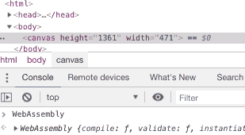
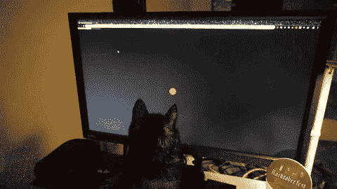

# 世界上最简单的 WebAssembly 入门？

> 原文：<https://www.freecodecamp.org/news/webassembly-with-golang-is-fun-b243c0e34f02/>

马丁·奥尔森斯基(奥尔索)

# 世界上最简单的 WebAssembly 入门？

#### 面向 JavaScript 开发者的 Golang WASM。


An interactive *<canv*as> laser game for cats ? on your phone ?written completely in Golang. Being inspected by Matsu ?

*   你认为 WebAssembly (WASM)只用于图像处理、数学运算或其他网络应用吗？
*   你还在把 WASM 和`Web Workers`和`Service Workers`搞混吗？
*   不感兴趣是因为您认为今天开发的 JavaScript web 应用程序在未来 10 年仍需要维护？
*   要不要做非 JS 语言的前端 web 开发？

*对于撇油器，这里有 [**demo**](https://olso.space/go-wasm-cat-game-on-canvas/index.html) 或者 **/ [src](https://github.com/olso/go-wasm-cat-game-on-canvas-with-docker)*** 的链接？。*[读/写是一个事务】，](http://www.perell.com/blog/coolest-things-2018#block-yui_3_17_2_1_1546345205921_226865)我尽量不浪费你的时间。代码中有带解释性注释的 g `ists` 。*

### 故事情节？

我们的目标是为猫创造一个简单的游戏？:用一些在手机上移动红色激光？音效和振动。我们将实现 Go [lang (](https://golang.org) Go)中的一切，包括 DOM 操作、逻辑和状态。

因为猫不能使用鼠标，我们需要用猫爪进行触摸互动？。

#### 介绍说明！

把 WASM 想象成[通用虚拟机](https://webassembly.org/docs/use-cases/)(沙箱)，在这里你写一次代码，它就可以在任何地方运行。

WASM 是一个编译目标，而不是一种语言。就好像你要同时为 Windows、Mac OS 和 Linux 编译一样！

我不认为 WASM 是要废黜 JS，而是要有没有任何牺牲的选择。

想象一下所有的人都在用 *Go、Swift、Rust、Ruby、C++、OCaml 或其他*进行开发。现在，他们可以使用他们喜欢的语言来创建一个交互式的、网络化的、快速的、离线的网站和网络应用程序。

你有没有参与过关于你的项目是单回购还是多回购的讨论？

你现在还将讨论你的项目是单语还是多语言。

当人们可以使用相同的技术时，一切都会变得更容易。尤其是团队之间的沟通。

你仍然可以使用 React，Vue，但是现在你不再被迫使用 JS 了。

#### WASM 与服务和网络工作者有什么不同？

`Service & Web Workers`允许您运行后台、离线&缓存进程。它们模仿线程，不能访问 DOM，不能共享数据(只能通过消息传递),并且在单独的上下文中运行。见鬼，你甚至可以穿着它们跑 WASM 而不是 JS。对我来说，他们只提供一些具有特权的抽象层，没有人说这些层必须执行 JS。

> `*Service & Web Workers*`是一个浏览器功能，它们不是一些专属的 JS 功能。

### 设置开发环境？

我们将使用 WASM、Go、JS 和(可选)Docker？。

不知道围棋但是知道 JS 的话，[学围棋](https://nemethgergely.com/learning-go-as-a-nodejs-developer/)然后回到这里。让我们从访问[围棋 WASM 维基](https://github.com/golang/go/wiki/WebAssembly)开始。

用你本地的`go`，我用的是`golang:1.12-rc` Docker 镜像。只需在这里为`go`编译器设置两个 WASM 标志。在`main.go`中创建一个简单的 [hello world](https://gobyexample.com/hello-world) 来测试它。

```
$ GOOS=js GOARCH=wasm go build -o game.wasm main.go
```

现在，抓住围棋队提供的`[wasm_exec.js](https://github.com/golang/go/blob/master/misc/wasm/wasm_exec.js)`胶水。这个`Go`全球文摘 WASM 发起。我们不必从头开始制作任何 DOM 抽象？。最后，f `etch` 了。`wasm` 归档并运行我们的游戏。

总而言之，它应该是这样的:

### 给我看看密码！

为了渲染我们的简单游戏，`<canv`作为>应该足够了。我们可以直接从 Go 代码中创建 DOM 结构和元素！ `[That sysc](https://github.com/golang/go/tree/master/src/syscall/js)` all/js(作为标准 Go 包包含)为我们处理`s t` he DOM 交互。

#### 主()

我打赌你很久没看过`main()`了？。

看起来和 JS 挺像的吧？

是的，这就是你与`DOM`互动所需要的一切！现在只有几个`Get`和`Call`功能。



Oh mama ? It’s there!

此时，我在问自己。我仍然以某种方式写 JS…这怎么是升级？因为我们还不能直接访问 DOM，所以我们不得不求助于调用 DOM(通过 JS)来做任何事情。想象一下，你可以用 JSX/反应来抽象这个概念。实际上，你已经可以了，但是让我们把它留给我的下一篇文章吧？。

#### *“渲染”和事件处理*

*直接使用`syscall/js` lib 揭示了一些类似 ES5 的回调。我们能够监听 DOM 事件。用那些静态类型看起来很干净！*

#### *日志记录、音频和“异步”*

*在 Go 中，有一个约定是用同步的方式写所有的`func`。由调用者决定`func`是否异步。让`func`异步运行真的很容易。只要加上前缀`go`就行了！它用自己的上下文创建一个线程。您仍然可以将父上下文绑定到它，不要担心。*

#### *永远运行我们的游戏！♾*

*该代码创建一个无缓冲通道，并尝试从中接收数据。因为没有人在上面发送任何东西，所以它本质上是一个永远阻塞的操作，允许我们永远运行我们的程序。*

#### *更新游戏状态并移动红色激光*

*这里没有状态管理，只有一个简单的类型化的`struct`，它不允许你在里面传递任何不正确的值。*

### *结论*

*事实上，WASM 仍然被认为是一个最有价值球员，而且你不用写一行 JS 就能创造出这样一个游戏，这太令人惊讶了！[can use](https://caniuse.com/#feat=wasm)已经完全绿色，没有什么可以阻止你建立 WASM 驱动的网站和应用程序。*

*看，你可以组合你想要的所有语言，event JS -> WASM。最后，它们都会编译成 WASM 字节码。如果你需要在他们之间分享什么，你可以，因为他们可以分享一个原始的记忆。*

*我害怕的是，在最近的新闻中，我们了解到[微软正在打造 Chromium 浏览器](https://news.ycombinator.com/item?id=18595069)而 [Firefox 市场份额低于 9%](https://news.ycombinator.com/item?id=18595025) 。这让谷歌拥有了控制 WASM 的权力。如果他们不配合，群众可能永远不会知道。*

*

Gameplay ?* 

#### *谁已经在使用 WASM 了？*

*同意，我的例子只是画了一整页`canvas`。这里有更多关于语义网的高级例子[awesome-wasm # web-frameworks-libraries](https://github.com/mbasso/awesome-wasm#web-frameworks-libraries)。*

*相当多的项目已经跳上了 WASM 的列车。我更感兴趣的是 Spotify、Twitch、 [Figma](https://www.figma.com/blog/webassembly-cut-figmas-load-time-by-3x/) & [EWASM](https://github.com/ewasm) 。*

#### *Web3 时代的 WASM*

*如今，如果你想在移动 web 上使用一些以太坊钱包，你必须从一些集中式应用商店下载类似 Status.im 的移动钱包，并信任各方。*

*一个可以通过 WebRTC 运行`geth`(以太坊客户端)的渐进式网络应用怎么样？它可以使用`Service Worker`来更新其 WASM 代码，并在后台运行，可以托管在 IPFS/Dat 上。*

### *有用的 WASM 文章、资源和好东西？*

*   *[WebAssembly 大于 web](https://words.steveklabnik.com/webassembly-is-more-than-just-the-web)*
*   *[WebAssembly and Go:看未来](https://www.brianketelsen.com/web-assembly-and-go-a-look-to-the-future/)与 [HN 点评](https://news.ycombinator.com/item?id=17381816)*
*   *Mozilla 黑客 & [黑客新闻](https://hn.algolia.com/?query=wasm&sort=byDate&prefix&page=0&dateRange=all&type=story)*
*   *[面向 Go 的 WebAssembly 架构](https://docs.google.com/document/d/131vjr4DH6JFnb-blm_uRdaC0_Nv3OUwjEY5qVCxCup4/edit)*

*[**awesome-wasm**](https://github.com/mbasso/awesome-wasm) ，**[awesome-wasm-langs](https://github.com/appcypher/awesome-wasm-langs)， [gowasm-experiments](https://github.com/stdiopt/gowasm-experiments) ， [**WasmWeekly**](https://twitter.com/wasmweekly) ，[WasmRocks](http://www.wasmrocks.com/) ， [SPA with C++](https://github.com/mbasso/asm-dom#examples) ，[更好的 DOM 绑定 for Go](https://github.com/dennwc/dom)***

***感谢[https://github.com/twifkak](https://github.com/twifkak)为 Android 优化了 Chrome for！***

### ***下一篇文章？✍️***

***我们将看看 JS 模块和 React 的互操作性。敬请期待！***

***如果你喜欢它，并想看到更多的内容，别忘了继续点击那个按钮。。***

### ***关于我***

***嗨，我是**马丁·奥尔森斯基** *(奥尔索)*。如有任何问题/建议，欢迎随时联系我[**https://olso . space**](https://olso.space)或@ [olso_uznebolo](https://twitter.com/olso_uznebolo)***

***我还对 [DIYBio](http://sphere.diybio.org) 、[技术增强的生态系统/植物](https://terra0.org/)、[开放患者数据&数字健康](https://events.ccc.de/congress/2018/wiki/index.php/Session:Digital_Health_and_Patient_Data)、加密货币、Web3、P2P 感兴趣。***