# 如何在 10 分钟内开始使用 MongoDB

> 原文：<https://www.freecodecamp.org/news/learn-mongodb-a4ce205e7739/>

纳文杜·贾亚蒂拉克

# 如何在 10 分钟内开始使用 MongoDB


MongoDB 是一个丰富的面向文档的 NoSQL 数据库。

如果你对 NoSQL 完全是个初学者，我推荐你快速看一下我之前发表的 [NoSQL 的文章](https://medium.com/@navindushane/say-no-to-sql-ab1e49aa7299)。

今天，我想分享一些关于 MongoDB 命令的基本知识，比如查询、过滤数据、删除、更新等等。

好了，谈够了，让我们开始工作吧！

### 配置？

为了使用 MongoDB，首先您需要在您的计算机上安装 MongoDB。为此，请访问[官方下载中心](https://www.mongodb.com/download-center/community)并下载适用于您特定操作系统的版本。在这里，我使用了 Windows。

下载 MongoDB 社区服务器安装程序后，您将经历一个“下一个接下一个”的安装过程。完成后，转到安装了 MongoDB 的 c 盘。转到程序文件并选择 MongoDB 目录。

```
C: -> Program Files -> MongoDB -> Server -> 4.0(version) -> bin
```

在 bin 目录中，您会发现一些有趣的可执行文件。

*   mongodb
*   蒙戈

先说这两个文件。

mongod 代表“Mongo 守护进程”。mongod 是 MongoDB 使用的后台进程。mongod 的主要目的是管理所有的 MongoDB 服务器任务。例如，接受请求、响应客户端和内存管理。

mongo 是一个命令行 shell，可以与客户端(例如，系统管理员和开发人员)进行交互。

现在，让我们看看如何启动并运行该服务器。要在 Windows 上做到这一点，首先需要在 c 盘上创建几个目录。打开 c 盘中的命令提示符，执行以下操作:

```
C:\> mkdir data/dbC:\> cd dataC:\> mkdir db
```

这些目录的目的是 MongoDB 需要一个文件夹来存储所有数据。MongoDB 的默认数据目录路径是驱动器上的`/data/db`。因此，我们有必要像这样提供这些目录。

如果您在没有这些目录的情况下启动 MongoDB 服务器，您可能会看到以下错误:

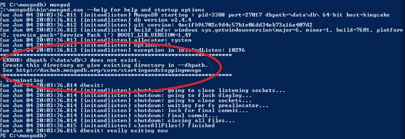

trying to start mongodb server without \data\db directories

创建完这两个文件后，再次打开 mongodb 目录中的 bin 文件夹，并在其中打开您的 shell。运行以下命令:

```
mongod
```

瞧啊。现在我们的 MongoDB 服务器已经启动并运行了！？

为了使用这个服务器，我们需要一个中介。因此，在 bind 文件夹中打开另一个命令窗口，并运行以下命令:

```
mongo
```

运行这个命令后，导航到我们运行 mongod 命令的 shell(这是我们的服务器)。您将在最后看到一条“连接已接受”的消息。这意味着我们的安装和配置是成功的！

只需在 mongo shell 中运行:

```
db
```

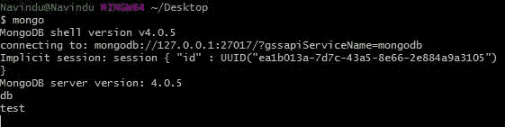

initially you have a db called ‘test’

#### 设置环境变量

为了节省时间，您可以设置您的环境变量。在 Windows 中，这是通过以下菜单完成的:

```
Advanced System Settings -> Environment Variables -> Path(Under System Variables) -> Edit
```

简单地复制我们的 bin 文件夹的路径，然后点击 OK！对我来说是`C:\Program Files\MongoDB\Server\4.0\bin`

现在你都准备好了！

### 使用 MongoDB

有一堆 GUI(图形用户界面)可以与 MongoDB 服务器协同工作，比如 MongoDB Compass、Studio 3T 等等。

它们提供了一个图形界面，因此您可以轻松地使用数据库和执行查询，而不是使用 shell 和手动输入查询。

但是在本文中，我们将使用命令提示符来完成我们的工作。

现在是我们深入 MongoDB 命令的时候了，这些命令将帮助您在未来的项目中使用。

1.  打开您的命令提示符并键入`mongod` 来启动 MongoDB 服务器。

2.打开另一个 shell，输入`mongo` 连接 MongoDB 数据库服务器。

#### 1.查找您当前所在的数据库

```
db
```


该命令将显示您当前所在的数据库。`test`是默认出现的初始数据库。

#### 2.列出数据库

```
show databases
```

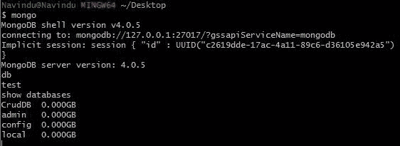

我目前有四个数据库。分别是:`CrudDB`、`admin`、`config`和`local`。

#### **3。转到特定的数据库**

```
use <your_db_name>
```

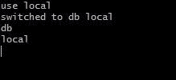

在这里，我已经转移到了`local`数据库。如果您尝试使用命令`db` 打印出当前的数据库名称，您可以检查这一点。

#### **4。创建数据库**

有了 RDBMS(关系数据库管理系统),我们就有了数据库、表、行和列。

但是在 NoSQL 的数据库中，比如 MongoDB，数据是以 BSON 格式存储的(JSON 的二进制版本)。它们存储在称为“集合”的结构中。

在 SQL 数据库中，这些类似于表。

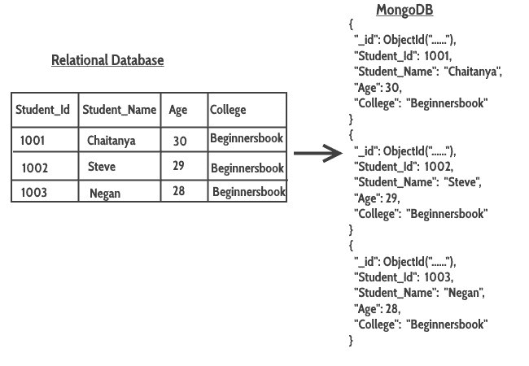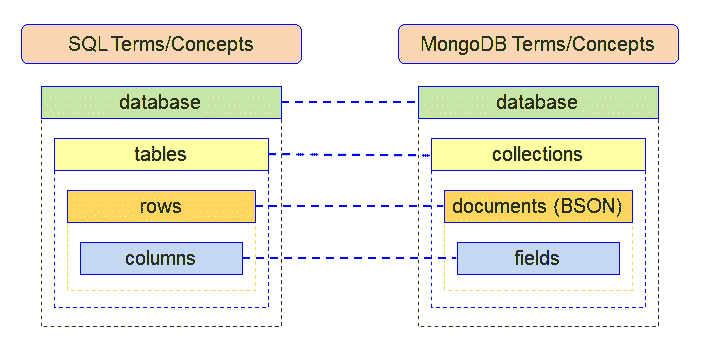

SQL terms and NoSQL terms by [Victoria Malaya](https://www.blogger.com/profile/18437865869379626284 "author profile")

好了，让我们来谈谈如何在 mongo shell 中创建数据库。

```
use <your_db_name>
```

等等，我们以前有过这个命令！为什么我又在用它？！

在 MongoDB 服务器中，如果您的数据库已经存在，使用该命令将导航到您的数据库。

但是如果数据库还不存在，那么 MongoDB 服务器将为您创建数据库。然后，它会导航进去。

创建新数据库后，运行`show database`命令不会显示新创建的数据库。这是因为，在它包含任何数据(文档)之前，它不会显示在您的数据库列表中。

#### **5。创建收藏**

使用`use` 命令导航到您新创建的数据库。

实际上，创建集合有两种方法。两个都看看吧。

一种方法是将数据插入集合:

```
db.myCollection.insert({"name": "john", "age" : 22, "location": "colombo"})
```

这将创建您的收藏`myCollection` 即使收藏不存在。然后它会插入一个带有`name` 和`age`的文档。这些都是不封顶的收藏。

第二种方式如下所示:

2.1 创建无上限集合

```
db.createCollection("myCollection")
```

2.2 创建封顶集合

```
db.createCollection("mySecondCollection", {capped : true, size : 2, max : 2})
```

这样，您将在不插入数据的情况下创建一个集合。

“封顶集合”有一个防止文档溢出的最大文档数。

在这个例子中，我通过将它的值设置为`true`来启用封顶。

`size : 2`表示两兆字节的限制，`max: 2`将文档的最大数量设置为两个。

现在，如果您试图将两个以上的文档插入到`mySecondCollection` 中，并使用`find`命令(我们将很快谈到)，您将只能看到最近插入的文档。请记住，这并不意味着第一个文档已经被删除，它只是没有显示出来。

#### **6。插入数据**

我们可以将数据插入到新的集合中，或者插入到以前创建的集合中。

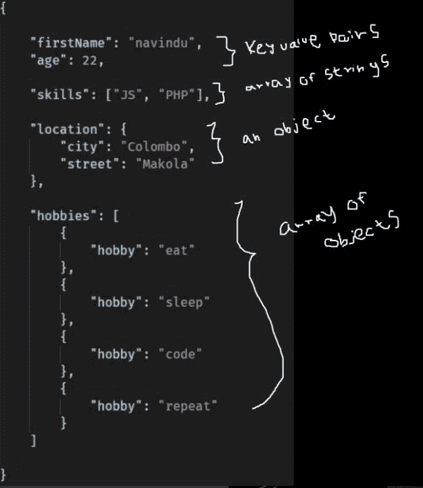

ways data can be stored in a JSON

有三种插入数据的方法。

1.  `insertOne()`仅用于插入单个文档。
2.  `insertMany()`用于插入多个文档。
3.  `insert()`用于插入任意多的文件。

以下是一些例子:

*   **插入()**

```
db.myCollection.insertOne(
  {
    "name": "navindu", 
    "age": 22
  }
)
```

*   **insertMany()**

```
db.myCollection.insertMany([
  {
    "name": "navindu", 
    "age": 22
  },
  {
    "name": "kavindu", 
    "age": 20
  },

  {
    "name": "john doe", 
    "age": 25,
    "location": "colombo"
  }
])
```

`insert()`方法类似于`insertMany()`方法。

另外，注意我们在文档中为`John Doe` *插入了一个名为`location` 的新属性。*所以如果你用**`find`*那么你会看到只有对于*`john doe``location`*属性是附加的。*****

***对于 MongoDB 这样的 NoSQL 数据库，这可能是一个优势。它允许可伸缩性。***

***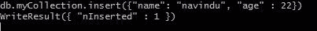

Successfully inserted data*** 

#### ***7 .**。查询数据*****

***以下是查询集合中所有数据的方法:***

```
***`db.myCollection.find()`***
```

***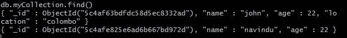

result*** 

***如果你想在一个更干净的地方看到这个数据，方法只是在它的末尾加上`.pretty()` 。这将以漂亮的 JSON 格式显示文档。***

```
**`db.myCollection.find().pretty()`**
```

**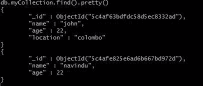

result** 

**等待...在这些例子中，你是否注意到了类似`_id`的东西？那是怎么回事？**

**嗯，每当您插入一个文档时，MongoDB 都会自动添加一个`_id` 字段来惟一地标识每个文档。如果您不希望它显示，只需运行以下命令**

```
**`db.myCollection.find({}, _id: 0).pretty()`**
```

**接下来，我们将看看过滤数据。**

**如果您想要显示某个特定的文档，您可以指定想要显示的文档的单个细节。**

```
**`db.myCollection.find(
  {
    name: "john"
  }
)`**
```

**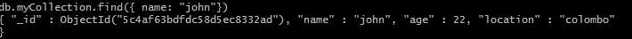

result** 

**假设您只想显示年龄小于 25 岁的人。您可以使用`$lt`对此进行过滤。**

```
**`db.myCollection.find(
  {
    age : {$lt : 25}
  }
)`**
```

**同样，`$gt`代表大于，`$lte`是“小于等于”，`$gte`是“大于等于”，`$ne`是“不等于”。**

#### ****8。更新文件****

**假设你想更新某人的地址或年龄，你该怎么做呢？好吧，看下一个例子:**

```
**`db.myCollection.update({age : 20}, {$set: {age: 23}})`**
```

**第一个参数是要更新哪个文档的字段。这里，为了简单起见，我指定了`age`。在生产环境中，您可以使用类似于`_id`字段的东西。**

**使用类似于`_id`的东西来更新一个唯一的行总是更好。这是因为多个字段可以有相同的`age`和`name`。因此，如果您更新一行，它将影响具有相同名称和年龄的所有行。**

**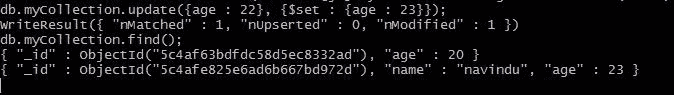

result** 

**如果你以这种方式用一个新的属性更新一个文档，比如说`location`，这个文档将会用新的属性更新。如果你做一个`find`，那么结果会是:**

**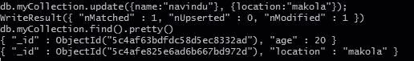

result** 

**如果您需要从单个文档中删除一个属性，您可以这样做(假设您希望`age` 消失):**

```
**`db.myCollection.update({name: "navindu"}, {$unset: age});`**
```

#### ****9。移除文件****

**正如我前面提到的，当你更新或删除一个文档时，你只需要指定`_id`，而不仅仅是`name`、`age`、`location`。**

```
**`db.myCollection.remove({name: "navindu"});`**
```

#### **10。移除收藏**

```
**`db.myCollection.remove({});`**
```

**注意，这不等于`drop()`方法。不同之处在于，`drop()`用于删除集合中的所有文档，而`remove()`方法用于删除集合中的所有文档。**

### **逻辑运算符**

**MongoDB 提供了逻辑运算符。下图总结了不同类型的逻辑运算符。**

**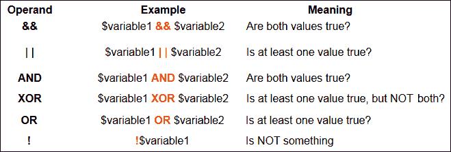****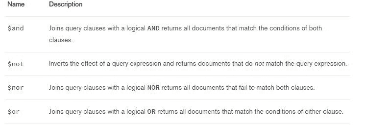

reference: MongoDB manual** 

**假设您想要显示年龄小于 25 岁的人，并且他们的位置在科伦坡。我们能做什么？**

**我们可以使用`$and` 运算符！**

```
**`db.myCollection.find({$and:[{age : {$lt : 25}}, {location: "colombo"}]});`**
```

**最后，我们来谈谈聚合。**

### **聚合**

**快速回顾一下我们在 SQL 数据库中学习的聚合函数:**

**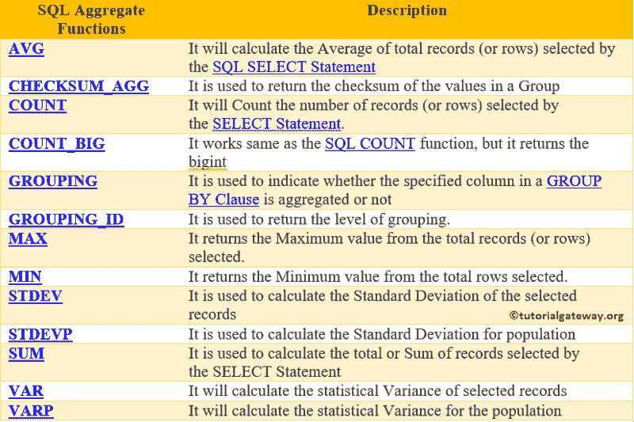

aggregation functions in SQL databases. ref : Tutorial Gateway** 

**简而言之，聚合将来自多个文档的值分组，并以某种方式汇总它们。**

**想象一下，如果我们在一个集合中有男学生和女学生，我们想对他们每个人进行总数统计。为了得到男性和女性的总数，我们可以使用`$group`聚合函数。**

```
**`db.recordBook.aggregate([
  {
    $group : {_id : "$gender", result: {$sum: 1}}
  }  
]);`**
```

**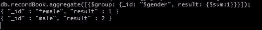

result** 

#### **包扎**

**因此，我们已经讨论了 MongoDB 的基础知识，您可能需要在将来构建应用程序。我希望你喜欢这篇文章——感谢阅读！**

**如果你对本教程有任何疑问，欢迎在下面的评论区发表评论，或者通过[脸书](https://www.facebook.com/navinduuu)或[推特](https://twitter.com/NavinduJay)或 [Instagram](https://www.instagram.com/iamnavindu/) 联系我。**

**下一篇文章再见！❤️ ✌?**

**链接到我以前的文章: [NoSQL](https://medium.com/@navindushane/say-no-to-sql-ab1e49aa7299)**