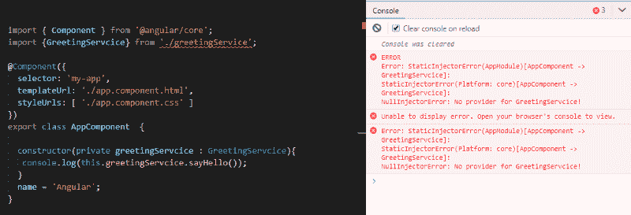
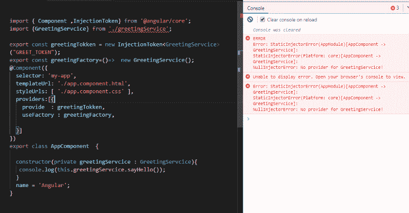
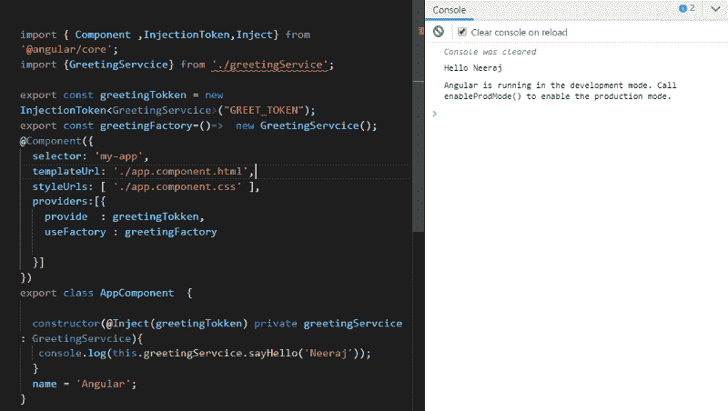

# 角度依赖注入简介

> 原文：<https://www.freecodecamp.org/news/angular-dependency-injection-in-detail-8b6822d6457c/>

作者:尼拉杰·达纳

在本文中，我们将看到 Angular 的依赖注入是如何在内部工作的。假设我们有一个名为 appcomponent 的组件，它有一个简单的基本结构，如下所示:

```
import { Component, OnInit } from "@angular/core";@Component({  selector: "my-root",  templateUrl: "app.component.html",  styleUrls: ["app.component.css"]})export class AppComponent implements OnInit {  ngOnInit(): void {      }}
```

我们有一个名为 GreetingService 的服务类，其中有一个函数`sayHello` ，它有一个名称作为参数，并返回前面带有“Hello”的名称。

```
export class GreetingService{  sayHello(name){    return `Hello ${name}` ;  }}
```

在组件中使用服务类有两种方法:首先，我们可以在组件中手动创建服务的一个实例(这是错误的方法，不推荐使用)。

另一种方法是让 Angular 创建我们服务的实例，并在内部将该实例传递给我们的组件。这是常见的和推荐的做法。

#### 在角度依赖注入系统中注入我们的服务

```
Import {Component} from '@angular/core';Import {GreetingService} from '. /greetingService';
```

```
@Component({  selector: 'my-app',  templateUrl: './app.component.html',  styleUrls: [ './app.component.css' ]})export class AppComponent  {
```

```
constructor(private greetingService : GreetingService){   console.log(this.greetingService.sayHello());  }}
```

现在，如果您运行这个项目，您将得到错误“没有 GreetingService 的提供者！”



因此，Angular 基本上是在抱怨它没有找到任何提供者来创建问候服务的实例，或者它不知道如何创建实例。为了让框架知道应该如何创建实例，我们必须将一个 provider 对象传递给组件装饰器中的 providers 属性，如下所示:

```
import { Component } from '@angular/core';import {GreetingService} from './greetingService';
```

```
@Component({  selector: 'my-app',  templateUrl: './app.component.html',  styleUrls: [ './app.component.css' ],  providers:[{      }]})export class AppComponent  {
```

```
constructor(private greetingService : GreetingService){   console.log(this.greetingService.sayHello());  }  }
```

在这个 provider 对象中，我们有许多属性，所以让我们一个一个地理解它们。

#### 定制工厂

使用工厂:这将告诉框架在创建服务对象时将使用哪个工厂。在我们的例子中，我们没有任何工厂，所以让我们创建一个。

工厂将是一个负责创建和返回服务对象的函数。

```
export function greetingFactory(){   return  new GreetingService()};
```

```
Or more short way
```

```
export const greetingFactory= () =>  new GreetingService ();
```

#### 自定义注入令牌

下一件事是创建一个属性，其值将是一个注入令牌实例。使用这个属性，框架将唯一地标识我们的服务，并将注入服务的正确实例。

```
var greetingTokken = new InjectionToken<GreetingService>("GREET_TOKEN");
```

所以在上面的代码片段中，我们创建了 InjectionToken 类的一个实例，它是泛型的。在我们的例子中，当有人请求名为 greetingToken 的注入时，GreetingService 实例将被注入。

到目前为止，我们的代码如下所示:

```
import { Component ,InjectionToken} from '@angular/core';import {GreetingService} from './greetingService';
```

```
export const greetingTokken = new InjectionToken<GreetingService>("GREET_TOKEN");export const greetingFactory=()=>  new GreetingService();@Component({  selector: 'my-app',  templateUrl: './app.component.html',  styleUrls: [ './app.component.css' ],  providers:[{    provide  : greetingTokken,    useFactory : greetingFactory,     }]})export class AppComponent  {
```

```
constructor(private greetingService : GreetingService){   console.log(this.greetingService.sayHello());  }  name = 'Angular';}
```

但是我们也会有同样的错误:



这是因为在构造函数中，当我们请求我们服务的实例时，我们必须告诉它我们注入令牌的唯一字符串`greetingToken`。

所以让我们更新我们的代码:

```
export class AppComponent  {
```

```
constructor(@Inject(greetingTokken) private greetingService : GreetingService){   console.log(this.greetingService.sayHello('Neeraj'));  }  name = 'Angular';}
```

现在我们将有一个结果，允许我们成功地通过角度依赖注入的服务。



现在让我们假设您有一些像这样的嵌套依赖关系:

```
import{DomSanitizer} from '@angular/platform-browser';
```

```
export class GreetingService{  constructor (private domSanitizer:DomSanitizer){      }  sayHello(name){    return `Hello ${name}`  }}
```

因此，在这种情况下，我们必须再向提供者的对象(即 deps)传递一个属性，该对象是所有依赖项的数组:

```
@Component({  selector: 'my-app',  templateUrl: './app.component.html',  styleUrls: [ './app.component.css' ],  providers:[{    provide  : greetingTokken,    useFactory : greetingFactory,    deps:[DomSanitizer]     }]})export class AppComponent  {
```

```
constructor(@Inject(greetingTokken) private greetingService : GreetingService  ){   console.log(this.greetingService.sayHello('Neeraj'));  }  name = 'Angular';}
```

> 到目前为止，我们所做的一切都只是为了学习。除非有必要，否则不建议创建手动提供程序。

所以这都是 Angular 在幕后为我们做的辛苦工作。我们不必为注册我们的服务做所有这些。我们实际上可以减少代码，而不是手动传递工厂和令牌，在这种情况下，我们可以要求框架为我们做这件事。

provide 属性是注入令牌，它将是服务的名称，Angular 将在内部为我们创建一个注入令牌和工厂。

我们必须再传递一个属性(use-class ),告诉框架我们需要使用哪个类:

```
import { Component ,InjectionToken,Inject} from '@angular/core';
```

```
import {GreetingService} from './greetingService';
```

```
@Component({  selector: 'my-app',  templateUrl: './app.component.html',  styleUrls: [ './app.component.css' ],  providers:[{    provide  : GreetingService,    useClass :GreetingService     }]})export class AppComponent  {
```

```
constructor( private greetingService : GreetingService  ){   console.log(this.greetingService.sayHello('Neeraj'));  }  name = 'Angular';}
```

所以现在我们的代码看起来干净多了，我们可以通过传递服务名来进一步减少代码。然后 Angular 将为我们创建提供对象、工厂和注入令牌，并在需要时使实例对我们可用。

```
import { Component } from '@angular/core';
```

```
import {GreetingService} from './greetingService';
```

```
@Component({  selector: 'my-app',  templateUrl: './app.component.html',  styleUrls: [ './app.component.css' ],  providers:[GreetingService]})export class AppComponent  {
```

```
constructor( private greetingService : GreetingService  ){   console.log(this.greetingService.sayHello('Neeraj'));  }  name = 'Angular';}
```

所以最后，我们的代码看起来非常熟悉。现在，在将来，无论何时创建服务，您都确切地知道需要哪些步骤来获得可用的实例。

如果你喜欢这篇文章，请跟我来获取更多这类东西。


访问 [Smartcodehub](https://www.smartcodehub.com/)