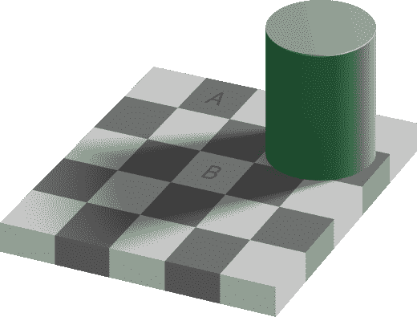
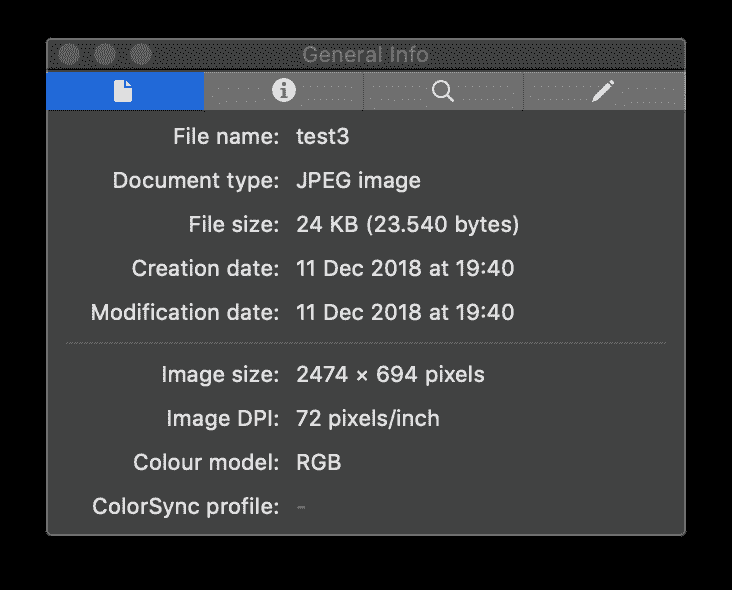
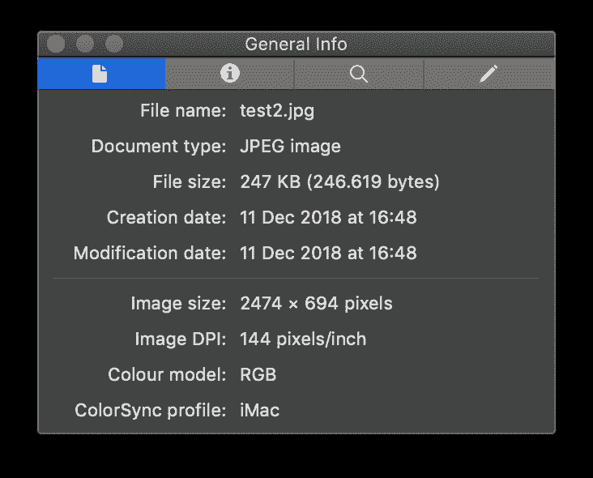
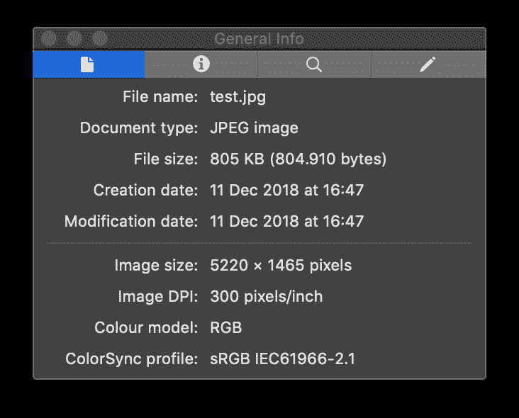
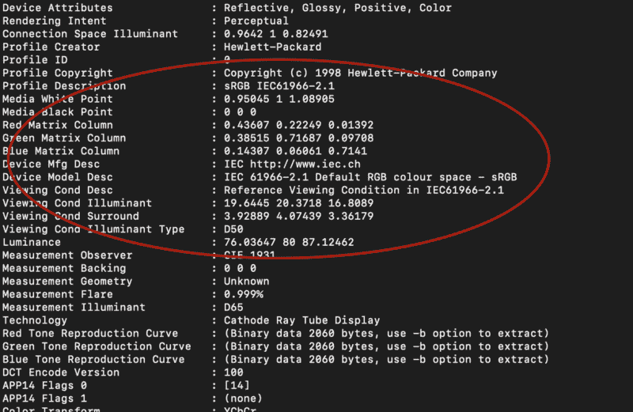
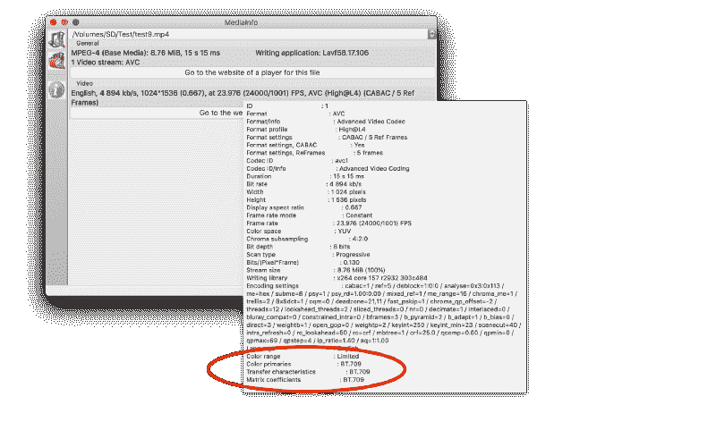

# 如何管理图像和视频中的颜色:最新趋势和最佳实践

> 原文：<https://www.freecodecamp.org/news/color-management-for-the-web-the-challenges-from-iphone-to-chrome-b07cb44ad21b/>

在上届世界杯期间，很少有人知道只有前 10 名球队中的阿根廷和法国的国旗可以在标准的高清电视上准确显示。所有剩余的旗帜颜色都明显超出了色域。也就是说，标准显示器不能正确再现颜色。只有那些使用宽色域的粉丝才能在 4K HDR 的广播中看到他们的颜色。

至于 web 工作流，它比显示属性要复杂得多。纹理、饱和度、色调或亮度在其他行业可能比足球更重要——只要想想时尚或电子商务中的艺术图像就知道了。在这种情况下，清晰的色彩管理是部署健康可靠的图像和视频处理及优化管道的关键。

然而，电子商务和一般网络工作流程中的色彩管理可能会成为一个棘手的问题。我最近与复杂的电子商务团队打交道的经历，包括摄影师、修图师和开发人员调试和部署[图像和视频优化](https://abraia.me)解决方案，只会强化这个想法。

在这篇文章中，我将简要介绍色彩管理的基本概念、最佳实践以及显示技术最新趋势带来的挑战。

### 人眼中的颜色

具有健康色觉的人在视网膜中有三种类型的颜色探测器。每种类型的探测器对光谱颜色(从红色到紫色)的响应强度不同。因此，我们感知的任何物理颜色都可以用三原色的组合来表示。

这个事实让我们——大约 90 年前——定义了第一个[色度学](https://medium.com/hipster-color-science/a-beginners-guide-to-colorimetry-401f1830b65a)标准，将光的物理量级转换成与颜色唯一相关的数字表示。它为用一个简单的三个数字的数组精确地表示任何颜色(到达眼睛的光)奠定了基础。

### 相机和显示器

数码相机和显示器的设计是为了传达人眼能够看到的场景图像，就好像它就在那里看着它们一样。因此，相机捕捉场景的三色表示，并将其编码在数字文件中。

为了做到这一点，相机*就像我们的视网膜一样，有三种类型的光探测器(R、G 和 B)。同样，显示器转换三色信号中的数字值，驱动光的产生，以重新创建存储在数字文件中的图像。为此，显示器*简单来说就是*:)有三种类型的光发射器(R、G 和 B)。*

这似乎很容易:相机模拟眼睛，显示器投射光线来模拟场景，最终随时随地传递给眼睛。

但是有…

### 一些基本问题

有些与物理有关，有些与感知有关。

#### 需要校准

首先，相机传感器的三个检测器的光谱灵敏度与我们眼睛的光检测器不同，实际上非常不同(我们眼睛的检测器不是 R、G 和 B)。此外，不同的相机传感器表现出相当不同的行为(它们的 R、G 和 B 是不同的)。颜色感知与光的强度等物理量明显是非线性的。但是传感器通常与光强度成线性关系。

最后，这意味着为了提供准确的色彩表现，摄像机应该被校准。校准是通过拍摄颜色图案的图像来完成的。然后创建颜色配置文件，将传感器响应转换为颜色的标准表示。但是这应该针对不同的照明来进行。

简而言之，如果我们寻求真实的色彩保真度，我们需要为每个新场景校准正确的颜色！任何轻微的灯光变化都意味着场景也发生了变化。幸运的是，根据精确度的具体需求和工作流程的灵活性，[校准的要求可以放宽](https://www.dpreview.com/articles/6497352654/get-more-accurate-color-with-camera-calibration-)。

类似的事情也发生在显示器上，但方向相反。它们将图像文件中编码的颜色转化为发出的光。发出的光量的微小变化会对有效显示的颜色产生影响。

这就是专业显示器需要不时校准的原因。检查为一些原色发射的光，并创建显示颜色简档。该配置文件用于将存储的像素值转换为具有预期颜色的实际光线。不用说，用户显示器没有校准，但他们通常有一个工厂的颜色配置文件。

我们应该承认，当前的 LED 技术已经极大地限制了同一显示器模型的不同单元之间以及同一显示器中颜色属性随时间的变化。

#### 仍然…感知技巧

如果这一切还不够，我们的大脑在确保不同照明条件下的颜色恒常性方面表现出色。为了做到这一点，各种机制不断地调整感知，以便基于场景上下文匹配预期的颜色。不管物理颜色的真实值如何，都会这样做。在这个经典的错觉中，你可以选择 A 和 B 中的数字 RGB 值(在这里检查[原件，因为介质改变了图像)。](https://upload.wikimedia.org/wikipedia/commons/b/be/Checker_shadow_illusion.svg)



[Our brain tricks our perception](http://illusionoftheyear.com/cat/top-10-finalists/2018/) to ensure [color constancy](https://en.wikipedia.org/wiki/Color_constancy) under variable lighting conditions

它们完全相同:显示器从它们中的每一个发出相同的光。即使知道了这一点，你还是会看到比 b 更黑暗的 A。当我写这篇文章时，我看到了它。这种微妙的感觉是许多摄影师手动调整颜色而不是使用校准的场景参考的强大原因。

### 色彩管理

然而，事情可能还会变得更糟，糟糕得多。在这一点上，我们应该已经注意到，如果我们想保持一致，用同一种语言谈论颜色是很重要的。为了实现这一需求，我们应该管理色彩。换句话说，我们的软件应该是色彩管理的。web 工作流中颜色管理的失败会破坏用户体验的一致性。

出于这个目的，已经开发了不同的色彩空间。每个色彩空间都旨在以尽可能好的方式支持一个用例。用例的三个例子是:

*   平均显示技术
*   照片的打印
*   4K HDR 视频和电影

每个色彩空间都有一个关联的色彩配置文件来解释文件中存储的 RGB 值。有很多方便的工具可以用来检查图像的色彩空间。比如 Mac 中预览的检查器工具。



Three examples of color profiles shown in Preview: one with an undefined color profile, other with the color profile of an iMac display, and one more with an sRGB color profile

为了检查一张图片的每个细节，我发现使用 exiftool 非常方便。它揭示了颜色配置文件以及许多其他元数据。

```
exiftool test.jpg
```

您应该会看到类似这样的内容



Fragment of exif data of an image coded in the sRGB color space

对于视频，Mediainfo 是一个方便的工具，具有简单易用的图形界面。将指针放在*视频*区域，会出现视频的详细元数据，包括底部的色彩空间。



Capture of Mediainfo window with information on color profile highlighted in red

#### 经典颜色配置文件

sRGB:根据建议。709

由惠普和微软创建的这个色彩空间是专门针对互联网的。它基于视频的 BT.709(或 Rec 709)标准，增加了适用于 CRT 显示器的伽玛。但它也适合普通人的感知。这意味着它有效地利用了动态范围。

这是整个网络普遍支持的色彩空间。任何没有明确颜色配置文件(即未定义的颜色空间)的图像(或 web 元素)都会被任何 web 浏览器解释为 sRGB。此外，任何像样的显示器都支持 sRGB:它可以再现整个 sRGB 色域。在撰写本文时，这是 web 环境中最安全的色彩空间。

如果你保证你所有的工作流程，从工作室到网页交付，都是在 sRGB 完成的，那么你网页上的图像颜色对每个人来说都是一致的。你可能对此很有信心。

如果你发现一个非 sRGB 的图像，你需要快速修复，[小 CMS](http://www.littlecms.com/) 是一个方便的工具来完成这项工作。无论图像的颜色配置文件是什么，您都可以通过简单地使用

```
jpegicc -q100 input.jpg output.jpg
```

但是，请记住，最佳实践是从 sRGB 开始。当从更宽的空间转换时，色域外的颜色可能会被不同地处理，在某些情况下，颜色可能会被剪裁，而在其他情况下，颜色可能会被洗掉。这取决于[渲染意图](http://www.johnpaulcaponigro.com/blog/6088/rendering-intents-compared/)。

sRGB 的不便之处在于，你的色域将比当前显示技术的很大一部分更有限，而这个百分比将稳步增加。回想一下这篇文章的开头。除非你是法国人或阿根廷人，否则你很可能在标准的 sRGB 显示器上看不到自己国家的颜色。或者在其他情况下，每个在网上买衣服的人都是根据不真实的颜色决定购买的(显示在未校准的显示器上！).但是如果网络坚持 sRGB，每个用户体验到的不匹配将至少是一致的，限制了坏消息的机会。

**Adobe RGB**

它是图形行业中使用的经典色彩空间。它的色域比 sRGB 更广，涵盖了与印刷品制作相关的所有色域。要使用它，您需要一台支持 Adobe RGB 的经过专业校准的宽色域显示器。

除非要打印图像而不是在显示器上查看，否则此颜色配置文件在 web 工作流中没有意义。我把它包括在这里是因为我在这样的背景下发现了它几次。

由于它是摄影师和修图师打印作品的首选色彩空间，一些人认为它意味着比 sRGB 更高的质量。在一个颜色空间中调整颜色并在另一个颜色空间中保存图像可能会浪费时间并带来意想不到的结果，尤其是在存在高度饱和色调的情况下。

如果你被要求用这种颜色配置文件优化原始图像，你可能会面临来自修图或工作室团队的上游问题。如果你找到色域更大的 Adobe ProPhoto，问题可能会更严重。

#### 新的宽色域色彩空间

P3 总督察(或简称 P3)。

这种色彩空间自 2016 年以来一直被苹果公司采用在他们的宽色域显示器中。其他品牌最近也采用了 P3。虽然与 Adobe RGB 的大小相似，但它跨越了不同的色域，更适合于显示器-光投影技术-而不是打印。这是迈向 UHDTV 的中间步骤，目标是 8k 电视和电影产业。这是一个很好的高质量流，可以迎合 4K HDR 的显示能力。

P3 的使用产生了更丰富和更深的色彩，对用户体验和色彩保真度产生了真正的影响。回到世界杯的例子，P3 将大大提高色彩的保真度，为大多数球迷提供真实的色彩。很容易想到时尚、烹饪或旅游网站中的图像也有类似的好处。

UHDTV /Rec。2020 年

这个色彩空间是为 4k 和 8k HDR 电视设计的。与 P3 相比，它的色域更广。它也包括 P3。即使对 HDR 的电视来说，这个标准仍然是未来的标准。这在今天的 web 工作流中没有多大意义。

#### **比较色域**

如果您拥有宽色域显示器并享受健康的色彩视觉，第一手视觉检查是了解和评估色彩配置文件之间差异的最佳和最快方式。一个好的起点是使用专门准备的宽色域图像来[比较色彩空间](https://webkit.org/blog-files/color-gamut/comparison.html)。

### 色彩方面的良好实践

除非你决心成为一个宽色域的先驱，否则色彩管理将会成为在整个图像处理流程中加强 sRGB 色彩空间的同义词。

一个好的做法是至少用[双光源校准](http://blog.xritephoto.com/2010/05/x-rite-colorchecker-passport-dual-illuminant-profiles-part-1/)来校准相机。当然，对特定的照明使用特定的校准总是更好。在工作室里，你的灯光设置越固定(所以你不需要重新校准)，效果越好。如果你在 sRGB 直接拍摄 jpegs 而不是 RAW，你的校准应该在 sRGB 进行。

当 iPhone 用于拍摄时，色彩空间可能是一个问题，因为 [iPhone 相机默认设置为 DCI-P3](https://photo.stackexchange.com/questions/98792/which-color-space-is-used-by-my-iphone-8-photos)。

在拍摄之后，暗房软件中的任何色彩校正都应该已经在 sRGB 完成了。修图应该在 sRGB 完成。您将避免与渲染意图选择相关的问题。这同样适用于艺术品和视觉创意。

使用的软件应该是色彩管理的。这是大多数图像编辑和图形软件包的情况。在视频的情况下，有一个明显的例外:2018 年 10 月之前的 Adobe Premiere Pro 版本[不管理颜色](https://premierepro.net/color-management-premiere-pro/)。

如果 Premiere 用于 web 的后期制作，最佳实践是使用校准的 sRGB 显示器。否则，在 web 上观看时，视频颜色可能会改变(通常会褪色)。这就是为什么 iMAC 显示器上如此多的 Premiere 用户通常会使他们的视频过饱和，以避免输出结果褪色。

如果遵守 sRGB 法则，由于导数的生成和优化，颜色的唯一风险将是与低 q 值或过度色度下采样相关的[压缩伪像](https://abraia.me/docs/image-optimization/#jpeg-compression)。

不要被贴出的说浏览器没有颜色管理的旧东西所迷惑。这只是证明了在谷歌搜索中排名靠前并不能保证信息准确和及时。所有主要的网络浏览器(从 Safari 到 Firefox、Edge 或 Chrome)目前都是色彩管理的，并且能够解释 ICC 配置文件。

如果你有很多 iOS 和 macOS 用户，你可能会被 P3 色彩空间所吸引。你会带给他们更真实的体验，更鲜艳的色彩。

但在 2019 年，这仍然是一个冒险的举动。所有其他使用普通 sRGB 显示器的用户可能会遇到褪色或过饱和的图像。影响总是取决于具体的图片和浏览器，因为浏览器可能使用不同的[渲染意图](http://www.johnpaulcaponigro.com/blog/6088/rendering-intents-compared/)。例如，在 macOS 中，截至 2019 年 1 月，Chrome(版本 71)和 Safari(版本 12)使用感知意图，而 Firefox(版本 64)使用色度意图。

提供两个手动调整的版本，以利用 iOS 用户的宽色域优势，同时仍然提供最佳的 sRGB 图像…这将需要您调整两个空间中的颜色。这些好处不太可能平衡摄影和修饰团队的负担。

### 摘要

从工作室到网络的一个好的实践是坚持端到端的相同色彩空间。在大多数(几乎所有)情况下，这意味着坚持 sRGB。

当不同来源的图像和视频迎合工作流程时，这需要图像创建和处理链中涉及的所有人都有意识。

然而，显示技术最近已经从分辨率竞赛转向色域竞赛。所以，我们应该关注 P3 色彩空间和用户使用的技术。随着越来越多的人购买宽色域显示器，切换到具有 P3 色彩配置文件的图像可能会开始有意义。