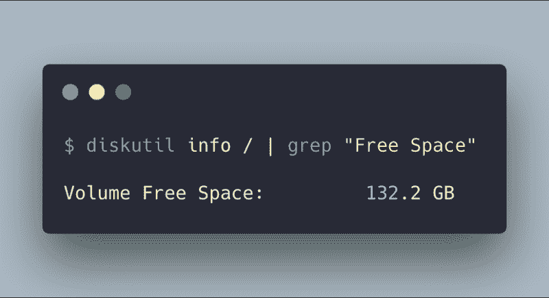
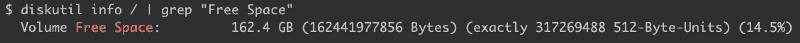

# 如何释放开发者 Mac 上的空间

> 原文：<https://www.freecodecamp.org/news/how-to-free-up-space-on-your-developer-mac-f542f66ddfb/>

#### 清理你的开发环境，你这肮脏的动物！

我爱清理软件？PLZ！删除重复，寻找旧的操作系统碎片等。但是它从来没有像我一样清理过开发机器。

当然，对于一般的维护来说，没有什么比 CleanMyMac 更好的了。但是一年一次，开发人员应该运行一些手动命令，因为自动清理器不知道如何维护开发人员的机器。

在我们开始之前，让我们先看看您有多少“可用空间”:



我的是清理前报 132.2 GB。是时候开始了！

### Mac 自制软件用户

这一个通常刮掉数百兆的数据。更新、升级，然后清理那些你不打算使用的文件。

**更新然后删除旧公式及其文件夹:**

```
brew update && brew upgrade && brew cleanup
```

过去您可能会使用`brew prune`,但现在已经不推荐使用了。清理为您处理这些！

#### 常规 Brew 维护

Brew 是一个复杂的系统，没有人比维护人员更了解它。所以你可以运行`brew doctor`并获得一些额外的杂务来让它正常运行。

### Git 用户

Git 很棒，但是在本地机器上留下一堆合并的分支并不难！这些分支不再有用，有时会给未来的分支造成命名冲突。

**你可以用这个命令从一个项目中删除所有合并的分支:**

```
git branch --merged master | grep -v "\* master" | xargs -n 1 git branch -d
```

哇，只有一个项目，多么拗口啊！让它变得更糟。？

**这段代码将 CD 放入当前工作目录下的所有文件夹中，然后运行命令来清理每个合并的分支！**

```
for d in */; do cd $d; echo WORKING ON $d; git branch --merged master | grep -v "\* master" | xargs -n 1 git branch -d; cd ..; done
```

### JavaScript 开发人员

#### 删除嵌入项目中的旧“节点模块”

以下命令查找所有超过 120 天的`node_modules`文件夹并删除它们。这确实意味着你将不得不在那些老项目中再次使用`npm i`或`yarn`。*这通常是一个巨大的清理工作！*

**删除所有超过 4 个月的`node_modules`文件夹:**

```
find . -name "node_modules" -type d -mtime +120 | xargs rm -rf
```

如果你觉得很激进，你可以清除所有的`node_modules`文件夹，并根据需要通过移除`mtime`标志来重新安装。

**删除所有`node_modules`文件夹:**

```
find . -name "node_modules" -type d | xargs rm -rf
```

#### 删除节点的旧版本

删除节点的旧版本。这取决于您的节点管理器。我用 n，所以对我来说很简单。请咨询您的特定版本管理器的卸载。

> **使用`n`？**

> 用`n ls`列出 node +您已安装的所有版本，然后在>上用`n rm <versi`删除任何版本。

> **使用`nvm`？**

> 用`nvm ls`列出你已安装的版本，然后在>上用`nvm uninstall <versi`删除任何版本。

> **使用`asdf`？**

> 用`asdf list nodejs`列出你已安装的版本，然后在>上用`asdf uninstall nodejs <versi`删除任何版本。

### Ruby 开发者

用`cleanup`命令清理 Gems 的旧版本。如果你担心，你可以先用“dryrun”看看结果。

```
gem cleanup --dryrun
```

然后，当你有信心时，你可以删除“dryrun”参数，并真正运行它。

```
gem cleanup
```

#### 删除旧版本的 Ruby

这具体取决于您的 Ruby 版本管理器。我们将推出两个流行版本来帮助您。

> **使用`rbenv`？**

> 用`rbenv versions`列出你已安装的版本，然后在>上用`rbenv uninstall <versi`删除任何版本。

> **使用`rvm`？**

> 用`rvm list`列出你已安装的版本，然后在>上用`rvm uninstall <versi`删除任何版本。

### Xcode 开发者

Xcode 喜欢在你的机器上到处缓存东西，有些东西有几百兆。是时候清理它们了，如果你需要再次重建它们，不用担心！

**清理 CocoaPod 缓存:**

```
rm -rf "${HOME}/Library/Caches/CocoaPods"
```

**删除旧的 Xcode 模拟器:**

```
xcrun simctl delete unavailable
```

**清理各种档案、日志、派生数据文件夹:**

```
rm -rf ~/Library/Developer/Xcode/Archives
rm -rf ~/Library/Developer/Xcode/DerivedData
rm -rf ~~/Library/Developer/Xcode/iOS Device Logs/
```

在`~/Library/Developer/Xcode/iOS Device Logs/`中查看您连接的设备信息，并删除您连接的旧 iOS 设备的任何内容。

### 码头工人

您可以删除至少一个容器未使用的所有卷。因为…你为什么想要那些？！

这可能很大，也可能什么都不会移除。值得一跑吧！？

**移除未使用的本地卷**

```
docker volume prune
```

### 结果？！

别忘了清空你的垃圾并检查我们做得如何！



> 30 场演出！拔掉了我的机器！你呢？

你的成功可能大不相同，但我很想知道。评论或[发推文给我](https://twitter.com/GantLaborde?lang=en)你的结果，以及你建议我们清理的任何其他开发者点！我很乐意把你的建议添加到文章中。

* * *

甘特·拉博德是[无限红](http://infinite.red)的首席技术策略师，出版作家，兼职教授，全球公共演说家，也是一名正在接受培训的疯狂科学家。鼓掌/追随/ [发推特](https://twitter.com/GantLaborde)或者在会议上拜访他[。](http://gantlaborde.com/)

[**关于远程工作的 5 件烂事**](https://shift.infinite.red/5-things-that-suck-about-remote-work-506b98dd38f9)
[*远程工作的陷阱+建议解决方案*shift . infinite . red](https://shift.infinite.red/5-things-that-suck-about-remote-work-506b98dd38f9)[**React Native vs . Native**](https://shift.infinite.red/react-native-vs-native-ccac6f05346a)
[*我该学 React Native 还是 Native？* shift.infinite.red](https://shift.infinite.red/react-native-vs-native-ccac6f05346a)