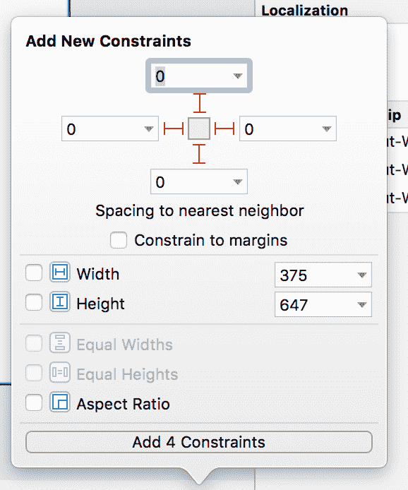
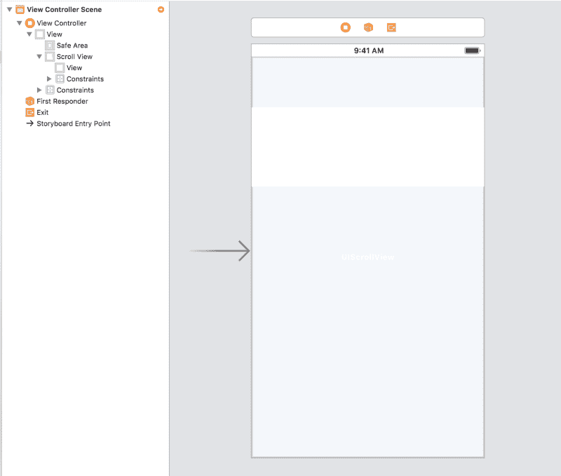
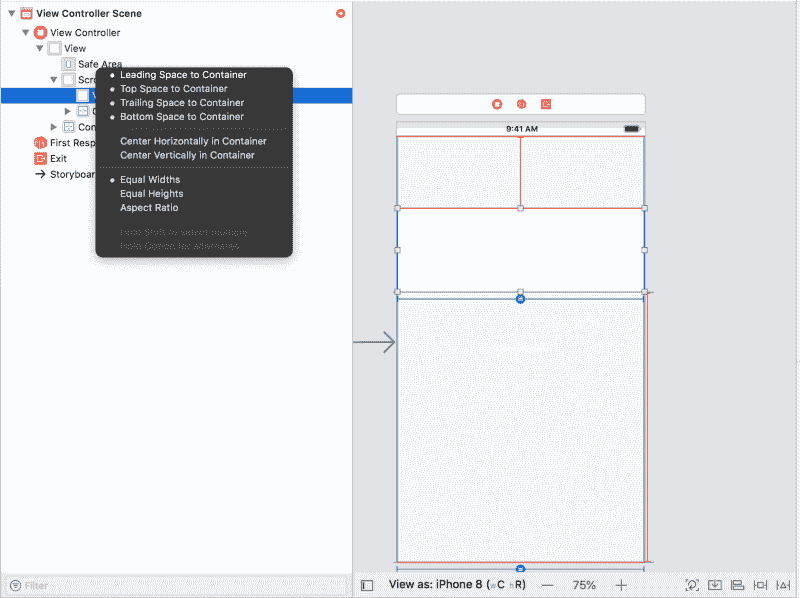
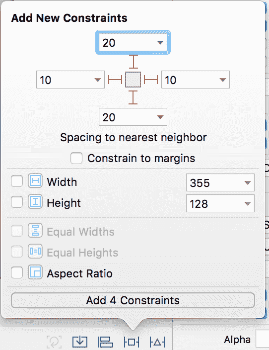
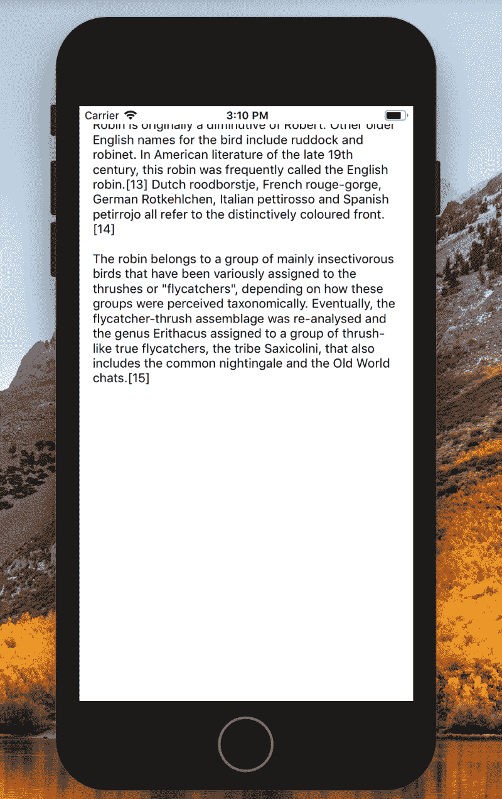

# 如何在 iOS 版 UIScrollView 中使用自动布局

> 原文：<https://www.freecodecamp.org/news/how-to-use-auto-layout-with-uiscrollview-for-ios-b94b8687a4cc/>

山姆·奥拉森

# 如何在 iOS 版 UIScrollView 中使用自动布局

Layout of Apple products — Photo by [Fischer Twins](https://unsplash.com/photos/9_5z24t0DFA?utm_source=unsplash&utm_medium=referral&utm_content=creditCopyText) on [Unsplash](https://unsplash.com/search/photos/apples?utm_source=unsplash&utm_medium=referral&utm_content=creditCopyText)

我喜欢用软件构建工具，这也是为什么我现在是绿色 13 解决方案的首席开发者。

最近，我一直在用 Swift 和 Xcode 中的界面生成器创建 iOS 应用程序，玩得很开心。

当我试图创建一个用户可以通过**滚动**来查看当前**内容视图**中溢出的内容的**场景**时，我遇到了一些挑战。内容不能正常滚动，文本不能根据不同的屏幕尺寸自动显示。

下面是一些笔记，供未来的自己参考。我希望你也能发现它们有用！

如果你想看完整的例子，这里有一个项目的[库](https://github.com/SamOllason/autolayout-scrollview-example)。

### 我们将建造什么

我们的应用程序将有一个单一的页面。该页面将包含一些文本，用户可以向下滚动来查看从当前内容视图溢出的文本。

我们将使用 Xcode 中的界面构建器添加一个 UIScrollView 对象，一个嵌套的 UIView 对象，然后再添加一个嵌套的 UITextView 对象。我们将使用界面构建器向这些元素添加约束。这些约束将意味着自动布局可以使滚动正确发生，并且文本视图将自动在不同的屏幕尺寸上正确出现。

### 一点背景信息(双关语)

UIScrollView 对象可用作其他 UIKit 项(如 UIView 和 UITextView)的父对象。

这样做意味着所有的子对象可以**相对于显示给用户的**内容视图**一起移动它们的原点**。这意味着“滚动”行为如用户所愿。另一个好处是，自动布局将正确地调整不同屏幕上的元素大小。

我们在下面交替使用术语“UIScrollView”和“ScrollView ”,视图和文本视图也是如此。

下面是要遵循的步骤。

### 添加视图

创建新项目并选择“单视图应用程序”。如果你点击 Main.storyboard，你会看到我们有一个空白视图元素的场景。

### 添加滚动视图

将滚动视图 UI 元素从对象库拖动到场景中。然后添加下图所示的约束，将滚动视图元素锚定到其父安全区域的边缘。

### 添加视图元素

使用对象库将视图元素拖动到场景中。该视图将是我们的文本视图元素的父容器。

用光标手动调整视图元素的大小，使其填满屏幕宽度。

Manually resized View element to fit into width

### 锚视图到滚动视图

单击对象层次结构中的视图元素，并将光标拖到层次结构中它上面的滚动视图元素上。单击 4 个最上面的选项来应用这些约束。点击“等宽”也可应用该约束。

**为什么？**以这种方式约束视图意味着我们添加的子文本视图元素可以与自动布局一起正常工作。发生这种情况是因为我们将文本视图约束在视图的底部(我们将它正确地锚定在滚动视图的底部！)而不是直接滚动到视图的底部。

您将会看到界面构建器中的布局指南是红色的，因为还有其他一些错误。我们将很快解决这个问题。

Add these constraints to the View element

### 将文本视图作为子视图添加到视图

在场景中的视图元素内添加文本视图元素。

### 向文本视图添加约束

将下图中的约束添加到文本视图中。

**为什么？**这将相对于文本视图周围的视图对象约束文本视图。

Adding constraints to Text View

### 在文本视图中禁用滚动行为

您应该有一个类似于下图的屏幕。你可以看到界面生成器中仍然有很多红色。

您可以通过选择文本视图元素并在右侧的编辑器窗格中**取消选择“启用滚动”来删除这些警告。**

Deselect ‘Scrolling Enabled’ on the right to remove these red errors

注意，这种方法仍然会有滚动行为，但是实际移动的是父滚动视图，而不是单个文本视图元素。这就像一片树叶只在河上移动一样，因为环绕它的河流在移动！

这有点微妙，但理解起来非常重要，因为它是整个解决方案的基础。

Our approach means a Text View only scrolls because a Scroll View moves it — same as how a leaf only moves because the surrounding river moves it

### 最后

向文本视图添加更多内容。您应该看到滚动工作正常，并且文本视图在不同的屏幕尺寸上都能正常显示。

这就是汽车布局的妙处！

Screenshot of scrolled Text View using Xcode Simulator

如果你想看完整的例子，这里有一个项目的[库](https://github.com/SamOllason/autolayout-scrollview-example)。

文本视图内容中关于知更鸟的所有信息都直接来自[维基百科](https://en.wikipedia.org/wiki/European_robin)。为此感谢社区。

为什么是知更鸟？因为我爱鸟，知更鸟是特别牛逼的生物！

感谢阅读，我希望你发现这是有用的。如果你对问题有任何意见，请告诉我！