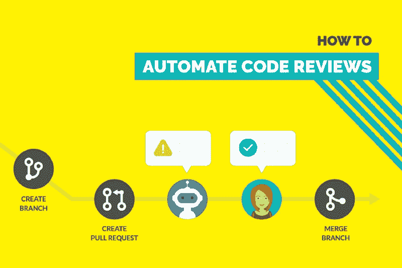
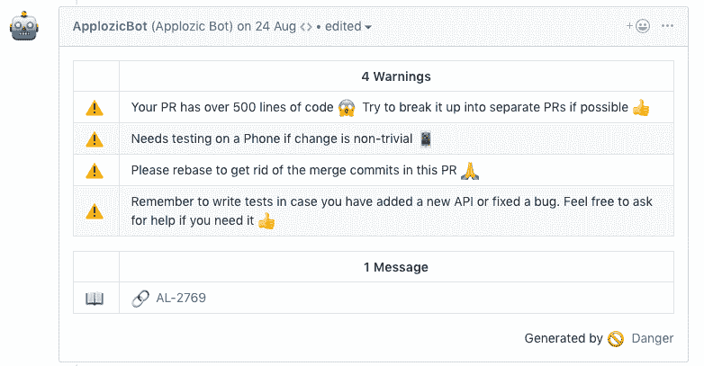
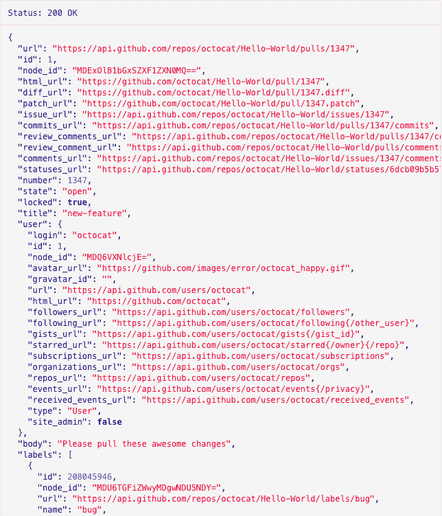
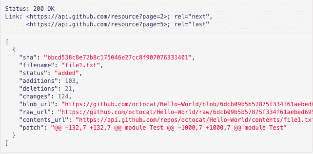
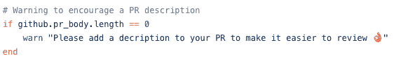
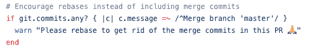

# 如何在 Github 上自动化代码审查

> 原文：<https://www.freecodecamp.org/news/how-to-automate-code-reviews-on-github-41be46250712/>

穆克什·塔瓦尼

# 如何在 Github 上自动化代码审查

创建拉请求和检查它们是开发人员日常日程中最常见的两项任务。大多数项目都有开发人员在创建和审查拉请求时需要遵循的通用准则。

现在，开发人员很难在发出拉请求时记住每一条准则。对于评审人员来说，确保每一行代码都符合既定的指导方针就更加困难了。

我们在项目中面临同样的问题，并通过自动化手工机械工作的主要部分解决了这个问题。这使得我们的开发人员和评审人员的生活变得更加容易。他们把更多的时间花在提高代码质量上，而把更少的时间花在日常琐事上。

在这篇文章中，我将详细描述我们是如何做到的，我们自动化了流程的所有方面，以及我们为此使用的工具。

200 million plus pull requests created on Github. Source: Octoverse

### 自动化样式问题

我们不希望我们的审阅者在提交请求时要求贡献者添加相应的吉拉问题编号和描述。相反，我们部署了一个执行所有常规检查的机器人。这有助于贡献者遵循项目指南。

是的，bot 可以通过检查 pull 请求的主体来验证描述是否存在。如果缺少描述，它可以对拉请求进行注释。

Applozic Bot commenting on pull requests.

我们还可以添加一个[拉请求模板](https://help.github.com/articles/creating-a-pull-request-template-for-your-repository/)来获取一些与拉请求相关的信息。但是这种方法增加了创建拉请求所需的摩擦。当我们添加规则时，我们需要确保新开发人员的体验尽可能的顺畅。同时，我们需要保持代码质量。

现在让我们看看创建这样一个机器人所需的步骤。

### “危险”需要救援

> [*危险*](http://danger.systems/) *在你的 CI 过程中运行，并给团队机会自动化常见的代码评审杂务。这为您的构建提供了另一个合乎逻辑的步骤，通过这个危险可以帮助 lint 您在日常代码审查中的机械任务。*

> 你可以用危险来制定你团队的规范。让人类去思考更难的问题。她通过根据您用 Ruby 脚本语言创建的规则将消息留在您的 PRs 中来做到这一点。随着时间的推移，随着规则的遵守，消息被修改以反映代码评审的当前状态。

> Danger 用于各种项目:ruby gems、python 应用、Xcode 项目、博客、npm 网站和模块。

它将在 Github 的 API 之上为您提供一个抽象，以获取与 pull 请求相关的细节并执行必要的检查。它由 Orta 和许多其他优秀的贡献者创建和维护。安装后，您需要创建一个名为 Dangerfile 的文件，其中包含所有的规则。该文件应该位于项目的根目录下。

添加这个文件后，您就可以设置规则了。现在，每当有人创建拉取请求时，您都需要运行 Danger。

### 将其添加到您的 CI 工作流中

我们在移动 SDK 项目中使用 Bitrise。这是一项持续集成和持续交付移动应用的服务。如果您正在使用不同的 CI 服务，您可以查看此[指南](https://danger.systems/guides/getting_started.html#continuous-integration)，了解如何将 Danger 与该服务集成。有一篇详细的[博文](https://blog.bitrise.io/danger-danger-uh-that-is-using-danger-with-bitrise)介绍了如何将 Danger 与 Bitrise 结合起来。我将总结为五点:

*   安装 bundler，创建一个 gem 文件，并将危险宝石添加到 gem 文件中。
*   为您的项目创建一个危险文件。
*   在 Github 上创建一个 bot 用户，并为 bot 创建一个个人访问令牌。
*   然后在 Bitrise 上添加生成的令牌。
*   在项目工作流中添加脚本步骤。就是这样！？

### 我们可以自动化的规则

确定哪些规则可以自动化的方法之一是查看 Github 的 pull request API 响应。通过将 API 响应与我们的拉式请求清单或指南进行比较，我们可以了解其中的可能性。响应看起来是这样的:

Response from Github’s pull request API

*   它返回你在 GitHub 的 pull request 网页上看到的几乎所有信息，如标题、描述、受让人、审核者、标签等。
*   还有一个 API 可以获取已更改文件的列表。对于每个文件，它将返回文件名、添加到文件的数量、删除到文件的数量。
*   我们不必使用这个 API，因为我们将使用 Danger，它为我们提供了一个与这些数据交互的简单方法。

Response from Github’s list pull requests files API

### 我们自动化的规则列表

当我们向我们的库添加 Danger 时，我们查看了我们的需求和其他一些使用 Danger 的项目。下面是我们在项目中的一些检查。

*   如果这是一个大的公关活动，就发出警告:我们往往会犯这样的错误，在一个公关活动中推动许多变化。审查这种减贫战略是一项艰巨的任务。我们添加了一个警告，当 PR 中更新的行数超过 500 时就会显示。
*   **鼓励拉取请求描述**:有时开发者认为描述是不必要的，或者我们忘记添加。即使您提到了问题编号，简短的描述总是有帮助的，并给出了拉取请求的上下文。要查看描述是否为空，我们可以检查主体长度:

*   检查测试是否遗漏了:我们都知道测试很重要，但我们往往会跳过这一步。每当我们修改源代码时，如果可能的话，我们应该添加测试。因此，如果源代码中有任何更改，并且 tests 文件夹没有被修改，它就会发出警告，这意味着新的测试丢失了。
*   **更新变更日志**:增加了一个新功能或者修复了一个 bug——用细节更新变更日志。如果更改不重要，我们强制添加一个 Changelog 条目。如果 Changelog 没有更新，并且 pull 请求没有被标记为无关紧要，那么我们的 CI 构建失败。现在，我们不必跟踪变更日志是否被更新。
*   **鼓励不合并提交**:随着项目的增长，我们总是建议应该避免“合并”提交，以便项目有一个干净的历史。我们更喜欢使用 rebase，而不是合并不同的分支。我们可以为这种格式的消息添加一个检查:“Merge branch‘master’”来避免合并提交。

### 接下来去哪里

作为参考，你可以查看一下 [ApplozicSwift 的 Dangerfile](https://github.com/AppLozic/ApplozicSwift/blob/master/Dangerfile) 或者其他一些流行的开源项目，比如 [React Native](https://github.com/facebook/react-native/blob/master/bots/dangerfile.js) 或者 [CocoaPods](https://github.com/CocoaPods/CocoaPods/blob/master/Dangerfile) 。在写这篇博文的时候，我发现像 React Native 和 React 这样的项目也在使用 danger。这向我们展示了自动化这些检查的过程是如何成为通用拉式请求工作流的一部分的。

喜欢这个故事吗？点击拍手按钮，跟着我上[中型](https://medium.com/@MukeshThawani)。感谢阅读！这篇文章最初发表在[通信博客](https://www.kommunicate.io/blog/automate-code-reviews-on-github-using-a-chatbot/)上。