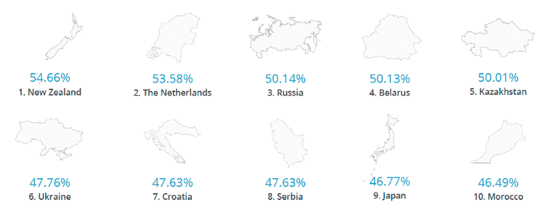
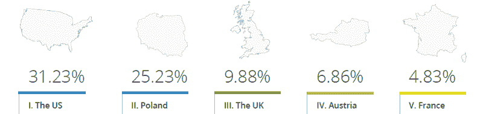
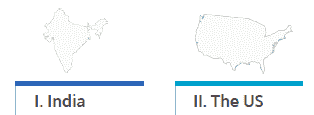
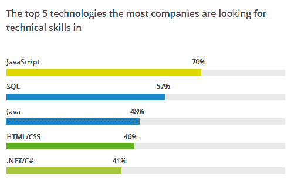
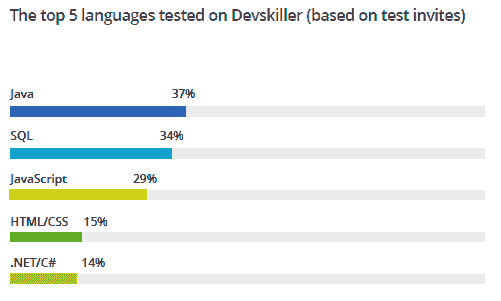
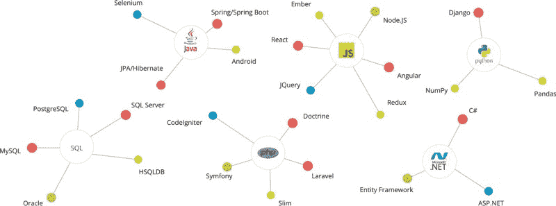

# 通过分析 112，654 次编码测试，我们了解到了 2019 年开发人员招聘趋势

> 原文：<https://www.freecodecamp.org/news/what-we-learned-about-2019-developer-hiring-trends-from-analyzing-112-654-coding-tests-b05a3ba0ca7b/>

汤姆·温特

# 通过分析 112，654 次编码测试，我们了解到了 2019 年开发人员招聘趋势

在招聘开发人员时，信息是关键——无论你是招聘人员还是开发人员。

如果你知道行业的趋势，什么样的技能是受欢迎的，开发人员是从哪里招聘的，那么找到合适的开发人员和合适的公司就变得容易多了。

我们一直致力于提高科技招聘的知识水平。开发人员招聘数据是其中的一个关键部分，但我们遇到了一个问题。

有很多关于开发人员招聘趋势的信息。但是有多少是真正有用的呢？

毕竟，调查需要自我报告。但是雇佣开发人员或获得这份工作的重要性需要一个更具体的数据源。我们当然是这样认为的，这让我们去看看我们已经掌握的数据。

在 Devskiller，我们一直坐在越来越多的编码测试上(仅去年就有 112，654 个)。这是一个特殊的原因。行动胜于言语。我们的编码测试数据反映了公司积极招聘的技能，以及他们招聘的地点。

这些不是技术预言家的印象，而是来自世界各地的技术招聘人员的公开意图。

有了这个数据集，我们开始挖掘，发现了一些惊人的见解。

### 来自新西兰的开发人员在编码测试中得分最高(54.66%)

如果说我对开发者有什么了解的话，那就是他们之间有一种健康的竞争意识。

他们总是在寻找方法与他们的同龄人比较他们的技能。这些竞赛可以呈现出国际性的特征，并反映出开发人员如何看待他们的教育程度和技术熟练程度。

我们测试了来自 120 多个国家的候选人，所以想看看来自不同国家的开发人员如何相互竞争。

Source: [*Devskiller Global Technical Hiring & Skills Report 2019*](https://devskiller.com/technical-hiring-skills-report-2019/?utm_source=Medium&utm_medium=referral&utm_campaign=Free%20Code%20camp&utm_term=Thomas&utm_content=2019%20Developer%20skill%20and%20geographical%20hiring%20trends%20based%20on%20an%20analysis%20of%20112%2C654%20coding%C2%A0tests)

结果是，新西兰以 54.66%的平均分位居榜首，紧随其后的是荷兰。

那么这是为什么呢？

是因为教育风格，还是某些国家的开发人员比其他国家的开发人员更容易通过测试？新西兰已经做了很多来吸引最好的外国人才，所以这些新来者可能会影响国家分数。

那么问题就变成了，在编码测试中得分最高的国家的开发人员也是国际上所追求的吗？

### 美国是海外开发商的最大招聘国，但也是海外候选人的第二大来源

这项研究中超过 30%的海外候选人接受了美国公司的测试。尽管美国公司测试的开发者中只有 40%来自海外。

考虑到中国科技行业的规模，这样的销量或许不足为奇。美国也以科技人才的高工资而闻名，可以吸引世界各地的顶尖人才。

Source: [*Devskiller Global Technical Hiring & Skills Report 2019*](https://devskiller.com/technical-hiring-skills-report-2019/?utm_source=Medium&utm_medium=referral&utm_campaign=Free%20Code%20camp&utm_term=Thomas&utm_content=2019%20Developer%20skill%20and%20geographical%20hiring%20trends%20based%20on%20an%20analysis%20of%20112%2C654%20coding%C2%A0tests)

可能更极端的是当你看那些产生最多候选人的国家时。印度排在第一位，超过四分之一的候选人在这个平台上接受了测试。

有趣的是，美国排在第二位。这使美国处于一个迷人的位置，既是最大的招聘国之一，也是候选国家。

Source: [*Devskiller Global Technical Hiring & Skills Report 2019*](https://devskiller.com/technical-hiring-skills-report-2019/?utm_source=Medium&utm_medium=referral&utm_campaign=Free%20Code%20camp&utm_term=Thomas&utm_content=2019%20Developer%20skill%20and%20geographical%20hiring%20trends%20based%20on%20an%20analysis%20of%20112%2C654%20coding%C2%A0tests)

美国的立场表明，有一个强大的趋势是国际化的开发商候选人劳动力池。也许这会带来更高的效率，因为公司能够吸引拥有合适技能的开发人员，无论他们来自哪里。

与此同时，美国开发人员同样乐于为海外公司工作，因为那里需要他们的技能。

为了找出这些技能是什么，我们看了一下世界各地的公司正在寻求的技术。

### 70%的公司在寻找 JavaScript 开发人员

关于下一项重大技术将会是什么，往往会有很多讨论。随着所有关于 Kotlin 是否正在崛起，或者 Golang 是否将占据主导地位的喋喋不休，人们很容易忘记这些技术仍然不太成熟。

在大多数企业中，像 JavaScript 这样的成熟技术仍然非常受欢迎。事实上，我们发现 70%的公司都在寻找 JavaScript 开发人员。

Source: [*Devskiller Global Technical Hiring & Skills Report 2019*](https://devskiller.com/technical-hiring-skills-report-2019/?utm_source=Medium&utm_medium=referral&utm_campaign=Free%20Code%20camp&utm_term=Thomas&utm_content=2019%20Developer%20skill%20and%20geographical%20hiring%20trends%20based%20on%20an%20analysis%20of%20112%2C654%20coding%C2%A0tests)

相比之下，Java 是这项研究中测试最全面的语言。

Source: [*Devskiller Global Technical Hiring & Skills Report 2019*](https://devskiller.com/technical-hiring-skills-report-2019/?utm_source=Medium&utm_medium=referral&utm_campaign=Free%20Code%20camp&utm_term=Thomas&utm_content=2019%20Developer%20skill%20and%20geographical%20hiring%20trends%20based%20on%20an%20analysis%20of%20112%2C654%20coding%C2%A0tests) *(*edited)

数据显示，JavaScript 对于小型企业和大型企业都很有用。另一方面，Java 对少数公司的大型团队更有用。

你会发现变化不在技术栈之间，而是在它们内部。

因此，尽管 70%的公司都在寻找 JavaScript 开发人员，但 React、Vue、Angular 或 Node.js 等特定框架或库是创新发生的地方。事实上，正是这些栈内技能在考验着开发者。

### 希望测试的是技术堆栈中的知识，而不是语言本身

JavaScript 并不是测试候选人对特定技术和资源的知识的唯一技术栈。

取而代之的是，所有语言的测试都变得更加精细，具有栈特定的知识。例如，如果你是一名 Java 开发人员，预计将在 Spring 或 Android 中接受测试。

JavaScript 开发人员本身可以在任意数量的框架中进行测试，包括 React、Angular、jQuery、Node.js 或 Ember。

数据库开发人员可能需要了解 MySQL、PostgreSQL 或 HSQLDB。

PHP 开发者可能需要了解 Laravel 或者 Symphony。

Python 开发人员(取决于职位的要求)在 Django 可能和在 Pandas 或 Numpy 一样容易通过测试。

Source: [*Devskiller Global Technical Hiring & Skills Report 2019*](https://devskiller.com/technical-hiring-skills-report-2019/?utm_source=Medium&utm_medium=referral&utm_campaign=Free%20Code%20camp&utm_term=Thomas&utm_content=2019%20Developer%20skill%20and%20geographical%20hiring%20trends%20based%20on%20an%20analysis%20of%20112%2C654%20coding%C2%A0tests)

重点是光有广博的语言知识是不够的。熟悉特定的技术组合是有价值的，这也是越来越多的公司所寻求的。

由此，我们得出结论，除了一般的语言技能之外，您还应该熟悉相关的库和框架。

### 后端技能和数据库技能经常一起测试

当然，对某些职位来说，了解一个单一的技术组合可能没问题。但是越来越多的互补技术栈被一起测试。所以问题变成了，什么样的技术栈是免费的？

绝大多数情况下，我们发现后端技术是用 SQL 测试的。

在一起测试的八大技术中，超过 26%是 Java 和 SQL 的组合。除此之外。NET 和 SQL 的测试在 9%以上。

JavaScript 和 Node.js 现在是后端技术，15%以上的时间是和 SQL 一起测试的。最后，PHP 与 SQL 一起测试的时间也超过了 7%。

Source: [*Devskiller Global Technical Hiring & Skills Report 2019*](https://devskiller.com/technical-hiring-skills-report-2019/?utm_source=Medium&utm_medium=referral&utm_campaign=Free%20Code%20camp&utm_term=Thomas&utm_content=2019%20Developer%20skill%20and%20geographical%20hiring%20trends%20based%20on%20an%20analysis%20of%20112%2C654%20coding%C2%A0tests)

当你在前端使用 JavaScript 时，你会发现它在 18%的时间里与 CSS 结合在一起。在其他地方，你可以看到全栈测试被放在一起。NET 和 JavaScript 在 8%的时间里结合在一起，PHP 和 JavaScript 在 7%的时间里结合在一起，Java 在 6%的时间里结合在一起。

我们从中可以得到的是，如果你是后端开发人员，数据库技能是非常重要的。同样，如果你是一个全栈开发人员，无论你使用哪种后端栈，前端工作的首选语言都是 JavaScript。

### 73%的开发人员会参加基于真实工作的编码测试

在这份报告中，有很多关于编码测试的讨论。毕竟这些都是数据所依据的。但在某些圈子里，它们可能会引起争议。

常见的批评包括它们花费的时间太长，它们与正在完成的工作无关，以及开发人员不能真正展示他们的技能。当然，这些抗议导致一些开发人员宣称他们会简单地忽略任何需要编码测试的工作。

有趣的是，我们在研究中发现，作为技术招聘过程的一部分，73%的开发人员接受了 Devskiller 编码测试。这只是向招聘开发人员的人表明，通过正确的测试，你可以让大多数候选人参加考试。结果是你获得了关于他们技能的重要信息。

### 新加坡的公司是最挑剔的

现在，如果你参加编码测试，来自不同国家的开发人员往往会得到不同的分数。同样，并不是所有的雇主都对他们认可的候选人如此挑剔。这是为什么呢？

想到的是简单的供求关系。你可能会有很多人去竞争某些地方的几个职位。同样，公司可能会对候选人的要求设定更高的标准。

新加坡是技术招聘人员最挑剔的国家，这可能就不足为奇了。新加坡是一个非常发达的国家，教育水平非常高。经合组织将他们的所有科目列为世界第一。

最重要的是，他们比任何邻国都有更高的经济成就，因此能够吸引来自东南亚的候选人。

### 这些见解对 2019 年意味着什么

虽然这些数据是在去年收集的，但它表明了 2019 年的一些有趣趋势。

*   像新西兰这样的国家可能是高质量开发人员的新来源
*   印度是开发商的巨大来源，但美国也是如此
*   像 JavaScript 这样的传统技术仍然很受欢迎
*   熟悉一系列技术，而不仅仅是一门语言
*   开发人员应该在互补的技术栈中开发技能，就像后端开发人员的数据库栈一样
*   考生将参加基于真实工作的编码测试
*   新加坡的公司非常挑剔

这些并不是你在报告中发现的唯一见解。查看 [*Devskiller 全球技术招聘&技能报告 2019*](https://devskiller.com/technical-hiring-skills-report-2019/?utm_source=Medium&utm_medium=referral&utm_campaign=Free%20Code%20camp&utm_term=Thomas&utm_content=2019%20Developer%20skill%20and%20geographical%20hiring%20trends%20based%20on%20an%20analysis%20of%20112%2C654%20coding%C2%A0tests) 以获得这些见解和其他见解的完整图片。