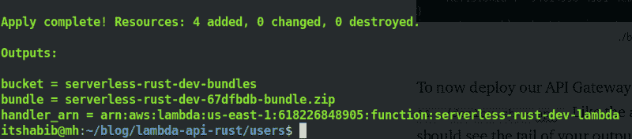
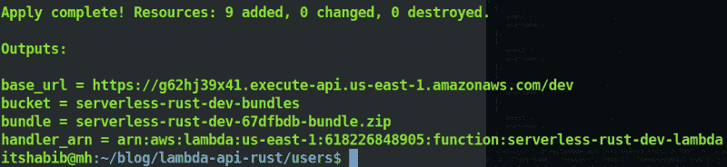
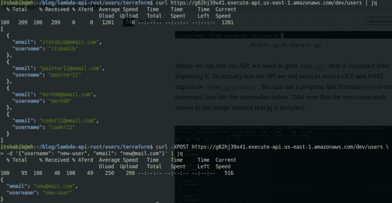

# 如何使用 Rust 和 API 网关实现无服务器

> 原文：<https://www.freecodecamp.org/news/going-serverless-with-rust-and-api-gateway-aa5d1502c32e/>

迈克尔·哈比卜

# 如何使用 Rust 和 API 网关实现无服务器

在今年的 AWS re:Invent 之前，没有支持用 Rust 编写 AWS Lambda 函数的方法。我经常碰到使用 Go 运行时作为底层 Rust 代码的包装器。在 re:Invent 上，AWS 宣布它的 lambda 函数现在可以支持任何语言。用户将能够通过使用新的运行时 API 来利用这一点。除了这个声明，AWS 还开源了一个 [Rust 运行时](https://github.com/awslabs/aws-lambda-rust-runtime)，并在这里发布了一个快速操作方法。

这篇文章的目标是提供足够的信息来使用 API Gateway 和 Rust。我们将创建一个简单的 AWS Lambda 函数，它将服务于单个 API 网关资源。一个使用 DynamoDB 的中间例子将于 3 月份在 YouTube 上发布。如果你有兴趣在发布时得到通知，请在推特上关注我。虽然仍在进行中，但视频中使用的代码在回购的`intermediate`分支上。

#### 要求

1.  [码头工人](https://docs.docker.com/install/)
2.  饭桶
3.  [AWS 账户](https://aws.amazon.com/console/)
4.  [AWS CLI(可选)](https://docs.aws.amazon.com/cli/latest/userguide/cli-chap-install.html)
5.  [生锈(可选)](https://www.rust-lang.org/tools/install)
6.  [地形(可选)](https://www.terraform.io/)

**在这里克隆和分叉[的回购。AWS 设置说明可以在](https://github.com/itsHabib/api-gateway-rust)这里找到[。](https://github.com/itsHabib/api-gateway-rust/blob/master/AWS_SETUP.md)**

### 处理请求

要开始，运行`git checkout scratch` 并编辑用户文件夹中的`Cargo.toml` 。

文件底部的`[[bin]]`部分告诉 cargo 生成一个具有该名称的可执行文件。这是必需的，因为 AWS Lambda 部署包需要一个引导文件。现在让我们将注意力转移到处理传入 API 网关请求的实际代码上。编辑`users/src/main.rs` ,使其与下面的文件匹配。

我们首先声明一个将用于响应的用户结构。然后，我们定义一个与请求方法匹配的路由器。负责创建响应的三个函数是`not_allowed`、`add_user`和`get_users`。每个函数构建一个响应，处理一个潜在的错误，并最终发送回响应。

`lambda_http`箱方便地让我们将服务器 JSON 值转换成带有`into_response()` 的响应。这是在`add_user`和`get_users`中完成的，当我们从一个用户到一个 JSON 值，最后到一个响应。

请记住，没有一个 POST 请求会将任何用户添加到任何数据库中。所有的`add_user` 方法在这里做的就是反序列化主体并将其发送回去。

### 运营—构建和部署

为 lambda 捆绑代码和依赖项有时会很棘手。在撰写本文时， [SAM](https://aws.amazon.com/serverless/sam/) 还没有用于捆绑货物项目的构建命令。代替 SAM，我们将使用 Docker 和 Terraform 来创建这些部署包等等。添加一个`Dockerfile`到用户文件夹，内容如下。

lambci 构建映像被用作基础映像，因为它们提供了一个非常无缝的构建过程。上面的文档可以分为五个主要部分:

1.  安装 Rust 的夜间版本
2.  添加项目文件
3.  编译项目
4.  压缩可执行文件
5.  创建地形平面图

我们还需要一个 docker 文件，专门用于部署我们的 API 网关资源。用以下内容创建一个名为`Dockerfile.api` 的文件。

现在让我们创建一个构建脚本，它将驱动创建和应用我们的 Terraform 计划的过程。一个地形计划只是一个关于它想要创造的资源的提议。将以下内容添加到 a `build.sh`和`deploy.sh`中。

构建和部署脚本利用 Docker 和 Terraform 来创建或更新我们的 AWS 资源。简而言之，在运行`build.sh`时创建提供资源的 Terraform 计划，然后在运行`deploy.sh`时应用该计划。Terraform 不在本文讨论范围之内，但是你可以在`users/terraform`查看所有代码。为了构建和部署我们的 lambda 资源，运行`./build.sh && ./deploy.sh`。

如果一切顺利，您应该会看到输出的尾部，如下所示。请记住，docker 文件假设 AWS_*凭证被设置为环境变量。

./build.sh && ./deploy.sh

现在，要部署我们的 API 网关资源，像上面的命令一样运行`./build.sh --api && ./deploy.sh --api.`,如果一切顺利，您应该会看到输出的尾部，如下所示。

`./build.sh --api && ./deploy.sh --api`

确保记下展开后显示的`base_url` 。为了测试 API，我们需要向`<base_url>` /users 发送一个 GET 和 POST 请求。可以用 Postman 这样的程序，也可以用下面截图这样的命令行。图中显示的两个命令假设安装了 jq。

销毁此帖子中创建的所有资源运行`./destroy.sh && ./destroy.sh --state`。

我希望这篇文章对你使用 API Gateway 和 Rust 有所帮助。请随意评论、提问或建议我接下来可以写的主题。

***附言关注我[推特](https://twitter.com/_itsHabib)***