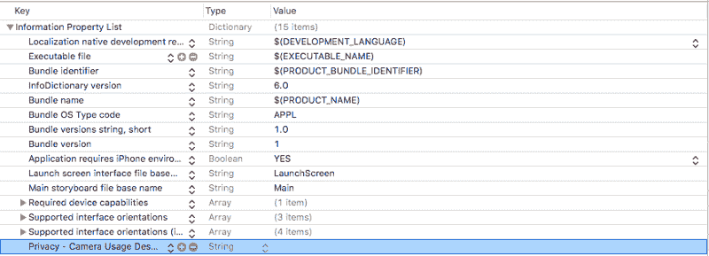
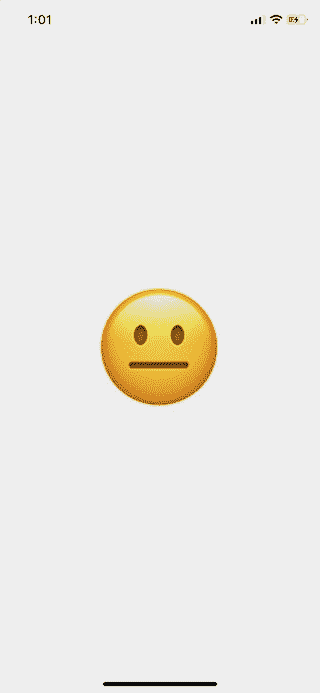
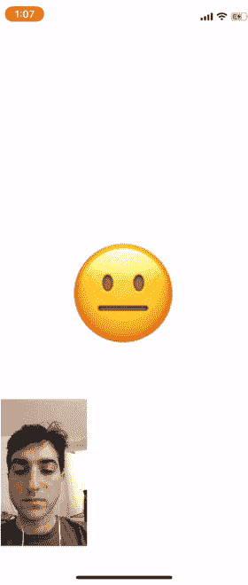

# 如何建立一个超级快速的微笑追踪应用程序

> 原文：<https://www.freecodecamp.org/news/how-to-build-a-super-quick-smile-tracking-app-16eee960888d/>

ARKit 可能看起来令人生畏，但如果你已经有了一些构建 iOS 应用程序的基本经验，它也不是那么糟糕。

我是一个边做边学的人，所以我一直在玩 ARKit，构建基本的应用程序来熟悉它。在这篇文章中，我将回顾我在创建一个简单的面部跟踪应用程序中学到的东西。

我将分三部分来做:

1.  **初始设置→** 首先，获取相机权限，确保设备可以使用 ARKit。
2.  **微笑追踪→** 用 ARKit 开始追踪微笑。这可能就是你来这里的原因。
3.  **用户界面→** 为我们的应用程序添加对微笑做出反应的用户界面。

在撰写本文时，Xcode 模拟器不支持前置摄像头**，所以你需要一个真实的设备来运行这个应用程序。你的设备还需要有原深感摄像头(iPhone X 或更新的应该可以)。**

最后，对于复制粘贴俱乐部的成员们，[所有的代码都可以在 Github](https://github.com/JakeShelley1/SmileTracker) 上找到。

#### **初始设置**

首先打开 Xcode 并创建一个名为“SmileTracker”的新项目(或者您喜欢的任何名称)。

在我们开始面部跟踪之前，我们需要做两件事:

1.  确保您的设备支持 ARKit
2.  获取访问设备摄像头的权限

在您的新项目中，打开`ViewController.swift`。在文件顶部附近的`import UIKit`下面，添加一行:`import ARKit`。这将让我们访问苹果公司提供给我们的所有好东西，使面部跟踪变得超级容易。

现在在`viewDidLoad`中添加以下代码:

```
guard ARFaceTrackingConfiguration.isSupported else {
    fatalError("Device does not support face tracking")
}
```

`ARFaceTrackingConfiguration.isSupported`是一个布尔值，如果运行该应用程序的设备支持面部跟踪，则该值为真；如果不支持，则该值为假。在这种情况下，如果设备不支持面部跟踪，我们将因致命错误而使应用程序崩溃。

接下来，让我们获得使用相机的许可。在我们的`guard`声明下面的`viewDidLoad`中添加以下内容:

```
AVCaptureDevice.requestAccess(for: AVMediaType.video) { granted in
   if (granted) {
      Dispatch.main.sync {
          // We're going to implement this function in a minute
          self.setupSmileTracker()      
      }
   } else {      
      fatalError("User did not grant camera permission!")   
   }
}
```

这里我们要求设备请求相机许可。如果用户授予权限，我们将运行设置微笑跟踪的函数(不要担心错误，我们将马上实现这个函数)。

我们将该函数包装在`Dispatch.main.sync`中，因为我们将在该函数中添加 UI 元素，这只能在主线程上完成。

我们还需要给我们的`Info.plist`添加一个相机使用描述。打开`Info.plist`并添加一个新行(可以通过高亮显示最后一行并点击`enter`来完成)。

在刚刚创建的行中，将`Privacy — Camera Usage Description`添加到`Key`列，并确保`Type`列设置为 string。您可以将`Value`栏留空或添加一条消息，向用户解释您将如何使用相机。

您的`Info.plist`现在应该看起来像这样:



如果你想测试你的应用程序，你可以注释掉我们调用`setupSmileTracker()`的那一行。只是记得稍后取消注释。

如果您现在运行应用程序，您应该会看到一个弹出窗口，要求您启用相机权限。**如果你拒绝，你必须转到应用程序设置来启用这些权限，以便应用程序运行。**

如果应用程序崩溃，检查控制台的两个错误信息之一，看看哪里出错了。

#### 微笑追踪

打开`ViewController.swift`并将以下变量添加到`ViewController`的顶部:

```
class ViewController: UIViewController {   
   let sceneView = ARSCNView()

   override func viewDidLoad() {...}
}
```

`ARSCNView`配备了一个`ARSession`，你的 iPhone 可以用它来协调 AR 体验。我们将使用`sceneView`的`ARSession`通过前置摄像头分析用户的面部。

将此函数添加到您的文件中的`viewDidLoad`下:

```
func setupSmileTracker() {   
   let configuration = ARFaceTrackingConfiguration()   
   sceneView.session.run(configuration)   
   sceneView.delegate = self   
   view.addSubview(sceneView)
}
```

这里我们创建了一个配置来处理面部跟踪，并使用它来运行我们的`sceneView`的`ARSession`。

然后我们将`sceneView`的代理设置为 self，并将其添加到我们的视图中。

Xcode 会告诉你因为`ViewController`不符合`ARSCNViewDelegate`所以有问题。转到文件顶部附近声明`ViewController`的地方，将该行改为:

```
class ViewController: ViewController, ARSCNViewDelegate {   
   ...
}
```

现在在你的`ViewController`类`setupSmileTracker`中添加这个`ARSCNViewDelegate`函数:

```
func renderer(_renderer: SCNSceneRenderer, didUpdate node: SCNNode, for anchor: ARAnchor) {
   ...
}
```

`renderer`会在每次我们的场景更新时运行，为我们提供与用户脸部对应的`ARAnchor`。

为了更容易地创建面部跟踪体验， **Apple 会自动创建一个** `ARFaceAnchor` **，并在我们使用** `ARFacetrackingConfiguration` **运行它时将其添加到我们的会话中。这个 ARFaceAnchor 然后作为一个`ARAnchor`被传递给`renderer`。**

将以下代码添加到渲染器中:

```
func renderer(_renderer: SCNSceneRenderer, didUpdate node: SCNNode, for anchor: ARAnchor) {   
   // 1      
   guard let faceAnchor = anchor as? ARFaceAnchor else { return }

   // 2   
   let leftSmileValue = faceAnchor.blendshapes[.mouthSmileLeft] as! CGFloat
   let rightSmileValue = faceAnchor.blendShapes[.mouthSmileRight] as! CGFloat

   // 3
   print(leftSmileValue, rightSmileValue)
}
```

这个函数内部有很多操作，所以我对步骤进行了编号(Ray Wenderlich 风格)。

在**步骤 1** 中，我们将`ARAnchor`转换为`ARFaceAnchor`，并将其赋给`faceAnchor`变量。

`ARFaceAnchor`包含关于我们正在跟踪的脸部的当前位置和方向、拓扑以及*面部表情*的信息。

`ARFaceAnchor`在变量`blendShapes`中存储面部表情的信息。`blendShapes`是一个存储各种面部特征对应系数的字典。如果你感兴趣，我建议你[查看苹果文档](https://developer.apple.com/documentation/arkit/arfaceanchor/blendshapelocation)中面部特征的完整列表。(*提示*:如果你想增加皱眉追踪，你可以在这里找到方法。)

在**步骤 2** 中，我们通过`mouthSmileLeft`和`mouthSmileRight`键使用`faceAnchor.blendShapes`得到一个 CGFloat，它对应于用户嘴的左右两边笑的程度。

最后，**第 3 步**只是打印出这两个值，这样你就可以确保它正常工作了？。

此时，您应该有一个应用程序:

*   从用户处获取相机和面部跟踪权限
*   使用 ARKit 跟踪用户的面部表情
*   将用户嘴的左右两边微笑的程度打印到控制台

我们已经取得了很大进展，所以让我们花一点时间来确保一切正常运行。

第一次运行应用程序时，应该会询问您是否会授予相机权限。一定要答应。

然后，您将被发送到一个空白屏幕，但是您应该开始看到 CGFloat 值被打印到控制台(在您看到它们之前，可能会有短暂的延迟)。

当你对着手机微笑时，你应该会注意到打印出来的数值在上升。你笑得越多，数字就越高。

如果工作正常，*恭喜*？！如果遇到错误，请仔细检查以确保您的设备支持面部跟踪，并且您已经打开了相机权限。如果您从一开始就遵循了这篇文章，那么在这两种情况下，控制台都会显示错误。

#### 用户界面

我们正在跟踪人脸，现在让我们构建对微笑做出反应的 UI。

首先将一个名为`smileLabel`的新`UILabel`添加到文件的顶部，就在`sceneView`的下面。

```
class ViewController: UIViewController {   
   let sceneView = ARSCNView()      
   let smileLabel = UILabel()

   ...
}
```

这将是对用户面部表情做出反应的视图。

在`setupSmileTracker`函数的底部添加以下代码:

```
smileLabel.text = "?"smileLabel.font = UIFont.systemFont(ofSize: 150) 

view.addSubview(smileLabel)

// Set constraints
smileLabel.translatesAutoresizingMaskIntoConstraints = false
smileLabel.centerXAnchor.constraint(equalTo: view.centerXAnchor).isActive = true
smileLabel.centerYAnchor.constraint(equalTo: view.centerYAnchor).isActive = true
```

这里，我们将基本的 UI 属性添加到我们的`smileLabel`中，并设置它的约束，使它位于屏幕的中间。现在运行 app 的时候应该看到一个巨人？中间的表情符号。



看到表情符号出现后，将以下功能添加到您的`ViewController`:

```
func handleSmile(leftValue: CGFloat, rightValue: CGFloat) {
   let smileValue = (leftValue + rightValue)/2.0
   switch smileValue {      
   	  case _ where smileValue > 0.5:         
      	 smileLabel.text = "?"      
      case _ where smileValue > 0.2:         
         smileLabel.text = "?"      
      default:         
         smileLabel.text = "?"      
   }
} 
```

该功能将根据用户对着摄像头微笑的程度来改变我们`smileLabel`中的表情符号。我们通过取我们的`ARFaceAnchor`给我们的左右微笑值的平均值来计算`smileValue`(很科学，我知道)。

将这个值插入到 switch 语句中，用户笑得越多，我们的表情符号就越开心。

最后，回到我们的`renderer`函数，把它添加到底部，把我们的左右微笑值插入`handleSmile`:

```
DispatchQueue.main.async {   
   self.handleSmile(leftValue: leftSmileValue, rightValue: rightSmileValue)
}
```

同样，我们使用`DispatchQueue`是因为我们正在对 UI 进行更改，这必须在主线程上完成。

当你运行这个应用程序时，你应该会看到表情符号根据你对它笑的次数而变化。

在下面的 gif 中，我添加了我的脸，这样你就可以看到它和表情符号一起与相机输出一起工作。



I added the camera output to show how it works

您的应用程序没有摄像头输出，但您可以通过将我们的`ARSCNView`、`sceneView`添加到 superview 并为其指定尺寸来添加摄像头输出。

#### 包扎

我希望这篇文章对你开始用 ARKit 创建应用有所帮助。

如果你想进一步扩展这个应用程序，请查看我上面提到的列表，以及你可以跟踪的所有其他面部特征。我留下了一个提示，告诉你如何扩展它来检查皱眉。

回来评论你自己创建的任何酷项目，我仍然在尝试这些东西，所以看到更复杂的应用程序会很兴奋。

我已经在 Github 上发布了这个应用的所有代码，以获得反馈和问题。感谢阅读，祝你好运！

* * *

非常感谢您的阅读！如果你喜欢这个故事，请在 [Twitter](https://twitter.com/JakeShelley3) 上关注我，我会在那里更新我正在写的故事和我正在做的事情。