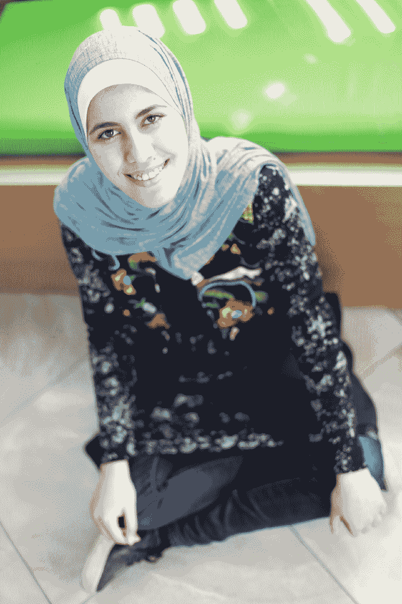
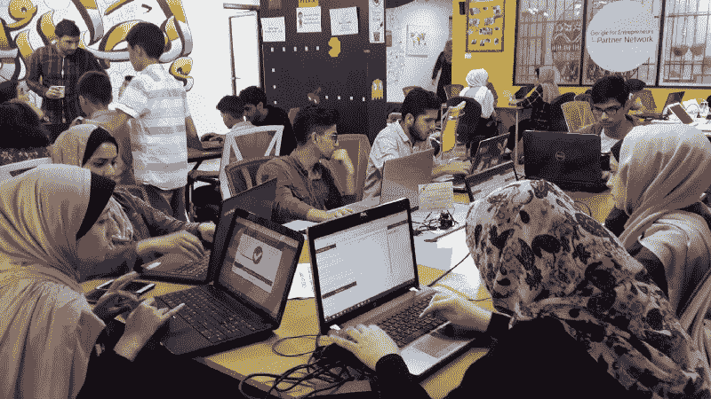
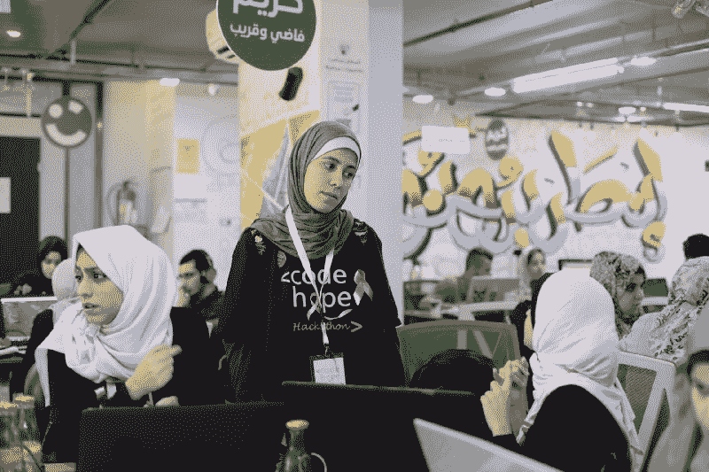
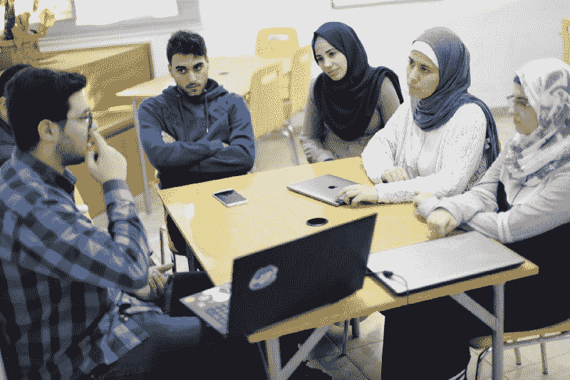
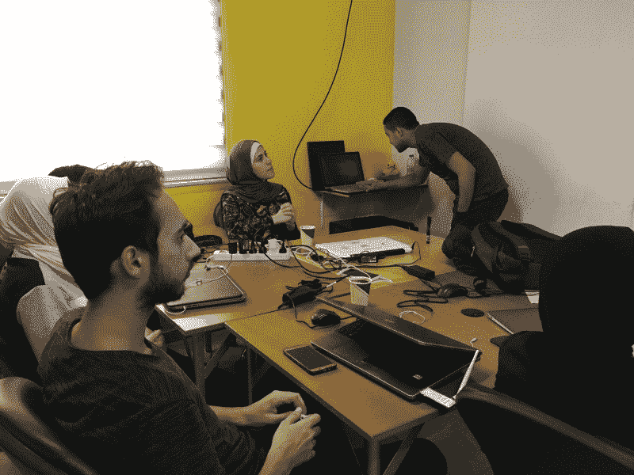
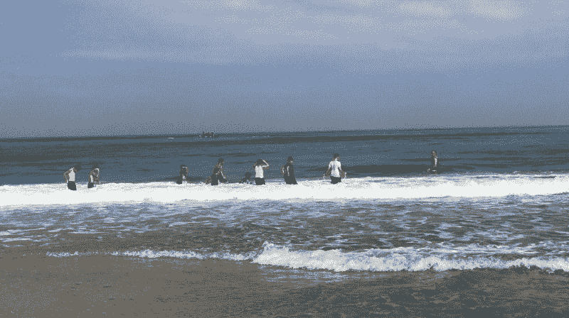

# 我内心有个声音在低语:“成为建造者”

> 原文：<https://www.freecodecamp.org/news/something-within-me-whispered-be-the-builder-9a47fcc013f/>

丽贝卡·帕丁

# 我内心有个声音在低语:“成为建造者”

#### 前加沙代码学院主持人 Yasmin Hillis，一个自称内心嬉皮士的人，讲述了弗吉尼亚·伍尔夫是如何激励她开始写代码的

Yasmin Hillis 学习英国文学，教孩子们英语，然后转而与同伴引导的编码训练营[创始人和编码员](http://www.foundersandcoders.com)一起学习网络开发，她最近在那里结束了课程辅导员的任期。几年来，她一直热衷于冥想和素食。在业余时间，Yasmin 为当地非营利组织做志愿者，并自学数学。

如果 Yasmin 生活在 Founders and Coders 总部所在地伦敦，她作为一名自学成才的女性程序员的故事仍然会引人注目。但 Yasmin 出生在加沙地带五个省中人口最多的加沙，这一事实使她的成就和她坚持不懈的积极性更加非凡。事实上，随着以色列边境口岸自 2007 年以来基本关闭，以及埃及边境口岸自 2014 年以来实际关闭，Yasmin 从未离开过加沙这个只有 25 英里长的狭长地带。

Yasmin 毕业于[加沙代码学院](https://gazaskygeeks.com/code/)，这是一个由[加沙天空极客](https://gazaskygeeks.com/)和伦敦的创建者和编码者共同参与的项目，他在封锁下长大，环境是大多数有抱负的开发者难以理解的:加沙人平均每天只有四个小时的电力，加沙 90%的水不安全，无法饮用。根据世界银行的数据，加沙 43.9%的失业率是世界上最高的。女性失业率为 55.2%，女性劳动力参与率仅为 19.7%。

丽贝卡:亚斯明，我知道在你决定成为一名网络开发人员之前，你学过英语。

**亚斯敏**:没错。我于 2016 年毕业于阿兹哈尔大学，在那里我学习了英国文学，并爱上了文学批评，尤其是威廉·华兹华斯的诗歌。

毕业后，我在一些组织和中东组织的夏令营中担任英语老师。

丽贝卡:用你的第二语言阅读小说不适合胆小的人！说说你第一次看英文小说的经历。

亚斯明:实际上，是《鲁滨逊漂流记》。

丽贝卡:你的第一部英文小说是关于一个人在荒岛上遭遇海难的故事？

**Yasmin:** 我知道，讽刺吧？当我读到他在荒岛上的生活，他与社会隔绝的经历时，我觉得每一句话都在描述我。也许这就是激励我坚持读完这本书的原因。读完前两章，并在字典中查找每隔一个单词，我决定每天坐 12 个小时，埋头读书，直到我觉得我理解了整个故事，而不仅仅是单个单词。我花了两个星期，但我做到了！

丽贝卡:你提到你在大学期间爱上了华兹华斯的诗歌。你有最喜欢的诗吗？

**Yasmin:** 这么难选，大概是华兹华斯的《我孤独地漫游如云(水仙花)》。当我读它的时候，我觉得我和他就在花田里，尽管我自己以前从未参观过水仙花田。他的作品…让我感觉到我可以闻到以前从未闻到过的东西，每当我情绪低落、渴望与大自然交流时，它都会让我振作起来。最后一节尤其引起了我的共鸣:

> *”它们闪现在向内眼睛上*

> 这是孤独的幸福；

> *然后我的心充满了快乐，*

> 与水仙花共舞。"

丽贝卡:所以请帮助我理解你是如何从看小说变成写代码的。

作为一名文学专业的学生，我花了大量的时间在网上搜索由我阅读的小说和文学评论引发的似乎无穷无尽的问题的答案。在某个时候，我意识到我用于研究的网站是由软件工程师建立的。我内心有个声音在低语，“成为建设者”，所以我决定赌一把学习编码。

没过多久，我在社交媒体上看到了加沙天空极客开办的短期课程 She Codes 的广告，马上就报名了。我参加了这个课程，并立即开始学习我所能学到的关于编码的一切，在我通过代码学院的先决条件时，我花了大部分空闲时间阅读文章和观看 YouTube 上关于编程的视频。

我仍然记得在我参加代码学院的面试中，在技术问题之后，一个小组成员问，如果我可以邀请任何人吃饭，那个人会是谁。我说弗吉尼亚·伍尔夫是因为从她的小说中，你可以看到她在一个女性被社会强加了如此多的规则的时代是多么开明，作为一个生活在传统社会中的女权主义者，我发现她真的很鼓舞人心。

Aspiring developers collaborate during an open meetup at the Gaza Sky Geeks campus

丽贝卡:很明显，你不是一个会让规则阻挡你的人！作为一个非技术背景的人，告诉我你在课程上的经历。

Yasmin :一开始，我很难应对这么多新的技术课题，尤其是因为我的团队中的其他人都学习了计算机科学或信息系统。但是我知道怎么做的一件事是谷歌，我花每一点时间查找我遇到的新术语和话题。

有时候，学习代码就像学习另一种语言——这是我熟悉的语言，我学过英语和法语会话。但是我很难接受像代码模块化这样的概念，因为我不能接受这样的想法，即某个代码块从项目中其他地方的另一个代码块获取/发送输入/输出。

也许是因为在文学中我们没有相同的概念——我们通常把文学作为一个整体来处理。因此，当开始编程并发现一些文件依赖于其他文件时，我的头都晕了！

丽贝卡:我认为事情最终会变得容易起来。你是如何找到立足点的？

Yasmin :这一切都归结于同伴引导的学习。与关注学生缺乏什么的传统学习方法不同，同伴引导学习赋予了我们作为学习者相互教授的责任。通过这个过程，我们也变得更加了解自己的优缺点。同伴引导的学习教会了我，不管我知道多少，我总能从和别人一起工作的过程中学到一些东西。

丽贝卡:我很想听听你对同伴互助学习的第一次体验。

Yasmin: 我第一次体验同伴引导学习是在课程第一天的一次结对编程练习中。导师们把我们分成两人一组，告诉我们在 Codewars 上进行一项挑战。我记得就在课程开始的三天前，我在家里做一个类似的挑战，我花了很长时间，做了很多研究，才找到答案。当我配对时，我的同学使用了一种不同的模式，命名变量并以一种新的方式处理代码，这帮助我从一个新的角度看待问题，我们在以前花费我的一小部分时间内找到了解决方案。后来，我记得我告诉我们的导师，当两个头脑专注于一个单一的问题，没有什么我们不能解决的。

丽贝卡:课程中最精彩的部分是什么？

Yasmin :我们指导下一批学生的最后一个项目无疑是课程的亮点。我们[开发了一个应用](http://facapt.herokuapp.com/)来展示创始人和程序员学生的作品集，创始人和程序员商业经理 Joe Tanner 是我们的客户。

**Rebecca:** 说到技术技能，你认为来自非技术背景的人在你的旅程中有哪些优势？

亚斯敏:你问的这个问题很有意思。我想你可以说我带来了从用户的角度从技术上和情感上思考项目的能力。我的一些同学在技术上很强，但他们会忘记从用户的角度来考虑这个项目。

Yasmin mentoring at the Code Hope hackathon in October 2018

Rebecca :你提到你在指导下一批学员时参与了这个项目。我们的许多校友表示，他们在指导过程中的成长与学生时代一样多，甚至更多。说说你当导师的经历？

Yasmin:指导教会了我很多东西，首先，学习的最好方式是向别人解释概念。我记得我站在全班面前解释了一些关于 Node 的东西，尽管我自己仍然没有弄清楚它背后的逻辑。在我解释的过程中，一个学生打断了我，问了我一个问题，大意是“为什么会这样？”我发现自己提供了答案，并注意到另一个学生点头说:“是的，没错。”所以我回去寻找，发现我当场得出的答案实际上是正确的。

就在昨天，我在家里解一道数学题。我发现这个问题很难，就是找不到解决办法，所以我去找我妈妈，我自学数学的导师。我告诉她:“妈妈，我找不到解决这个问题的办法！”她让我先给她解释一下这个问题，然后再一起考虑解决办法。你瞧，当我向妈妈解释这个问题时，我找到了解决办法。

**丽贝卡**:你说你妈妈是你自学数学的导师。你认为她是一个榜样吗？

亚斯敏:绝对是。我母亲在加沙伊斯兰大学 IUG 分校学习数学，目前是近东救济工程处在加沙的一所学校的初中数学教师。

我想我首先成为一名教师，然后成为一名辅导员并不是偶然的。你可以说教育是一种家庭传统。我的祖父安息吧，他来自加沙，在回到加沙做英语老师之前，他在埃及学习英语文学。他最终被提升为学校校长，然后担任近东救济工程处加沙地区教育部主任。我的祖母也是近东救济工程处学校的教师。

在我的旅程中，有一个强大的女性榜样是必不可少的，因为这里有很多人认为女性不够聪明，不适合在科技领域工作。

丽贝卡:跟我说说这些唱反调的人。

亚斯明:嗯，我们社会的主流观点是，女性不适合科技、数学和科学，说白了，女性就是不聪明。长大后听到这些，一些女性甚至开始相信这一点，并表现得好像这是真的。我很感激我的家人一直如此支持我的教育和职业抱负，我的母亲和祖母就是我的榜样。

Rebecca: 我知道，虽然在加沙从事开发工作的女性屈指可数，但女性却占了代码学院学生的一半。

**Yasmin:** 没错。我们相信女性和男性同样具备从事技术工作的能力，并设想有一天加沙的技术部门雇佣的女性和男性一样多。

Yasmin, as course facilitator, with a group of students from the Code Academy

**Rebecca** :你是 2018 年夏天开始的代码学院第五期的课程主持人。根据你的经验，辅导和教学有什么不同？

**Yasmin** :有趣的问题。教学是传递一种思想。另一方面，促进主要是观察——只有当我们认为学生不能自己解决问题时，或者当一个学生的行为对自己或他人有害时，我们才会干预。作为一名辅导员，我密切关注环境和学生的个性，并做出相应的调整。

成为一名辅导员是我做过的最有意义的事情。有一次，当学生们在研讨会上两人一组工作时，我在房间里飘来飘去。我注意到一个学生似乎特别紧张和焦虑。我走近她，问出了什么事，但她向我保证一切都很好。休息时，我决定和她私下谈谈。这一次，她向我承认，她觉得自己像个冒名顶替者，好像她不属于这门课程，也不属于科技行业(当然这不是真的)。我给了她建议和情感上的支持，她后来接受了。几周后，在最后的项目演示会上，她展示了对整个项目的牢固掌握。演讲结束后，我和她聊了聊，听到她告诉我她觉得自己在个人和职业上都有所成长，我感到非常自豪。

Reviewing a team project during the fifth cohort of the Code Academy

丽贝卡:作为一名辅导员，你是如何成长的？

Yasmin :比起我还是学生的时候，引导更让我懂得了团队合作的价值。我以前也是一名团队成员，但是目睹房间里的团队如何工作，观察他们在哪里陷入困境，让我更加意识到合作和沟通的重要性。

当你在团队中的时候，你会被眼前的小事弄得不知所措，忘记关注更重要的事情。当你是一个观察团队动态的人时，你可以更清楚地看到全局，从而帮助团队在项目的日常会议中重新聚焦。我经常提醒整个教室，关注大局很重要。有时候大局就是团队内部的沟通。有时是维持长久的关系，有时是优先考虑项目和他人的学习过程。

最重要的是，这份工作教会了我要更有耐心。我学会了对学生的进步速度、团队动力、犯同样错误不止一次的学生保持耐心。总的来说，在生活中，我对自己的身心都很有耐心。我提醒自己，一切都需要时间，如果一切都在瞬间发生，生活就失去了最有趣的特征之一，悬念。

丽贝卡:你说你对自己的身心很有耐心。除了促进之外，你怎么说你已经学会了耐心的价值？

Yasmin:实际上我已经练习冥想四年了。我从冥想练习中学到了很多，比如如何不抱怨、同情、耐心和自我意识。

**丽贝卡:**你是如何开始冥想的？

亚斯明:嗯，在大学的时候，在考试的时候，我是如此的不知所措。我觉得我的大脑需要休息，但我不知道如何为自己提供休息。我感觉脑子里有声音，他们在吵架，但我不知道如何让他们安静下来。

我决定坐在卧室的地板上，闭上眼睛——本能地，我想，我们都知道如何保持正念。我静静地坐在那里，大约十五分钟。当我完成时，我的头脑感觉更有条理，我很平静，我的心情也有所改善。当我去学习的时候，我发现我的理解能力有了很大的提高，所以我决定我必须研究一下我到底做了什么。

我找到了一个 YouTube 视频，里面有用于放松的器乐，我继续冥想了几个月，几乎每天都冥想，最终我了解到控制呼吸是如何让放松变得更容易、更快并改善情绪的。我仍然尽可能地冥想，使用音乐、引导冥想或正念应用程序，如[平静](https://www.calm.com/)和[顶空](https://www.headspace.com/)。老实说，很难找到一个独处和冥想的地方，因为这里的房子很拥挤。但我为自己偷取时间，因为如果我想练习冥想并与大自然联系，它不必是一个特殊的地方或时间，只要是我需要的任何地方或时间。

这里的人认为我为冥想而疯狂，但我能说什么呢，我想我本质上只是一个嬉皮士。

丽贝卡:那么当你想独处、放松或学习时，你会去哪里？

**Yasmin:** 从小到大，我最喜欢的学习场所是我们老房子里卧室的阳台，我会在那里阅读，在新鲜的空气中啜饮一杯茶。今天，我不得不说我喜欢看海。这是我感到放松、恢复活力和亲近自然的地方。

Photo of Gaza waterfront: [Stefanie Dekker/[Al Jazeera](https://www.aljazeera.com/blogs/editors-blog/2018/08/side-gaza-swimming-canoeing-child-180802084349283.html)]

丽贝卡:你的职业目标是什么？你梦想的工作是什么？

Yasmin :我喜欢和 Gaza Sky Geeks 的团队一起工作，我现在正在一个同样运转良好的团队中寻找一个开发者的角色。我想继续做一些项目管理，因为我喜欢促进的组织方面。

丽贝卡:为我梦想。想象一下封锁今天结束，你可以在世界任何地方找到工作。你会去哪里？

Yasmin :当然是伦敦啦！

要了解更多关于在加沙雇佣开发人员的信息，请访问 agency.gazaskygeeks.com。

要申请加沙代码学院，请访问 www.gazaskygeeks.com/code。