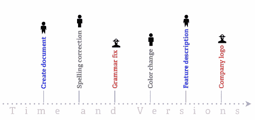
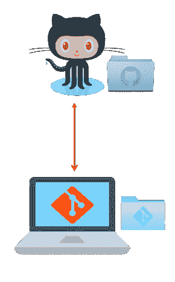
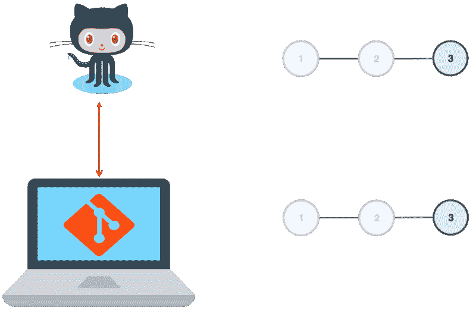
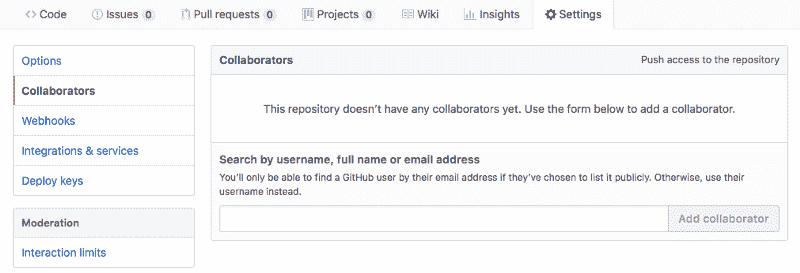
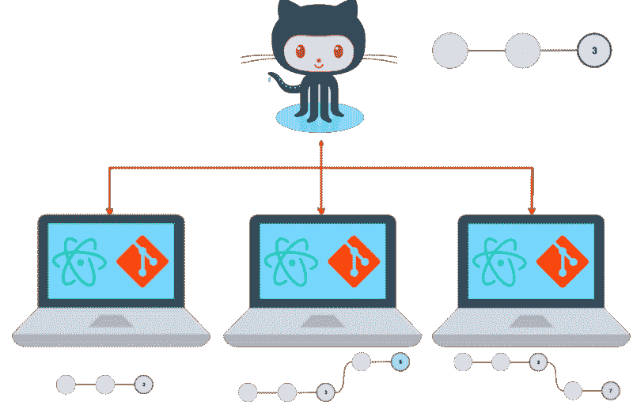
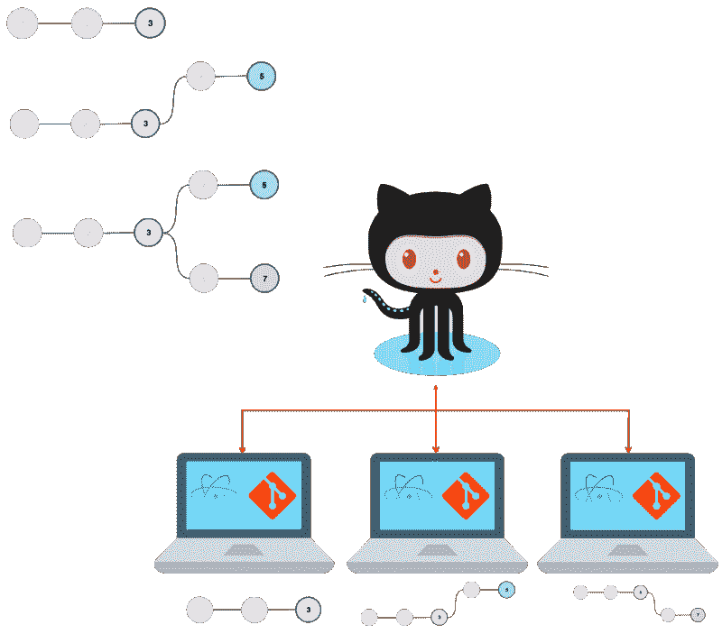
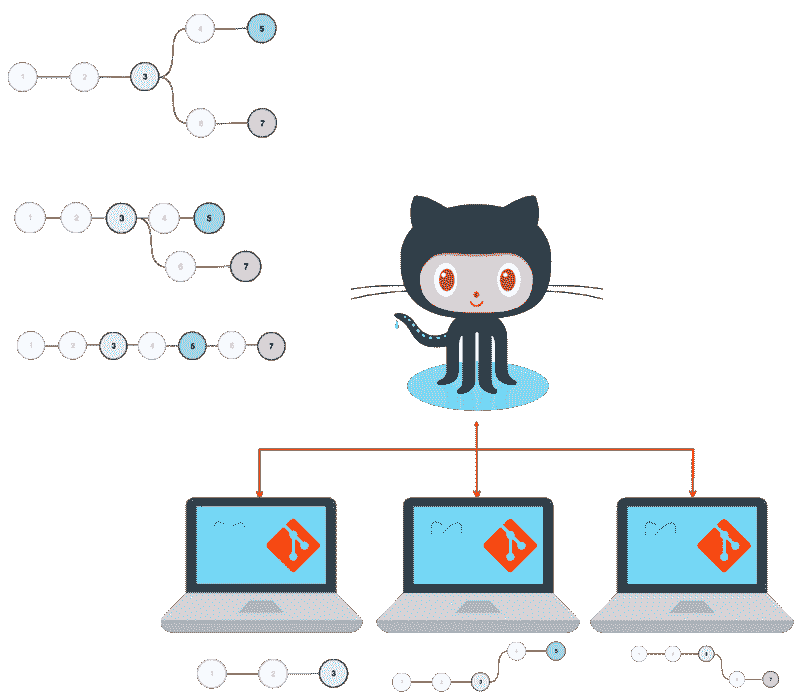
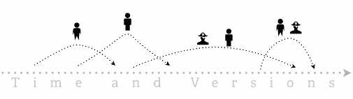

# 编码的 Google 文档:Git & GitHub

> 原文：<https://www.freecodecamp.org/news/the-google-doc-of-coding-git-github-ec103e87926d/>

作者:梁荣立

# 编码的 Google 文档:Git & GitHub

### **简介**

Google Doc 是一个服务器端(在线)文字处理器。用户的文件是通过网络浏览器创建的，并存储在服务器中。该软件使用户可以与其他人共享文档进行协作。通常，工作流程如下:

*   创建文档并填充内容。
*   保存内容并与他人共享文件以进行协作。
*   成员在线对同一文档做出贡献。

除了文件共享，另一个重要的特性是撤销或重做对“主”文件所做的更改。对文档的更改是连续的，任何用户都可以撤销(或重做)这些更改。

但是，这很快就会变得一团糟，尤其是当多个用户同时添加或编辑内容时。谁创建或更改了什么内容，出于什么原因，不得而知。

### Atom 走吧 GitHub

在软件开发中，用于协作编程的工具由文本编辑器、版本控制系统和在线知识库组成。

**Atom (** 或任何文本编辑器 **)** 就像你的客户端(桌面)文字处理器，除了文档是用某种语言(即:JavaScript)编写的代码。

Git 是一个有选择地记录你的项目保存的变更历史的工具。这是一种用**控制**你的编程项目的所有**不同版本**的方法。

**GitHub** 就像你的 Google Docs，除了你可以创建&离线保存你的代码版本，然后由“**推送**在线保存。

Atom, Git & GitHub

于是，你有了你的**文本编辑器** **(** 原子 **)** ，**版本控制系统(** Git **)** & **远程文件存储系统(** GitHub **)** )。这些是解决协作问题的基本要素，尤其是对于软件开发人员来说。工作流程类似于谷歌文档的使用，但有一些不同。

### 协作软件开发工作流

1.  **创建在线(**远程 **) GitHub 资源库(**【https://github.com/new】**)**

**2。创建一个离线(**本地**)存储库。**终端命令**git init*****project _ name***通过创建一个文件夹来存储其内容来启动您的项目&版本控制文件来存储其更改的历史

*   想法是最终拥有一个远程&你的项目的本地副本。

**3。使用文本编辑器构建内容。**这是您开始用 Atom 编写程序和创建 JavaScript 文件的地方。

Coding with an Atom Text Editor

**4。保存内容&记录项目中的重大历史进展。**终端命令 **git add。**添加所有文件夹内容，**所有修改，*待提交，*待历史记录。命令 **git commit -m 'message'** 将更改提交到历史记录中，并附带一条解释所做更改的消息。命令 **git push** 将您的文件和历史数据推送到您的远程存储库。**

*   当您在项目中不断取得进展时，您记录了每个开发阶段(git 添加、git 提交、git 推送)背后的基本原理。

Your remote & local copy grows with every push.

**5。与他人共享文件以进行协作。**一旦您的远程存储库有了内容，您就可以与协作者共享您的项目。

*   成员接受邀请后，他们可以从远程存储库中分出一个分支，在本地克隆项目(**git clone*****<repo URL 或 s*** sh >)。

Originator with two collaborators building content on project clones.

*   每个协作者都可以构建内容、保存内容并将其推送到他们的远程分支。
*   随着合作者继续构建和保存他们的内容，他们最终会在 GitHub“天空”中构建分叉( **git add** 、 **git commit** 、 **git push** )。

Originator & Collaborators developing project & pushing it to GitHub.

*   每个分支都是从原始项目中分支出来的合作者，这样成员就可以与发起人并行工作，而不会干扰彼此的进度。每当合作者执行一次 **git 推送**，叉子就会拉长。

**6。合并分支文件。**在合作者的请求下，**发起者**可以将他们的分支与主分支合并。

Collaborators are pushing & submitting pull requests. The originator is pulling clones & merging the branches.

*   当合作者提交一个 pull 请求时，发起者可以执行一个 **git pull** 来将分支合并到项目的一个更新版本中。然后，这个新版本可以被推送到远程存储库中，供所有人查看和使用。

### 版本控制和文件共享

在协作软件开发中，在将主副本的多个克隆合并到主文件之前，对它们进行更改。因此，所做的更改是连续的，但在时间上有重叠。

Collaborators forking, pushing & having their branches merged with the Originator, at different times.

在克隆体上创建的每一条新内容最终都会被推送到合作者的主存储库中。每个协作者的提交消息都向发起者提供反馈，以便他们可以对原始项目进行可理解的编辑和添加。

如果没有 **Git 的**版本控制& **GitHub 的**文件共享，这将是一个困难的壮举。一个简单的终端命令( **git 分支&lt；branch_n **a** me >可以在本地机器上克隆并创建一个分支，这样就可以开发项目的不同版本。然后，用户可以在任何时间点记录他们的进度。如果活动版本有任何问题，用户可以简单地切换到以前的 br**anch(git chec**kout<br**a**nch _ name>)并从那里继续。**

这就是**版本控制**的意义。在任何时间点，用户可以切换到项目的替代版本，同时提交可理解的注释来解释每个版本的进展。用户可以完全控制所开发的版本。一个简单的对 GitHub“云”的终端推送使他们的合作者可以使用任何版本。这就是在协作软件开发中使用 Git & GitHub 的强大之处。

**参考文献:**

[**Git-Videos**](https://git-scm.com/videos)
[*编辑描述*git-scm.com](https://git-scm.com/videos)[***用 Bitbucket Cloud 学习 Git*| Atlassian Git 教程**](https://www.atlassian.com/git/tutorials/learn-git-with-bitbucket-cloud)
[用 Bitbucket 学习 Git Cloudwww.atlassian.com](https://www.atlassian.com/git/tutorials/learn-git-with-bitbucket-cloud)[**Google Docs 如何工作**](https://computer.howstuffworks.com/internet/basics/google-docs5.htm)
[*Google Docs 的后端——Google Docs 的后端依赖于简单、廉价的硬件和软件。了解更多…*computer.howstuffworks.com](https://computer.howstuffworks.com/internet/basics/google-docs5.htm)[**Atom(文本编辑器)-维基百科**](https://en.wikipedia.org/wiki/Atom_(text_editor))
[*Atom 是一个免费的开源文本和源代码编辑器，适用于 macOS、Linux 和 Microsoft Windows，支持…*en.wikipedia.org](https://en.wikipedia.org/wiki/Atom_(text_editor))[**Git-维基百科**](https://en.wikipedia.org/wiki/Git)
[*Git()是一个分布式版本控制系统，用于在软件开发期间跟踪源代码的变化。它是…*en.wikipedia.org](https://en.wikipedia.org/wiki/Git)[**GitHub-Wikipedia**](https://en.wikipedia.org/wiki/GitHub)
[*GitHub 为企业、团队、pro 和自由账户提供常用于托管开源软件的方案…*en.wikipedia.org](https://en.wikipedia.org/wiki/GitHub)