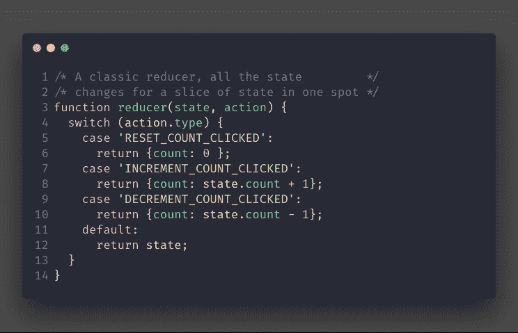
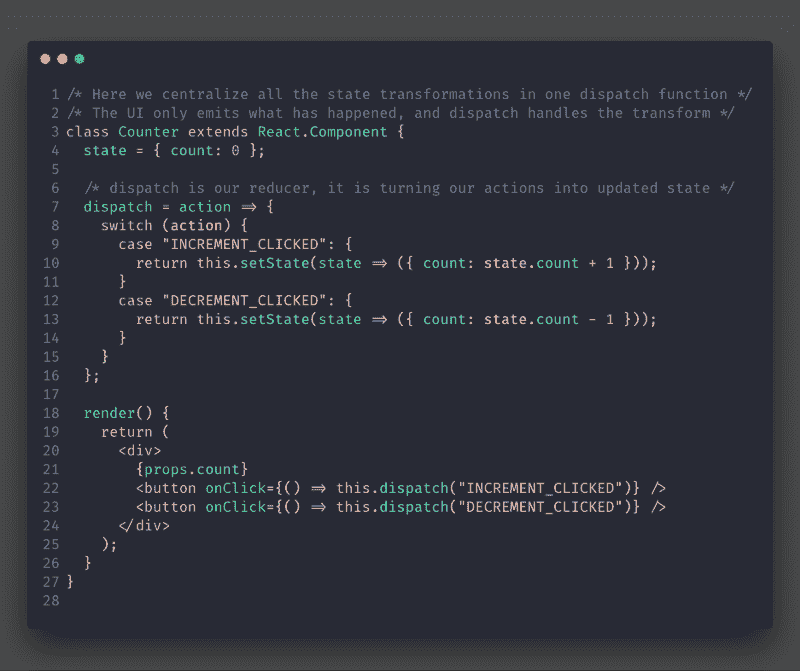
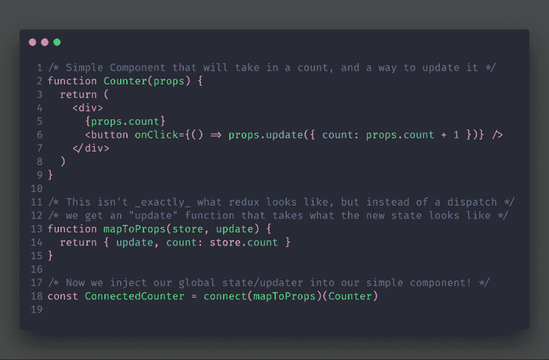
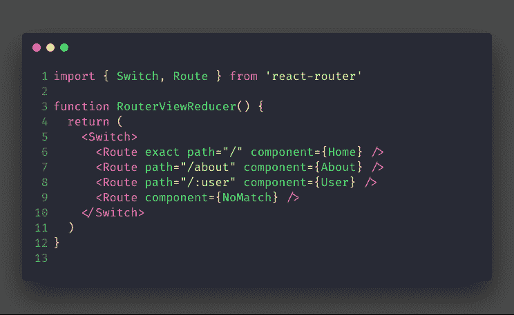

# 如何理解 Reducers:不用 Redux 也可以用

> 原文：<https://www.freecodecamp.org/news/how-to-understand-reducers-you-can-use-them-without-redux-2935208bdb12/>

瑞安·尤尔卡宁

# 如何理解 Reducers:不用 Redux 也可以用

Photo by [Soraya Irving](https://unsplash.com/@traxing?utm_source=medium&utm_medium=referral) on [Unsplash](https://unsplash.com?utm_source=medium&utm_medium=referral)

**TLDR:** 你可以在你的类组件中用一个 reducer 来处理状态，方法是拥有一个将动作转换成状态变化的函数。它集中了你所有的设置状态。

#### ？什么是减速器？

减速器是接受输入并在一个中心点决定如何处理输入的功能。**就这样。？**

如果你有一个基于 URL 决定视图显示的函数，它就是一个缩减器。

Redux Reducers™️是 reducers 的一种特殊用法，它解释应用程序中的事件，以及事件如何改变应用程序的状态。

this.dispatch(“RESET_COUNT_CLICKED”)

如果您不熟悉 Redux，上面的例子通常是通过调用带有`action`(描述事件的对象)的`dispatch`函数来启动的。？

我们现在可以在一个类组件中使用 reducers，方法是创建一个函数，通过一个动作类型来处理状态设置，如下所示:

在我看来，在这个简单的例子中使用一个减速器是多余的。为此，我很高兴 React 将同时提供一个`useState`和`useReducer`钩子。

如果我注意到我正在传递改变状态的方法，并且`count`与更多的状态属性结合在一起，我会切换到一个 reducer。

由于 Redux 将其所有状态放在一个快速增长的对象中，这使得 reducer 模式非常适合。从 Redux 中删除 reducers 是可能的，即使我们会失去大量令人敬畏的特性。

Redux 让你把你的全局存储到你的组件中。你可以把状态转化成道具。它们还提供了一个`dispatch`功能来触发你的减速器。

让我们传入一个类似于`setState`的`update`函数，而不是传递一个`dispatch`函数。

#### ？创建 Redux 的更差版本

当您调用 update 时，您实际上是在说状态应该如何内联更改。它可能与其他类似的状态变化相邻，也可能不相邻。

**在足够小的状态下，这实际上感觉很好，很简洁。**如果我们有 5 个或更多的组件改变了一些状态属性，就很难找到错误的来源。？？

即使不改变 redux，您也可以模拟这种模式。看起来像`SET_COUNT`的调度动作暗示我们实际上只是想要`setState`。这是很容易做到的事情。

如果我们创建一个不那么固执己见的动作，像`INCREMENT_BUTTON_CLICKED`一样，我们可以在许多 reducers 中使用它，动作负载不会有太大的变化。

#### ？减速器不仅仅用于状态

The input here is the current URL, the output is the view!

Reducers 是集中决策的好方法。如果您以前使用过 react-router-4，那么上面的代码应该看起来非常熟悉。

多亏了`<Switch` / >组件，我们可以在任何地方嵌套这些 route-view 减速器。

现在，如果有人有这样的问题“URL 可以改变呈现的所有方式是什么”，他们有一个集中的地方可以看。

#### ？总结一下

1.  Reducers 作为一种模式存在于 Redux 和 Javascript 之外，并且易于实现。他们有一个单一的责任，接受输入和输出。
2.  Redux Reducers 把 app 事件变成状态。现在不需要 Redux 来做这个，用本地组件状态就可以了。
3.  Reducers 使组织和查找代码中可能发生的不同变化变得容易，并且在应用程序变大时很有用。

如果您有任何问题或正在寻找一对一的 React 指导，请随时给我发推特**@ yurkaniryan**！

如果你喜欢我的写作风格，这里有一些我写的其他文章。