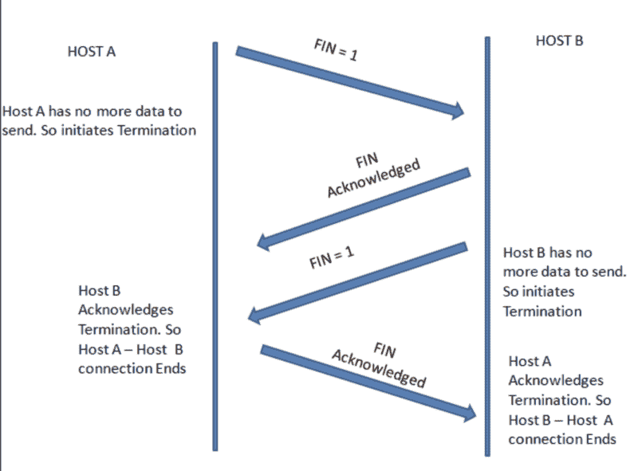

# 无痛 Apache Kafka 集成需要考虑什么

> 原文：<https://www.freecodecamp.org/news/what-to-consider-for-painless-apache-kafka-integration-df559e828876/>

Apache Kafka 在现实世界中的应用正在爆炸式增长，它声称要主宰流数据世界。它在全世界有一个庞大的开发者社区，并且还在不断发展。但是，这也很痛苦。所以，在跳 head first 和与 Apache Kafka 完全集成之前，让我们先检查一下水，提前计划一下无痛集成。

nPhoto by [Helloquence](https://unsplash.com/photos/5fNmWej4tAA?utm_source=unsplash&utm_medium=referral&utm_content=creditCopyText) on [Unsplash](https://unsplash.com/search/photos/computer?utm_source=unsplash&utm_medium=referral&utm_content=creditCopyText)

#### 这是什么？

Apache Kafka 是一个用于异步消息传递的开源框架，它是一个分布式流平台。它是基于 TCP 的。消息保存在主题中。消息生产者被称为*发布者*，消息消费者被称为*订户*。

消费者可以订阅**一个或多个主题**，并消费该主题中的所有消息。消息被写入主题分区。

*主题*始终是多层订阅者，他们可以有零个、一个或多个消费者订阅写入其中的数据。对于每个主题，Kafka 都有一个分区日志。分区日志和主题的元数据通常由 Zookeeper 管理。

如果你想了解更多关于 Kafka 消息传递语义的知识——比如，*最多一次*，*至少一次*和*正好一次——*点击这里阅读[。](http://bit.ly/2Shu9L5)

许多科技公司已经将 Apache Kafka 集成到他们的产品中，作为**消息代理、用户活动跟踪管道、指标收集器、日志聚合机制、流处理设备**等等。阿帕奇卡夫卡是用 Scala 和 Java 写的。

#### 为什么是卡夫卡？

*   *Kafka 提供**高可用性**和**容错**消息日志。* Kafka 集群保留所有已发布的记录。默认情况下**是持久的—** 如果你不为 Kafka 设置限制，它会一直保存记录，直到用完磁盘空间。当**数据丢失**意味着产品出现严重故障时，这对于恢复至关重要。
*   **多个主题消费者** —当在多个消费者组下配置消费者时，它有助于减少将数据发送到多个应用程序进行处理的旧瓶颈。Kafka 是分布式的，因此，它可以从各种物理机器/服务实例向消费者发送信息。使用 Apache Kafka 的镜像特性 MirrorMaker 将主题复制到辅助集群也相对容易——参见两个 HDInsight 集群之间镜像数据的[示例](http://bit.ly/2CsENsU)。**只要记住**，如果多个消费者被定义为同一个组(由 group.id 定义)的一部分，数据将在组内的所有消费者之间平衡。
*   卡夫卡是**多语种**——有很多 C#、Java、C、python 等语言的客户端。该生态系统还提供了一个 REST 代理，允许通过 HTTP 和 JSON 轻松集成。
*   **实时处理** — Kafka 可以处理实时数据管道，为应用程序提供实时消息。
*   **可扩展** —由于分布式架构，Kafka 可以在不发生任何停机的情况下向外扩展。
*   还有更多…

### 让我们不痛不痒地与卡夫卡融合

#### 在整合之前，有 6 件事需要了解:

**1 — Apache Zookeeper 可能成为 Kafka 集群的一个痛点**

在过去(版本< 0.81)，Kafka 使用 Zookeeper 来维护每个主题和分区的偏移量。Zookeeper 过去常常参与读取路径，其中过于频繁的提交和过多的消费者会导致严重的性能和稳定性问题。

最重要的是，最好对旧的基于 Zookeeper 的消费者使用手动提交，因为粗心的自动提交会导致数据丢失。

Kafka 的新版本提供了自己的管理，消费者可以使用 Kafka 本身来管理补偿。这意味着有一个特定的主题代替 Zookeeper 来管理读偏移量。

然而，Kafka 仍然需要一个带有 Zookeeper 的集群，即使是在后来的版本 2 中。+.Zookeeper 用于存储 Kafka 配置(在需要时重新分配分区)和 Kafka 主题 API，如创建主题、添加分区等。

Kafka 上的负载与消费者、代理、分区的数量以及消费者提交的频率密切相关。

**2 —你不应该通过 Kafka** 发送大型信息或有效载荷

根据 Apache Kafka 的说法，为了获得更好的吞吐量，最大消息大小应该是 **10KB *。*** 如果消息比这个大，最好在给卡夫卡写信之前，检查一下替代方案或者想办法把消息剁成更小的部分。这样做的最佳实践是使用一个消息键来确保所有切碎的消息将被写入同一个分区。

**3 —阿帕奇卡夫卡不能转换数据**

许多开发人员都错了，认为他们可以创建 Kafka 解析器或在 Kafka 上进行数据转换。然而，Kafka 不支持数据转换。如果你正在使用 Azure 服务，有一个很棒的[数据工厂服务](http://bit.ly/2Sk8rpS)列表，你可以用来转换数据，比如 [Azure Databricks](http://bit.ly/2Lv6uEm) 、 [HDInsights Spark](http://bit.ly/2EK5EDp) 以及其他连接到 Kafka 的服务。

另一个解决方案是使用[阿帕奇卡夫卡流](https://kafka.apache.org/documentation/streams/)。这实际上是一个建立在 Kafka 的生产者和消费者客户端之上的新 API。它比 Kafka 消费者客户端功能更强大，表达能力也更强。

`[KafkaStreams](https://kafka.apache.org/10/javadoc/org/apache/kafka/streams/KafkaStreams.html)` 客户端允许我们对来自一个或多个输入主题的输入进行连续计算，并将输出发送给零个、一个或多个输出主题。在内部，`KafkaStreams`实例包含一个普通的`[KafkaProducer](https://kafka.apache.org/10/javadoc/org/apache/kafka/clients/producer/KafkaProducer.html)`和`[KafkaConsumer](https://kafka.apache.org/10/javadoc/org/apache/kafka/clients/consumer/KafkaConsumer.html)`实例，用于读取输入和写入输出。

另一个选择是使用 Flink，点击查看[。](https://www.baeldung.com/kafka-flink-data-pipeline)

**4 — Apache Kafka 支持 TCP 上的二进制协议**

Apache Kafka 通信协议是基于 TCP 的。它不支持 MQTT 或 JMS 或其他现成的非基于 TCP 的协议。然而，许多用户编写了适配器来从这些协议读取数据，并写入 Apache Kafka。比如 [kafka-jms-client](https://github.com/adispennette/apache-kafka-jms) 。

Simple TCP handshake

**5 — Apache Kafka 管理/支持和陡峭的学习曲线**

到今天为止，Apache Kafka 的基于管理系统的免费用户界面是有限的，我工作过的大多数开发者都使用脚本工具。然而，对于初学者来说，不花时间进行培训就直接使用 Apache Kafka 脚本工具是很乏味的。学习曲线是陡峭的，需要一些时间来移动和融入大的运行系统。

对于有经验的开发人员来说，可能需要几个月(2 个月以上)才能完全理解如何集成、支持和使用 Apache Kafka。为了以最适合系统需求的方式使用配置，了解 Kafka 的工作方式是很重要的。

这里有一个管理工具的列表，你几乎可以免费使用这些工具(有些仅限于个人/社区使用):

*   [KafkaTool](http://www.kafkatool.com/) —用于管理和使用 **Apache Kafka** 集群的 GUI 应用程序。
*   [融合平台](https://www.confluent.io/product/confluent-platform/) —全企业流媒体平台解决方案。
*   [KafDrop](https://github.com/HomeAdvisor/Kafdrop) —显示经纪人、话题、分区等信息的工具，甚至可以让你查看消息。这是一个运行在 Spring Boot 上的轻量级应用程序，只需要很少的配置。
*   雅虎 Kafka 管理器(Yahoo Kafka Manager)——另一个监控 Kafka 的工具，但它提供的功能比其他工具少得多。

**支持云上的托管 Kafka**

今天，几乎所有的云都支持 Kafka，如果它是完全托管的，或者从云商店到购买 Kafka 机器都使用与 Confluent 的集成:

*   [融合云——卡夫卡即服务](https://www.confluent.io/confluent-cloud/)
*   [Azure 活动中心](http://bit.ly/2Ah5MGo) -全面管理的 Kafka
*   [在 HDInsight — Azure 上管理卡夫卡](http://bit.ly/2BEpPyp)
*   [谷歌云上的卡夫卡机器](https://console.cloud.google.com/marketplace/details/click-to-deploy-images/kafka?pli=1)
*   [Kafka 在 AWS 上使用合流溶液](https://aws.amazon.com/quickstart/architecture/confluent-platform/)
*   ...更多的

**6 —卡夫卡没有魔力—仍有可能丢失数据**

Apache Kafka 可能是分布式异步消息传递最流行的工具。这主要归功于他的高吞吐量、低延迟、可伸缩性、集中化和实时能力。这主要是由于使用了 Kafka 中称为分区的数据副本。

然而，由于配置错误，当机器/进程出现故障时，很有可能会丢失*数据*，并且它们将会出现故障。因此，了解 Kafka 如何工作以及产品/系统要求是什么非常重要。

**7 — Kafka 内置故障测试框架 Trogdor**

为了帮助你找到正确的配置，Kafka 团队创建了 [Trogdor](https://cwiki.apache.org/confluence/display/KAFKA/Fault+Injection) 。Trogdor 是一个失败测试框架。

**工作原理**

*   像在生产中一样配置 Kafka
*   创建一个生成序列为 1…X 百万的消息的生成器。
*   运行生产者
*   运行消费者
*   通过崩溃和/或挂起代理来制造故障。
*   测试并检查产生的每个事件是否都被使用。
*   …如果不是这样，最好返回并相应地更新配置！

#### 除此之外，重要的是要记住阿帕奇卡夫卡…

*   ***不是 RPC*** 吗——阿帕奇卡夫卡是一个消息传递系统。对于 RPC，服务 X 需要知道服务 Y 和调用签名。例如，在卡夫卡那里，如果你发送一条信息，并不意味着有人会消费它，永远不会。在 RPC 中，总是有一个消费者，因为服务本身知道消费者 Y 并创建对其签名/函数的调用。
*   这是 ***而不是数据库***——这不是一个保存信息的好地方，因为你不能在它们之间跳转，或者在没有昂贵的全面扫描的情况下创建搜索。

#### 简单说一下 KSQL

合流社区给我们带来的一个有趣的库是 [KSQL](https://github.com/confluentinc/ksql) 。它建立在卡夫卡溪流之上。KSQL 是一个完全交互式的 SQL 接口。不用写任何代码就可以使用。KSQL 在合流社区许可下。

### TL；速度三角形定位法(dead reckoning)

Apache Kafka 有许多优点，但是在将它添加到产品中之前，应该意识到:

*   它有一个陡峭的学习曲线——花时间学习卡夫卡的点点滴滴
*   你必须管理集群资源——像 Zookeeper 一样注意需求
*   使用 Apache Kafka 仍然会丢失数据
*   大多数云提供托管的 Apache Kafka
*   它不会转换数据
*   这不是一个数据库
*   它支持 TCP 协议上的二进制协议
*   目前，你不能用卡夫卡发送大量信息
*   您应该使用 Trogdor 对您的系统进行故障测试

尽管如此，Apache Kafka 可能是消息和流任务的最佳工具。

感谢 Gwen Shapira 一路上的投入和指导。

如果你喜欢这个故事，请点击？按钮。欢迎在下方留言评论。

[关注我](https://medium.com/@adipolak)这里，或者[这里](https://twitter.com/adipolak)更多关于 Scala、Kotlin、大数据、干净代码和软件工程师废话的帖子。干杯！