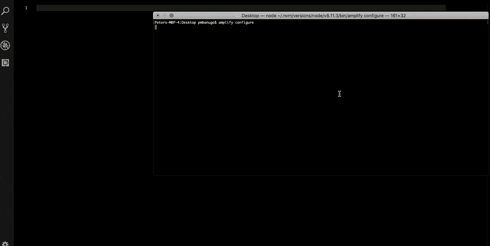

# React 和 AWS Amplify 的无服务器化:开发环境设置

> 原文：<https://www.freecodecamp.org/news/going-serverless-with-react-and-aws-amplify-development-environment-set-up-9b15c3363bd/>

彼得·姆巴努戈

# React 和 AWS Amplify 的无服务器化:开发环境设置


Photo by [Fabian Grohs](https://unsplash.com/@grohsfabian?utm_source=medium&utm_medium=referral) on [Unsplash](https://unsplash.com?utm_source=medium&utm_medium=referral)

无服务器计算为我们提供了诸如降低运营成本和开发时间等好处。它允许我们专注于我们的代码，为用户提供商业价值，而不用担心构建和维护服务器。

AWS 是众多无服务器计算服务提供商之一。在这篇文章中，我将带你建立你的开发环境来构建 AWS。这将是本系列未来文章的基础。

据[维基百科](https://en.wikipedia.org/wiki/Serverless_computing)介绍，无服务器计算是一种云计算执行模型，云提供商充当服务器，动态管理机器资源的分配。这通常意味着，您可以通过专注于编码业务逻辑来单独构建生产就绪型应用，而将配置服务器、扩展或升级服务器以及其他功能的任务留给云提供商或第三方服务提供商。您可以利用它来构建几乎任何类型的应用程序或后端服务，并且为您处理运行和扩展具有高可用性的应用程序所需的一切。

这种运行应用程序的模式为我们带来了诸多好处，如降低运营成本、缩短开发时间等等。如果你想了解更多关于什么是无服务器及其优势的信息，请查看这篇关于无服务器架构的文章。

### 读这本书我能学到什么？

这篇文章(不久将会有更多)旨在教你如何利用无服务器架构和各种 [AWS](https://aws.amazon.com/) 服务构建 React 应用程序。我们将涵盖认证、创建和使用 REST APIs、分析和托管等领域，同时利用来自单一云提供商的服务。我们将与 [AWS Amplify](https://aws-amplify.github.io/) 合作，它提供 CLI 工具和 UI 组件，使在 AWS 上构建无服务器应用变得容易。

在这篇文章中，我将带你建立你的开发环境来构建 AWS。

### AWS Amplify 入门

AWS Amplify 是一个库，它为你提供了构建无服务器应用的工具。有了它，只需几行代码就可以将各种 AWS 服务集成到您的应用程序中。您还可以获得 UI 组件来加速开发。

要使用任何 AWS 服务或 Amplify 库，您需要一个 AWS 帐户。如果你还没有，现在就可以[注册](https://portal.aws.amazon.com/billing/signup?redirect_url=https%3A%2F%2Faws.amazon.com%2Fregistration-confirmation)。注册后，您可以立即访问 AWS 免费层，并且没有前期费用。

### 安装和配置 Amplify CLI

Amplify CLI 是一个允许您为应用程序创建和配置 AWS 服务的工具。它的目的是为您简化移动和 web 应用程序开发。CLI 使用 [AWS CloudFormation](https://aws.amazon.com/cloudformation/) 和嵌套堆栈，这允许您在将配置推送到云中执行之前，在本地添加或修改配置。

要使用 CLI，您需要安装 node . js(8.11 版或更高版本)和 NPM(5 版或更高版本)。如果您没有安装它们，请访问 [Node.js 下载页面](https://nodejs.org/en/download/)。安装 node 也会给你 npm，但是如果你刚刚安装 node，你也可以[单独下载 npm](https://www.npmjs.com/get-npm) 。

通过在命令行中运行`npm install -g @aws-amplify/cli`来安装 CLI。不要使用 yarn 安装 CLI，因为它存在已知问题。一旦安装了 Amplify CLI，您就必须对其进行配置，以指定必要的 AWS 凭证和区域。按照下面的说明配置 CLI。

1.  打开命令行，运行命令`amplify configure`。这将在您的浏览器中打开 AWS 控制台，如果您尚未登录，则需要登录您的帐户。
2.  登录后，返回命令行并按 Enter 键。
3.  系统将提示您选择一个 AWS 区域。选择一个并按回车键。
4.  然后，您可以选择指定新的 AWS IAM(身份和访问管理)用户的用户名，以便在 CLI 中使用。输入用户名，然后按 Enter 键。当您按 enter 键时，它会打开您的浏览器，并将您带到 AWS 控制台中的 IAM 仪表板。
5.  在 IAM 仪表板上，系统会要求您创建一个新用户。用户名字段预先填充了您在控制台中输入的用户名，并选择了`Programmatic Access`访问类型。点击`Next: Permissions`按钮进入下一页。
6.  保留默认选择的`Administrator Access`策略，点击`Next: Review`按钮。
7.  点击`Create User`按钮创建用户。当用户被创建时，你会得到一个**访问密钥 ID** 和一个**秘密访问密钥**。请保留这些信息，因为您将需要它们来设置 CLI。
8.  回到命令行并按回车键。
9.  它会提示您输入**访问密钥 ID** 。复制并粘贴该值，然后按 Enter 键。
10.  另一个提示显示询问**秘密访问密钥**。复制并粘贴该值，然后按 Enter 键。
11.  现在将询问您是否想要在本地机器上创建或更新 AWS 概要文件。我们将对此配置文件使用默认值。按 Enter 键选择默认值并创建您的 AWS 概要文件。



### 创建 React 应用

现在已经配置了 Amplify CLI，我们可以开始创建 React 应用程序了。我们将用 [Create React app](https://github.com/facebookincubator/create-react-app) 引导 React App。这使得我们可以专注于编写代码，而不用担心设置 Babel 和 Webpack，因为它们已经为我们预先配置好了。要创建 React 项目，请运行以下命令:

```
$ npx create-react-app serverless-react
```

这将创建一个文件夹`serverless-react`，其中包含 react 应用程序所需的文件。接下来要做的是初始化一个放大项目。为此，请遵循以下说明

1.  通过在命令行中运行`cd serverless-react`将目录切换到项目
2.  运行命令`amplify init`。这会提示你回答一些问题。
3.  选择您的代码编辑器，然后按 Enter 键。
4.  下一组提示向您提出问题，以确定您正在构建的应用程序的类型。选择 JavaScript，然后选择 React，然后按 Enter 键让剩余的提示使用默认值。


`amplify init`命令使用 CloudFormation 栈在云中设置部署资源，并为 Amplify 准备项目。它将资源的配置细节提取到项目目录中。此配置信息将用于向项目添加 AWS 服务并更新服务配置。在项目目录的根目录下，你会发现一个`.amplifyrc`文件和一个**放大**文件夹。它们包含我们将使用的资源的云结构配置信息。

我们需要设置项目的最后一点是将放大器库添加到我们的项目中。该库为我们提供了模块和 UI 组件，使得用几行代码集成 AWS 服务变得很容易。运行以下命令从 npm 安装它。

```
$ npm install -S aws-amplify && npm install -S aws-amplify-react
```

### 那是一个包裹

无服务器计算为我们提供了诸如降低运营成本和开发时间等好处。它允许我们专注于我们的代码，为用户提供商业价值，而不用担心构建和维护服务器。

AWS 是众多无服务器计算服务提供商之一。配置和集成这些服务需要几个步骤，AWS Amplify 旨在使在 AWS 上构建无服务器应用程序变得更加容易。它提供了用几个命令创建和配置服务的工具，以及从我们的代码中轻松与这些服务交互的库组件。

这是向您介绍用 AWS Amplify 构建无服务器应用程序的系列文章中的第一篇。我们设置了 Amplify CLI 并创建了一个 Amplify 项目。