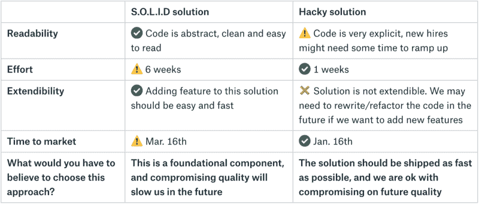

# 如何通过比较备选方案做出有效的决策

> 原文：<https://www.freecodecamp.org/news/how-to-make-effective-decisions-by-comparing-alternatives-99ab7d4388bb/>

### 没有更好，没有更坏…只是不同

“React.js 比 Angular 好太多了”。“Java 烂透了，没人用了……应该用 Golang”。“菠萝是最糟糕的比萨饼配料”。你可能听过这些非常直截了当的观点。一个选项是最好的，另一个是最差的，X 比 Y 好等等。但是 Java 仍然是世界上最流行的语言之一。Angular 给了一个体面的战斗 React.js .菠萝披萨…嗯，就是 Ewwww。

这是不是意味着一半以上的人都一无所知？或者不知道如何分辨哪种技术更好或者做出正确的选择？也许我们应该停止使用“更好”、“更差”、“最好”这样的术语，以及在评估替代方案时进行肤浅的比较。相反，我们应该关注每个解决方案的优点、缺点，以及哪一个更适合我们的具体问题。

### 评估备选方案

一种方法是创建备选方案对照表:

*   在标题中写下不同的选项。使用每列评估一个备选方案。挑选 2-5 个备选方案。
*   写出你认为对评估不同选择很重要的不同属性。挑选 2-5 个最重要的比较属性。
*   留最后一排做总结。没有更好/更差的解决方案，专注于每个备选方案解决问题的原因。

### “选择这种方法，你必须相信什么？”

例如，让我们假设我们有一个可以用两种方法解决的问题。一个是 [S.O.L.I.D](https://en.wikipedia.org/wiki/SOLID) 另一个是 hackier。有些人可能会说，无论在什么情况下，我们都应该使用神盾局的解决方案。这是否意味着任何使用 hacky 代码的人都是糟糕的开发人员？我表示怀疑。

让我们把这些选择放在一个表格里:

写完这张表后，我们可以把注意力集中在底线上，把它和我们的目标直接联系起来。

*“尽快发货，我们同意对未来质量做出妥协”*的一个案例可能是:

*   系统中存在的严重缺陷。没有解决方案的每一天都会造成长期损害。
*   我们与客户签订了合同，在特定日期交付解决方案。如果我们错过了最后期限，可能会有法律后果。
*   该公司有现金流问题。尽早交付解决方案会对我们的业务稳定性产生巨大影响。

如您所见，使用 S.O.L.I.D 并不总是更好的方法。如果我们关心代码质量，我们肯定应该默认它，但是我们必须确保我们知道权衡。选择一个解决方案，因为你相信这是达到目标的最佳途径。不要因为鲍勃叔叔或你公司的人说这样更好就去做。

### 不要只为了“盖章”而做评论

Photo by [Hello Lightbulb](https://unsplash.com/photos/hgITU7cj7k8?utm_source=unsplash&utm_medium=referral&utm_content=creditCopyText) on [Unsplash](https://unsplash.com/search/photos/stamp?utm_source=unsplash&utm_medium=referral&utm_content=creditCopyText)

在很多公司，点评([设计](https://hackernoon.com/tagged/design)点评，产品点评等。)有相同的仪式。特性所有者编写规范。然后，他们的经理会对其进行审核。该小组安排了一次会议来审查规范。不止一次地，有一种感觉是这些会议的目的是得到利益相关者的认可，而不是实际参与公开的讨论。发生这种情况的原因是:

*   如果你已经准备好了一个规范，为什么还需要 7 个人聚在一个房间里“检查”它呢？
*   当特性所有者阅读他们编写的规范时，会议往往会很无聊，可能会变成一场独白。
*   有时候，这些会议往往吹毛求疵。对话可以集中在对功能成功不重要的事情上(*“为什么我们使用 int32 而不是 int16？”、“字符串还是枚举？”，“制表符还是空格？”).*
*   有些人比其他人更内向。是否听到了所有的声音，还是只有少数人参与了对话？
*   关于某些细节的对话可能会比预期的时间长。在特性所有者覆盖整个规范之前，时间就用完了，有时甚至不到一半。这可能会令人沮丧。此外，如果需要召开后续会议，还可以推迟[决策](https://hackernoon.com/tagged/decosion)和整个项目的时间表。

### 准备好备选方案和目标，而不是解决方案

在我现在的公司，我们采取不同的方法。使用[纸张](https://paper.dropbox.com/)进行离线评审(受益于其共享、评论、任务等功能，使协作更加高效)。其他任何在线编辑器都可以。

对于设计会议，我们使用不同的模板。决策者选择对该功能的成功至关重要的 3-4 个最重要的开放式问题。然后，他们组成一个替代表，就像我们之前看到的那样。他们也可以推荐替代方案，但不应该固执己见。会议**的目的是**根据项目目标选择合适的方法。

然后，会议从专注于为解决方案“盖章”的独白转向关于最佳方法的公开对话。观众从批准者变成了建议者。功能所有者不需要“捍卫”他们选择的解决方案。它变成了一个决策者，将他们的解决方案建立在利益相关者的建议上。通过为每个问题设定时间(10-15 分钟)，您可以确保涵盖所有开放式问题。当时间到时，由特征所有者做出决定。

确保每个人的声音都被听到，即使是内向的人，就像“嘿，简，我们没有听到你的意见，你认为哪个选项会服务于我们的目标？x，Y 还是 Z？”

因此，下次你想比较两个或更多的替代方案时，用“React.js 更容易学习，更灵活，更新更频繁，所以如果我们的目标是快速培养新工程师，用最顶尖的技术更快地前进，这应该是我们在这两者之间的选择”来代替“React.js 比 Angular 好”。

至于“菠萝是最糟糕的比萨饼配料”——也许有些东西并不意味着有替代品。？

谢谢你花了 4 分钟的时间，下次再见。

-阿龙

*特别感谢:*

*   *Eric Suh，他推动了 Dropbox 工程审核流程的创建*
*   Pierpaolo Baccichet、Steve Eisner、Gal Zellermayer、James Cowling 和 Devdatta Akhawe，他们都作为流程的早期测试者和评审者提供了宝贵的反馈
*   [Rina art stain](https://www.freecodecamp.org/news/how-to-make-effective-decisions-by-comparing-alternatives-99ab7d4388bb/undefined)&[Keren](https://www.freecodecamp.org/news/how-to-make-effective-decisions-by-comparing-alternatives-99ab7d4388bb/undefined)*校对、审阅本文并给出令人敬畏的技术反馈*