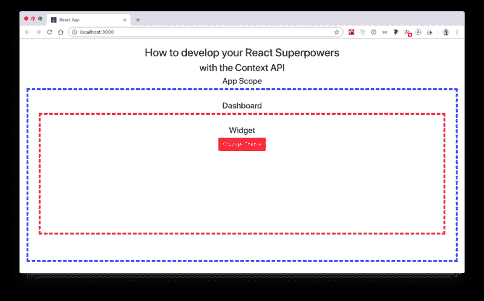
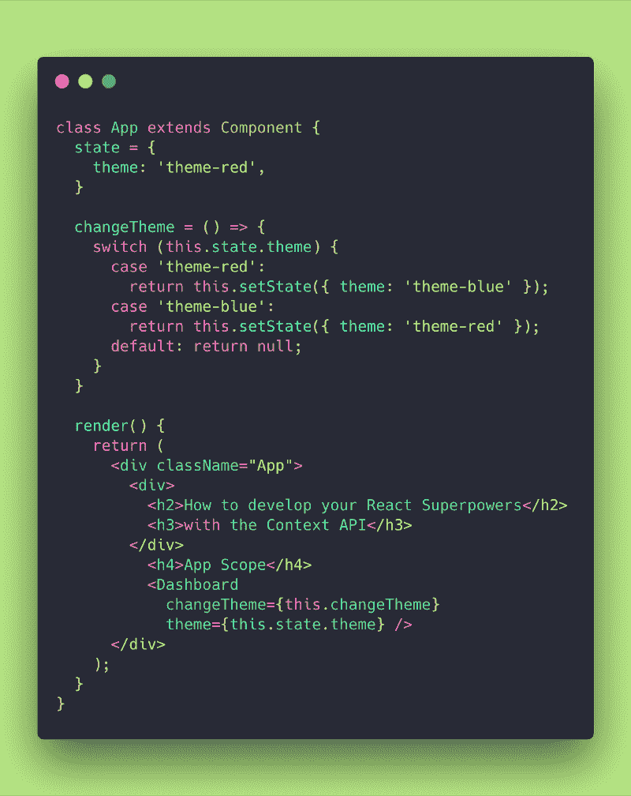
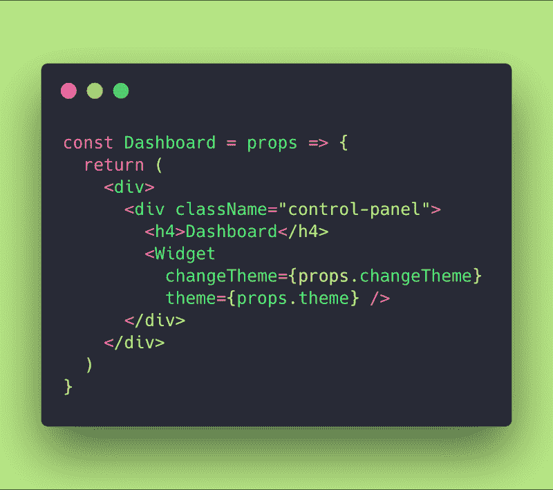
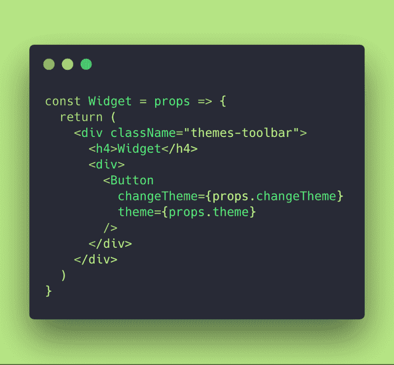
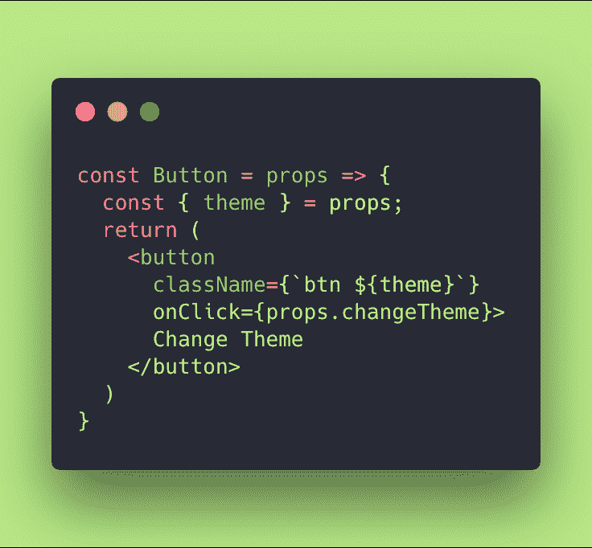
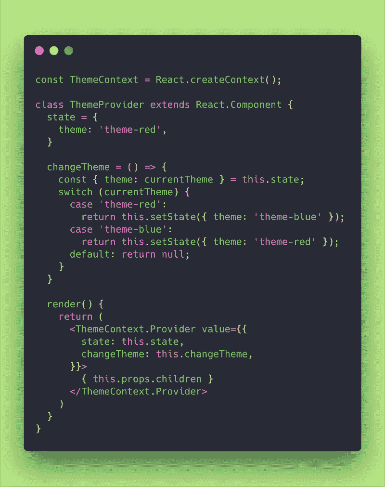
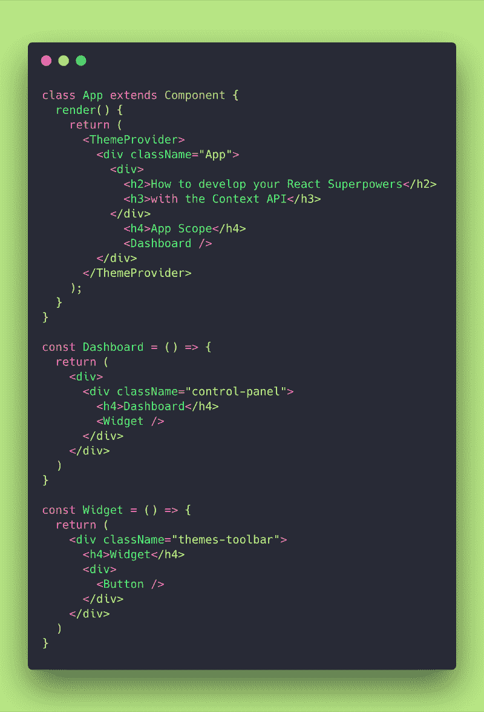
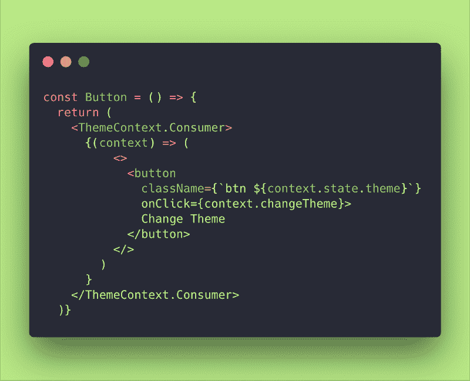

# 如何使用上下文 API 开发您的 React 超能力

> 原文：<https://www.freecodecamp.org/news/how-to-develop-your-react-superpowers-with-the-context-api-61e0ab952c02/>

嘿大家好！❤️

这次我将展示如何在 React 中使用上下文 API。

上下文提供了一种通过组件树传递数据的方式，而不必沿着每一层手动向下传递属性。

React 通常使用自顶向下(从父到子)的数据流。这在一连串的道具中工作得非常好，总是给虚拟 DOM 检查它的能力，并在需要时触发重新渲染。

我们还在每个有状态组件中使用本地状态来管理更改，允许用户更改通过 props 传播的数据。

当我们想要更抽象一点的时候，我们可以使用 [Redux](https://redux.js.org/) 来抽象状态或道具到一个“外部”的商店，一个真实的单一来源——如果你还没有读过我关于[如何在十分钟内用 Redux 让球滚动起来的文章](https://www.freecodecamp.org/news/redux-get-the-ball-rolling-in-10min-9d9551ff4b3c/)，请随意去做！

即使工具箱中有所有这些工具，在我们的应用程序中处理某些类型的数据(道具、状态等等)也是很麻烦的。

**想象当前认证的用户信息**、**主题**、 **locale️ o** r **甚至语言 r** ela **ted 数据。**

这是 React 组件树中被视为“全局”的信息。一旦你改变了这个信息，所有的应用程序都应该重新渲染以保持更新。

**上下文旨在共享可被视为**“全局”的数据。****

为了理解这一点，让我们把手弄脏吧！如果你愿意，你可以把我的 GitHub repo [放在这里](https://github.com/evedes/context-api)，玩一玩我们将要做的这些事情:

### **01。弄脏我们的手**

让我们建立一个应用程序，它有一个仪表板。

在仪表板里面有一个小部件，可以呈现一个主题按钮。

主题按钮允许用户更改应用程序主题。

**类似这样的:**

Image of the App

**那么，让我们从我们的应用组件开始:**

App Component

**这个组件有一个状态，一个`changeTheme`方法和一个呈现`<Dashboard` / >组件的呈现器。**

Dashboard Component

**Dashboard 组件接收道具，并呈现一个通过`changeTheme`和主题道具的 Widget 组件。**

Widget Component

**Widget 组件从其父组件接收道具，并呈现一个传入其中的按钮`changeTheme`和主题道具。**

Button Component

**按钮从其父节点接收道具，并最终利用它来呈现带有`className`的按钮，该按钮取决于用户选择的主题。**

**该按钮还允许用户将主题从红色切换到蓝色，反之亦然。这就是为什么它有一个`onClick`处理器来触发从应用组件- >仪表板- >小部件- >按钮自上而下传递的`changeTheme`方法。**

**正如大家看到的，这是一个很大的道具，很大的复杂性，很多重复的代码，很多？。**

因此，此时此刻，你在问我们如何避免这种情况？怎样才能把这些主题的东西都抽象出来，让我们的代码更干净？

答案是利用 React 提供的上下文 API！！

### **02。实现上下文 API**

好吧，首先要做的是。

让我们将所有与主题相关的复杂性从我们的主要应用组件中分离出来。

ThemeContext and ThemeProvider

**为此，我们首先使用`React.createContext()`创建一个`ThemeContext`。**

**然后我们创建了一个名为`ThemeProvider`的有状态组件，它将处理状态，这个`changeTheme`方法特定于这个主题化关注点。**

在 render 方法中，我们将返回 ThemeContext。提供者>拥有`value`道具，其中包含了我们想要传播的任何东西。该组件将使用渲染道具模式包含{ this.props.children }。

> 顺便说一句，如果你想知道更多关于渲染道具模式的信息，不要错过我的文章[这里](https://medium.freecodecamp.org/how-to-develop-your-react-superpowers-with-the-render-props-pattern-b74e68c6d053)。

通过这种方式，我们可以用我们的 state 和 changeTheme 方法将< ThemeProvider / >包含的价值道具注入到所有东西中。

好了，下一步是清理所有的道具？我们已经传递了自顶向下的父到子流程，非常重要的是，将应用组件的返回包装在我们的<主题提供者/ >组件中——这将为我们的应用提供“上下文”?。

各位，现在干净多了！❤️，我太高兴了！？

**让我们关注一下我们的按钮组件:**

嗯，这里我们刚刚连接了<主题上下文。Consumer >组件，在它的内部，我们传递了一个函数，作为上下文的子组件来呈现。

对于那些不知道这个< > < / >符号的人来说，它和<反应是一样的。片段>；</反应过来。片段>。

### 03。结论

各位，我玩得很开心！我们已经能够将所有的主题逻辑封装在一个名为< ThemeProvider >的适当组件中。

我们在需要的地方注入了上下文。在这种情况下，它是在<应用>组件中，但它可以在我们想要使用数据的任何地方完成。

最后，我们在需要的时候使用了数据。在这种情况下，它是在一个按钮组件中。

我们已经清除了应用程序中所有自上而下的道具流。

朋友们，这是双赢的局面！？

**非常感谢，永远记得*“要坚强，继续努力！”*？**

### **04。参考书目**

**01。 [React 文档](https://reactjs.org/docs/getting-started.html)**

**伊夫迪斯，2019 年 1 月**