# 基于 Firebase 的物联网原型:如何事半功倍

> 原文：<https://www.freecodecamp.org/news/iot-prototyping-with-firebase-doing-more-with-less-2f5c746dac8b/>

作者:Bayrem Gharssellaoui

# 基于 Firebase 的物联网原型:如何事半功倍

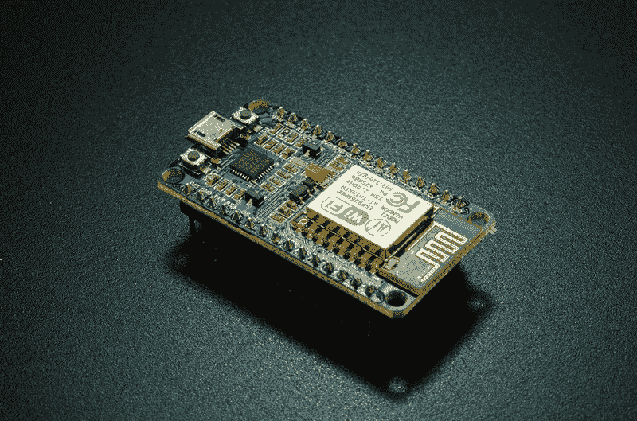

物联网就是将设备(或者你可以称之为“东西”)连接到互联网，然后分析从这些设备收集的数据，以提取附加值。在本文中，您将发现如何在从事物联网项目时从 [Firebase](https://firebase.google.com/) 中受益，以及它如何帮助您比传统方法更快、更容易地开发物联网原型。您还将开发自己的物联网项目，并将其托管在 Firebase 中。

### 点火前实时数据库

我的大多数物联网项目都需要不同终端之间的某种通信方式。这些端点可以是从设备和服务到应用程序的任何东西，最终数据需要存储在某个地方以供进一步处理和分析。

假设您想要构建一个物联网系统，其中一个设备将从传感器测量温度和湿度值，并将它们发送到数据库服务进行存储。然后，您希望有一个 web 应用程序来获取这些值，并在仪表板中显示它们。很简单，对吧…？

实现这一点的简单而轻量的方法是设置一个 [MQTT](https://www.hivemq.com/mqtt-essentials/) 代理，它将充当一个中枢，并将所有来自设备的**发布的**传入消息重新路由到所有**订阅的**客户端，就像本例中的 web 应用程序一样。

现在的问题是 web 应用程序如何显示数据？这意味着它是直接显示来自代理的消息，还是从数据库服务获取数据？

假设您希望应用程序做两件事:实时显示来自代理的数据**和从数据库获取数据**。在这种情况下，你可以想出两种方法(实际上有许多不同的方法)来实现这一点:

**第一个解决方案:**

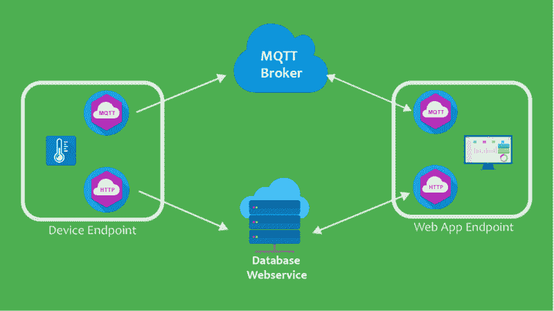

使用这种架构，设备将首先向代理发布其数据，然后向数据库 web 服务发送 HTTP 请求以保存数据。对于这个解决方案，设备需要实现两个客户端:一个 MQTT 和一个 HTTP 客户端。

**第二种解决方案:**

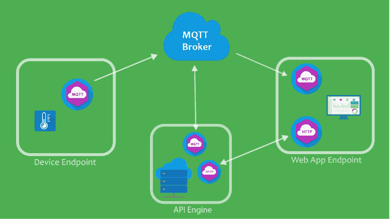

另一种方法是，设备将向代理发送或发布其数据，然后代理(如预期的那样)将该消息重新路由到所有连接的订阅者，如 web 应用程序。但是这次连接了另一个订阅者，它代表一个 API 引擎，该引擎将接受这些数据并将其发送到数据库 web 服务进行存储。

正如您可能已经注意到的，在这个解决方案中，HTTP 客户端与设备分离，并作为后端服务实现。这样你可以让设备程序变得更简单。在 CPU 和内存等资源有限的受限物联网设备上进行开发时，这一点非常重要。

尽管如此，这个解决方案在开发作为持久层的后端服务时还需要一些额外的工作。

那么有没有更简单的方法呢？

### 救火基地


正如你在上面看到的，事情很容易变得很复杂。对于像我这样想在开发原型时快速启动并运行的人来说，这可能需要一些额外的时间。这就是为什么，在文章的这一部分，您将看到 Firebase 如何在开发物联网原型时让您的生活变得更轻松，并节省您的大量时间。

Firebase 提供许多云服务，从认证、存储和云功能到托管您的 web 应用程序。在这篇文章中，你将使用 2 种服务:实时数据库和托管。

让我们从 **Firebase 实时数据库**开始。当阅读这个服务名时，我首先想到的是:好的，我知道什么是数据库，但是实时在这里意味着什么？

根据维基百科:

> **实时数据库**是使用[实时处理](https://en.wikipedia.org/wiki/Real-time_computing)来处理状态不断变化的工作负载的数据库系统。这不同于包含持久数据的传统数据库，后者大多不受时间的影响

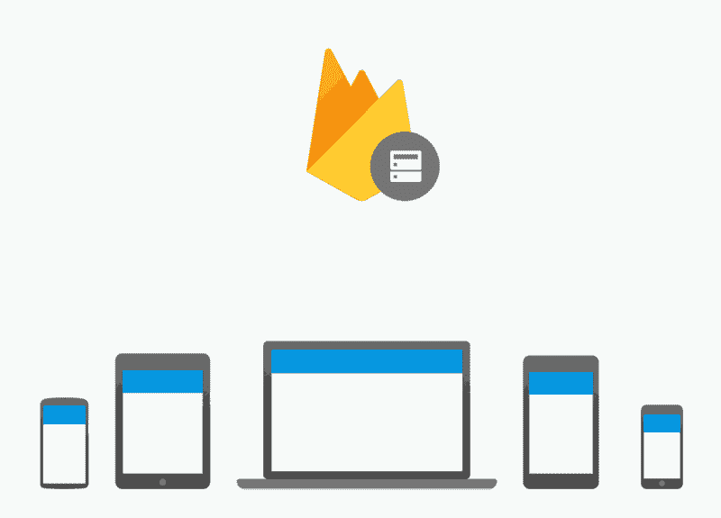

在 Firebase 实时数据库的情况下，客户端将连接到数据库，并通过 [websockets](https://blog.teamtreehouse.com/an-introduction-to-websockets) 保持开放的双向连接。然后，如果任何客户端将数据推送到数据库，它将被触发，并(在这种情况下)通过向所有连接的客户端发送新保存的数据来通知它们数据已被更改。

这种工作方式可能会让您想起 MQTT 代理，以及它从发布者那里接收消息并将其发送给所有订阅者时的反应。这次不同的是增加了数据持久化部分，也就是数据库。因此，正如您在这里看到的，您不需要自己使用其他协议来路由消息——Firebase real time Database 会处理这些，并执行其正常的数据库功能。令人惊奇不是吗？

回到前面提到的物联网系统，现在可以将设备连接到 Firebase 实时数据库，并让它定期将数据推送到数据库。在系统的另一部分，您有一个 web 应用程序，它将连接到与设备相同的服务，并在数据库发生变化时接收新数据。

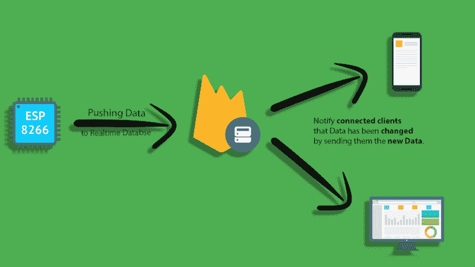

但是如何让**托管**web 应用程序呢？

Firebase 提供了一个托管服务，你可以用它来托管你的应用程序，而不是管理你自己的 web 服务器，处理部署和网络配置。好的一面是它是免费的(尽管有限制)并且非常容易使用。


现在是你们期待已久的部分。在这个演示中，您将使用本文中讨论的示例，并将其应用到生活中。

如果你还记得，物联网系统由 **2 个端点**组成:第一个是**物联网设备**，它负责将温度和湿度数据发送到 Firebase 实时数据库。这反过来将与第二个端点——**web 应用程序** —通信，后者将读取数据并将其显示在一个漂亮的仪表板上。

我会把这个项目分成 **3 个步骤**，这样会更容易理解。

### 1.建立 Firebase 实时数据库

这一步没什么特别的。你只需要去你的 [firebase 控制台](https://console.firebase.google.com/)创建一个新项目。在你的项目准备好之后，去数据库部分，并确保创建一个实时数据库**而不是云 Firestore 数据库。**选择在测试模式下启动并继续，因为您将仅使用该数据库进行测试和原型制作，而不是生产解决方案(因此您可以忽略红色警告)。现在数据库应该可以使用了。

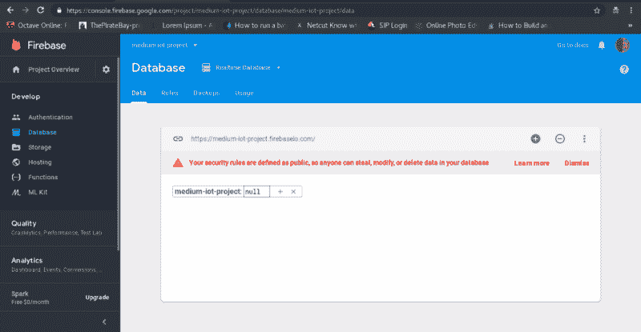

### 2.开发物联网设备应用


当谈到嵌入式系统开发时，您经常会听到低级编程、汇编、寄存器、内存管理等术语。这些术语和概念与您正在使用的硬件细节相关，并且可能会因硬件不同而有所变化。

这就是为什么，当构建想法的原型时，你没有时间深入挖掘这些细节并详细研究它们，因为你将同时处理其他高级语言，从而处理关于代码的其他方式。因此，你应该对设备的架构和特性以及如何使用它们有一个清晰的整体概念。


幸运的是，有一个专门为原型和抽象硬件的所有低级功能而设计的平台。是的，我说的是著名的 Arduino。

[**Arduino-Home**](https://www.arduino.cc/)
[*开源电子原型平台，让用户能够创建交互式电子对象。* www.arduino.cc](https://www.arduino.cc/)

请注意，当我谈论 Arduino 时，我指的是带有 IDE、编译器和库的 **Arduino 框架**,而不是主板。

所以你将使用 Arduino 对电路板进行编程，但是你问的是什么电路板？你需要一块能够与传感器接口并测量温度等物理值的电路板。它还应该能够连接到互联网，以便将这些数据发送到数据库。最后，它应该能够使用 Arduino 框架进行编程。

市场上有各种各样的主板可以完成这些任务。其中一些是 Arduino 板，另一些是 Arduino 兼容板。

在这个演示中，您将使用著名的 **NodeMCU，**Arduino 兼容板。它基于由总部位于上海的中国制造商 Espressif Systems 生产的 **ESP8266** SoC 芯片组。这种板对开发者来说很有吸引力，因为单个单元只需 3 美元就能买到。

#### 我们的装备

虽然 Arduino 平台提供了一个用于编程和上传代码到主板的 IDE，但它对开发者来说并不友好，因为它不提供任何智能感知功能或调试功能。这就是为什么，对于我的大多数物联网项目，我都使用一个名为 **PlatformIO 的环境。**

[**PlatformIO:面向物联网开发的开源生态系统**](https://platformio.org/)
[*跨平台构建系统和库管理器。跨平台 IDE 和统一调试器。远程单元测试和…*platformio.org](https://platformio.org/)

这是一个面向物联网开发的开源生态系统，你猜怎么着？它支持 Arduino 框架。所以你可以用它来写 Arduino 代码，编译，上传到开发板。最后，PlatformIO 很酷的一点是，它是一个**扩展**，你可以在 **Atom** 或 **VScode** 中使用，这样你就可以将它与你的 ide 的其他功能(Atom 或 VScode)一起使用。我强烈推荐观看这两个 YouTube 视频教程来设置和熟悉环境。

说够了，让我们开始吧:

#### 为 NodeMCU 开发固件

[**kaizoku-619/firebase _ node MCU**](https://github.com/kaizoku-619/firebase_nodemcu)
[*Arduino Firebase node MCU 客户端开发发送 DHT11 数据到 Firebase 实时数据库…*github.com](https://github.com/kaizoku-619/firebase_nodemcu)

在开始开发固件之前，我们先来谈谈电子设备的设置。

如果您还记得前面的例子，物联网设备将从传感器测量温度和湿度值，并将它们发送到云。在这种情况下，这意味着 **NodeMCU** 将从 **DHT11** 传感器模块读取温度和湿度值，并将它们发送到 Firebase。这里将使用 **DHT11** 模块，因为它很便宜，并且不需要任何额外的电子元件来工作。

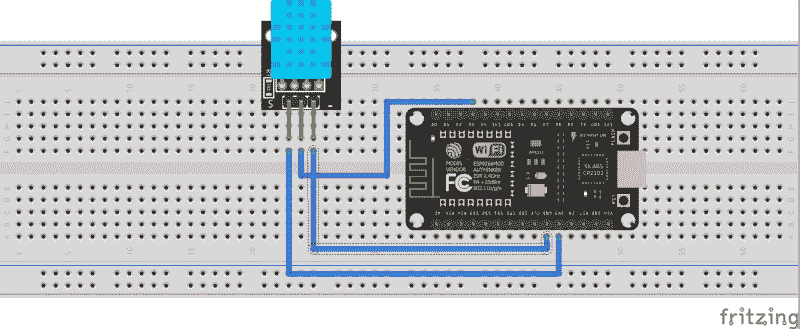

Wiring Diagram

从上面的线路图可以看出，DHT11 通过中间的 3 根线 **GND** 、 **3.3V** 和**数据信号**连接到板上。将数据引脚连接到电路板上的一个 **Dx** 引脚，这样就完成了布线。

现在连线已经完成，您可以开始使用 PlatformIO 编写固件了。


We’re not writing Go but I like the GIF

但是在你开始直接写代码之前，让我们停下来想一想程序应该做什么。

因此，该设备需要做的第一件事是连接到互联网。为此，它需要**连接到 WiFi** 接入点。一旦上线，它需要**打开与 Firebase 的连接。**之后，设备将**从传感器读取温度和湿度**值，最后**发布数据**。

以下是有序的任务列表:

*(注意，这里使用的世界**任务**是指代码块的功能，而不是像 FreeRTOS 任务那样的实时操作系统中的任务。)*

**1。连接 WiFi**
**2。打开与 Firebase**
**3 的连接。读取传感器值**
**3。将值发布到 Firebase**

让我们从第一项任务开始:

*   **连接 WiFi:**

该功能首先打印 **SSID** (AP 名称)并将 NodeMCU 设置为站模式而不是 AP 模式。然后继续加载，直到连接到 AP。SSID 和**密码**是在另一个文件中定义的两个常量，稍后您会看到。

*   **打开与 Firebase 的连接:**

这个函数非常简单:它有两个参数 **FIREBASE_HOST** 和 **FIREBASE_AUTH。**这也是在另一个文件中定义的两个常量。

*   **读取传感器值:**

首先为 **DHT** 传感器类型和 pin 定义 2 个常数。然后，通过将这两个常量传递给 DHT 构造函数来创建一个 DHT 对象。最后使用对象方法**read weather()**和 **readTemperature()** 分别读取湿度和温度。

*   **将值发布到 Firebase:**

这里，Firebase 类的 **pushInt()** 方法用于将一个整数推送到 Firebase，并在出现错误时打印出来。

现在你完成了任务！剩下的就是将这些任务放在一个干净的 arduino 草图中。

首先在 PlatformIO 中创建一个新项目，如下所示:

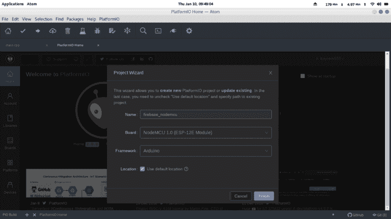

接下来，您需要**安装项目所需的库**。注意，在这种情况下，您将在本地安装库**，**，这意味着它们只适用于这个项目。如果有一天您决定在另一个项目中使用另一个版本的库，这是一个最佳实践。

进入 PlatformIO 主页→库，搜索 firebase。FirebaseArduino 会出现，所以点击它。但是**不要点击安装按钮**，而是点击安装旁边的 **…** ，选择要安装库的项目。最后点击安装。对 **DHT** 库重复此过程。

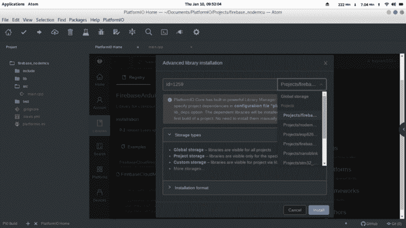

将这段代码复制到 **main.cpp** 文件中:

还记得包含 WiFi 和 Firebase 凭证的文件吗？转到 include 文件夹，创建一个新文件 **Creds.h** ，并将这段代码复制到其中。别忘了**根据**你的证件**更改**密码。

这就对了。上传固件到 **NodeMCU** ，你的设备应该可以发送数据到 **Firebase 实时数据库**。

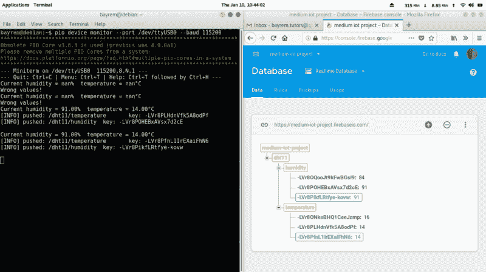

### 3.开发和托管 web 应用程序

[**kaizoku-619/firebase _ IOT _ web**](https://github.com/kaizoku-619/firebase_iot_web)
[*Firebase web 应用客户端连接到 Firebase 实时数据库获取传感器值…*github.com](https://github.com/kaizoku-619/firebase_iot_web)

现在，物联网设备已经准备好并将数据推送到实时数据库，您可以移动到系统中的另一个端点，即 web 应用程序。它将从 Firebase 接收数据，并显示在仪表板上。

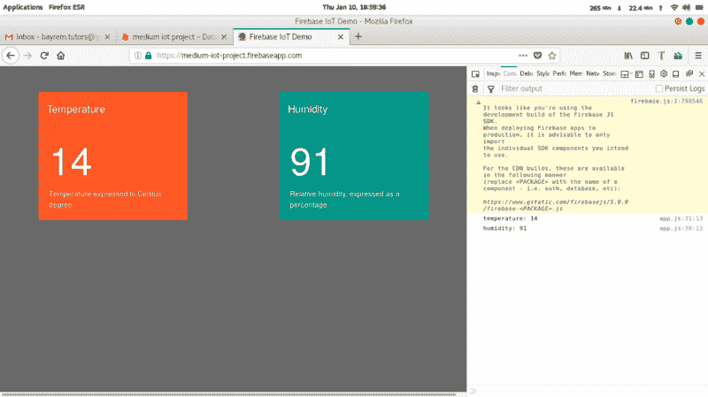

您将从本地开发应用程序开始，并最终部署它。

从设置项目开始。

#### **安装 Firebase CLI:**

**Firebase CLI** (命令行界面)需要 **Node.js** 和 **npm** (节点包管理器)。安装后，您可以通过运行以下命令，使用 npm 继续安装 Firebase CLI:

```
npm install -g firebase-tools
```

您可以按照视频完成项目设置。

项目设置完成后，您的目录应该如下所示:

```
├── database.rules.json├── firebase.json└── public   ├── 404.html   └── index.html
```

首先构建**仪表板 UI。**这将是 index.html 的**文件。打开文件并将其更改为如下所示:**

这是一个简单的使用[自举素材设计](https://fezvrasta.github.io/bootstrap-material-design/)设计的 **HTML** 页面。它由 **2 卡**元件组成，一个显示湿度，一个显示温度。

至于这里的 firebase 部分，首先在 head 标记内的 script 标记中导入 Firebase 依赖项。最后，当页面完成加载时，它调用 **app.js** 。

现在仪表板 UI 已经准备好了，您可以继续到 **app.js** 了，在这里您实现了 firebase 连接和您的业务逻辑。在同一个目录下创建一个名为 **app.js** 的新文件，并复制以下代码:

该脚本首先创建一个配置对象。最好的方法是直接从 firebase 控制台的 firebase 项目中复制。为此，导航到您的 firebase 控制台，并转到 firebase 项目设置。然后向下滚动，点击**<**；/ >图标如下所示:

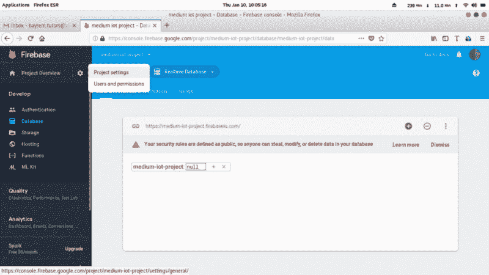

我想剩下的代码通过注释是不言自明的。

现在您的应用程序应该准备好了，您可以使用以下命令在本地测试它:

```
firebase serve
```

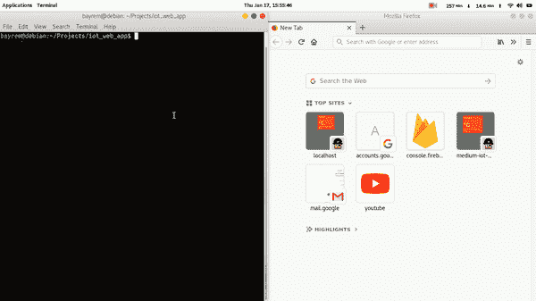

请注意，在启动时，应用程序将从数据库中获取最新的温度和湿度值。太好了！这款应用可以在本地运行，但迄今为止，它只能在你的本地主机上运行，无法从外部访问。这意味着是时候使用 **Firebase 托管在 web 上托管它了。**

但是在部署它之前，您只需要做最后一件事。转到 **database.rules.json** 文件，将读写规则改为“ **true** ”。不建议在生产中使用这种方法，因为它不安全，但在这里用于演示目的是很好的。

完成后，您就可以开始部署了:

```
firebase deploy
```

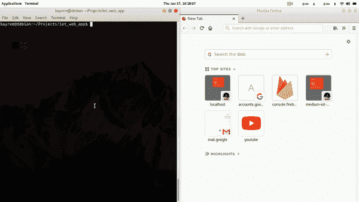

这就对了。如果您已经做到了这一步，那么现在您应该已经部署并运行了一个活动的 web 应用程序。

### 把所有的放在一起


是时候把所有东西放在一起测试系统了。将**节点 MCU** 插入您的电脑，如果您还没有上传草图，请上传:

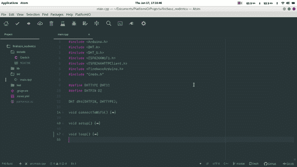

打开 web 应用程序和 firebase 数据库，观察它随着设备发送的值实时变化。

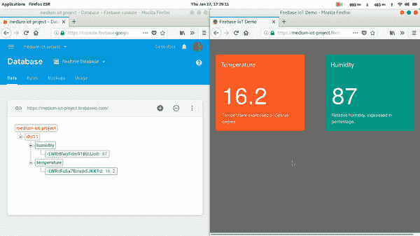

现在打开**串行监视器**，观察从设备推送到网络应用的数据。请注意，您可以在浏览器中打开控制台来查看接收到的值。这里我使用的是波特率为 115200 bps 的 [Gtk 串口终端](https://linux.die.net/man/1/gtkterm)，但是你也可以使用集成的 **PlatformIO** 串口监视器或者任何其他你选择的工具。

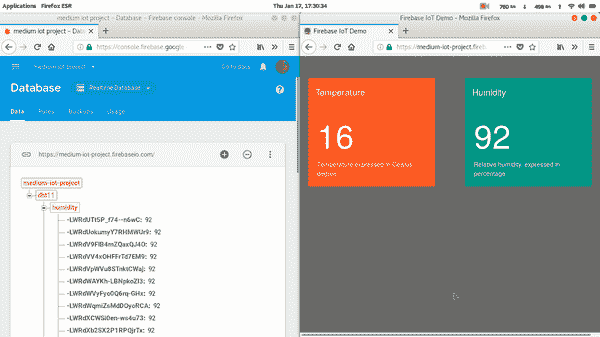

### 解决纷争

我在 **ESP8266** 上开发应用程序时遇到了一个问题(我花了一些时间才弄明白)。即使一切都配置正确(WiFi 连接、Firebase 主机、密钥)，ESP8266 **也无法连接到 Firebase。**这是由于 Firebase 库中的 **FirebaseHttpClient.h** 文件中的**错误指纹**造成的。你需要用你自己的指纹来代替它。如果您使用 **PlatformIO** 在本地安装了库，那么您可以在以下路径中找到该文件:

```
your_project_folder/.piolibdeps/FirebaseArduino_ID1259/src/
```

要**生成**指纹，去这个网站复制你的没有 https 部分的 Firebase 主机链接，点击指纹网站(我的是:
medium-IOT-project . Firebase io . com):

[**GRC | SSL TLS HTTPS Web 服务器证书指纹**](https://www.grc.com/fingerprints.htm)
[*GRC 的 HTTPS Web 服务器证书指纹服务*www.grc.com](https://www.grc.com/fingerprints.htm)

这将为您的站点生成一个指纹，所以继续复制它，在 **FirebaseHttpClient.h** 文件中替换旧的**kfirebaseinfingerprint[]**值。这应该可以解决问题。


### 结论


如果你能走到这一步，恭喜你！

我们只是触及了表面。物联网是关于实验和探索的，所以我鼓励你不要停在这里，继续通过犯错误和在代码中寻找 bug 来学习。但最重要的是，不要忘记在你的学习旅途中享受乐趣。

### 参考

[**Firebase 实时数据库| Firebase 实时数据库| Firebase**](https://firebase.google.com/docs/database/)
[*存储数据并与我们的 NoSQL 云数据库同步。数据在所有客户端之间实时同步，并保持可用……*firebase.google.com](https://firebase.google.com/docs/database/)[**platform io:面向物联网开发的开源生态系统**](https://platformio.org/)
[*跨平台构建系统和库管理器。跨平台 IDE 和统一调试器。远程单元测试和…*platformio.org](https://platformio.org/)[**Arduino-Home**](https://www.arduino.cc/)
[*开源电子原型平台，支持用户创建交互式电子对象。*www . arduino . cc](https://www.arduino.cc/)[**自举素材设计**](https://fezvrasta.github.io/bootstrap-material-design/)
[*世界上最流行的 HTML、CSS、JS 素材设计库。*fezvrasta . github . io](https://fezvrasta.github.io/bootstrap-material-design/)[**ESP8266/Arduino**](https://github.com/esp8266/Arduino)
[*ESP8266 核心为 Arduino。在 GitHub 上创建帐户，为 esp8266/Arduino 开发做出贡献。*github.com](https://github.com/esp8266/Arduino)[**firebase extended/Firebase-Arduino**](https://github.com/FirebaseExtended/firebase-arduino)
[*Arduino 为 Firebase 的样品。在…*github.com](https://github.com/FirebaseExtended/firebase-arduino)[**GRC | SSL TLS HTTPS Web 服务器证书指纹**](https://www.grc.com/fingerprints.htm)
[*GRC 的 HTTPS Web 服务器证书指纹服务*www.grc.com](https://www.grc.com/fingerprints.htm)上创建一个帐户，为 firebase extended/firebase-arduino 开发做出贡献