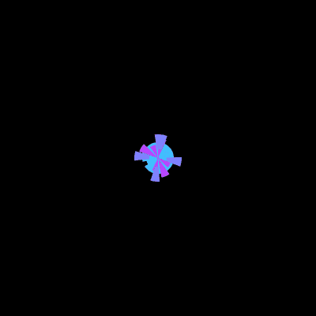
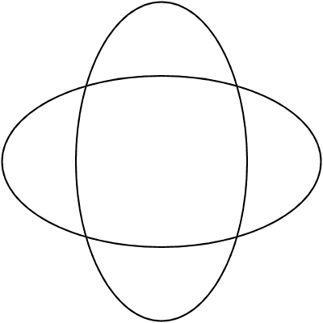
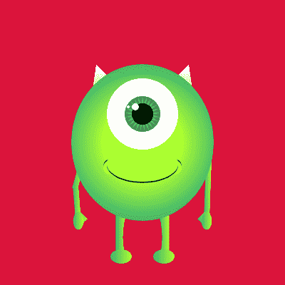
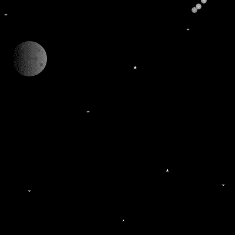
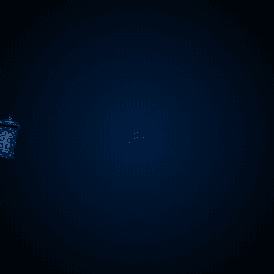
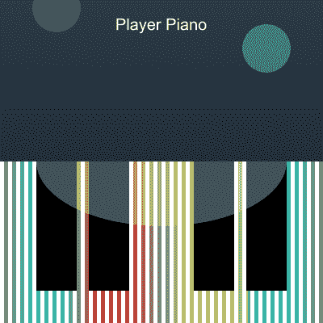
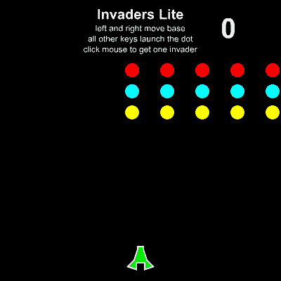
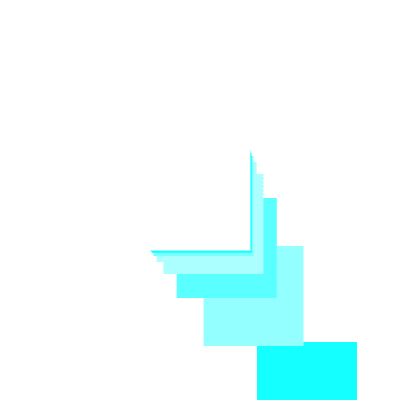

# 我们如何教 K-12 学生如何编码

> 原文：<https://www.freecodecamp.org/news/how-were-teaching-k-12-students-how-to-code-e0dcc31192db/>

作者:克里斯托佛·乔治

# 我们如何教 K-12 学生如何编码



This application is an exercise on CMU CS Academy.

你好世界！(抱歉，我没忍住。)我叫克里斯托佛·乔治，目前是卡耐基·梅隆大学的大三学生，学习可视化智能计算机系统。

自从上大学以来，我对高质量的计算机科学教育有了更多的了解。

我在校园里为一个名为 [CMU CS 学院](https://academy.cs.cmu.edu/splash)(卡耐基梅隆大学计算机科学学院)的项目工作，其目的是将一个**免费、** **世界级的** **计算机科学课程**带到高中水平。

**CMU CS 学院是本文的主题。**在这篇文章中，我会用 gif 和图片来展示整个课程和平台的能力。

> ***本文使用的所有媒体都是用 CMU CS 学院的图形包制作的。***



This application was created in the Sandbox on the CMU CS Academy website.

### 什么

CMU CS 学院是一门*完全免费的 9 年级计算机科学在线课程。*

> ***“想一想，可汗学院的类固醇。”***

> *“这不是‘拖放’编程。我们正在教(孩子们)使用 Python，这是一种基于文本的编程语言，是大学里教授得最广泛的语言。”大卫·科斯比教授*

> *目前，CMU 的 CS 学院正在运行其初始课程的第二个试点项目，即 9 年级 CS1，编程和计算机科学导论。该课程使用 Python 编写的自定义图形包向学生介绍计算机科学所需的编程和解决问题的技能。除了代数准备之外，不需要任何先决条件。该项目在美国和卢旺达有 40 所高中参与，超过 1000 名学生使用该课程。*

*学生们通过用 Python 创作图画、动画和游戏来学习如何编码。向你解释这有多棒，以及这给九年级学生带来了什么的最好方式，就是向你展示 CMU 计算机学院能做些什么。这是学生作为课程的一部分完成的练习的一个小展示。(整个课程有超过 255 个自动评分练习。)*

*

This application is an exercise on CMU CS Academy.* *

This application is an exercise on CMU CS Academy.* *

This application is an exercise on CMU CS Academy.* *

This application is an exercise on CMU CS Academy.* *

This application is an exercise on CMU CS Academy.* 

*该课程旨在为准备学习代数的学生在高中讲授。*

*学生们，如果你访问了[网站](https://academy.cs.cmu.edu/splash)，并且觉得它有趣、好玩或者值得，我强烈建议你去和你的学校谈谈。*

*老师们，如果你们还没有 9 年级的计算机编程课程，那就开始吧！它在这里。拿着吧。我们正在努力给你！教你的孩子如何编码！*

#### ****我们提供什么****

*   *CMU CS 学院不仅仅是一个免费的课程，而是一个完全由学生掌握进度的在线教材。**——*又想，可汗学院打了兴奋剂。****
*   *老师是向导，领导者，调试者，通过代码的曲折和危险的旅程。*
*   *在这篇文章发表的时候，CMU CS 学院有超过 255 个练习，完全是自动评分的。也就是说，老师不必坐几个小时批改作业，直到深夜。*
*   *[访问我们的网站，看看还有什么](https://academy.cs.cmu.edu/splash)*

### *为什么*

*软件开发人员、计算机工程师、设计师、建筑师、学校教师、作家、舞蹈家，当他们知道如何编码时，每个人都会受益。*

*最近，美国(和全世界)都在推动让孩子们更好地为这场技术革命做准备。这个项目，这个机会，就是准备工作开始的地方。*

> *CMU CS 学院旨在弥合 Scratch 基于块的代码和高中以后的 ap 计算机科学课程之间的差距。*

### *节目*

> *那么克里斯。我该如何将这门课程引入我的九年级班级呢？“我如何让我的孩子学习这些东西，”*

#### *教师/学校行政人员*

*   *如果您是教师或管理员，现在就可以在我们的[网站](https://academy.cs.cmu.edu/splash)上制作一个模拟账户！*
*   *这将让你预习本课程的笔记和练习。*
*   *在那里，你可以联系我们的项目经理来建立一个完整的教师帐户(通过网站)。*

#### *学生/家长/其他任何人*

*如果你不直接隶属于一所学校，但仍然希望在你的地区这样做，你可以也应该联系你的学校管理部门，请他们调查我们。纠缠他们！请将它们发送到我们的网站！*

*你也可以找到一个已经在教编程课程的老师，(可能是在 20 世纪 80 年代创建的)向他们展示网站，看着他们的眼睛变得发亮，兴奋地尖叫。*

### *包裹*

*最后可以去探索一下[网站](https://academy.cs.cmu.edu/splash)，现在都是荣耀了。有一个[沙盒](https://academy.cs.cmu.edu/ide)模式，你可以写任何你喜欢的程序。这些[文档](https://academy.cs.cmu.edu/docs)对那些只想玩图形软件包的人也很有帮助。*

*下面，我将有一些我做得非常快的示例练习，但是要知道这个平台的可能性是无限的，因为你是在浏览器中编写纯 Python。*

#### *笔记*

*任何有 Python 图形包经验的人都可能注意到明显缺乏 MVC。在对该平台的教学目的进行了大量的辩论后，图形包的这一方面和所有其他方面都得到了解决。他们的决定，部分是基于我们认为九年级学生学习编码最简单的方法。*

*正如我所承诺的，这里有一些代码示例，可以从中获得乐趣！以及所有的链接:)*

#### *链接*

*这里是 CMU CS 学院的网站。如果你是老师/管理员，可以做一个模拟账户。如果你是其他人，你可以在沙盒里玩一玩，做一些很棒的东西。*

*通过 CMU 的另一个资源是技术知识。这是一个 CMU 学生组织，拥有许多免费课程，用于在**课后**环境中教授编程。我们有[中学课程](https://github.com/google/teknowledge)(通过谷歌开源)[高中机器学习课程](https://github.com/Teknowledge/Curriculum)，还有[高中安卓 app 开发课程](https://github.com/Teknowledge/Curriculum)。*

*这里有一份关于 CMU CS 学院的 CMU 新闻稿。*

#### *代码示例*

*

This application was created in the Sandbox on the CMU CS Academy website.* 

```
*`backRects = Group()def drawRects():    for i in range(20):        backRects.add(Rect(200, 200, 100, 100,                            fill=rgb(randrange(0, 255), 255, 255), align='center'))    Rect(200, 200, 100, 100, fill='white', align='center')    drawRects()`*
```

```
*`def onMouseMove(mouseX, mouseY):    currentDistance = distance(200, 200, mouseX, mouseY)    angle = angleTo(200, 200, mouseX, mouseY)    for r in backRects.children:        newX, newY = getPointInDir(200, 200, angle, currentDistance)        r.centerX = newX        r.centerY = newY        currentDistance /= 2`*
```

*

This application was created in the Sandbox on the CMU CS Academy website.* 

```
*`app.background = 'black'dots = Group()`*
```

```
*`def onMousePress(mouseX, mouseY):    for i in range(10):        c = Circle(mouseX, mouseY, randrange(1, 20), fill='white')        c.dx = randrange(-30, 30, 5)        c.dy = randrange(-30, 30, 5)        c.line = Line(mouseX, mouseY, mouseX, mouseY, fill='white')        dots.add(c)`*
```

```
*`def onStep():    for d in dots.children:        d.centerX += d.dx        d.centerY += d.dy        if (d.centerX < 0 or d.centerX > 400 or d.centerY < 0 or d.centerY > 400):            dots.remove(d)        d.line.x2 = d.centerX        d.line.y2 = d.centerY`*
```

*最后，作为一名教师、学生或世界公民，这是一个你应该感到兴奋的机会。我知道我是！*

*所以，请…联系你的学校，向他们展示可能性！*

*快乐编码:)*