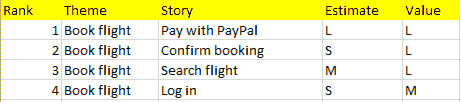
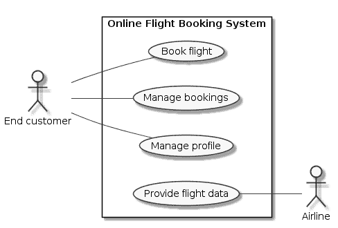
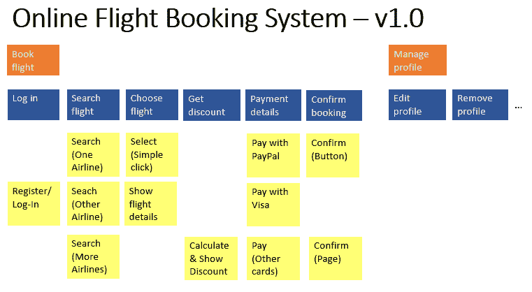

# 史诗已死。这是我们应该做的。

> 原文：<https://www.freecodecamp.org/news/epics-are-dead-heres-what-we-should-do-instead-279bada1e644/>

什么还没有被宣布死亡？测试驱动开发在年前就被埋没了。尽管如此，它仍在继续蔓延。当然，[敏捷死了](https://www.youtube.com/watch?v=a-BOSpxYJ9M)也一样。但是即使是传统公司也会接触 Scrum。死去的人继续活着，但是宣布某样东西已经死去总是适合一个时髦的标题。从这个意义上说，看看我是如何作为敏捷实践摧毁 epics 的吧。

### 什么是史诗？

这个术语很模糊。这有好处。史诗更多的是为了交流而不是规范。这种模糊性使它们变得多才多艺。但是存在误解的风险。我坚持迈克·科恩的定义:

> Scrum 史诗是一个庞大的用户故事。([来源](https://www.mountaingoatsoftware.com/blog/stories-epics-and-themes))

我是这样使用这个术语的:史诗是一个太大而无法在 Scrum sprint 中实现的故事。因此，产品待办事项清单顶部的项目不是史诗，而是小故事。在积压下来的作品中，你通常会发现史诗。随着时间的推移，史诗被“分割”成故事，这些故事可以被拉进冲刺阶段。

这是我多年来在培训课程中教授的内容。这似乎是普遍的共识。乍一看很直观。我在这里解释一下为什么不实用。

### 处理史诗的三种不切实际的方法

迄今为止，我遇到过三种公司处理史诗的方式。都不实用。让我们称他们为:

#### 溶解

1\. Dissolution

#### 链接

2\. Links

#### 树

3\. Trees

### 1.溶解

解散的原则很简单。一部史诗完全被分解成各个部分，一个个小故事。

例如，一个在线航班门户网站的史诗般的“预订航班”可以被分解成单独的流程步骤。于是“登录”、“搜索航班”等等。每一个过程步骤都成为一个故事。这个团队估计这个故事。只要太大，团队就继续切片。一旦所有的故事都小到足以适合 sprints，团队就删除史诗，开始开发故事。

困扰我的是完整性的潜在概念。解散暗示一个题目可以在预定的范围内完成。但是如果在开发过程中可能会对故事进行修改，你就不能预先定义所有的故事。

Scrum 指南说:

> 产品积压从来都不是完整的。[……]需求永远不会停止变化。

如果你必须交付一个固定的范围，停止假装。忘记史诗，提前描述详细的需求。那就不要自称敏捷了。

### 2.链接

如果你没有完全溶解你的史诗，使用链接是有意义的。史诗仍然存在，在积压下来。你把新的小故事和它们衍生的史诗联系起来。

风险在于，随着时间的推移，史诗的数量会增加。积压变得臃肿。它包含了你不再需要的史诗。涉众已经不在公司了。或者话题不再相关。

当然，你也可以时不时的清理一下自己的积压。我认为这是不增值的工作。你可以避免它，我将在后面描述。

### 3.树

另一种方式是把史诗和故事描绘成一棵树:

Depiction of epics as a tree

你把小故事按史诗分类。这主意不错。但是你失去的是待办事项的有序列表。那你怎么确定实施顺序呢？

当然，您可以使用支持这两种视图的数字工具。风险:你在工具上投入了太多的时间和精力。有哪些观点？有哪些属性？底层数据模型是什么？有趣的问题。但是在敏捷方法中，它们不应该有高优先级。

综上，分组的想法是好的。但是做起来很费时间。

### 史诗的替代品

早就有替代方案了。我在上面链接的迈克·科恩的同一篇博文中甚至提到了这一点。

我说的是*主题*。

主题可以被认为是故事的附加属性。通常，几个故事分享同一个主题。故事“搜索航班”的主题可以是“图书航班”。backlog 中的一个片段可能如下所示:

User Stories with theme

主题不是作为单独的 backlog 元素来管理的。这消除了链接一章中讨论的清理工作。那很好。

但你失去的是从大史诗到一个冲刺就能实现的故事的逐步提炼过程。那很糟糕。

幸运的是，有一些实践使得在 backlog 之外进行这种细化成为可能。确定主题的一种方法是用例图:

这种图表的好处在于，由于高度的抽象和图形化表示，它们显示了“大画面”。为此，积压是不合适的。

用例名称后来成为 backlog 中的主题。但是你如何从用例到故事呢？对于这一点，杰夫·巴顿的故事映射非常合适:

示例地图的顶部两行显示了用例“预订航班”和“管理个人资料”及其基本流程。在单个步骤下，团队挂起了备选方案:其他流程、错误等等。这些黄色注释称为用户任务。

在 Backlog 精化中，团队从用户任务中获取故事。任务可以作为故事的标题。团队在故事中添加了一些细节，比如验收标准。

### 后果

应用这种替代方法会带来一些后果。例如，产品 Backlog 将只包含接下来 1-2 个 sprints 的故事。所以可能有 10 到 20 层。

所有活动，如进一步的优先排序、评估和验收标准的阐述，都只发生在这些故事中。正如第十条敏捷原则所说:

> 简单——最大化未完成工作量的艺术——至关重要。

如果管理层希望深入了解开发进度，这在三个层面上是可能的:

*   **用例图或主题**为管理层提供长期视角。一年，甚至更久。但是:它们不适合指定细节。
*   **故事地图**构成了发布计划的基础。对发布感兴趣的涉众与团队成员一起创建故事地图。(由于新的发现，范围可能会在开发过程中发生变化。)
*   那些希望在开发过程中有深刻见解并影响细节的人参与**冲刺评审**和**待办事项细化**。

只有在低空，我们才能看到细节。产品积压基本上就像一个购物清单。你会写下你一年内想买的东西吗？

最后，但同样重要的是，史诗的死亡预示着消费主义的死亡。如果你想要什么，你必须同意团队的意见，并紧密合作。

### 验尸

在与同事的讨论中，他们指出，即使在一部史诗解散后，也可以加入小故事。没错，对我来说这是一个可以接受的解决方案。然而，在这种情况下丢失的是我在用例图中展示的“大图”。

最终，产品对用户的适用性决定了它的成功。而不是它是如何制作的。这适用于所有的开发实践，包括史诗。
也许你已经想出了一个明智的处理史诗的方法？

*通过访问我的在线课程，学习如何[有效地管理你的产品积压](https://skl.sh/2Edz9Zu)。这篇文章最初用德语发表在[胡德博客](https://blog.hood-group.com/blog/2019/01/02/epics-sind-tot/)上。*