# 2019 年 React 简介(给那些对 jQuery 了解不多的人)

> 原文：<https://www.freecodecamp.org/news/react-introduction-for-people-who-know-just-enough-jquery-to-get-by-2019-version-28a4b4316d1a/>

朱利安·本奇特里

# 2019 年 React 简介(给那些对 jQuery 了解不多的人)

早在 2015 年， [@chibicode](https://twitter.com/chibicode) 的“ [React.js 介绍给懂 jQuery 的人刚刚过得去](https://chibicode.com/react-js-introduction-for-people-who-know-just-enough-jquery-to-get-by/)”是我第一次接触 React，也是为我揭开整个事情神秘面纱的教程。

它以细致的方式带您了解 React 的基础知识，特别适合来自 jQuery 世界的任何人。

不幸的是，当我最近试图分享它时，我意识到它使用的是 React 现已过时的`createClass` API，图像和嵌入式代码样本不再加载。

所以在得到了 [@chibicode](https://twitter.com/chibicode) 的允许后，我用 React 和 JavaScript 的最新版本重写了他的文章，并扩展了一些解释。

请注意，虽然这个教程的绝大部分是他的工作。我希望它对你和对我一样有用。

事不宜迟，让我们学学我们的一些反应吧！

> **小免责声明:**部分图片来自 [@chibicode](https://twitter.com/chibicode) 的原文章，显示的代码与我们这里使用的代码略有不同。这些图像仅用于说明目的。请务必参考编写的代码示例。

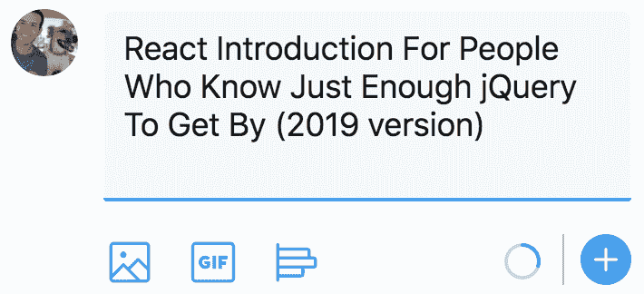

#### 目标受众:对 jQuery 了解不多的人

在我开始之前，我想澄清一下谁是目标受众。

“[艰难地学习代码](https://learncodethehardway.org/)”系列的作者 Zed Shaw 写了一篇名为[早期与初级程序员](https://zedshaw.com/2015/06/16/early-vs-beginning-coders/)的优秀博文。在他的帖子中，Zed 批评了那些声称他们的材料是为“初学者”准备的编程教育者，但实际上对于大多数“完全”初学者来说是无法理解的。

我不想在这里犯类似的错误。在从未尝试过 React 的人中，有些人对前端 JS 框架很熟悉，如[主干](http://backbonejs.org/)、[余烬](https://emberjs.com/)或[棱角](https://angular.io/)。有些人非常了解 JavaScript。有些人知道的 jQuery 刚刚够用。对一个群体有效的教程对其他群体可能不是最佳的。

在本教程中，我的目标是我提到的第三类人:**那些对 jQuery 的了解仅够应付**的人。可能属于这一类别的人员包括:

*   可以用 HTML/CSS/jQuery 做基本编码的设计师。
*   知道如何使用 jQuery 插件的 WordPress 开发者。
*   已经在线完成基本 HTML/CSS/JS 教程的初级开发人员。
*   依赖 Bootstrap 和基本 jQuery 来满足前端需求的后端开发人员。
*   任何一个在 JavaScript 方面更多的是复制粘贴而不是构建的人。

**如果你对 JavaScript 或任何前端框架如 Backbone/Ember/Angular 很熟悉，本教程不适合你**，你会对我的写作风格感到非常失望。有很多很棒的教程可以让你学习，包括[官方 React 教程](https://reactjs.org/tutorial/tutorial.html)。

另外，**如果你已经知道 React** ，你也会对我感到很失望，因为我将主要谈论**状态**，而不是不变性或组件。然而，我发现首先教授状态是 jQuery 开发人员了解 React 为什么更优越的最佳方式。

不管怎样，让我们开始吧！

### 预计时间:1 ~ 2 小时

如果你真的很快(复制粘贴示例代码而不是打字)，本教程应该需要一个多小时。如果你慢慢来，应该需要 2 个多小时。

#### 如果你卡住了

如果你卡住了或者有问题，你可以发微博给原作者 [@chibicode](https://twitter.com/chibicode) 或者我 [@julienbenc](https://twitter.com/julienbenc) 。

### 概述:我们将建立一个“推特盒子”

很多 React 教程都是从解释 React 如何工作或者 React 为什么牛逼开始的。本教程没有。

相反，我们将直接构建一个简单的 UI，交替使用 jQuery 实现和 React 实现，并解释其间的差异。我相信你会用这种方式思考，而不仅仅是打出例子。

我们将构建的 UI 将类似于你在 Twitter 上找到的 Tweet box。它不会完全像真正的 Tweet box，但会非常相似。希望你会发现这个例子很实用。

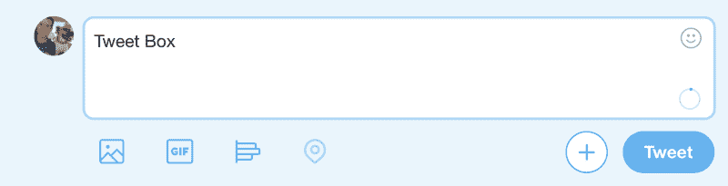

### 步骤 CodePen 简介(5-10 分钟)

我们将使用 [CodePen](https://codepen.io/) ，一个支持 jQuery 和 React 代码的在线代码编辑器。你可能熟悉类似的服务，如 [JSBin](https://jsbin.com) 或[js fiddle](https://jsfiddle.net/)——它们都非常相似，但为了更容易嵌入，我选择了 CodePen。

这是一支钢笔的例子:

[https://codepen.io/julienben/embed/preview/XoYQyj?height=300&slug-hash=XoYQyj&default-tabs=html,result&host=https://codepen.io](https://codepen.io/julienben/embed/preview/XoYQyj?height=300&slug-hash=XoYQyj&default-tabs=html,result&host=https://codepen.io)

点击“运行笔”查看代码运行时发生的情况以及代码本身(点击`HTML`按钮)。

接下来，点击“在 CodePen 上编辑”,在新窗口中打开笔。**您现在可以修改左上角**的 HTML，即更改按钮的文本。您将在窗口的下半部分看到这些更改。这就是 CodePen 的工作方式。

#### 创建一个 CodePen 帐户

除非你已经有一个 CodePen 账号，否则**头到[https://codepen.io/](https://codepen.io/)头到**头到**创建一个账号**。点击**注册**创建您的账户。

创建账户后，你可以**叉**公笔到你的账户。或多或少与将 GitHub 存储库分支到您的帐户中是一样的。

让我们试一试。在新标签中打开下一支笔，点击右上角菜单中的“Fork”。

[https://codepen.io/julienben/embed/preview/XoYQyj?height=300&slug-hash=XoYQyj&default-tabs=html,result&host=https://codepen.io](https://codepen.io/julienben/embed/preview/XoYQyj?height=300&slug-hash=XoYQyj&default-tabs=html,result&host=https://codepen.io)

一旦你动笔，你可以导入流行的开源库。您可以打开“设置”,然后转到 CSS 或 JavaScript 选项卡，在那里您可以搜索您想要添加的库。

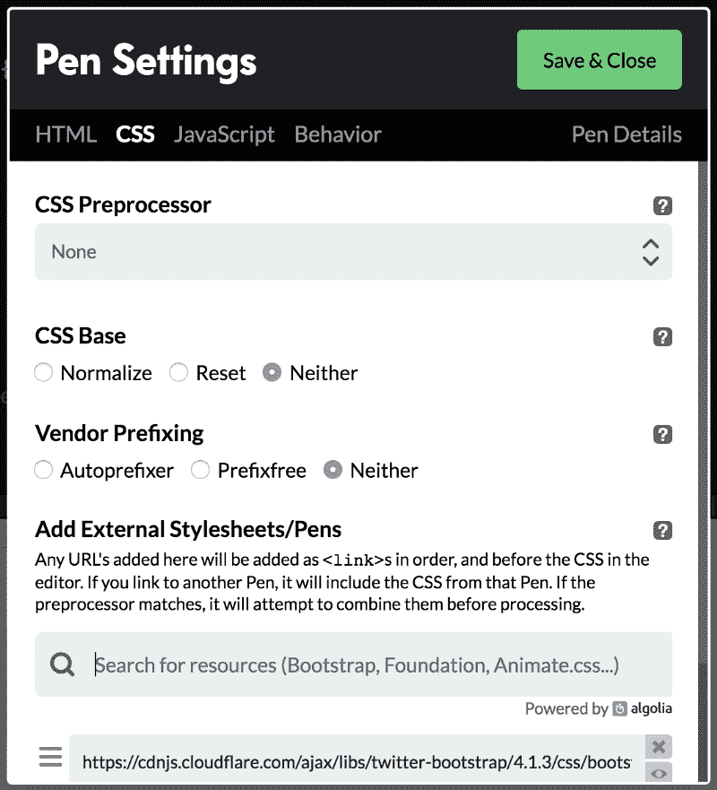

CSS settings in CodePen

试着用你的分叉笔做以下事情:

*   从 CSS 选项卡添加最新的引导程序(名称将是“twitter-bootstrap”)
*   在`<button>`标签上添加`btn btn-primary`类

输出变得更漂亮了:

[https://codepen.io/julienben/embed/preview/dwKEWg?height=300&slug-hash=dwKEWg&default-tabs=html,result&host=https://codepen.io](https://codepen.io/julienben/embed/preview/dwKEWg?height=300&slug-hash=dwKEWg&default-tabs=html,result&host=https://codepen.io)

#### 创建一个推文框

你现在似乎对 CodePen 很满意。好吧，让我们建立一个推特盒子。还是用之前的那支笔，**把`<body>`里面的 HTML 改成**这样:

```
<div class="card bg-light">
  <div class="card-body text-right">
    <textarea class="form-control"></textarea>
    <br/>
    <button class="btn btn-primary">Tweet</button>
  </div>
</div>
```

我们使用的引导类有`form-control`、`card`、`card-body`等。但那些只是为了看，和教程无关。结果如下:

[https://codepen.io/julienben/embed/preview/jXKgZo?height=300&slug-hash=jXKgZo&default-tabs=html,result&host=https://codepen.io](https://codepen.io/julienben/embed/preview/jXKgZo?height=300&slug-hash=jXKgZo&default-tabs=html,result&host=https://codepen.io)

第一步到此为止！不算太坏，嗯？

### 第二步:实现第一个功能——Tweet 按钮最初应该被禁用(5 分钟)

现在，该做些 JS 了。我们将首先实现以下功能:

**特性 1:**“Tweet”按钮最初应该被禁用。当文本字段中至少有一个字符时，应该启用“Tweet”按钮。

这是演示笔。如您所见，该按钮最初是禁用的。如果您在文本框中键入内容，该按钮将变为启用状态。

[https://codepen.io/julienben/embed/preview/gZKVjd?height=300&slug-hash=gZKVjd&default-tabs=js,result&host=https://codepen.io](https://codepen.io/julienben/embed/preview/gZKVjd?height=300&slug-hash=gZKVjd&default-tabs=js,result&host=https://codepen.io)

要实现这一点，首先需要将 jQuery 添加到笔中。在你的笔的设置中的 JavaScript 标签里做。(如果你在这一步有困难，查看 CodePen 的官方说明。)**完成后，转到小 JavaScript 窗口，添加以下 jQuery 代码。**

```
// Initially disable the button
$("button").prop("disabled", true);
// When the value of the text area changes...
$("textarea").on("input", function() {
  // If there's at least one character...
  if ($(this).val().length > 0) {
    // Enable the button.
    $("button").prop("disabled", false);
  } else {
    // Else, disable the button.
    $("button").prop("disabled", true);
  }
});
```

#### 说明

*   我使用标签名`button`和`textarea`作为选择器——在这个例子中不需要添加 id 或类。
*   要启用/禁用按钮，使用`$(...).prop("disabled", ...)`。
*   要监听`textarea`中的变化，使用在现代浏览器上工作的`input`事件。

**通过在 Tweet 框中键入一些文本并查看按钮的启用/禁用状态变化来尝试一下**。

如果这个例子让您感到困惑，请不要继续——您可能需要在进入 React 之前学习更多的 jQuery。有很多优秀的学习资源，比如[代码学院](https://www.codecademy.com)、[树屋](https://teamtreehouse.com/)、[代码学校](https://www.pluralsight.com/codeschool)等等。

既然这个特性已经完成，我们将尝试使用 React 重新实现同样的东西。这将需要几个步骤。

### 第三步:使用 React 的 Tweet Box(5-10 分钟)

在 React 中你会注意到的第一件事是**你将用 JS 编写标记，而不是用 HTML** 。

让我告诉你我的意思。下面是显示相同 Tweet 框的 React 代码。

#### 警告！您还不需要跟随——只需阅读代码。

[https://codepen.io/julienben/embed/preview/majbMg?height=300&slug-hash=majbMg&default-tabs=js,result&host=https://codepen.io](https://codepen.io/julienben/embed/preview/majbMg?height=300&slug-hash=majbMg&default-tabs=js,result&host=https://codepen.io)

一些观察结果:

*   在`return (...)`里面是类似 HTML 的代码，而不是 JavaScript。在 React 中，您将使用一种叫做 JSX 的特殊语法来编写代码，这种语法允许您将类似 HTML 的代码放入 JavaScript 中。
*   我说 HTML-“喜欢”是因为它和 HTML 不一样。请注意，它使用的是`className`而不是`class`——但这非常相似，所以你会很快学会。
*   你的浏览器不理解 JSX，所以在代码运行之前，它会被 JS 编译器(称为 Babel)自动转换成与浏览器兼容的 JavaScript。
*   `return (...)`中的 HTML 代码与步骤 1 中的 HTML 代码非常相似。
*   看看我们笔中剩下的 HTML 代码，你会发现除了`<body><div id="container">&`lt；/div>T4/body>。这就是我所说的在 React 中你将用 Java scriptt(JSX)而不是 HTML 编写标记的意思。

#### 常见问题和答案

**问题:**`class TweetBox extends React.Component`和`ReactDOM.render`是做什么的？我现在需要理解他们吗？
**回答:**暂时不用担心。基本上，第一个声明了一个带有名称的 React 组件(在本例中是`TweetBox`)。然后通过`ReactDOM.render(<TweetBox />, document.getElementById("contai` ner "))在 DOM 中呈现——这意味着这个组件被添加到 id `e the <div id="co` ntainer" >标签中。你现在只需要知道这些。

问题:在本地机器上写 JSX 需要做什么特别的事情吗？
**回答:**是的，但这超出了本教程的范围——简而言之，你需要启用一个叫做巴别塔编译的东西。在 CodePen 上编写 JSX 所需要做的就是(1)添加 React 和 ReactDOM 库,( 2)从 JS 设置窗口的 JavaScript 预处理程序列表中选择“Babel”。

**问题:**把标记(HTML)和行为(JS)写在同一个地方不是不好的做法吗？
**答:**对于简单的 web 页面来说这可能是个坏习惯，但对于大型的 web 应用来说就不一定了。在大型 web 应用程序中，会有数百个 UI，每个 UI 都包含自己的标记和行为。如果将每个 UI 的标记和行为放在一起，而不是将“所有标记”和“所有行为”放在一起，代码将更易于管理。React 是为开发大型 web 应用程序而设计的。事实上，React 是由脸书开发和使用的，它是最大的网络应用之一。

接下来，我将一步步向您展示如何编写上述 React 代码。

### 步骤 4:编写您的第一个 React 代码(5-10 分钟)

这是一支启动笔。在其中，我导入了 Bootstrap(CSS 部分)和 React。我还将 JavaScript 预处理器设置为 Babel，这样我们就可以编写类和 JSX 了。

请试着跟上。首先，叉起这支笔，这样你就可以边走边编辑和保存。

[https://codepen.io/julienben/embed/preview/YdjeWj?height=300&slug-hash=YdjeWj&default-tabs=html,result&host=https://codepen.io](https://codepen.io/julienben/embed/preview/YdjeWj?height=300&slug-hash=YdjeWj&default-tabs=html,result&host=https://codepen.io)

现在你可以写一些反应了。尝试跟随并在您的笔中键入以下 JS 代码片段。

```
class TweetBox extends React.Component {
  render() {
    return null;
  }
};
```

这是使用 React 创建一个 UI 的模板(在本例中，是一个 Tweet box)。就像 jQuery 中的`$(selector).append('your HTML code or element')`一样必不可少。

为了实际构造 UI，我们必须编写`render()`方法。现在，让我们保持简单，只用一个`div`标签。

```
class TweetBox extends React.Component {
  render() {
    return (
      <div>
        Hello World!
      </div>
    );
  }
};
```

就像上面的例子一样，**在`return`后面放一对括号，并在里面写标记。**

#### JSX 抓到你了

对于 JSX，有一件事你需要记住——在`render()`中，你必须只返回**一个**最外层的标签(或者任何可以被认为是有效的 DOM 节点的东西，比如字符串或者字符串)。

这是可行的，因为它是一个字符串:

```
return 'Hello World!';
```

但是下面的方法不起作用，因为文本周围没有引号或最外面的标签:

```
return (
  Hello World!
);
```

这也不起作用，因为在`return (…)`中有两个最外面的(`span`)标记:

```
return (
  <span>
    Hello
  </span>
  <span>
    World
  </span>
);
```

对于上面的例子，解决方法是创建一个额外的`div`标签来包装两个`span`标签。

```
return (
  <div>
    <span>
      Hello
    </span>
    <span>
      World
    </span>
  </div>
);
```

我们在这里使用了一个`div`,但是在 React 的最新版本中，您可以使用片段特性来呈现多个最外面的标签。像这样:

```
return (
  <React.Fragment>
    <span>
      Hello
    </span>
    <span>
      World
    </span>
  </React.Fragment>
);
```

#### 将 UI 附加到 DOM

现在我们需要将这个 UI“附加”到 DOM 上，以便看到`Hello World`。为此，**在我们刚刚编写的代码下面添加了`ReactDOM.render()`:**

```
class TweetBox extends React.Component {
  ...
};
ReactDOM.render(
  <TweetBox />,
  document.getElementById("container")
);
```

(**注**:代码片段中的省略号(…)表示为了清楚起见已经省略的代码。换句话说，不要碰这部分代码，让它保持原样。)

`ReactDOM.render`需要两个参数。第一个参数是 React 组件，它是`<VariableName` / >。第二个参数是我们想要呈现的 DOM 元素(在这个`case, document.getElementById('conta` iner ')中)。综合起来，上面的代码呈现`s the Tw` eetBox UI i `nside <div id="co` ntainer" >。

现在，您应该看到`Hello World`出现在您的笔中。恭喜，您编写并呈现了您的第一个 React 组件！

#### 为 Tweet 框编写实际的 HTML

现在，我们将为 Tweet Box 实现 HTML，而不是`Hello World`。**把`render()`里面的代码换成这个:**

```
return (
  <div className="card bg-light">
    <div className="card-body text-right">
      <textarea className="form-control" />
      <br />
      <button className="btn btn-primary">Tweet</button>
    </div>
  </div>
);
```

有两件事你需要注意:

*   **不要用`class`。**代替，用`className`。这是因为 JSX 被翻译成了 JS，而`class`是 JS 中的保留关键字。
*   如果你用`<` br >而不是`ad of`br/>，你会得到一个错误。确保关闭所有标签。同样的事情 w`ith images: 

其他的都应该和前面的 jQuery 例子一样。

如果您输入正确，那么您应该在您的笔中看到 Tweet 框。如果输出中没有出现任何内容，请仔细检查您的代码，确保没有任何拼写错误。

这一步就到此为止！这是这部分的笔:

[https://codepen.io/julienben/embed/preview/majbMg?height=300&slug-hash=majbMg&default-tabs=js,result&host=https://codepen.io](https://codepen.io/julienben/embed/preview/majbMg?height=300&slug-hash=majbMg&default-tabs=js,result&host=https://codepen.io)

### 第 5 步:在 React 中重新实现第一个功能——Tweet 按钮最初应该被禁用(5-10 分钟)

我们将使用 React 重新实现我们使用 jQuery 实现的第一个特性:

**特性 1:**“Tweet”按钮最初应该被禁用。当文本字段中至少有一个字符时，应该启用“Tweet”按钮。

下面是我们编写的 jQuery 代码:

[https://codepen.io/julienben/embed/preview/gZKVjd?height=300&slug-hash=gZKVjd&default-tabs=js,result&host=https://codepen.io](https://codepen.io/julienben/embed/preview/gZKVjd?height=300&slug-hash=gZKVjd&default-tabs=js,result&host=https://codepen.io)

让我们看看如何在 React 中做到这一点。

从上一步开始用你的笔。 ( **提示:**因为在 React 中你不会碰到 HTML，**你可以最小化 CodePen 上的 HTML 标签**来获得更多的屏幕空间。CSS 标签也是如此。)

**首先，我们通过添加`disabled`作为属性来禁用按钮。**

```
render() {
  return (
    ...
    <button className="..." disabled>Tweet</button>
    ...
  );
}
```

在 JSX，这相当于写`disabled={true}`。

该按钮现在应该被禁用。注意，在我们的 jQuery 实现中，我们写道:

```
$("button").prop("disabled", true);
```

最初禁用按钮，但我们可以像上面这样修改按钮标签。

现在，当文本字段中至少有一个字符时，我们需要启用按钮。

#### 处理变更事件

首先，我们需要监听用户输入的`textarea`。在我们的 jQuery 实现中，我们写道:

```
$("textarea").on("input", function() {
  ...
}
```

在 React 世界中，我们将事件处理程序写成一个**类方法**。姑且称之为`handleChange`:

```
class TweetBox extends React.Component {
  handleChange = () => {
  };
  render() {
    ...
  }
}
```

> 注意，我们使用了一个箭头函数，这样我们就可以访问类的上下文(`this`)，而不必在`constructor`中绑定函数。深入解释这一点超出了本教程的范围，但您很可能会在适当的时候了解到这一点。

接下来，我们在输入文本时调用这个处理程序。为此，**修改了`render()`中的`textarea`标签，如下所示:**

```
<textarea className="form-control" onChange={this.handleChange}>
</textarea>
```

*   我们在 jQuery 中使用了`input`事件，但是在 React 中我们使用了`onChange`——您将了解 React 的 JSX 与 React 官方文档中的事件有何不同，所以现在不必太担心。
*   **更重要的是**，我们使用花括号将 JavaScript 代码包含在 JSX 的 HTML 语法部分中。在这种情况下，我们传递了处理程序`handleChange`并给它加上了前缀`this`,因为它是一个类方法。
*   如果您习惯于 jQuery，这可能看起来是一种不好的做法，但是不要担心。同样，在大型应用程序中，如果将每个 UI 的标记和行为放在一起，代码将更易于管理。

为了确保处理程序确实被调用，**让我们在`handleChange` :** 中添加`console.log`

```
handleChange = (e) => {
  console.log(e.target.value);
};
```

`event`对象(昵称为`e`)包含`target`，也就是`textarea`。我们让`value`输出`textarea`的当前内容。

**在您的笔中，打开`console`选项卡(带有屏幕左下方的按钮)检查输出。然后在 Tweet 框中键入一些内容。**

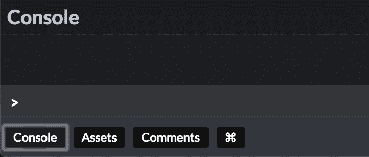

The console button in CodePen

您也可以在这里尝试一下(您需要在新标签中打开笔才能看到`console`按钮):

[https://codepen.io/julienben/embed/preview/aPaoOJ?height=300&slug-hash=aPaoOJ&default-tabs=js,result&host=https://codepen.io](https://codepen.io/julienben/embed/preview/aPaoOJ?height=300&slug-hash=aPaoOJ&default-tabs=js,result&host=https://codepen.io)

这一步就到此为止！我们将在下一步完成这个特性。

**注意:完成后关闭 CodePen 中的`console`标签。**我们不再需要它了。

### 第 6 步:实施状态(10-15 分钟)

我现在将解释 jQuery 风格的代码和 React 风格的代码之间的最大区别之一。

在 jQuery 中，当一些事件发生时，您通常会直接修改 DOM(就像我们之前对`$("button").prop("disabled", true)`所做的那样):


在 React 中，**你从不直接修改 DOM。**相反，在一个事件处理程序中，你修改了一个叫做**“组件状态”**的东西。而这是通过调用`this.setState`来完成的。

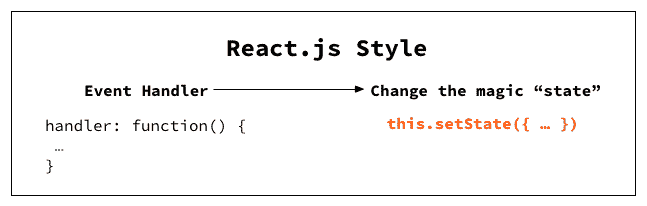

然后，每次更新`state`时，再次调用`**render()**` **。**和**在`render()`中，您可以访问状态来告诉 React 您希望 DOM 如何被修改。**

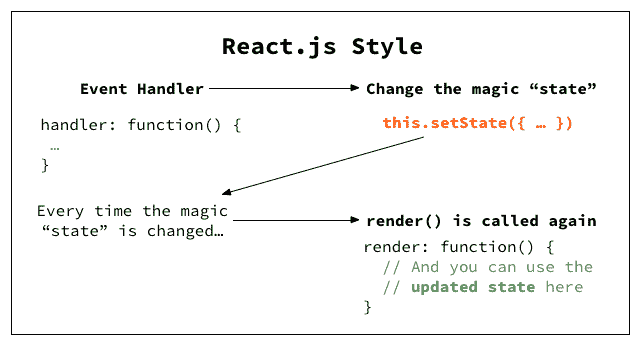

这是您更新 UI 以响应事件的方式。是的，一开始会令人困惑，所以让我用代码来解释。

#### 编写事件处理程序

**从上一步的笔开始。**首先，我们需要**初始化状态对象。**我们可以在课堂上这样做。

对象里有什么？**让我们创建一个名为`text`** 的单键，并让它存储 Tweet box 中的任何内容。

```
class TweetBox extends React.Component {
  constructor(props) {
    super(props);

    this.state = {
      text: '',
    };
  }

  handleChange = (e) => {...};
  render() {...}
};
```

> 不要担心我们为什么在`constructor`的顶部调用`super(props)`。这是重要的一步，但不是理解 React 的必要步骤。

**接下来，我们将修改事件处理程序**，将状态的`text`字段设置为当前在`textarea`中的值。为此，**我们使用一种叫做`setState`的特殊方法，并传递更新后的键值对。**

```
handleChange = (e) => {
  this.setState({ text: e.target.value });
};
```

现在，让我们通过在`render()`中编写一些只用于调试的代码来检查状态设置是否正确。

为此，**只需在`render()`的末尾添加`this.state.text`，并使用花括号**在 JSX 的 HTML 语法部分中使用 JS 代码。

```
render() {
  return (
    <div className="card bg-light">
      ...
      {this.state.text}
    </div>
  );
}
```

现在，尝试在 Tweet 框中输入一些文本。按钮下方应出现相同的文本。

你也可以用下面的笔试试:

[https://codepen.io/julienben/embed/preview/XoPrzR?height=300&slug-hash=XoPrzR&default-tabs=js,result&host=https://codepen.io](https://codepen.io/julienben/embed/preview/XoPrzR?height=300&slug-hash=XoPrzR&default-tabs=js,result&host=https://codepen.io)

现在，前面的图表可能对您更有意义:


#### 移除调试代码

一旦确认状态设置正确，**删除我们刚刚添加的调试代码:**

```
{this.state.text}
```

#### 启用/禁用按钮

现在我们可以监听文本变化，下一步是根据`text`是否为空来启用/禁用`button`。

利用`state`，我们可以使用这样的逻辑:

*   如果`this.state.text.length === 0`，按钮应被禁用。

为了在 React 中做到这一点，**添加了`disabled`属性，并将其值设置为`this.state.text.length === 0`** 的输出。因为这是 JS 代码，所以需要用`{}`包装。

```
<button className="btn btn-primary" disabled={this.state.text.length === 0}>Tweet</button>
```

如果你在原始 HTML 中写`disabled="true"`或`disabled="false"`，它将不起作用——在原始 HTML 中，你需要添加/删除`disabled`属性来启用`button`。但是 React 是**而不是**原始 HTML——它在幕后执行以下操作:

*   如果你在 JSX 写`disabled={true}`，它会被转换成 HTML 格式的`<button disabl` ed >。
*   如果你在 JSX 写`disabled={false}`，HTML 中的`button`标签中的`disabled`属性会被删除。

这适用于其他布尔属性，如`checked`。(你可以在这里阅读更多关于 JSX 这方面的内容。)

生成的钢笔如下所示:

[https://codepen.io/julienben/embed/preview/GPXKYa?height=300&slug-hash=GPXKYa&default-tabs=js,result&host=https://codepen.io](https://codepen.io/julienben/embed/preview/GPXKYa?height=300&slug-hash=GPXKYa&default-tabs=js,result&host=https://codepen.io)

#### 反光

同样，在进入下一步之前，请记住 jQuery 和 React 之间的区别:

*   在 jQuery 中，您编写事件处理程序来修改 DOM 。
*   在 React 中，你编写事件处理程序来修改状态。你写`render()`来反映当前状态。

### 步骤 jQuery 中剩余的字符数(5 分钟)

我们要实现的下一个特性是剩余字符数。

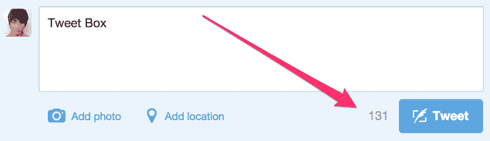

规格如下:

*   字符计数将显示`280 — the length of the text`。

我们将首先在 jQuery 中实现它，然后在 React 中实现。

我们将从之前的 jQuery 实现开始，暂时搁置 React 代码。**接下来，当我们在 jQuery 和 React 之间切换时，我会在每一章**的开头给你新的代码。这意味着在你完成每一步之后，你可以在进入下一步之前处理代码。

**✔叉下面的笔**开始。

[https://codepen.io/julienben/embed/preview/gZKVjd?height=300&slug-hash=gZKVjd&default-tabs=js,result&host=https://codepen.io](https://codepen.io/julienben/embed/preview/gZKVjd?height=300&slug-hash=gZKVjd&default-tabs=js,result&host=https://codepen.io)

首先，**添加 HTML 中的字符数。**让我们把它放在一个`span`里面:

```
<textarea {...}></textarea><br>
<span>280</span>
<button {...}>Tweet</button>
```

并且在 JS 的输入处理程序中添加以下代码来更新字符数:

```
$("textarea").on("input", function() {
  $("span").text(280 - $(this).val().length);
  ...
});
```

就是这样！尝试在推文框中输入，你会看到字符数随着你的输入而更新。这是笔:

[https://codepen.io/julienben/embed/preview/gZdJNJ?height=300&slug-hash=gZdJNJ&default-tabs=js,result&host=https://codepen.io](https://codepen.io/julienben/embed/preview/gZdJNJ?height=300&slug-hash=gZdJNJ&default-tabs=js,result&host=https://codepen.io)

### 步骤 React 中剩余的字符数(5 分钟)

反应如何？你应该试着自己做这件事。从我们之前的 React 实现开始。

**✔叉下面的笔**开始。

[https://codepen.io/julienben/embed/preview/GPXKYa?height=300&slug-hash=GPXKYa&default-tabs=js,result&host=https://codepen.io](https://codepen.io/julienben/embed/preview/GPXKYa?height=300&slug-hash=GPXKYa&default-tabs=js,result&host=https://codepen.io)

(**提示:**因为你不会在 React 中接触 HTML，**你可以最小化 CodePen** 上的 HTML 标签来获得更多的屏幕空间。)

**提示:**

*   无需更改`constructor()`或`handleChange()`方法。
*   在`render()`中使用`this.state.text.length`。

#### 回答:

在 `your re` nder()中的`<b` r/ >后添加此代码:

```
<span>{280 - this.state.text.length}</span>
```

这是笔:

[https://codepen.io/julienben/embed/preview/QzVXOd?height=300&slug-hash=QzVXOd&default-tabs=js,result&host=https://codepen.io](https://codepen.io/julienben/embed/preview/QzVXOd?height=300&slug-hash=QzVXOd&default-tabs=js,result&host=https://codepen.io)

太容易了？不确定为什么用 React 构建 ui 比 jQuery 好那么多？嗯，下一步更复杂，这是 React 真正开始发光的地方。

### 第九步:“添加照片”按钮(5 分钟)

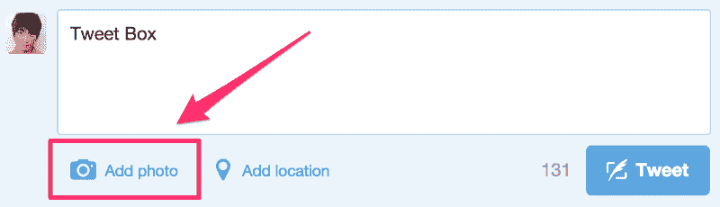

对于我们的下一个功能，我们将在 Tweet 框中添加一个“添加照片”按钮。这就是事情开始变得棘手的地方。

然而，**我们实际上不会编写上传图像的代码。**相反，我们要做的是:

当你在 Twitter 上上传一张照片时，它会被计入字数限制。在我的尝试中，它将剩余字符的数量从 280 减少到 257。

> 是的，我知道 Twitter 不再将照片计入字数限制，但在本教程中我们将忽略这一点。

规格如下:

*   创建一个“添加照片”按钮。
*   点击此按钮切换**开/关状态。**
*   如果按钮打开，它将显示`**✓ Photo Added**`，可用字符数减少 23。
*   此外，如果按钮打开，**即使没有输入文本,“Tweet”按钮仍保持启用状态。**

这是演示代码笔。尝试点击“添加照片”按钮，看看字符数和 Tweet 按钮会有什么变化。

[https://codepen.io/julienben/embed/preview/roZXvE?height=300&slug-hash=roZXvE&default-tabs=js,result&host=https://codepen.io](https://codepen.io/julienben/embed/preview/roZXvE?height=300&slug-hash=roZXvE&default-tabs=js,result&host=https://codepen.io)

让我们先用 jQuery 实现它。

### 步骤 10:jQuery 中的“添加照片”按钮(15-20 分钟)

从我们的 jQuery 实现的最新版本开始。

**✔叉下面的笔**开始。

[https://codepen.io/julienben/embed/preview/gZdJNJ?height=300&slug-hash=gZdJNJ&default-tabs=js,result&host=https://codepen.io](https://codepen.io/julienben/embed/preview/gZdJNJ?height=300&slug-hash=gZdJNJ&default-tabs=js,result&host=https://codepen.io)

早些时候，我们给`$("button")`附加了一个处理程序，但是如果我们有两个按钮的话，这个就不再有效了。**所以让我们这样修改 HTML:**

```
...
<button class="js-tweet-button btn btn-primary" disabled>Tweet</button>
<button class="js-add-photo-button btn btn-secondary">Add Photo</button>
...
```

变化如下:

*   **增加了第二个按钮**，上面写着“添加照片”。
*   **给每个按钮增加了`js-tweet-button`和`js-add-photo-button`类。**类名以`js-`为前缀，以记住它们只在 JS 中使用，而不在 CSS 中使用。
*   **为 Tweet 按钮**添加了初始的`disabled`属性，这样我们就不用在 JS 中这么做了。

**接下来，像这样重写整个 JS 文件:**

```
$("textarea").on("input", function() {
  $("span").text(280 - $(this).val().length);
  if ($(this).val().length > 0) {
    $(".js-tweet-button").prop("disabled", false);
  } else {
    $(".js-tweet-button").prop("disabled", true);
  }
});
```

变化如下:

*   **(重要)从第一行**中删除了`$("button").prop("disabled", true);`，因为我们将`disabled`属性直接添加到了 Tweet 按钮中。
*   **将`$("button")`替换为`$(".js-tweet-button")`** ，以便与`.js-add-photo-button`相区别。

#### 添加按钮

接下来，我们将实现其中一个功能:

*   单击“添加照片”按钮切换开/关状态。**如果开启，按钮会显示`✓ Photo Added`。**

为此，**让我们添加这段代码:**

```
$("textarea").on("input", function() {
  ...
});

$(".js-add-photo-button").on("click", function() {
  if ($(this).hasClass("is-on")) {
    $(this)
      .removeClass("is-on")
      .text("Add Photo");
  } else {
    $(this)
      .addClass("is-on")
      .text("✓ Photo Added");
  }
});
```

我们使用类`is-on`来跟踪状态。**通过多次点击“添加照片”按钮并查看文本替换，检查这是否有效**。

#### 减少字符数

接下来，我们将实现这个特性:

*   如果“添加照片”按钮打开，**可用字符数减少 23。**

为此，**像这样修改我们刚刚添加的点击处理程序。**

```
if ($(this).hasClass("is-on")) {
  $(this)
    .removeClass("is-on")
    .text("Add Photo");
  $("span").text(280 - $("textarea").val().length);
} else {
  $(this)
    .addClass("is-on")
    .text("✓ Photo Added");
  $("span").text(280 - 23 - $("textarea").val().length);
}
```

我们在每次点击时都会改变`span`的内容。如果`button`开启，我们需要从`257`(即`280 — 23`)中减去文本长度。为了清楚起见，我们现在使用`280 — 23`,但是，如果我们正在构建一个生产应用程序，我们应该使用常量。

**点击“添加照片”按钮，查看这是否有效**。

#### 修复输入处理程序

然而，这还没有完成— **如果你打开了“添加照片”按钮，并开始在`textarea`中输入，那么剩余的字符数就不同步了。**

这是因为`textarea`的处理程序没有考虑“添加照片”按钮的状态。

为了解决这个问题，**我们需要像这样更新`textarea`的处理程序:**

```
$("textarea").on("input", function() {
  if ($(".js-add-photo-button").hasClass("is-on")) {
    $("span").text(280 - 23 - $(this).val().length);
  } else {
    $("span").text(280 - $(this).val().length);
  }

  if (...) {
    ...
  }
});
```

**打开“添加照片”按钮，然后键入一些文本，确保这一操作有效**。

#### 我知道这需要一些时间…

但是坚持下去！这里的 jQuery 代码是 ***假设*** 是令人困惑的，所以不要担心！

#### 实现最后一个功能

我们需要实现的最后一个特性是:

*   如果“添加照片”按钮打开，**即使没有输入文本,“推文”按钮仍保持启用状态。**

为此，**我们需要修改“添加照片”按钮的点击处理程序:**

```
$(".js-add-photo-button").on("click", function() {
  if ($(this).hasClass("is-on")) {
    ...
    if ($("textarea").val().length === 0) {
      $(".js-tweet-button").prop("disabled", true);
    }
  } else {
    ...
    $(".js-tweet-button").prop("disabled", false);
  }
});
```

以下是解释:

*   如果“添加照片”按钮从开变为关(`if`子句)，我们需要检查是否没有输入文本，如果有，禁用“Tweet”按钮。
*   如果“添加照片”按钮从关闭变为打开(`else`子句)，我们总是启用“推特”按钮。

#### 但是，这又坏了

我们还没完呢。现在代码中有一个 bug。**按照以下步骤自己尝试一下:**

*   打开“添加照片”按钮。
*   键入一些文本。
*   删除所有文本。
*   “Tweet”按钮应该仍然是启用的，因为“Add Photo”按钮是打开的，但事实并非如此。

这意味着我们的输入处理器`textarea`缺少一些逻辑。为了解决这个问题，**我们需要向输入处理程序中的`if`语句添加另一个条件。**

```
$("textarea").on("input", function() {
  ...
  if ($(this).val().length > 0 || $(".js-add-photo-button").hasClass("is-on")) {
    ...
  } else {
    ...
  }
});
```

这是对这个附加条件的解释:

*   当文本改变时，**如果文本不是空的或者如果“添加照片”按钮在**上，不要禁用“Tweet”按钮。

**再次尝试上述步骤**，这一次它将按预期工作。

### 步骤 11:对 jQuery 代码的反思——为什么这么混乱？(5 分钟)

下面是上一步的最终 HTML 和 JS 代码:

[https://codepen.io/julienben/embed/preview/YdJKqE?height=300&slug-hash=YdJKqE&default-tabs=js,result&host=https://codepen.io](https://codepen.io/julienben/embed/preview/YdJKqE?height=300&slug-hash=YdJKqE&default-tabs=js,result&host=https://codepen.io)

再看一下 jQuery 代码。很混乱。如果你保持代码原样，你可能需要到处注释来记住它是如何工作的。也有明显的代码重复的迹象，但是你必须在重构之前好好想想。

问题是:**为什么这么快就变得这么丑？**

答案与我们之前讨论过的代码的**“jQuery 风格”**有关。回想一下这张图表:


当只有一个事件处理程序和一个 DOM 元素时，事情就简单了。然而，正如我们刚刚看到的，**如果几个事件处理程序正在修改 DOM 的几个部分，代码会变得难看和复杂。**

这是人们所说的“意大利面条代码”的一个例子。

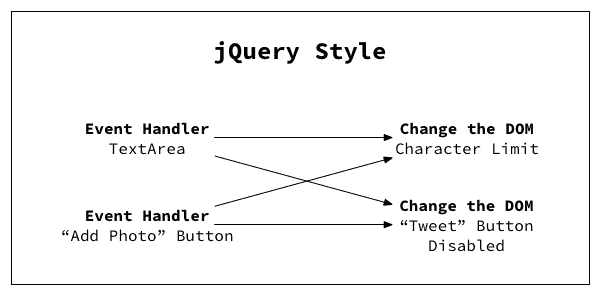

想象一下，添加更多可能影响字符限制和“Tweet”按钮状态的功能。代码将变得更加难以管理。

理论上，您可以通过重构为可重用的函数来减轻这一点。但是每次你添加新的东西时，你仍然需要仔细考虑它。

> **注:**有人分享了一个[重构版的 jQuery 代码](https://pastebin.com/wbGZZs7U)(针对原教程)。非常干净。您会注意到,`update()`函数根据其当前的“状态”负责对 DOM 的大部分更新。然后事件监听器在每次调用时运行这个函数。

> 在这方面，它类似于 React 的`render`。然而，这种解决方案仍然有许多缺点。首先，缺少真正的`state`对象使得逻辑更加不透明。它也不允许你将你的 UI 分解成多个组件，并且当你继续添加组件时，可能会有性能问题。

现在，让我们看看用 React 做同样的事情是什么感觉。

剧透:这将会简单得多。

### 步骤 12:React 中的“添加照片”按钮(10-20 分钟)

让我们从之前的 React 实现开始。

**✔叉下面的笔**开始。

[https://codepen.io/julienben/embed/preview/QzVXOd?height=300&slug-hash=QzVXOd&default-tabs=js,result&host=https://codepen.io](https://codepen.io/julienben/embed/preview/QzVXOd?height=300&slug-hash=QzVXOd&default-tabs=js,result&host=https://codepen.io)

#### 添加按钮

首先，让我们添加“添加照片”按钮。**修改 JSX:**

```
<button ...>Tweet</button>

<button className="btn btn-secondary">
  Add Photo
</button>
```

现在，让我们给这个按钮添加一个点击处理程序，这样文本就从`Add Photo`变成了`✓ Photo Added`。回想一下 React 编写代码的方式:


我们将:

1.  **创建一个状态变量**，跟踪“添加照片”按钮是开还是关。
2.  **使用`render()`中的状态**来决定是显示`Add Photo`还是`✓ Photo Added`。
3.  **更新点击处理程序中的状态**。

对于(1)，**我们将修改`constructor`** 中的初始状态，通过添加一个键值对来跟踪照片是否被添加:

```
constructor(props) {
  super(props);

  this.state = {
    text: '',
    photoAdded: false,
  };
}
```

对于(2)，**我们将修改“添加照片”按钮的 JSX 标记**。如果`this.state.photoAdded`为真，我们将让按钮显示“照片已添加”。这里我们可以只使用一个[三元运算符](https://developer.mozilla.org/en-US/docs/Web/JavaScript/Reference/Operators/Conditional_Operator):

```
<button className="btn btn-secondary">
  {this.state.photoAdded ? "✓ Photo Added" : "Add Photo" }
</button>
```

最后，对于(3)，**，我们将在 JSX** 上附加一个事件处理程序，就像我们对`textarea`所做的那样:

```
<button className="btn btn-secondary" onClick={this.togglePhoto}>
  {this.state.photoAdded ? "✓ Photo Added" : "Add Photo" }
</button>
```

注意，我们使用的是`onClick`而不是`onChange`。这是因为我们面对的是`button`，而不是`textarea`或`input`。

我们还将**添加一个处理程序方法来切换`this.state.photoAddded` :** 的值

```
togglePhoto = () => {
  this.setState((prevState) => ({ photoAdded: !prevState.photoAdded }));
}
```

这次你会看到我们正在传递一个函数给`this.setState`。如果要更新组件状态，但需要使用以前状态的值，这是必要的。我们为什么这样做超出了本教程的范围，但是你可以在 React 官方文档的[这一节](https://reactjs.org/docs/state-and-lifecycle.html#using-state-correctly)中读到。

现在，点击添加照片应该切换按钮文本。自己尝试一下。

#### 减少字符数

我们现在将实现下一个特性:

*   如果“添加照片”按钮打开，**可用字符数减少 23。**

当前，可用字符的数量在`render()`中显示如下:

```
<span>{280 - this.state.text.length}</span> 
```

这个值现在也将取决于`this.state.photoAdded`，所以我们需要一个`if`和`else`。

但是，**在 JSX，你不能把`if`或者`else`写在`{ ... }`T5 里面。您可以像我们之前一样使用三元表达式(`a ? b : c`)，但是在这种情况下，它会很长，很难阅读。**

在这种情况下，最简单的解决方案通常是将条件重构为方法。让我们试一试。

**首先，修改上面的代码使用一个类方法，就像这样**:

```
<span>{this.getRemainingChars()}</span> 
```

**并这样定义方法:**

```
getRemainingChars = () => {
  let chars = 280 - this.state.text.length;
  if (this.state.photoAdded) chars = chars - 23;
  return chars;
}
```

现在，当“添加照片”按钮被切换时，剩余的字符数应该如预期的那样更新。

**问题**:在`render()`中，为什么`{this.getRemainingChars()}`有`()`而`{this.handleChange}`和`{this.togglePhoto}`没有？

好问题。我们再来看看`render()`:

```
render() {
  return (
    ...
      <textarea className="..." onChange={this.handleChange}></textarea>
    ...

    <span>{this.getRemainingChars()}</span>
    ...    

    <button className="..." onClick={this.togglePhoto}>
      ...
    </button>
    ...
    );
  } 
```

**回答**:

*   我们已经编写了`getRemainingChars()`方法来让**返回一个数字**。我们需要得到这个数字，并把它放入`<span>&`lt；/span >，所以**我们用()来代替`to call the getRema`。那是在英国的`wh`。**
*   另一方面，`handleChange`和`togglePhoto`是**事件处理程序**。我们希望这些方法只在用户与 UI 交互时被调用(键入`textarea`或点击`button`)。要做到这一点，我们需要在`render()`中不使用`()`来编写它们，并将它们分配给类似`onChange`和`onClick`的属性。React 将负责为我们将方法附加到相关的事件侦听器上。

#### “推特”按钮的状态

我们还需要实现一个特性:

*   如果“添加照片”按钮打开，**即使没有输入文本,“推文”按钮仍保持启用状态。**

这实际上非常简单，因为有了反应。之前，Tweet 按钮的`disabled`选项设置为:

```
<button ... disabled={this.state.text.length === 0}>...</button> 
```

换句话说，以前如果文本长度为 0，则“Tweet”按钮被禁用。**现在，如果**:

*   文本的长度为 0
*   **和**
*   “添加照片”按钮关闭。

所以逻辑是这样的:

```
<button ... disabled={this.state.text.length === 0 && !this.state.photoAdded}>...</button>
```

你可以通过利用`getRemainingChars()`来阐明上面的代码。如果还有 280 个字符，这意味着`textarea`是空的，并且“添加照片”按钮是关闭的，因此“Tweet”按钮应该被禁用。

```
<button ... disabled={this.getRemainingChars() === 280}>...</button>
```

这是可行的，但是可能会中断，例如，如果您稍后重构`getRemainingChars`以便它返回一个字符串而不是一个数字。相反，我们可以保留之前的逻辑，只是将它移动到`render()`的顶部:

```
render() {
    const isTweetButtonDisabled = this.state.text.length === 0 && !this.state.photoAdded;

    return (
      ...
        <button className="..." disabled={isTweetButtonDisabled}>Tweet</button>
      ...
    );
  }
```

就是这样！尝试切换“添加照片”按钮，并检查“推文按钮”是否正确启用/禁用。

#### 我们完了！

这是生成的钢笔:

[https://codepen.io/julienben/embed/preview/roZXvE?height=300&slug-hash=roZXvE&default-tabs=js,result&host=https://codepen.io](https://codepen.io/julienben/embed/preview/roZXvE?height=300&slug-hash=roZXvE&default-tabs=js,result&host=https://codepen.io)

### 步骤 13:反思 React 代码——为什么这么简单？(5 分钟)

使用 React 时，为适应“添加照片”按钮所做的更改很少。不需要重构。为什么会这样呢？

同样，这与 React 编写 UI 代码的风格有关。在 React 中，事件处理程序修改`state`，每当状态被修改， **React 自动再次调用`render()`来更新 UI。**

在这个特定的示例中，图表现在看起来像这样:

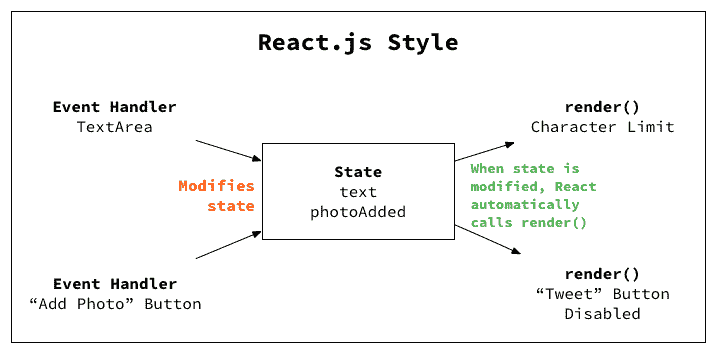

`state`成为位于事件处理程序和`render()`之间的中介物:

*   事件处理程序不需要担心 DOM 的哪一部分发生了变化。他们只需要设置`state`。
*   同样，当你写`render()`的时候，你需要担心的只是当前的`state`是什么。

### 与 jQuery 比较

你可以想象当用户界面获得更多特性时会发生什么。如果没有中间状态，我们将很难管理复杂性。这就是为什么您希望对复杂的 ui 使用 React over jQuery。

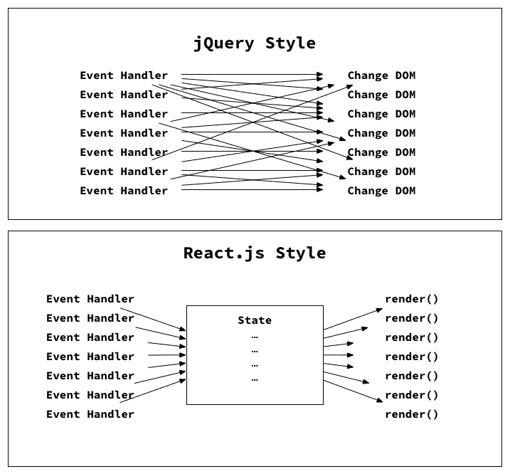

同样，**有可能**写出干净的 jQuery 代码，看起来不像意大利面条一样的代码。**但是你必须自己想出代码结构**并在每次添加新功能时考虑如何重构。React 为你提供了这种结构，减少了你的认知负荷。

> 注意，将状态从渲染中分离出来的想法并不是 React 发明的。我们只是从 React 的角度来看。

### 第 14 步:最后一个特点——突出溢出字符(5 分钟)

我们要实现的最后一个特性是**高亮显示超过限制的字符**。

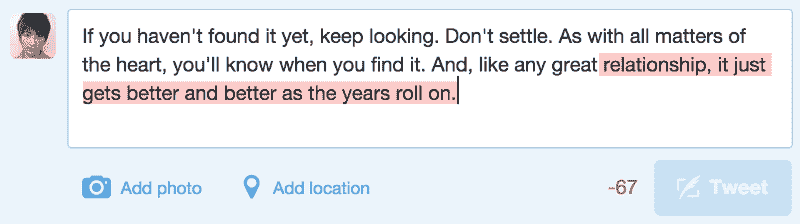

不幸的是，**我们不会突出显示推文框**中的实际文本，因为这需要我们更改`<textar`ea&e = " tr`ue"> and con`tent editable 对于演示来说有点太复杂了。

相反，**我们将在顶部显示一个引导警告框**，并指出哪些字符需要删除，如下所示:

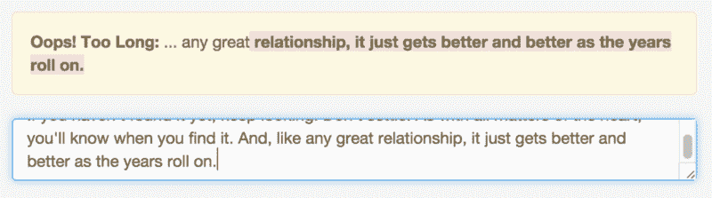

**要尝试一下，请从 React 官方文档中复制以下引文:**

> React 接受了呈现逻辑与其他 UI 逻辑固有耦合的事实:如何处理事件，状态如何随时间变化，以及如何准备数据以供显示。

> React 不是通过将标记和逻辑放在单独的文件中来人为地分离技术，而是通过包含两者的松散耦合的单元(称为“组件”)来分离关注点。

[https://codepen.io/julienben/embed/preview/bOmdWZ?height=300&slug-hash=bOmdWZ&default-tabs=js,result&host=https://codepen.io](https://codepen.io/julienben/embed/preview/bOmdWZ?height=300&slug-hash=bOmdWZ&default-tabs=js,result&host=https://codepen.io)

*   它应该显示一个警告框，溢出字符用红色突出显示。
*   它还应该在截止点之前显示 10 个字符，没有任何突出显示。

如果我们在 jQuery 中实现这一点，我们的代码会变得更加混乱。请注意，在图表中，我们将为一个新特性添加两个箭头。

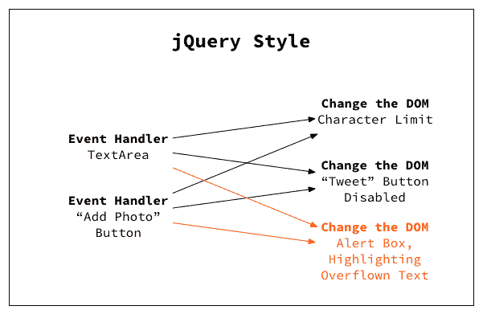

**所以我们不打算在 jQuery** 中实现它。我们就用 React 做，然后就到此为止。使用 React 非常简单——图中只需多一个箭头:

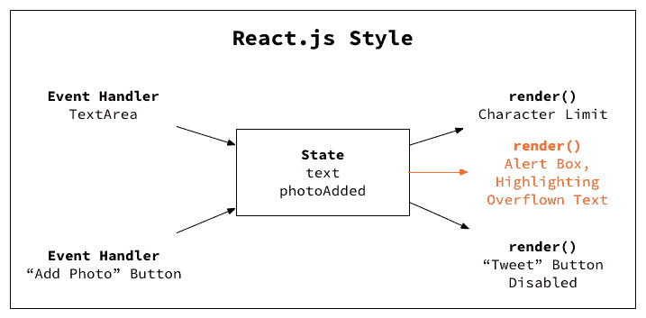

### 第 15 步:用 React 突出显示溢出字符(10-15 分钟)

让我们从之前的 React 实现开始。

**✔叉下面的笔**开始。

[https://codepen.io/julienben/embed/preview/roZXvE?height=300&slug-hash=roZXvE&default-tabs=js,result&host=https://codepen.io](https://codepen.io/julienben/embed/preview/roZXvE?height=300&slug-hash=roZXvE&default-tabs=js,result&host=https://codepen.io)

我们会一步一步来。首先，**当你写的超过限制时，我们会用静态文本显示一个简单的警告。**

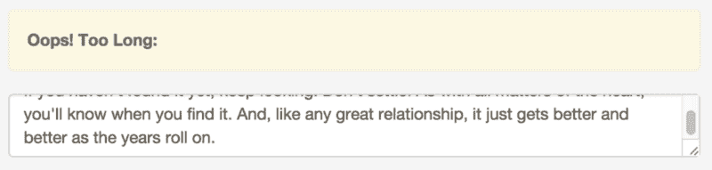

因为这将需要一个条件，让我们用一个单独的方法来写它。**在`textarea`上面加上`{this.renderOverflowAlert()}`:**

```
{this.renderOverflowAlert()}
<textarea ...></textarea>
```

现在，这个方法应该返回:

*   如果没有更多的字符，警告框的 div 标签。
*   **否则没有**(即空字符串或 NULL)。

事实证明，在 React 中，**你可以从一个方法返回 JSX 标记，并在任何其他方法中使用它**，一切都会正常工作。换句话说，你可以这样做:

```
someMethod = () => {
  return (
    <a href="#">Hello World</a>
  );
}
anotherMethod = () => {
  return (
    <h1>
      {this.someMethod()}
    </h1>
  );
}
```

在`renderOverflowAlert`中，我们可以在一种情况下返回`( <div> ... </div> )`，而在另一种情况下**中不返回任何内容。所以我们的`renderOverflowAlert`方法会这样 loo** k:

```
renderOverflowAlert = () => {
  if (this.getRemainingChars() < 0) {
    return (
      <div className="alert alert-warning text-left">
        <strong>Oops! Too Long:</strong>
      </div>
    );
  }
  return '';
};
```

请注意，我们正在检查`this.getRemainingChars()`以确定是否需要显示警告。

键入 280 个以上的字符(或在“添加照片”按钮打开的情况下键入 257 个以上的字符)试试看。警报应该在字符限制达到-1 时出现。

#### 显示溢出字符

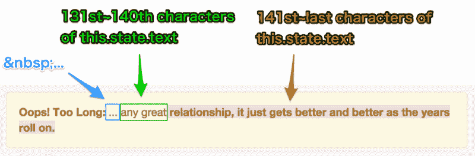

(This should say 280 instead of 140 characters.)

下面是我们对警报消息的逻辑分析:

*   在“哎呀！太长:“实际文本中，有一个空的空格，后面跟着三个点。我在这里使用了,因为在 JSX 写标记时，标签之间的空格会被删除。(可以使用`{' '}`手动添加。)
*   然后是`this.state.text`的第 271 ~ 280 个(共 10 个)字。
*   然后剩下的字符用红色突出显示。

让我们在 JSX 写这篇文章。在`overflowAlert`的`if`子句中，我们将创建两个变量:`beforeOverflowText`和`overflowText`。我们将在`this.state.text`上使用[子串方法](https://developer.mozilla.org/en-US/docs/Web/JavaScript/Reference/Global_Objects/String/substring)。

```
renderOverflowAlert = () => {
  if (this.getRemainingChars() < 0) {
    const beforeOverflowText = this.state.text.substring(280 - 10, 280);
    const overflowText = this.state.text.substring(280);
    return (
      <div className="alert alert-warning text-left">
        <strong>Oops! Too Long:</strong>
        &nbsp; &#8230;
        {beforeOverflowText}
        <strong className="bg-danger text-light">{overflowText}</strong>
      </div>
    );
  }
  return '';
};
```

*   如果你做了`.substring(a, b)`，它将返回`(a + 1)-nth`，直到从字符串中取出`b-th`个字符。
*   如果你做了`.substring(a)`，它将返回`(a + 1)-nth`直到字符串的最后一个字符。
*   我们使用 Bootstrap 的`bg-danger`类以红色突出显示文本，使用`text-light`使文本在暗背景下可读。

再次复制粘贴以下文本，并检查前 280 个字符之后的文本部分是否突出显示。我们快完成了！

> React 接受了呈现逻辑与其他 UI 逻辑固有耦合的事实:如何处理事件，状态如何随时间变化，以及如何准备数据以供显示。

> React 不是通过将标记和逻辑放在单独的文件中来人为地分离技术，而是通过包含两者的松散耦合的单元(称为“组件”)来分离关注点。

#### “添加照片”按钮打开了怎么办？

如果“添加照片”按钮打开，那么字符限制将减少 23。**所以我们的`beforeOverflowText`和`overflowText`需要考虑到这一点:**

```
renderOverflowAlert = () => {
    if (this.getRemainingChars() < 0) {
      const imageLength = this.state.photoAdded ? 23 : 0;
      const beforeOverflowText = this.state.text.substring(
        280 - imageLength - 10,
        280 - imageLength,
      );
      const overflowText = this.state.text.substring(280 - imageLength);
      return (
        <div className="alert alert-warning text-left">
          <strong>Oops! Too Long:</strong>
          &nbsp; &#8230;
          {beforeOverflowText}
          <strong className="bg-danger text-light">{overflowText}</strong>
        </div>
      );
    }
    return '';
  };
```

现在，尝试切换“添加照片”按钮，同时输入任何超过限制的文本。它应该像预期的那样工作。这是笔:

[https://codepen.io/julienben/embed/preview/bOmdWZ?height=300&slug-hash=bOmdWZ&default-tabs=js,result&host=https://codepen.io](https://codepen.io/julienben/embed/preview/bOmdWZ?height=300&slug-hash=bOmdWZ&default-tabs=js,result&host=https://codepen.io)

就是这样！同样，您可以看到代码更改非常简单:


### 第十六步:下一步是什么？(5 分钟)

本教程到此结束。希望你:

*   理解 React 的组件结构相对于用 jQuery 手动修改 DOM 的优势
*   学习了如何使用 JavaScript 和 JSX 编写简单的 React 组件。

#### 下一步是什么？

从这里有很多路可以走。

一种可能是看一看这篇名为[如何学习 React 的短文——从初学者到高级者的路线图](https://medium.freecodecamp.org/learning-react-roadmap-from-scratch-to-advanced-bff7735531b6)。它可以帮助你决定如何最好地继续学习。

我还强烈推荐阅读 React 官方文档的以下部分:

*   [入门](https://reactjs.org/docs/getting-started.html)，包括 React 团队推荐的学习资源，以及
*   [用 React 思考](https://reactjs.org/docs/thinking-in-react.html)这将帮助你理解如何用 React 构建组件和应用程序。

不过在你离开之前，我有一个**可选挑战**给你！

如果你已经对 React 感到足够舒服，并且想写自己的代码，**试着将`remainingChars`移到组件的`state`。确保它在必要的地方得到更新，并在所有相关的地方使用它。**

请随意在评论中用笔写下结果，我会很乐意去看看的！

#### 谢谢

非常感谢你读到这里！最重要的是感谢 [@chibicode](https://twitter.com/chibicode) 为这个教程的第一个版本投入了大量的工作！我希望这个更新版本公正。

我是朱利安。我在[health . io](https://healthy.io)做前端工程师，在 GitHub 上帮助维护[的反应样本](https://github.com/react-boilerplate/react-boilerplate)。如果你发现一个错误，想要任何澄清或者认为我跳过了一些重要的东西，请让我知道，我会确保修复它。