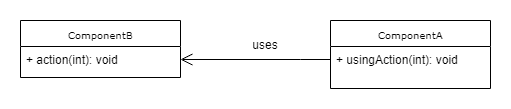
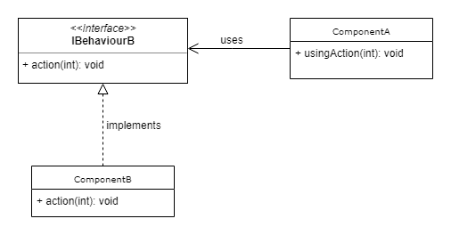

# 两个软件开发原则如何拯救你的项目

> 原文：<https://www.freecodecamp.org/news/how-2-software-development-principles-can-save-your-project-573fc10461cb/>

乔迪·贝勒克

# 两个软件开发原则如何拯救你的项目


### 介绍

在这篇文章中，我将重点解释一种设计模式(**控制反转**)和一种实践( **YAGNI** )如何减少软件项目失败的可能性。你可以马上开始运用这些技巧。

如果你是一名工程经理，如果你想降低特性边际成本的波动性，这是一本好书？。

### 控制反转(IoC)

我是说*依赖注入*吗？不完全是，但是我们可以使用依赖注入作为工具来实现依赖之间的控制反转。

IoC 可以帮助改变依赖方向。当组件 A 依赖于组件 B，而现在您希望 A 不知道 B 的实现细节时，它会有所帮助。

**当前形势**



*Component A depends on Component B.*

**目标情况**



*Component A does not depends on the implementation details of component B.*

使用最后一种方法，组件 A 不依赖于组件 b 的细节。事实上，*ibehaviorb*的新实现可以添加到项目中，甚至不需要接触组件 A。

#### 代码示例

*具有三个已知层的未知应用程序。*

```
UI -> REST API -> Database
```

放大 REST API，我们发现了 *UsersController* 类。我们注意到它正在从/向一个 *SQLServer 数据库*中读取和写入数据。下面是一个可能的 C#实现:

如果你认为上面的解决方案不是一个好的设计，你是对的？。

在这个例子中， *UsersController* 是与 SQLServer 实现紧密耦合的 T2。 *postUser* 方法使得编写**测试**变得困难(记住单元测试不应该触及数据库或外部服务)。随着应用程序的扩展，将会高度依赖所使用的特定 SQLServer 库。如果有人决定按领域划分应用程序，那就晚了？。

这个代码示例对应的是文章开头呈现的**“现状”**。在这种情况下:

*   **一个** = *用户控制器*
*   **B** = *系统。Data.SqlClient* 打开。网

但是等等…

**如果我们应用控制反转**使 UsersController 不依赖于特定的 SQLServer 实现会怎么样？如果我们让 REST API 不知道我们使用的是哪一个持久层呢？

？，好，我们开始吧:


**20 天后**？：

为了简单起见，我们表示了三个源文件，但是实际上，它们可以被分割或者位于不同的程序集或文件夹中。这个解对应的是开头提出的**【目标情况】**。在这种情况下:

*   **一个** = *用户控制器*
*   **B** = *SQLUserService*
*   **ibehaviorb**=*IUserService*。

我们做到了！

哦，但是等等， *IUserService* 依赖是如何注入到 *UsersController* 的构造函数上的？其实现细节超出了本文的范围。不过，如果你有兴趣，可以看看我在最后加的教程。

#### 利益

*   我们的架构对扩展是开放的。此外，我们减少了修改现有类的必要性。**开/关**原理？
*   测试很容易编写。我们可以在测试 UsersController 的时候注入一个 mock *UserService* ？
*   业务逻辑是非耦合的，不依赖于任何*持久性*策略。⭐️

### 亚吉

你不会需要它的！

我认为每个开发者都应该将 YAGNI 作为他们的核心实践之一。这个原则可以让你避免过度工程化和拥有未使用的代码(*不可触及*)。也能保住你的工作。

**一个搞笑的小故事:**

我在一个项目中工作，软件架构师决定用**字符**数据类型表示数据库中几乎所有的**布尔**列。至少他们使用的是英语——**true**存储为“Y”， **false** 存储为“N”。这有道理吧？当我问他们如何构思出如此神奇的解决方案时，他们回答道:

“这样，我们对第三国介入的可能性持开放态度”。

我从来不明白一个**真/假**的东西怎么会有第三种状态(也许他们想到了量子位)。正如您可能注意到的，这最终是一个非常糟糕的决定，其后果在代码中随处可见。我发现了这样的事情:

```
if (supportVisa === "Y" || supportVisa === "y") { ...
```

代码可读性受到影响，SQL 查询也受到影响。

但这还不止于此。随着时间的推移，该软件增加了其用户界面的国际化。一些配置和目录是由客户端自己使用 GUI 应用程序提供的。我们到达这样一个点，我们的一些**布尔**列有“S”和“N”(西班牙语中的 **S** i 和 **N** o)。

代码实在是难以维护。我不想谈他们提出的解决方案？。

### 结论

根据 Bob 叔叔的说法，*优秀的开发人员会尝试最大化未决策的数量*。不要写你认为在六个月后会有帮助的东西。相反，等待六个月，看看你的架构，看看它已经发展了多少，然后，做工作。应用 YAGNI。

您应该正确地管理您的依赖项。控制反转会在这方面指引你。

我希望进入你的意识，帮助你成为一个更好的开发者。

> “任何傻瓜都能写出计算机能理解的代码。优秀的程序员会写出人类能理解的代码。”― **马丁·福勒**

### 阅读更多关于

*   [对 C#的依赖注入](https://www.codeproject.com/Articles/1234518/Dependency-Injection-using-Unity-Resolve-dependenc)
*   [TypeScript 依赖注入。](https://nehalist.io/dependency-injection-in-typescript/)
*   [马丁·福勒谈 YAGNI](https://martinfowler.com/bliki/Yagni.html)

请分享你的想法，并提出任何问题。我很乐意回答他们。？F **给我找个**o[维特。](https://twitter.com/jbaylacc)****