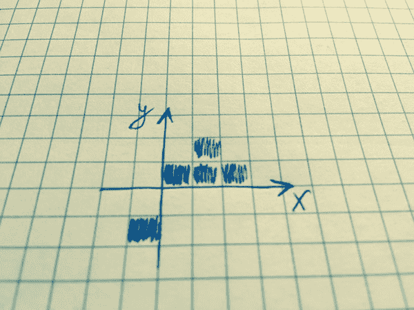
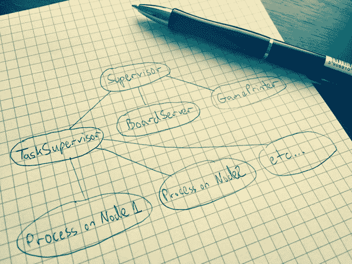

# 如何在 Elixir 中构建一个分布式的生命游戏

> 原文：<https://www.freecodecamp.org/news/how-to-build-a-distributed-game-of-life-in-elixir-9152588100cd/>

亚瑟·皮珀

# 如何在 Elixir 中构建一个分布式的生命游戏

我在《长生不老药》里写了我的第一个游戏。这是一个很受欢迎的东西——康威的生命游戏——但是当你用函数式语言解决它时，它变得非常有趣，尤其是当你可以看到[actor 模型如何工作](https://en.wikipedia.org/wiki/Actor_model)以及 actor 如何分布在网络中的服务器上。


Game of Life

**在这篇博文中，我将展示:**

*   如何用长生不老药来写生命游戏的规则，
*   跨轻量级进程(参与者)的并行任务为了利用所有 CPU 核心，
*   如何跨节点分配工作，以便游戏可以由集群中的许多服务器执行，
*   如何在 Elixir 中使用 GenServer 行为、任务主管和代理。

这个项目和完整的[源代码可以在这里找到](https://github.com/BeyondScheme/elixir-game_of_life)。

### 演示

让我们从观看游戏如何工作的快速演示开始。

[**游戏人生**](https://asciinema.org/a/44233)
[*由阿图尔*asciinema.org](https://asciinema.org/a/44233)记录

如你所见，node1 在屏幕上代表运行游戏和棋盘。第二个节点也已启动并连接到第一个节点。从第二个节点开始，我们向电路板添加新的单元。两个节点都负责处理游戏，但是只有第一个节点是主节点，它具有关于游戏当前状态的信息。我们可以将更多的节点连接到集群，这样游戏处理就可以在所有的节点上进行。在本文中，您将了解如何实现这一目标。

### 生活规则的游戏

如果你已经知道[游戏的人生问题](https://en.wikipedia.org/wiki/Conway%27s_Game_of_Life)就直接跳到[下一个标题](https://beyondscheme.com/2016/distributed-game-of-life-in-elixir#create-new-application-in-elixir)。如果没有，在这一节你可以学习基本概念。

生命游戏的宇宙是一个由正方形细胞组成的无限二维正交网格，每个细胞都处于两种可能的状态之一，活着或死了。每个单元格都与其八个邻居交互，这八个邻居是水平、垂直或对角相邻的单元格。在每个时间步，会发生以下转变:

*   任何具有少于两个活邻居的活细胞死亡，就好像是由人口不足引起的。
*   任何有两个或三个活邻居的活细胞都会延续到下一代。
*   任何有三个以上活邻居的活细胞都会死亡，似乎是由于人口过多。
*   任何一个死细胞，只要有三个活的邻居，就会变成活细胞，就像通过繁殖一样。

最初的模式构成了系统的种子。第一代是通过将上述规则同时应用于种子中的每个细胞而产生的——出生和死亡同时发生，发生这种情况的离散时刻有时被称为分笔成交点(换句话说，每一代都是前一代的纯函数)。这些规则不断重复应用，以创造更多代。

### 在 Elixir 中创建新应用程序

首先，我们将使用监督树创建一个新的 Elixir OTP 应用程序。我们将为我们的游戏服务器使用 supervisor，稍后你会了解到更多。

```
$ mix new --sup game_of_life
```

给出一个`--sup`选项来生成一个包括监督树的 OTP 应用程序框架。通常一个应用程序是在没有管理员和应用程序回调的情况下生成的。

在`lib/game_of_life.ex`文件中，您会发现一个如何将童工添加到主管的示例。

```
# lib/game_of_life.exdefmodule GameOfLife do  use Application  # See http://elixir-lang.org/docs/stable/elixir/Application.html  # for more information on OTP Applications  def start(_type, _args) do    import Supervisor.Spec, warn: false    children = [      # Define workers and child supervisors to be supervised      # worker(GameOfLife.Worker, [arg1, arg2, arg3]),    ]    # See http://elixir-lang.org/docs/stable/elixir/Supervisor.html    # for other strategies and supported options    opts = [strategy: :one_for_one, name: GameOfLife.Supervisor]    Supervisor.start_link(children, opts)  endend
```

### 在生命游戏中代表棋盘

我们需要在游戏中表现棋盘上的活细胞。单个单元格可以是在二维棋盘中具有坐标的元组`{x, y}`。

板上所有活着的细胞都将出现在列表`alive_cells`中。

```
alive_cells = [{0, 0}, {1, 0}, {2, 0}, {1, 1}, {-1,-2}]
```

这是一个带有活细胞的板子的例子:



Board with alive cells

这是正确的 x & y 坐标:


Coordinates of alive cells

现在，当我们有了如何储存活细胞的想法后，我们就可以开始写代码了。

### 有测试的生活规则游戏

我们可以创建具有函数`keep_alive?/2`的`GameOfLife.Cell`模块，负责确定特定的活细胞`{x, y}`是否应该在下一代仍然存活。

下面是带有预期参数的函数:

```
# lib/game_of_life/cell.exdefmodule GameOfLife.Cell do  def keep_alive?(alive_cells, {x, y} = _alive_cell) do    # TODO  endend
```

让我们编写一些测试来涵盖生活游戏的第一个要求:

> 任何少于两个活邻居的活细胞都会死亡，似乎是由人口不足引起的。

我们编写了测试来确保`GameOfLife.Cell.keep_alive?/2`函数在活细胞没有邻居或者只有一个邻居的情况下返回 false。

```
# test/game_of_life/cell_test.exsdefmodule GameOfLife.CellTest do  use ExUnit.Case, async: true  test "alive cell with no neighbours dies" do    alive_cell = {1, 1}    alive_cells = [alive_cell]    refute GameOfLife.Cell.keep_alive?(alive_cells, alive_cell)  end  test "alive cell with 1 neighbour dies" do    alive_cell = {1, 1}    alive_cells = [alive_cell, {0, 0}]    refute GameOfLife.Cell.keep_alive?(alive_cells, alive_cell)  endend
```

函数需要返回 false 才能通过我们的测试，所以让我们添加更多的测试来满足其他需求。

> 任何有三个以上活邻居的活细胞都会死亡，似乎是由于人口过多。

```
# test/game_of_life/cell_test.exstest "alive cell with more than 3 neighbours dies" do  alive_cell = {1, 1}  alive_cells = [alive_cell, {0, 0}, {1, 0}, {2, 0}, {2, 1}]  refute GameOfLife.Cell.keep_alive?(alive_cells, alive_cell)end
```

> 任何有两个或三个活邻居的活细胞都会延续到下一代。

```
# test/game_of_life/cell_test.exstest "alive cell with 2 neighbours lives" do  alive_cell = {1, 1}  alive_cells = [alive_cell, {0, 0}, {1, 0}]  assert GameOfLife.Cell.keep_alive?(alive_cells, alive_cell)endtest "alive cell with 3 neighbours lives" do  alive_cell = {1, 1}  alive_cells = [alive_cell, {0, 0}, {1, 0}, {2, 1}]  assert GameOfLife.Cell.keep_alive?(alive_cells, alive_cell)end
```

现在，我们可以实现我们的`GameOfLife.Cell.keep_alive?/2`函数了。

```
# lib/game_of_life/cell.exdefmodule GameOfLife.Cell do  def keep_alive?(alive_cells, {x, y} = _alive_cell) do    case count_neighbours(alive_cells, x, y, 0) do      2 -&gt; true      3 -> true      _ -> false    end  end  defp count_neighbours([head_cell | tail_cells], x, y, count) do    increment = case head_cell do      {hx, hy} when hx == x - 1 and hy == y - 1 -> 1      {hx, hy} when hx == x     and hy == y - 1 -> 1      {hx, hy} when hx == x + 1 and hy == y - 1 -> 1      {hx, hy} when hx == x - 1 and hy == y     -&gt; 1      {hx, hy} when hx == x + 1 and hy == y     ->; 1      {hx, hy} when hx == x - 1 and hy == y + 1 ->; 1      {hx, hy} when hx == x     and hy == y + 1 -&gt; 1      {hx, hy} when hx == x + 1 and hy == y + 1 -> 1      _not_neighbour -> 0    end    count_neighbours(tail_cells, x, y, count + increment)  end  defp count_neighbours([], _x, _y, count), do: countend
```

如您所见，我们实现了负责计算邻居数量的私有函数`count_neighbours/4`。符合下一条规则会有帮助。

我们还忘记了一个要求:

> 任何一个死细胞，只要有三个活的邻居，就会变成活细胞，就像通过繁殖一样。

我们将编写一个新的函数`GameOfLife.Cell.become_alive?/2`,期望得到死亡细胞的坐标，并返回死亡细胞是否会存活。

```
# lib/game_of_life/cell.exdefmodule GameOfLife.Cell do  def become_alive?(alive_cells, {x, y} = _dead_cell) do    3 == count_neighbours(alive_cells, x, y, 0)  endend
```

这是一个测试:

```
# test/game_of_life/cell_test.exstest "dead cell with three live neighbours becomes a live cell" do  alive_cells = [{2, 2}, {1, 0}, {2, 1}]  dead_cell = {1, 1}  assert GameOfLife.Cell.become_alive?(alive_cells, dead_cell)endtest "dead cell with two live neighbours stays dead" do  alive_cells = [{2, 2}, {1, 0}]  dead_cell = {1, 1}  refute GameOfLife.Cell.become_alive?(alive_cells, dead_cell)end
```

还有一件事可能对我们有帮助。我们有活细胞的列表，但对死细胞了解不多。死亡细胞的数量是无限的，因此我们需要减少死亡细胞的数量，以检测它们是否会存活。简单的方法是只检查死细胞和活着的邻居。因此有了`GameOfLife.Cell.dead_neighbours/1`函数。

让我们先写一些测试:

```
# test/game_of_life/cell_test.exstest "find dead cells (neighbours of alive cell)" do  alive_cells = [{1, 1}]  dead_neighbours = GameOfLife.Cell.dead_neighbours(alive_cells) |&gt; Enum.sort  expected_dead_neighbours = [    {0, 0}, {1, 0}, {2, 0},    {0, 1}, {2, 1},    {0, 2}, {1, 2}, {2, 2}  ] |>; Enum.sort  assert dead_neighbours == expected_dead_neighboursendtest "find dead cells (neighbours of alive cells)" do  alive_cells = [{1, 1}, {2, 1}]  dead_neighbours = GameOfLife.Cell.dead_neighbours(alive_cells) |&gt; Enum.sort  expected_dead_neighbours = [    {0, 0}, {1, 0}, {2, 0}, {3, 0},    {0, 1}, {3, 1},    {0, 2}, {1, 2}, {2, 2}, {3, 2}  ] |> Enum.sort  assert dead_neighbours == expected_dead_neighboursend
```

下面是实现的函数:

```
# lib/game_of_life/cell.exdef dead_neighbours(alive_cells) do  neighbours = neighbours(alive_cells, [])  (neighbours |&gt; Enum.uniq) -- alive_cellsenddefp neighbours([{x, y} | cells], neighbours) do  neighbours(cells, neighbours ++ [    {x - 1, y - 1}, {x    , y - 1}, {x + 1, y - 1},    {x - 1, y    }, {x + 1, y    },    {x - 1, y + 1}, {x    , y + 1}, {x + 1, y + 1}  ])enddefp neighbours([], neighbours), do: neighbours
```

基本上，这些都是在单个模块`GameOfLife.Cell`中实现的规则。你可以在 GitHub 上看到完整的[模块文件](https://github.com/BeyondScheme/elixir-game_of_life/blob/master/lib/game_of_life/cell.ex)和[测试。](https://github.com/BeyondScheme/elixir-game_of_life/blob/master/test/game_of_life/cell_test.exs)

### 分布式生活游戏的体系结构



The architecture of distributed Game of Life in Elixir

我们的主要主管是我在文章开头提到的`GameOfLife.Supervisor`。下面你可以看到我们是如何定义它的孩子的，比如`Task.Supervisor`、`BoardServer`和`GamePrinter`的工人。

```
# lib/game_of_life.exdefmodule GameOfLife do  use Application  # See http://elixir-lang.org/docs/stable/elixir/Application.html  # for more information on OTP Applications  def start(_type, _args) do    import Supervisor.Spec, warn: false    init_alive_cells = []    children = [      # Define workers and child supervisors to be supervised      # worker(GameOfLife.Worker, [arg1, arg2, arg3]),      supervisor(Task.Supervisor, [[name: GameOfLife.TaskSupervisor]]),      worker(GameOfLife.BoardServer, [init_alive_cells]),      # We will uncomment this line later      # worker(GameOfLife.GamePrinter, []),    ]    # See http://elixir-lang.org/docs/stable/elixir/Supervisor.html    # for other strategies and supported options    opts = [strategy: :one_for_one, name: GameOfLife.Supervisor]    Supervisor.start_link(children, opts)  endend
```

让我描述一下图像上的每个组件负责什么。

是一个 Elixir 模块，它定义了一个新的监督者，可以用来动态地监督任务。我们将利用它来完成一些任务，比如决定特定细胞是生是死。这些任务可以跨连接到集群的节点运行。

在上面的代码中，我们给我们的主管命名为`GameOfLife.TaskSupervisor`。我们将使用这个名称来告诉`Task.Supervisor.async`函数哪个任务主管应该处理我们的任务。你可以阅读更多关于[的任务。这里的主管](http://elixir-lang.org/docs/stable/elixir/Task.Supervisor.html)。

`GameOfLife.BoardServer`我们的模块是否实现为 [GenServer 行为](http://elixir-lang.org/docs/stable/elixir/GenServer.html)。它负责保持游戏的状态。我的意思是，它将活细胞的列表与代计数器和 TRef 一起保存在板上。TRef 是由 [Erlang 定时器模块](http://erlang.org/doc/man/timer.html)和 [apply_interval](http://erlang.org/doc/man/timer.html#apply_interval-4) 函数返回的定时器参考。

我们希望开始游戏，并以指定的时间间隔为下一代生成一个新的活细胞列表。对于每个新的世代，我们将更新世代计数器。另一件有趣的事情是`GameOfLife.BoardServer`只在一个节点上运行。一旦另一个节点连接到已经在运行`GameOfLife.BoardServer`的集群，那么`GameOfLife.BoardServer`将不会像在新连接的节点上那样启动。

相反，在新节点上`GameOfLife.BoardServer`将保留对第一个节点上存在的进程的 PID 的唯一引用。我们希望在集群中启动的第一个节点上存在的一个主要`GameOfLife.BoardServer`进程中，有关于我们游戏状态的单一真实来源。

`GameOfLife.GamePrinter`是一个简单的模块，使用[代理](http://elixir-lang.org/docs/stable/elixir/Agent.html)来保存 TRef(时间参考),这样我们就可以以指定的时间间隔将电路板打印到标准输出。我们将使用 [Erlang 定时器模块](http://erlang.org/doc/man/timer.html#apply_interval-4)每秒钟在屏幕上打印板子。

你可能想知道 GenServer 和 Agent 有什么区别。

GenServer 是一个类似于任何其他 Elixir 进程的进程，可以用来保持状态、异步执行代码等等。使用通用服务器进程(GenServer)的优势在于，它将拥有一组标准的接口函数，并包括跟踪和错误报告功能。它也适合监督树，因为这是我们在`GameOfLife`模块中所做的。

另一方面，代理是比 GenServer 简单得多的解决方案。代理是对状态的简单抽象。在 Elixir 中，通常需要共享或存储状态，这些状态必须在不同的时间点从不同的进程或由同一进程访问。代理模块提供了一个基本的服务器实现，允许通过一个简单的 API 检索和更新状态。这就是我们在`GameOfLife.GamePrinter`中要做的，因为我们只需要保持时间参考我们的定时器间隔。

### 为任务主管创建节点管理器

让我们从简单的事情开始，看看我们是否可以在集群中的节点之间分配工作。我们假设由任务主管创建的每个新进程将被随机分配到一个连接的节点上。假设每个任务都非常相似，并且所有节点都是具有相同配置和过载的机器，那么每个节点都应该具有相同的过载。

```
# lib/game_of_life/node_manager.exdefmodule GameOfLife.NodeManager do  def all_nodes do    [Node.self | Node.list]  end  def random_node do    all_nodes |&gt; Enum.random  endend
```

我们的节点管理器有`random_node/0`函数，它返回连接到集群的随机节点的名称。基本上就是这样。目前，一个简单的解决方案应该足够了。

### 创建纸板助手功能

我们需要一些辅助函数来完成我们可以在板上进行的操作，比如添加和删除单元格。让我们从模块`GameOfLife.Board`和功能`add_cells/2`的测试开始。

```
# test/game_of_life/board_test.exsdefmodule GameOfLife.BoardTest do  use ExUnit.Case, async: true  test "add new cells to alive cells without duplicates" do    alive_cells = [{1, 1}, {2, 2}]    new_cells = [{0, 0}, {1, 1}]    actual_alive_cells = GameOfLife.Board.add_cells(alive_cells, new_cells)                          |&gt; Enum.sort    expected_alive_cells = [{0, 0}, {1, 1}, {2, 2}]    assert actual_alive_cells == expected_alive_cells  endend
```

我们需要确保不允许将同一个单元格两次添加到板上，这样我们就可以测试没有重复。下面是`add_cells/2`功能的实现:

```
# lib/game_of_life/board.exdefmodule GameOfLife.Board do  def add_cells(alive_cells, new_cells) do    alive_cells ++ new_cells    |&gt; Enum.uniq  endend
```

另一件事是从活细胞列表中删除细胞:

```
# test/game_of_life/board_test.exstest "remove cells which must be killed from alive cells" do  alive_cells = [{1, 1}, {4, -2}, {2, 2}, {2, 1}]  kill_cells = [{1, 1}, {2, 2}]  actual_alive_cells = GameOfLife.Board.remove_cells(alive_cells, kill_cells)  expected_alive_cells = [{4, -2}, {2, 1}]  assert actual_alive_cells == expected_alive_cellsend
```

实施非常简单:

```
# lib/game_of_life/board.exdef remove_cells(alive_cells, kill_cells) do  alive_cells -- kill_cellsend
```

让我们创造一些更先进的东西。我们应该确定哪些细胞应该在滴答之后仍然存活在下一代中。下面是对`GameOfLife.Board.keep_alive_tick/1`函数的测试:

```
# test/game_of_life/board_test.exstest "alive cell with 2 neighbours lives on to the next generation" do  alive_cells = [{0, 0}, {1, 0}, {2, 0}]  expected_alive_cells = [{1, 0}]  assert GameOfLife.Board.keep_alive_tick(alive_cells) == expected_alive_cellsend
```

函数`keep_alive_tick`做一些事情，比如用`Task.Supervisor`为每个活细胞创建一个新任务。将在集群中的可用节点上创建任务。我们计算活细胞应该继续存活还是被移除。如果细胞应该存活，则`keep_alive_or_nilify/2`函数返回，否则`nil`返回。

我们用`Task.await/1`等待，直到所有节点上的所有任务都完成了它们的工作。任务是并行工作的，但是我们需要等待每个任务的结果。我们从列表中删除了`nil`值，所以最后我们只得到下一代的活细胞。

```
# lib/game_of_life/board.ex@doc "Returns cells that should still live on the next generation"def keep_alive_tick(alive_cells) do  alive_cells  |&gt; Enum.map(&(Task.Supervisor.async(                {GameOfLife.TaskSupervisor, GameOfLife.NodeManager.random_node},                GameOfLife.Board, :keep_alive_or_nilify, [alive_cells, &1])))  |>; Enum.map(&Task.await/1)  |> remove_nil_cellsenddef keep_alive_or_nilify(alive_cells, cell) do  if GameOfLife.Cell.keep_alive?(alive_cells, cell), do: cell, else: nilenddefp remove_nil_cells(cells) do  cells  |> Enum.filter(fn cell -&gt; cell != nil end)end
```

我们还应该处理另一种情况，即死亡的细胞应该复活。`GameOfLife.Board.become_alive_tick/1`功能将对此负责。

```
# test/game_of_life/board_test.exstest "dead cell with three live neighbours becomes a live cell" do  alive_cells = [{0, 0}, {1, 0}, {2, 0}, {1, 1}]  born_cells = GameOfLife.Board.become_alive_tick(alive_cells)  expected_born_cells = [{1, -1}, {0, 1}, {2, 1}]  assert born_cells == expected_born_cellsend
```

我们的函数看起来是这样的:

```
# lib/game_of_life/board.ex@doc "Returns new born cells on the next generation"def become_alive_tick(alive_cells) do  GameOfLife.Cell.dead_neighbours(alive_cells)  |&gt; Enum.map(&(Task.Supervisor.async(                {GameOfLife.TaskSupervisor, GameOfLife.NodeManager.random_node},                GameOfLife.Board, :become_alive_or_nilify, [alive_cells, &1])))  |>; Enum.map(&Task.await/1)  |> remove_nil_cellsenddef become_alive_or_nilify(alive_cells, dead_cell) do  if GameOfLife.Cell.become_alive?(alive_cells, dead_cell), do: dead_cell, else: nilend
```

它的工作原理类似于`GameOfLife.Board.keep_alive_tick/1`。首先，我们在寻找活细胞的死邻居。然后，对于每个死细胞，我们在集群中的节点上创建一个新的进程，以确定死细胞是否应该在下一代中存活。

可以看到 [GameOfLife 的完整源代码。github](https://github.com/BeyondScheme/elixir-game_of_life/blob/master/lib/game_of_life/board.ex) 上的板卡模块和[测试。](https://github.com/BeyondScheme/elixir-game_of_life/blob/master/test/game_of_life/board_test.exs)

### 创建 BoardServer

让我们创建`GameOfLife.BoardServer`通用的服务器行为。我们为服务器定义了一个公共接口。

```
# lib/game_of_life/board_server.exdefmodule GameOfLife.BoardServer do  use GenServer  require Logger  @name {:global, __MODULE__}  @game_speed 1000 # miliseconds  # Client  def start_link(alive_cells) do    case GenServer.start_link(__MODULE__, {alive_cells, nil, 0}, name: @name) do      {:ok, pid} -&gt;        Logger.info "Started #{__MODULE__} master"        {:ok, pid}      {:error, {:already_started, pid}} ->        Logger.info "Started #{__MODULE__} slave"        {:ok, pid}    end  end  def alive_cells do    GenServer.call(@name, :alive_cells)  end  def generation_counter do    GenServer.call(@name, :generation_counter)  end  def state do    GenServer.call(@name, :state)  end  @doc """  Clears board and adds only new cells.  Generation counter is reset.  """  def set_alive_cells(cells) do    GenServer.call(@name, {:set_alive_cells, cells})  end  def add_cells(cells) do    GenServer.call(@name, {:add_cells, cells})  end  def tick do    GenServer.cast(@name, :tick)  end  def start_game(speed \\ @game_speed) do    GenServer.call(@name, {:start_game, speed})  end  def stop_game do    GenServer.call(@name, :stop_game)  end  def change_speed(speed) do    stop_game    start_game(speed)  endend
```

如你所见，我们在模块中使用了`GenServer`行为。该模块还需要记录器，因为我们想打印一些信息到标准输出。

在`start_link/1`函数中，我们启动了一个新的`GenServer`。当我们的通用服务器启动时，它是集群中的第一个进程。然后就成了首要过程。如果已经有一个正在运行的全局注册名为`{:global,__MODULE__}`的进程，我们记录信息，我们的进程将是一个复制进程，引用集群中另一个节点上的现有 PID。

我们将服务器的全局名称存储在属性`@name`中。我们使用另一个属性`@game_speed`作为默认游戏速度，即 1000 毫秒。

在我们的公共接口中，我们有返回活细胞列表的`alive_cells/1`函数。基本上，它是游戏的当前状态(棋盘上的活细胞)。这个函数用注册的`@name`调用`GenServer`并请求`:alive_cells`。我们需要为这种类型的请求实现`handle_call/3`功能(`:alive_cells`)。

还有另一个公共函数`generation_counter/1`,它返回电路板服务器已经处理了多少代。

`state/1`函数返回由我们的通用服务器保存的状态。状态被表示为具有 3 个值的元组，如活细胞、TRef(时间参考——我们希望每秒重新生成电路板)和世代计数器。TRef 是一个非常内部的东西，所以我们不会向外界公布。这就是为什么我们将只返回活细胞和代计数器。稍后您将在`handle_call(:state, _from, state)`的实现中看到它。

当您想要用一个新列表覆盖当前的活动单元格列表时，您可以使用`set_alive_cells/1`函数。

`add_cells/1`功能将非常有用，因为我们希望能够在板上添加新的单元格或图形。例如，我们可能想在现有的游戏中添加一个闪光图案。稍后您会学到更多关于模式的知识。


blinker pattern

我们可以用`tick/1`函数手动强制游戏计算下一代细胞。

`start_game/1`函数负责启动一个新的定时器，该定时器每秒调用一个`tick/1`函数。由于这一点，我们的游戏将在指定的时间间隔内更新存活细胞的列表，这个时间间隔就是`@game_speed`。

最后两个功能是`stop_game/1`和`change_speed/1`，它们只是重启游戏，并以规定的速度开始一个新的游戏。

现在你可以看到上面的函数是如何工作的。他们正在调用服务器回调。

```
# lib/game_of_life/board_server.exdefmodule GameOfLife.BoardServer do  use GenServer  # ...  # Server (callbacks)  def handle_call(:alive_cells, _from, {alive_cells, _tref, _generation_counter} = state) do    {:reply, alive_cells, state}  end  def handle_call(:generation_counter, _from, {_alive_cells, _tref, generation_counter} = state) do    {:reply, generation_counter, state}  end  def handle_call(:state, _from, {alive_cells, _tref, generation_counter} = state) do    {:reply, {alive_cells, generation_counter}, state}  end  def handle_call({:set_alive_cells, cells}, _from, {_alive_cells, tref, _generation_counter}) do    {:reply, cells, {cells, tref, 0}}  end  def handle_call({:add_cells, cells}, _from, {alive_cells, tref, generation_counter}) do    alive_cells = GameOfLife.Board.add_cells(alive_cells, cells)    {:reply, alive_cells, {alive_cells, tref, generation_counter}}  end  def handle_call({:start_game, speed}, _from, {alive_cells, nil = _tref, generation_counter}) do    {:ok, tref} = :timer.apply_interval(speed, __MODULE__, :tick, [])    {:reply, :game_started, {alive_cells, tref, generation_counter}}  end  def handle_call({:start_game, _speed}, _from, {_alive_cells, _tref, _generation_counter} = state) do    {:reply, :game_already_running, state}  end  def handle_call(:stop_game, _from, {_alive_cells, nil = _tref, _generation_counter} = state) do    {:reply, :game_not_running, state}  end  def handle_call(:stop_game, _from, {alive_cells, tref, generation_counter}) do    {:ok, :cancel} = :timer.cancel(tref)    {:reply, :game_stoped, {alive_cells, nil, generation_counter}}  end  def handle_cast(:tick, {alive_cells, tref, generation_counter}) do    keep_alive_task = Task.Supervisor.async(                      {GameOfLife.TaskSupervisor, GameOfLife.NodeManager.random_node},                      GameOfLife.Board, :keep_alive_tick, [alive_cells])    become_alive_task = Task.Supervisor.async(                        {GameOfLife.TaskSupervisor, GameOfLife.NodeManager.random_node},                        GameOfLife.Board, :become_alive_tick, [alive_cells])    keep_alive_cells = Task.await(keep_alive_task)    born_cells = Task.await(become_alive_task)    alive_cells = keep_alive_cells ++ born_cells    {:noreply, {alive_cells, tref, generation_counter + 1}}  endend
```

哦，我们忘了考试。在这种情况下，我们可以使用 [DocTest](http://elixir-lang.org/docs/stable/ex_unit/ExUnit.DocTest.html) 。它允许我们从模块/功能/宏文档中的代码实例中生成测试。

我们的测试文件非常短:

```
# test/game_of_life/board_server_test.exsdefmodule GameOfLife.BoardServerTest do  use ExUnit.Case  doctest GameOfLife.BoardServerend
```

让我们把`@moduledoc`加到`GameOfLife.BoardServer`上。

```
# lib/game_of_life/board_server.exdefmodule GameOfLife.BoardServer do  use GenServer  require Logger  @moduledoc """  ## Example      iex> GameOfLife.BoardServer.start_game      :game_started      iex> GameOfLife.BoardServer.start_game      :game_already_running      iex> GameOfLife.BoardServer.stop_game      :game_stoped      iex> GameOfLife.BoardServer.stop_game      :game_not_running      iex> GameOfLife.BoardServer.change_speed(500)      :game_started      iex> GameOfLife.BoardServer.stop_game      :game_stoped      iex> GameOfLife.BoardServer.set_alive_cells([{0, 0}])      [{0, 0}]      iex> GameOfLife.BoardServer.alive_cells      [{0, 0}]      iex> GameOfLife.BoardServer.add_cells([{0, 1}])      [{0, 0}, {0, 1}]      iex> GameOfLife.BoardServer.alive_cells      [{0, 0}, {0, 1}]      iex> GameOfLife.BoardServer.state      {[{0, 0}, {0, 1}], 0}      iex> GameOfLife.BoardServer.generation_counter      0      iex> GameOfLife.BoardServer.tick      :ok      iex> GameOfLife.BoardServer.generation_counter      1      iex> GameOfLife.BoardServer.state      {[], 1}  """end
```

正如你所看到的，我们在`@moduledoc`属性中分组了 3 个例子，它们被一个新的行分开。当您运行测试时，您将看到 3 个独立的测试。

```
$ mix test test/game_of_life/board_server_test.exsCompiled lib/game_of_life/board_server.ex20:54:30.637 [info]  Started Elixir.GameOfLife.BoardServer master...Finished in 0.1 seconds (0.1s on load, 0.00s on tests)3 tests, 0 failuresRandomized with seed 791637
```

在`GameOfLife.BoardServer`中，你可能注意到了两件有趣的事情。首先是`GameOfLife.Board`，它被调用:

```
# lib/game_of_life/board_server.exdef handle_call({:add_cells, cells}, _from, {alive_cells, tref, generation_counter}) do  alive_cells = GameOfLife.Board.add_cells(alive_cells, cells)  {:reply, alive_cells, {alive_cells, tref, generation_counter}}end
```

正如你之前看到的，我们给`GameOfLife.Board`模块添加了一些有用的函数，帮助我们对活细胞列表进行操作。

另一件有趣的事情是我们如何在:

```
# lib/game_of_life/board_server.exdef handle_cast(:tick, {alive_cells, tref, generation_counter}) do    keep_alive_task = Task.Supervisor.async(                      {GameOfLife.TaskSupervisor, GameOfLife.NodeManager.random_node},                      GameOfLife.Board, :keep_alive_tick, [alive_cells])    become_alive_task = Task.Supervisor.async(                        {GameOfLife.TaskSupervisor, GameOfLife.NodeManager.random_node},                        GameOfLife.Board, :become_alive_tick, [alive_cells])    keep_alive_cells = Task.await(keep_alive_task)    born_cells = Task.await(become_alive_task)    alive_cells = keep_alive_cells ++ born_cells    {:noreply, {alive_cells, tref, generation_counter + 1}}  end
```

我们在这里做的是分离出一个新的异步进程来运行带有参数`alive_cells`的`GameOfLife.keep_alive_tick/1`函数。

```
# lib/game_of_life/board_server.exkeep_alive_task = Task.Supervisor.async(                  {GameOfLife.TaskSupervisor, GameOfLife.NodeManager.random_node},                  GameOfLife.Board, :keep_alive_tick, [alive_cells])
```

元组`{GameOfLife.TaskSupervisor, GameOfLife.NodeManager.random_node}`告诉`Task.Supervisor`我们想要使用名为`GameOfLife.TaskSupervisor`的任务管理器，并且我们想要在由`GameOfLife.NodeManager.random_node`函数返回的节点上运行流程。

### 创建游戏打印机和控制台演示者

`GameOfLife.GamePrinter`模块在`GameOfLife`管理员的监督下作为工人运行。`GameOfLife.GamePrinter`正在使用`Agent`存储`TRef`作为定时器参考，因为我们想要以指定的间隔将电路板打印到标准输出。

你已经看到了使用`Agent`的例子，所以这对你来说并不陌生。基本上，我们编写了公共接口来启动和停止将板子打印到屏幕上。对于测试，我们使用了 [DocTest](http://elixir-lang.org/docs/stable/ex_unit/ExUnit.DocTest.html) 。

```
# lib/game_of_life/game_printer.exdefmodule GameOfLife.GamePrinter do  @moduledoc """  ## Example      iex> GameOfLife.GamePrinter.start_printing_board      :printing_started      iex> GameOfLife.GamePrinter.start_printing_board      :already_printing      iex> GameOfLife.GamePrinter.stop_printing_board      :printing_stopped      iex> GameOfLife.GamePrinter.stop_printing_board      :already_stopped  """  @print_speed 1000  def start_link do    Agent.start_link(fn -> nil end, name: __MODULE__)  end  def start_printing_board do    Agent.get_and_update(__MODULE__, __MODULE__, :do_start_printing_board, [])  end  def do_start_printing_board(nil = _tref) do    {:ok, tref} = :timer.apply_interval(@print_speed, __MODULE__, :print_board, [])    {:printing_started, tref}  end  def do_start_printing_board(tref), do: {:already_printing, tref}  def print_board do    {alive_cells, generation_counter} = GameOfLife.BoardServer.state    alive_counter = alive_cells |> Enum.count    GameOfLife.Presenters.Console.print(alive_cells, generation_counter, alive_counter)  end  def stop_printing_board do    Agent.get_and_update(__MODULE__, __MODULE__, :do_stop_printing_board, [])  end  def do_stop_printing_board(nil = _tref), do: {:already_stopped, nil}  def do_stop_printing_board(tref) do    {:ok, :cancel} = :timer.cancel(tref)    {:printing_stopped, nil}  endend
```

`GameOfLife.Presenters.Console`负责用 X & Y 轴、活细胞数和世代计数器打印电路板。让我们从测试开始。我们将捕获 STDOUT，并比较打印到屏幕上的数据是否如我们预期的那样。

```
# test/game_of_life/presenters/console_test.exsdefmodule GameOfLife.Presenters.ConsoleTest do  use ExUnit.Case  # allows to capture stuff sent to stdout  import ExUnit.CaptureIO  test "print cells on the console output" do    cell_outside_of_board = {-1, -1}    cells = [{0, 0}, {1, 0}, {2, 0}, {1, 1}, {0, 2}, cell_outside_of_board]    result = capture_io fn -&gt;      GameOfLife.Presenters.Console.print(cells, 123, 6, 0, 2, 2, 2)    end    assert result == (    "    2| O,,\n" <>    "    1| ,O,\n" <>    "    0| OOO\n" <>    "     | _ _ \n" <;&gt;    "    /  0    \n" &lt;>    "Generation: 123\n" &lt;&gt;    "Alive cells: 6\n"    )  endend
```

下面是我们打印功能的实现:

```
# lib/game_of_life/presenters/console.exdefmodule GameOfLife.Presenters.Console do  @doc """  Print cells to the console output.  Board is visible only for specified size for x and y.  Start x and y are in top left corner of the board.  `x_padding` Must be a prime number. Every x divided by the prime number  will be visible on x axis.  `y_padding` Any number. Padding for numbers on y axis.  """  def print(cells, generation_counter, alive_counter, start_x \\ -10, start_y \\ 15, x_size \\ 60,            y_size \\ 20, x_padding \\ 5, y_padding \\ 5) do    end_x = start_x + x_size    end_y = start_y - y_size    x_range = start_x..end_x    y_range = start_y..end_y    for y &lt;- y_range, x <- x_range do      # draw y axis      if x == start_x do        (y        |>; Integer.to_string        |> String.rjust(y_padding)) <&gt; "| "        |&gt; IO.write      end      IO.write(if Enum.member?(cells, {x, y}), do: "O", else: ",")      if x == end_x, do: IO.puts ""    end    # draw x axis    IO.write String.rjust("| ", y_padding + 2)    x_length = (round((end_x-start_x)/2))    for x &lt;- 0..x_length, do: IO.write "_ "    IO.puts ""    IO.write String.rjust("/  ", y_padding + 2)    for x <- x_range do      if rem(x, x_padding) == 0 do        x        |&gt; Integer.to_string        |> String.ljust(x_padding)        |&gt; IO.write      end    end    IO.puts ""    IO.puts "Generation: #{generation_counter}"    IO.puts "Alive cells: #{alive_counter}"  endend
```

具有较大可见部分的板看起来像这样:

```
 15| ,,,,,,,,,,,,,,,,,,,,,,,,,,,,,,,,,,,,,,,,,,,,,,,,,,,,,,,,,,,,,   14| ,,,,,,,,,,,,,,,,,,,,,,,,,,,,,,,,,,,,,,,,,,,,,,,,,,,,,,,,,,,,,   13| ,,,,,,,,,,,,,,,,,,,,,,,,,,,,,,,,,,,,,,,,,,,,,,,,,,,,,,,,,,,,,   12| ,,,,,,,,,,,,,,,,,,,,,,,,,,,,,,,,,,,,,,,,,,,,,,,,,,,,,,,,,,,,,   11| ,,,,,,,,,,,,,,,,,,,,,,,,,,,,,,,,,,,,,,,,,,,,,,,,,,,,,,,,,,,,,   10| ,,,,,,,,,,,,,,,,,,,,,,,,,,,,,,,,,,,,,,,,,,,,,,,,,,,,,,,,,,,,,    9| ,,,,,,,,,,,,,,,,,,,,,,,,,,,,,,,,,,,,,,,,,,,,,,,,,,,,,,,,,,,,,    8| ,,,,,,,,,,,,,,,,,,,,,,,,,,,,,,,,,,,,,,,,,,,,,,,,,,,,,,,,,,,,,    7| ,,,,,,,,,,,,,,,,,,,,,,,,,,,,,,,,,,,,,,,,,,,,,,,,,,,,,,,,,,,,,    6| ,,,,,,,,,,,,,,,,,,,,,,,,,,,,,,,,,,,,,,,,,,,,,,,,,,,,,,,,,,,,,    5| ,,,,,,,,,,,,,,,,,,,,,,,,,,,,,,,,,,,,,,,,,,,,,,,,,,,,,,,,,,,,,    4| ,,,,,,,,,,,,,,,,,,,,,,,,,,,,,,,,,,,,,,,,,,,,,,,,,,,,,,,,,,,,,    3| ,,,,,,,,,,,,,,,,,,,,,,,,,,,,,,,,,,,,,,,,,,,,,,,,,,,,,,,,,,,,,    2| ,,,,,,,,,,,,,,,,,,,,,,,,,,,,,,,,,,,,,,,,,,,,,,,,,,,,,,,,,,,,,    1| ,,,,,,,,,,OO,,,,,,,,,,,,,,,,,,,,,,,,,,,,,,,,,,,,,,,,,,,,,,,,,    0| ,,,,,,,,,,OO,,,,,,,,,,,,,,,,,,,,,,,,,,,,,,,,,,,,,,,,,,,,,,,,,   -1| ,,,,,,,,,,,,,,,,,,,,,,,,,,,,,,,,,,,,,,,,,,,,,,,,,,,,,,,,,,,,,   -2| ,,,,,,,,,,,,,,,,,,,,,,,,,,,,,,,,,,,,,,,,,,,,,,,,,,,,,,,,,,,,,   -3| ,,,,,,,,,,,,,,,,,,,,,,,,,,,,,,,,,,,,,,,,,,,,,,,,,,,,,,,,,,,,,   -4| ,,,,,,,,,,,,,,,,,,,,,,,,,,,,,,,,,,,,,,,,,,,,,,,,,,,,,,,,,,,,,   -5| ,,,,,,,,,,,,,,,,,,,,,,,,,,,,,,,,,,,,,,,,,,,,,,,,,,,,,,,,,,,,,     | _ _ _ _ _ _ _ _ _ _ _ _ _ _ _ _ _ _ _ _ _ _ _ _ _ _ _ _ _ _ _    /  -10  -5   0    5    10   15   20   25   30   35   40   45   50Generation: 18Alive cells: 4
```

最后一步是在下面的代码中取消对`GameOfLife.GamePrinter` worker 的注释:

```
# lib/game_of_life.exdefmodule GameOfLife do  use Application  # See http://elixir-lang.org/docs/stable/elixir/Application.html  # for more information on OTP Applications  def start(_type, _args) do    import Supervisor.Spec, warn: false    init_alive_cells = []    children = [      # Define workers and child supervisors to be supervised      # worker(GameOfLife.Worker, [arg1, arg2, arg3]),      supervisor(Task.Supervisor, [[name: GameOfLife.TaskSupervisor]]),      worker(GameOfLife.BoardServer, [init_alive_cells]),      # This line is uncommented now      worker(GameOfLife.GamePrinter, []),    ]    # See http://elixir-lang.org/docs/stable/elixir/Supervisor.html    # for other strategies and supported options    opts = [strategy: :one_for_one, name: GameOfLife.Supervisor]    Supervisor.start_link(children, opts)  endend
```

### 添加图形模式，并将它们放在板上

为了玩我们的生活游戏，有一种简单的方法把数字添加到棋盘上会很棒。有许多众所周知的模式，如静物、振荡器和宇宙飞船。你可以[在这里](https://en.wikipedia.org/wiki/Conway%27s_Game_of_Life#Examples_of_patterns)了解更多。

一个有趣的图案是枪。戈斯帕滑翔机枪是一个非常受欢迎的模式。这是它的样子:


Gosper Glider Gun

当你运行游戏时，模式的行为如你所见。枪在射击。


Gosper Glider Gun pattern live cycle

让我们把这个模式写下来。假设你想把图案放在一个长方形里。矩形的左下角在`{0,0}`位置。

```
# lib/game_of_life/patterns/guns.exdefmodule GameOfLife.Patterns.Guns do  @moduledoc """  https://en.wikipedia.org/wiki/Gun_(cellular_automaton)  """  @doc """  https://en.wikipedia.org/wiki/File:Game_of_life_glider_gun.svg  """  def gosper_glider do    [      {24, 8},      {22, 7}, {24, 7},      {12, 6}, {13, 6}, {20, 6}, {21, 6}, {34, 6}, {35, 6},      {11, 5}, {15, 5}, {20, 5}, {21, 5}, {34, 5}, {35, 5},      {0, 4}, {1, 4}, {10, 4}, {16, 4}, {20, 4}, {21, 4},      {0, 3}, {1, 3}, {10, 3}, {14, 3}, {16, 3}, {17, 3}, {22, 3}, {24, 3},      {10, 2}, {16, 2}, {24, 2},      {11, 1}, {15, 1},      {12, 0}, {13, 0},    ]  endend
```

如果我们能把图案放在板上我们指定的位置，那也是很有用的。让我们写一个模式转换器。

```
# lib/game_of_life/pattern_converter.exdefmodule GameOfLife.PatternConverter do  @doc """  ## Example      iex> GameOfLife.PatternConverter.transit([{0, 0}, {1, 3}], -1, 2)      [{-1, 2}, {0, 5}]  """  def transit([{x, y} | cells], x_padding, y_padding) do    [{x + x_padding, y + y_padding} | transit(cells, x_padding, y_padding)]  end  def transit([], _x_padding, _y_padding), do: []end
```

这是您可以将 Gosper glider 图案添加到板上指定位置的方式。

```
GameOfLife.Patterns.Guns.gosper_glider|&gt; GameOfLife.PatternConverter.transit(-2, -3)|> GameOfLife.BoardServer.add_cells
```

您可以在这里的模块中找到更多的[模式。](https://github.com/BeyondScheme/elixir-game_of_life/tree/master/lib/game_of_life/patterns)

### 跨多个节点运行游戏

现在是时候开始我们的游戏了。完整的[源代码可以在这里找到](https://github.com/BeyondScheme/elixir-game_of_life)。

让我们运行将运行`GameOfLife.BoardServer`的第一个节点。

```
$ iex --sname node1 -S mixErlang/OTP 18 [erts-7.3] [source] [64-bit] [smp:4:4] [async-threads:10] [hipe] [kernel-poll:false] [dtrace]Interactive Elixir (1.2.4) - press Ctrl+C to exit (type h() ENTER for help)16:54:08.554 [info]  Started Elixir.GameOfLife.BoardServer masteriex(node1@Artur)1> GameOfLife.BoardServer.start_game:game_startediex(node1@Artur)2> GameOfLife.GamePrinter.start_printing_board:printing_started
```

在另一个终端窗口中，您可以启动第二个节点。我们将把它与第一个节点连接起来。

```
$ iex --sname node2 -S mixErlang/OTP 18 [erts-7.3] [source] [64-bit] [smp:4:4] [async-threads:10] [hipe] [kernel-poll:false] [dtrace]Interactive Elixir (1.2.4) - press Ctrl+C to exit (type h() ENTER for help)16:55:17.395 [info]  Started Elixir.GameOfLife.BoardServer masteriex(node2@Artur)1> Node.connect :node1@Arturtrue16:55:17.691 [info]  Started Elixir.GameOfLife.BoardServer slaveiex(node2@Artur)2> Node.list[:node1@Artur]iex(node2@Artur)3> Node.self:node2@Arturiex(node2@Artur)4> GameOfLife.Patterns.Guns.gosper_glider |> GameOfLife.BoardServer.add_cells[{24, 8}, {22, 7}, {24, 7}, {12, 6}, {13, 6}, {20, 6}, {21, 6}, {34, 6}, {35, 6}, {11, 5}, {15, 5}, {20, 5}, {21, 5}, {34, 5}, {35, 5}, {0, 4}, {1, 4}, {10, 4}, {16, 4}, {20, 4}, {21, 4}, {0, 3}, {1, 3}, {10, 3}, {14, 3}, {16, 3}, {17, 3}, {22, 3}, {24, 3}, {10, 2}, {16, 2}, {24, 2}, {11, 1}, {15, 1}, {12, 0}, {13, 0}]
```

两个节点都在执行计算以确定活细胞的新状态。您也可以在网络中的不同服务器上运行游戏，如下所示:

```
# start node1$ iex --name node1@192.168.0.101 --cookie "token_for_cluster" -S mix# start node2 on another server$ iex --name node2@192.168.0.102 --cookie "token_for_cluster" -S mixiex> Node.connect :"node1@192.168.0.101"true
```

你已经在文章开头的演示中看到了这个游戏是如何工作的。你可以在你自己的机器上试试，只需克隆[库](https://github.com/BeyondScheme/elixir-game_of_life)即可。

### 摘要

最后，我们设法走到了终点。这是一条相当长的路，但我们有一个跨节点分布的工作游戏。我们学习了如何编写 GenServer、使用代理、使用 TaskSupervisor 在节点间拆分进程以及将节点连接到集群中。您还看到了 Elixir 中的测试示例以及如何使用 DocTest。

希望你能在文章中找到一些有趣的东西。请在评论中分享你的想法。

现在我致力于 CI 并行化问题，以便在 CI 服务器上快速运行测试。我构建了[**backpack Pro，它将你的 Ruby 和 JavaScript 测试拆分到并行 CI 节点上，以节省测试**](https://knapsackpro.com?utm_source=medium&utm_medium=blog&utm_campaign=game_of_life_elixir&utm_content=knapsackpro) 的时间。你可以在 JavaScript 测试套件 parallelisation 或 [Heroku CI parallelisation](https://medium.com/datadriveninvestor/heroku-ci-parallel-test-runs-done-with-optimal-test-suite-split-how-to-run-parallel-dynos-79903d9a0ec6) 中查看我的一篇关于 [Cypress 的文章。让我知道你的测试在你的长生不老药项目中有多慢或多快——留下你的评论。:)我还想在 Elixir 中添加对 CI 并行化测试的支持。](https://medium.com/@arturtrzop/cypress-e2e-tests-split-with-ci-parallelisation-and-auto-balancing-ci-nodes-time-8c6c8b0a37f1)