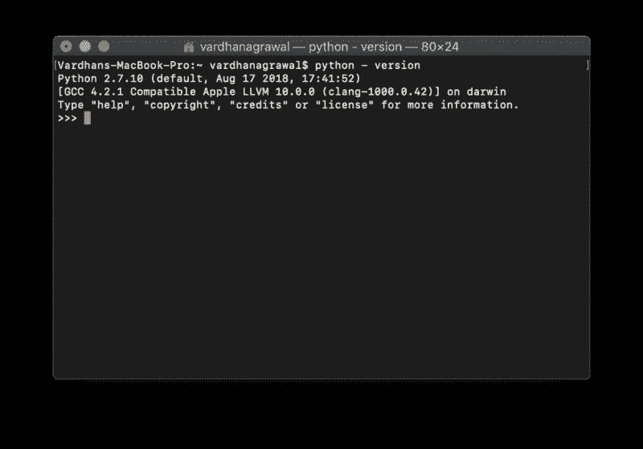
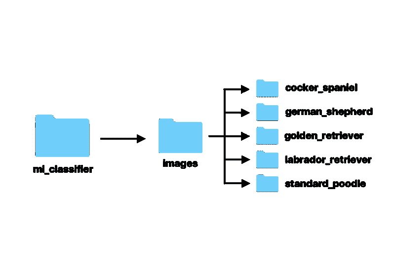
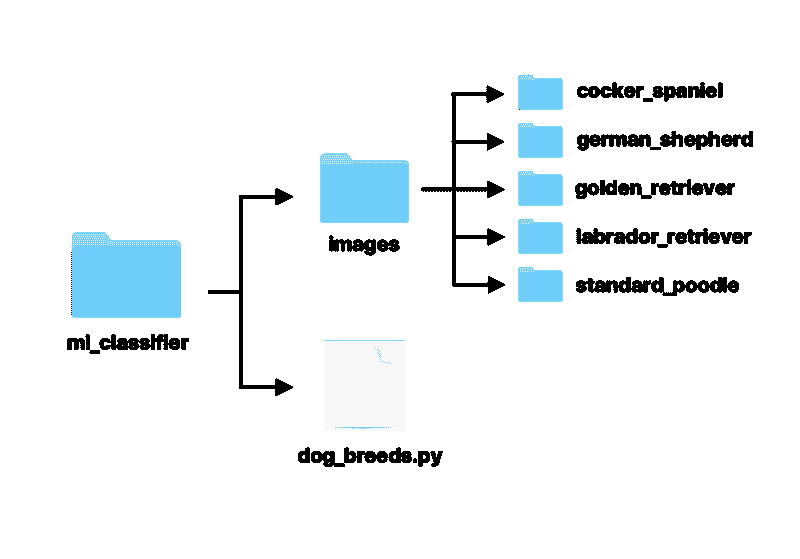
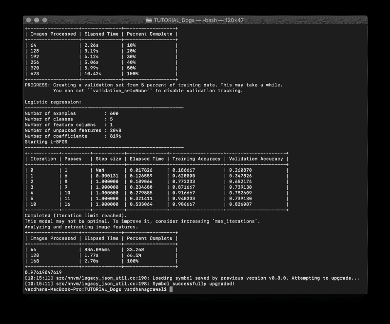

# 用 Turi Create 训练核心 ML 模型对犬种进行分类

> 原文：<https://www.freecodecamp.org/news/how-to-train-a-core-ml-model-with-turi-create-to-classify-dog-breeds-bc1d0fa108b/>

在本教程中，您将学习如何训练自定义犬种分类核心 ML 模型，以便在 iOS 和 macOS 应用程序中使用。到本教程结束时，您的核心 ML 模型将能够区分五个不同的品种！

你可能还记得，苹果几年前以超过 2 亿美元的价格收购了机器学习和人工智能初创公司 Turi 它提供了在短时间内创建高级机器学习模型的强大工具。

在本教程中，您将学习在 Mac 上安装 Turi Create，创建一个 Python 脚本，并使用该脚本训练一个核心 ML 模型，您可以将该模型直接拖到 Xcode 项目中，并在应用程序中快速实现。

### 入门指南

在我们开始真正的机器学习部分之前，让我们先安装 Turi 和 Python 当然，你需要确保你的硬件和软件符合 Turi 的要求。

#### 要求

和你安装的任何软件一样，Turi Create 有一些特定的要求，这些要求可以在他们的官方 GitHub 页面上找到。

**Turi 创建支持:**

*   macOS 10.12 以上
*   Linux(使用 glibc 2.12+)
*   Windows 10(通过 WSL)

**Turi 创建要求:**

*   Python 2.7、3.5、3.6
*   x86_64 架构
*   至少 4 GB 内存

底线是，只要你的 Mac 是相当新的，你应该可以运行 Turi Create。如果你愿意，你可以使用另一个操作系统；但是，您可能需要修改一些步骤才能让它们工作。

#### 装置

安装 Turi Create 相当简单，尤其是如果你熟悉命令行的话。虽然您可以选择使用较新版本的 Python，但在本教程中我将使用 Python 2.7。

在 MacOS Mojave 中，Python 2.7 是默认安装的，所以你需要做的就是检查版本。在你的 Mac 上，打开**应用程序>实用程序> Te** 终端或者简单地用键盘 sho **rtcut 命令** -Space 搜索它。

要检查 Mac 上的 Python 版本，请输入:

```
$ python - version
```

这将告诉您 Python 的版本，您的控制台应该如下所示:



**Figure 1:** Checking the Python Version

如果你的版本不是 Python 2.7，或者因为某种原因没有安装在你的电脑上，你应该在这个链接安装[。如果您的输出看起来与我的相似，您就可以继续了。](https://www.python.org/downloads/release/python-2714/)

> 注意:有些人喜欢用虚拟机来安装 Turi Create，因为这是苹果公司推荐的。但是为了简单起见，我们将直接安装它。

要安装 Turi Create，只需在您的终端窗口中输入以下内容:

```
$ pip install turicreate
```

仅此而已！Turi Create 已成功安装在您的 Mac 上，可以使用了。现在，您可以构建分类、检测、回归和其他类型的模型。

#### 资料组

对于任何机器学习模型，你都需要一个数据集。在本教程中，你将学习如何训练一个简单的狗品种分类模型，这需要图像分类。我将使用的数据来自斯坦福大学的狗数据集。

为了让 Turi 能够识别预先分类的图像，你需要根据它们所代表的内容来组织它们。例如，所有金毛猎犬的图片都在一个文件夹中，而所有拉布拉多犬的图片都在另一个文件夹中。

为了简单起见，我们将只使用斯坦福大学数据集中数百个品种中的五个，但是你可以随意使用。我已经为您组织了它，并为它创建了一个[存储库](https://github.com/vhanagwal/dog-breed-dataset)。如果您选择添加更多的狗品种，只需添加更多的文件夹，并根据您的意愿命名。

#### 文件夹结构

到目前为止，您可能已经明白了排列数据集的方式对于正确训练模型至关重要——除此之外，Turi Create 没有其他方法可以知道什么东西去了哪里。现在花点时间整理一下自己。



**Figure 2:** Starting Folder Structure

这个层次图应该解释了所有的事情，在继续学习本教程之前，你需要按照这个顺序放置你的文件夹。如果你想改变名字或安排不同的事情，你需要确保你记下这一点。

### 训练分类器

完成设置后，您就可以开始学习本教程的内容了——实际上是训练您的分类器。我们将主要使用 Python，但是如果你以前从未使用过 Python，那也没关系。我会在我们进行的过程中解释每一步，如果您有任何问题，请不要犹豫，在下面留下您的评论。

#### Python 文件

首先，我们需要一个地方来放下我们的想法(当然，是用 Python)。如果你已经有了一个支持 Python 的编辑器，比如 [Atom](https://atom.io) 或者一个集成开发环境，比如 [PyCharm](https://www.jetbrains.com/pycharm/) ，你可以用它们创建一个名为`dog_breeds.py`的空白文件。

如果您像我一样喜欢更适合开发人员的路线，您可以使用终端来做同样的事情。您需要在您的`ml_classifier`文件夹中创建这个文件，与`images`文件夹放在一起，这样您的层次结构如下所示:



**Figure 3:** Folder Structure with Python File

要创建一个新文件，首先进入目标目录:

```
$ cd ml_classifier
```

然后，创建一个名为`dog_breeds.py`的新文件。

```
$ touch dog_breeds.py
```

瞧啊。您的文件夹、文件和图像都在它们需要的地方，您已经准备好继续下一步。我们将使用 Xcode 来打开我们的文件，所以请确保您已经安装了 Xcode 并且是最新的。

#### 加载数据集图像

最后，是时候开始通过我们刚刚创建的 Python 文件告诉 Turi 它需要做什么了。如果您连按该文件，默认情况下它应该会在 Xcode 中打开(如果您安装了 Xcode)。如果没有，您也可以使用另一个编辑器或 Python IDE。

#### 1.导入框架

```
import turicreate
```

在文件的顶部，您需要导入 Turi Create 框架。如果你愿意，你可以通过添加`as <your na` me >来创建一个名字作为参考。例如，如果您想在代码中将`it`称为 tc，您可以这样写:

```
import turicreate as tc
```

这将允许你调用它`tc`而不是写出`turicreate`。在本教程中，我将使用完整版本，称之为`turicreate`以减少歧义。

您还需要处理文件夹名称和其他与操作系统相关的任务，以便对图像进行分类。这将需要另一个名为`os`的 Python 库。要导入它，只需添加以下内容:

```
import os
```

#### 2.加载图像

```
data = turicreate.image_analysis.load_images("images/")
```

这里，我们将数据集中的所有图像存储到一个名为`data`的变量中。由于我们的`dog_breeds.py`文件与`images`文件夹在同一个目录中，我们可以简单地将`“images/”`作为路径。

#### 3.定义标签

现在 Turi Create 已经有了你所有的图片，你需要把文件夹名和标签名联系起来。当在 iOS 或 MacOS 应用程序中使用时，这些标签名称将在您的核心 ML 模型中返回。

```
data["label"] = data["path"].apply(lambda path: os.path.basename(os.path.dirname(path)))
```

这允许你将所有的文件夹名映射到一个“标签”名，这告诉 Turi Create 所有在“可卡犬”文件夹中的图片确实是可卡犬。

#### 4.另存为`SFrame`

如果你不熟悉一个`SFrame`，简单来说，它是你所有数据(这里是一张图片)和所有标签(这里是狗的品种)的字典。像这样保存你的`SFrame`:

```
data.save("dog_classifier.sframe")
```

这允许您存储已标记的图像，以供下一步使用。这是机器学习行业中相当标准的数据类型。

### 培训和测试

在 Turi Create 将你所有的标签图像都准备好之后，是时候进入最后阶段，最后训练你的模型了。我们还需要分割数据，以便 80%用于训练，20%在模型完成训练后用于测试——我们不必手动测试。

#### 1.加载 SFrame

现在，我们需要加载我们在上一步中刚刚创建的 SFrame。这是我们稍后将用来划分测试和训练数据的内容。

```
data = turicreate.SFrame("dog_classifier.sframe")
```

这将把类型为`SFrame`的`data`变量分配给我们在上一步中保存的 SFrame。现在，我们需要将数据分成测试和训练数据。如前所述，我们将对训练数据进行 80:20 的测试。

#### 2.拆分数据

是时候拆分数据了。在 SFrame 代码后，添加以下内容:

```
testing, training = data.random_split(0.8)
```

这段代码将数据随机分成 80-20 份，并分别分配给两个变量`testing`和`training`。现在，Turi 将自动测试您的模型，而无需您手动提供测试图像和创建应用程序——如果您需要进行调整，您不需要首先完全实现它，相反，您可以在您的 Python 文件中进行调整。

#### 3.培训、测试和导出

你的努力终于有了回报！在这一行 Python 代码中，您只需告诉 Turi Create 训练您的模型，同时指定您想要使用的架构。

```
classifier = turicreate.image_classifier.create(testing, target="label", model="resnet-50")
```

你只是告诉 Turi 使用你的`testing`数据(之前指定的)，并使用它们来预测`labels`(基于之前的文件夹结构)，同时使用`resnet-50`，这是最准确的机器学习模型架构之一。

要使用您的测试数据并确保您的模型是准确的，请添加以下内容:

```
testing = classifier.evaluate(training)print testing["accuracy"]
```

它使用您指定的`training`数据，并将测试后的结果存储在一个名为(您猜到了)`testing`的变量中。供您参考，它打印出了准确性，但如果有足够的时间使用 Turi Create 的 API，您也可以打印其他内容。

最后但同样重要的是，在给模型起一个有用的名字后，可以用这个一行程序将模型保存到文件系统中:

```
classifier.save("dog_classifier.model")classifier.export_coreml("dog_classifier.mlmodel")
```

当然，您也可以将您的模型保存为其他格式，但是对于这个例子，我将它保存为一个核心 ML 模型。

### 运行和输出

对于所有的 iOS 开发者来说——不，这不是一个不断自动编译和报错的 Xcode 项目。为了执行您刚刚编写的代码，我们需要通过终端来执行。

#### 运行 Python 文件

运行 Python 文件很容易！确保您位于正确的目录中，您需要做的只是在终端窗口中输入以下内容:

```
python dog_breeds.py
```

#### 输出

经过几分钟的训练后，你的`images`文件夹和`dog_breeds.py`文件会附带一个 SFrame、一个模型文件夹和一个**。mlmodel** 文件，也就是你的核心 ML 模型！

您还会在终端窗口中看到输出，如下所示:



**Figure 4:** Output after Running Python

这为您提供了有关训练和训练准确性、处理的图像数量以及其他有用信息的信息，您甚至可以在不使用模型的情况下使用这些信息来分析模型。

### 结论

我希望你喜欢阅读这篇教程，就像我喜欢制作它一样！以下是从这里开始的一些步骤。如果你想学习如何在 iOS 应用程序中使用你的核心 ML 模型，请查看我的另一个教程:

[**Core ML 中的图像识别入门**](https://code.tutsplus.com/tutorials/image-classification-through-machine-learning-using-coreml--cms-29819?_ga=2.101472841.993700883.1547096068-312075175.1521244044)
[*随着技术的进步，我们的设备可以使用内置摄像头来准确识别…* 代码。](https://code.tutsplus.com/tutorials/image-classification-through-machine-learning-using-coreml--cms-29819?_ga=2.101472841.993700883.1547096068-312075175.1521244044)
[tutsplus.com](https://code.tutsplus.com/tutorials/image-classification-through-machine-learning-using-coreml--cms-29819?_ga=2.101472841.993700883.1547096068-312075175.1521244044)

本教程将向您展示如何将您得到的`dog_classifier.mlmodel`模型应用到现实世界的 iOS 应用程序中。它还将教你解析一个直播视频，并采取个别帧的图像分类。

如果你对本教程有任何问题或意见，请不要犹豫，在下面的评论区提出来！我总是渴望听到反馈，问题，或者你如何使用本教程中的知识。

### 很容易支持我的工作！

一定要尽可能多次地按下“鼓掌”按钮,**在社交媒体上分享这个教程,**在推特上关注我。

[**瓦尔丹·阿格拉瓦尔(@vhanagwal) |推特**](https://twitter.com/vhanagwal)
[*瓦尔丹·阿格拉瓦尔的最新推文(@vhanagwal)。完全自学#ios 开发者，#讲师，和人类……*](https://twitter.com/vhanagwal)