# 如何在 HTML5 画布上显示图像

> 原文：<https://www.freecodecamp.org/news/how-displaying-an-image-on-html5-canvas-works-13e3f6a6c4bd/>

纳什·韦尔

好吧，这里有一个问题:“纳什，为什么我们需要一篇文章？”

好吧，找个座位坐下。

不等等。首先，看看这个。

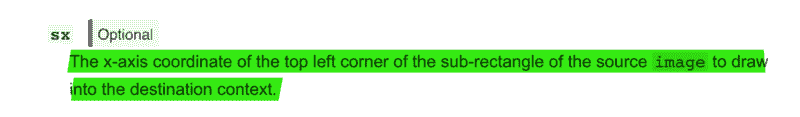

没错。那是什么？

`drawImage`是用于在`canvas`上显示或“绘制”图像的方法。你可能已经知道，也可能还不知道，这不仅仅是把图像的 URI 传递给它那么简单。`drawImage`最多接受 9 个参数。他们这样做，准备好了吗？屏住呼吸…

```
(image, sx, sy, sWidth, sHeight, dx, dy, dWidth, dHeight)
```

呼吸，呼气。

我发现`drawImage`的[文档](https://developer.mozilla.org/en-US/docs/Web/API/CanvasRenderingContext2D/drawImage)有点令人困惑和顽固。只是文件，是的。API 的概念和工作方式对于它应该服务的所有需求来说都是很棒的。

我们将一个接一个地检查上面提到的参数，让你完全理解。如果在文章的任何一点上，你发现自己在想“我只是想在画布上画一个图像，亲爱的纳什。为什么要让我的心思穿过铃声？”这将是一种可以理解的挫败感。

从某种程度上来说,`drawImage`的工作方式看起来确实很复杂，但是这种复杂性使得`drawImage`非常强大和有用——正如我们将在最后通过例子看到的。此外，这种复杂性只是表面上的:一旦你理解了全貌，这就是在欧洲某处的乡村公路上骑自行车下坡。

到本文结束时，你将能够通过查看 9 个参数的值来想象`drawImage`将如何在`canvas`上绘制任何给定的图像。听起来像是你想要的超能力？好吧，那么，让我们开始吧！

#### 在画布中载入图像

让我们从一张图片和一个 HTML5 `canvas`开始。

这是我们的目录的样子

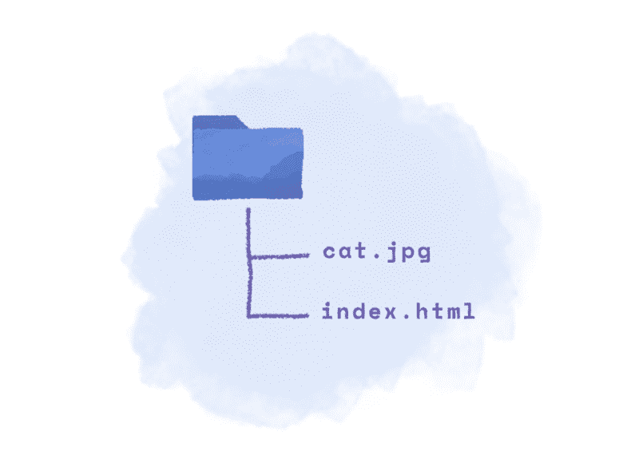

Directory Structure

在我们的`index.html`文件中，我们创建了一个新的画布元素，如下所示。

```
<canvas id="my-canvas" width="400px" height="200px"/>
```

我们的目标是获取`cat.jpg`图像并将其放在画布上(`#my-canvas`)。我已经说过了，这并不容易，贝蒂！否则我不会写这篇文章，你明白吗？很好。

首先，让我们使用 JavaScript 定位`canvas`元素并获取其上下文。

```
const myCanvas = document.getElementById('my-canvas'); const myContext = myCanvas.getContext('2d');
```

我们需要`myContext`与`canvas`元素进行交互。这就像，如果`canvas`是一张白纸，画布的背景就是笔。直觉上，你会告诉你的笔在一张白纸上画点什么，而不是对着纸大喊大叫在纸上画点什么，对吗？

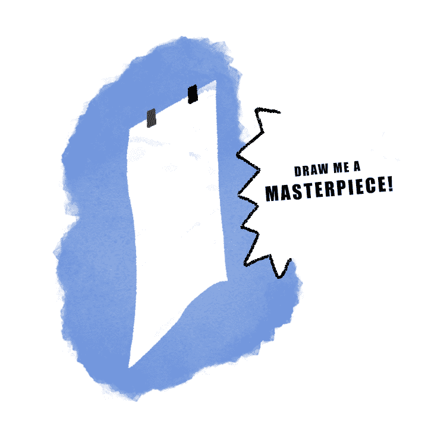

…or you might?

你可以用`context`做很多事情。你可以画一个矩形，或者一个椭圆或者一条线，或者一个… **图像**。另外，请注意上下文`myContext`隐式链接到了`myCanvas`。你可以有多个`canvas` es，并在每个 es 上调用`getContext()`来为每个 es 获得一个新的上下文/笔。在我们的例子中，我们只处理一个画布(`myCanvas`)和一个上下文(`myContext`)。

好了，解决了这个问题，我们终于可以开始尝试`drawImage`了。

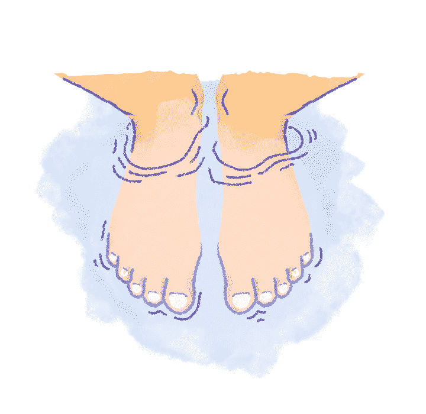

Feels gooood!

提醒一下，这里是`drawImage`接受的 9 个参数。

```
(image, sx, sy, sWidth, sHeight, dx, dy, dWidth, dHeight)
```

我们将从第一个参数`image`开始。先写点行不通的吧。

```
context.drawImage('./cat.jpg', 0, 0);
```

看到末尾的两个零了吗？很好。这不是文章中你应该理解它们的目的的部分。暂时忽略它们，只要记住纳什写了两个零，并且没有解释它们。我不会介意的。

现在注意上面代码行中的`...('./cat.jpg',..`。似乎是一个完全正确的 URI 不是吗？它是…buuuut，如果你在浏览器中启动`index.html`,你会看到一个很长很长的错误信息，如下所示。

```
ERROR: The provided value is not of type '(CSSImageValue or HTMLImageElement or SVGImageElement or HTMLVideoElement or HTMLCanvasElement or ImageBitmap or OffscreenCanvas)
```

*吞咽*

这个错误告诉我们，它需要一个图像元素，而不仅仅是图像的 URI。为了解决这个问题，我们可以这样做。

```
const canvas = document.getElementById('canvas'); const context = canvas.getContext('2d'); const img = new Image();        img.src = './cat.jpg';        img.onload = () => {          context.drawImage(img, 0, 0);        };
```

这是你没有预料到的，是吗？Canvas 需要一个预加载的图像来绘制/显示它。顺便说一句，没有必要对画布表现出任何蔑视。这是有原因的，就像我们其他人一样。我们最终会看到那些原因是什么，也许那时你会有同情心。

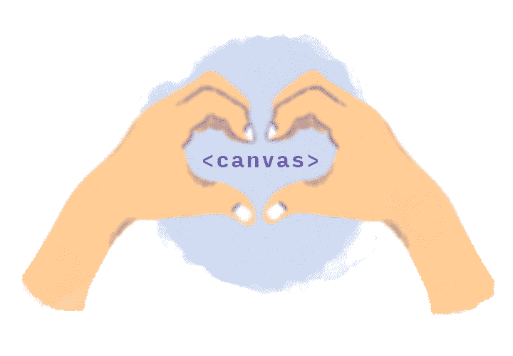

I ❤ canvas

概括一下:

`drawImage`要求 9 个参数，其中第一个是`image`。我们看到并理解`canvas`需要预载的图像来绘制，而不仅仅是图像的 URI。为什么它需要这个？当你阅读时，它会变得清晰。

现在是剩余 8 个参数的时候了。打开你的衣领！我要先学你一些图形编辑！

#### 如何裁剪图片

每一个图形编辑程序，即使是最基本的，都带有裁剪功能。这相当简单:打开一个图像>选择你想看到的区域>点击裁剪。就这样，那个令人讨厌的臭老头赤裸的啤酒肚露出来了。噗！

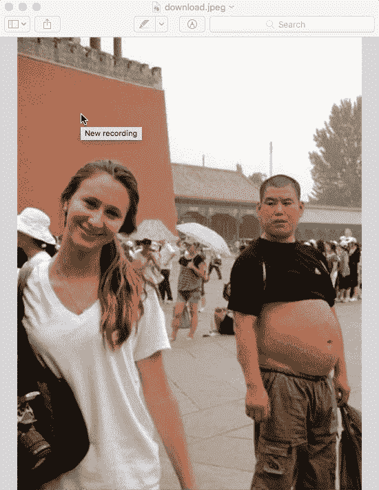

Image credits: [https://cheezburger.com/4406785536/classic-valentines-day-lover](https://cheezburger.com/4406785536/classic-valentines-day-lover)

技术！自从 Instagram 存在以来，保存人们的 insta gram。

让我们后退一步，在这里停下来。

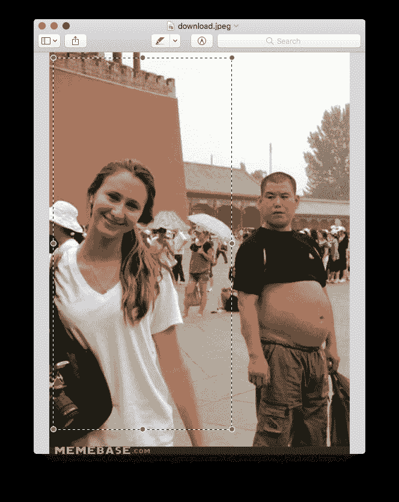

让我们在它上面标记一些点。

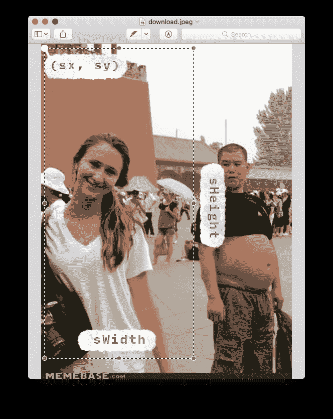

“等一下！`sx`、`sy`、`sWidth`和`sHeight`？我以前见过他们！”

是的，大约一分钟前！这就引出了文章最精彩的部分。

#### 在画布上显示图像，步骤 1:选择

`drawImage`执行的第一项任务(在幕后)是根据四个`s`参数(`sx, sy, sWidth, sHeight`)选择图像的一部分。你可以说所有 s 参数中的 s 代表“选择”。

事情是这样的。`sx`和`sy`标记图像上选择开始的点，或者换句话说，选择矩形左上角的坐标。`sWidth`和`sHeight`分别是选择矩形的宽度和高度。你可以滚动到最后一张图片来更清楚地了解我想解释的内容。

“但为什么选择纳什呢？它不能只显示整个图像吗？”我们离你所有的答案越来越近了，佩兴斯。

只需知道`drawImage`在接收到正确的图像后执行的第一步是根据您提供的 s 参数`(sx, sy, sWidth, sHeight)`选择图像的一部分/区域。

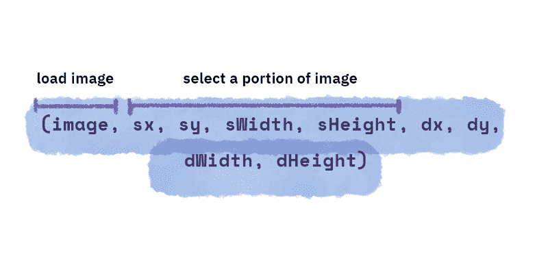

请记住，您不必总是选择图像的一小部分，如果您愿意，您可以选择整个图像。在这种情况下，`sx`和`sy`将分别具有值 0 和 0，并且`sWidth`、`sHeight`将与图像的宽度和高度相同。

此外，`sx`和`sy`也欢迎负值。`sx`和`sy`的值相对于左上角图像的原点。

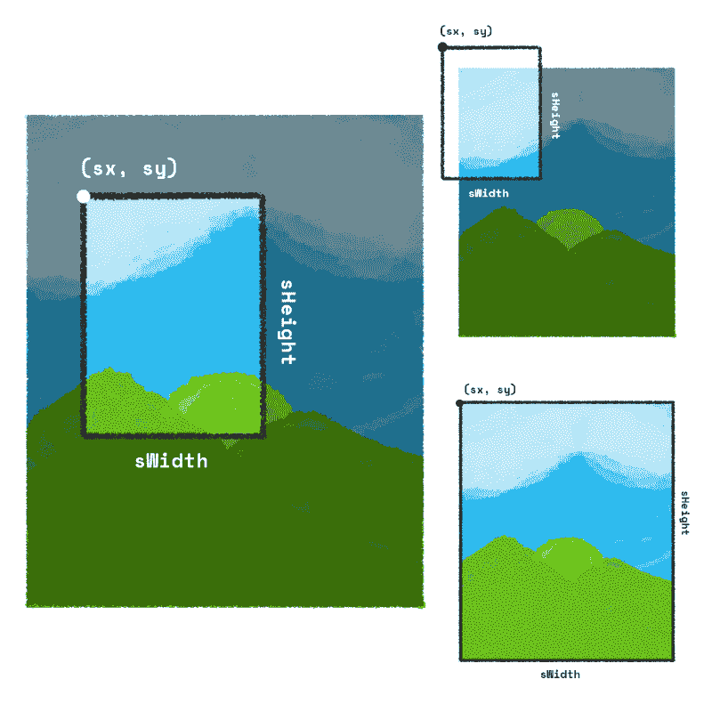

1\. Select a portion of an image 2\. Negative values for sx and sy 3\. Select the entire image

一旦`drawImage`选择了您要求的图像区域——我们很快就会看到为什么选择图像区域会有帮助——下一步就是在画布上绘制图像的选定部分。

官方文档中的“最初”`s`和`d`分别代表“来源”和“目的地”。但是，在我们之间，让我们称之为‘选择’和‘画’。这样更有意义，不是吗？

又来了。`s`选举完毕，下一步就是`d`生了。

#### 在画布上显示图像，步骤 2:绘图

为了绘制图像的选定部分，我们再次需要四个参数。

1.  画布上开始绘制位置的 x 坐标。(`dx`)
2.  在画布上开始绘制的 y 坐标。(`dy`)
3.  绘制图像的宽度。(`dWidth`)
4.  绘制图像的高度。(`dHeight`)

`dx`和`dy`的值将相对于画布的原点。

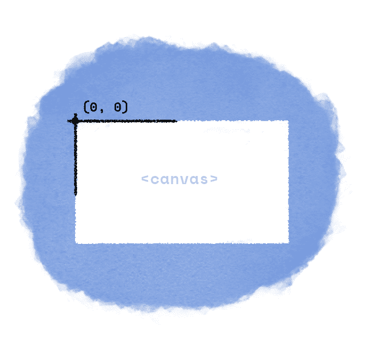

The canvas

这里有一个非常重要但微妙的细节需要注意。`dWidth`和`dHeight`与`sWidth`和`sHeight`没有任何关系。它们是独立的价值观。你为什么需要知道这个？嗯，因为如果你不仔细选择“绘制”的宽度和高度值，你最终会得到一个拉伸或压扁的图像，就像这样。

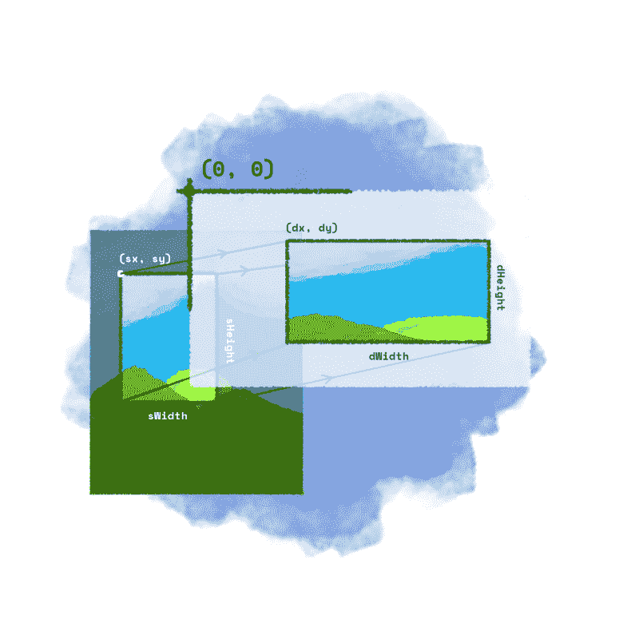

所以如果这不是你想要的(我希望你不是)，确保保持长宽比。或者这么说`sWidth`除以`sHeight`应该等于`dWidth`除以`dHeight`。这是一个小小的免责声明，你是你自己世界的统治者，可以自由选择你喜欢的价值观。

因此，在画布上显示/绘制图像的整个过程可以概括为两个步骤:选择和绘制。

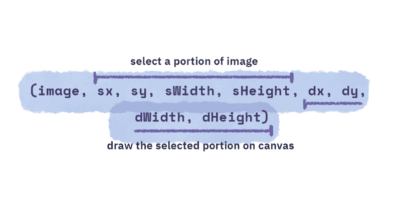

厉害！没那么复杂吧？

至此，我们已经完成了所有的理论。在接下来的文章中，我们将用一个有趣而实用的例子来烘烤你头脑中的知识面糊，这样你就可以开始了。但是，在此之前，让我们谈谈关于`drawImage`的最后一件重要的事情。

#### 默认值

还记得我的讲座“嘿，保持长宽比，小心不要从陌生人那里拿巧克力…”事实证明，你可以省略某些值，根本不用担心长宽比。至于从陌生人那里拿巧克力，还是那句话——你是自己世界的主宰。

下面是使用该方法的一种方式。

```
drawImage(image, dx, dy)
```

仅此而已！在这种情况下，您只告诉`drawImage`画布上开始绘图的位置。其余的`sx`、`sy`、`sWidth`、`sHeight`、`dWidth`、`dHeight`由自动处理。该方法选择整个图像`(sx = 0, sy = 0, sWidth = image's width, sHeight = images' height)`并在`(dx, dy)`开始在画布上绘制，其中`dWidth`和`dHeight`与`sWidth`(图像的宽度)、`sHeight`(图像的高度)相同。

记得我没解释的两个零吗？这就是两个零的由来。

使用该方法的另一种方式是，

```
drawImage(image, dx, dy, dWidth, dHeight)
```

在这种形式中,`sx, sy, sWidth and sHeight`被处理，该方法自动选择整个图像，并由您选择在哪里绘制图像以及绘制多大的图像。

相当酷！不是吗？

如果你能再给我两分钟时间，我想告诉你为什么`s`选举和`d`抽签是两个独立的操作。以及它是如何有帮助的。

你注意到我了吗？太好了！

所以在这里。

听说过精灵吗？你看，精灵是一个计算机图形概念，图形可以在屏幕上移动，或者作为一个单独的实体进行操作。

…?

我从谷歌上复制了这个定义，听起来很温和。

好吧好吧。记得马里奥吗？

很好。

让我们做一些有趣的事情。

#### 用 drawImage 制作马里奥动画

你看，当马里奥向前/向后或向任何其他方向移动时，就好像他在走路一样。他的位置改变了，但是也伴随着他的腿和手移动的动画。

他们是怎么做到的？他们是否连续展示马里奥的不同图像，就像一本动画书，看起来好像他在移动？

嗯，50%是。想象一下，存储和加载描述我们程序(或游戏)中每一帧动画的大量图像会是多么耗费资源。取而代之的是，只有一张图片，所有的位置都在**一个网格**中。如下图所示。

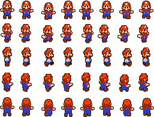

Mario Sprite (Source: [https://redballbomb.deviantart.com/art/Mario-and-Luigi-Run-Overworld-Sprite-Sheet-723563974](https://redballbomb.deviantart.com/art/Mario-and-Luigi-Run-Overworld-Sprite-Sheet-723563974))

为了执行动画，不是每毫秒加载一个新图像，而是通过视窗在不同位置显示同一图像的一部分。很聪明不是吗？

所以，是的，它有点像一本动画书，实际上是一本聪明的动画书。

现在，如果你能稍微伸展一下，弹出你的指关节，我希望我们能重现马里奥走路的动画。我们将使用上面显示的精灵和目前为止我们所知道的关于`drawImage`的一切。

准备好了吗？开始了。

让我们再来看一下我们的精灵，并试着计算它所在的网格尺寸。

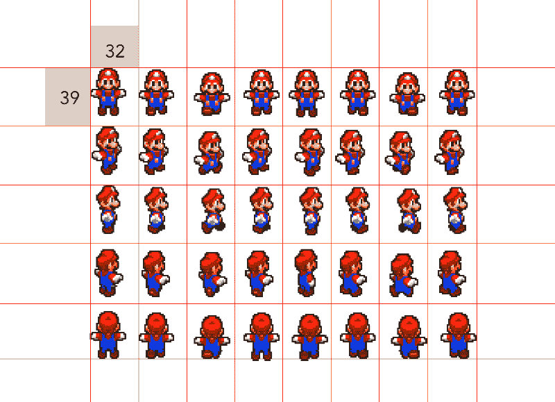

我们在这里所做的就是在精灵上想象一个网格。注意，整个网格是由相同尺寸的单元组成的`(32 x 39)`。但它仍然只是一个图像，记住这一点。

太好了！现在让我们开始写一些代码。我们将以通常的方式开始，首先创建一个`canvas`元素，在 JavaScript 中获取它及其上下文，然后加载我们的 Mario spritesheet。

```
// index.js const canvas = document.getElementById('canvas'); const ctx = canvas.getContext('2d'); const img = new Image();       img.src = './mario.png';       img.onload = () => {          ctx.drawImage(img, 0, 0);       }; 
```

```
// style.css canvas {   /*Add a border around canvas for legibility*/   border: 1px solid grey; }
```

上面的代码将产生以下结果。

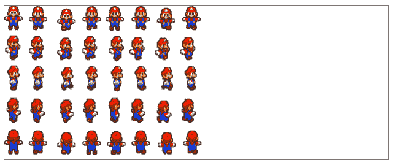

哇哦-好吧！我们有图像显示！到底发生了什么？

这里，我们使用的是`drawImage`–`drawImage(image, sx, sy)`的形式，整个图像是`s`选择的，`d`按原样绘制在画布上。

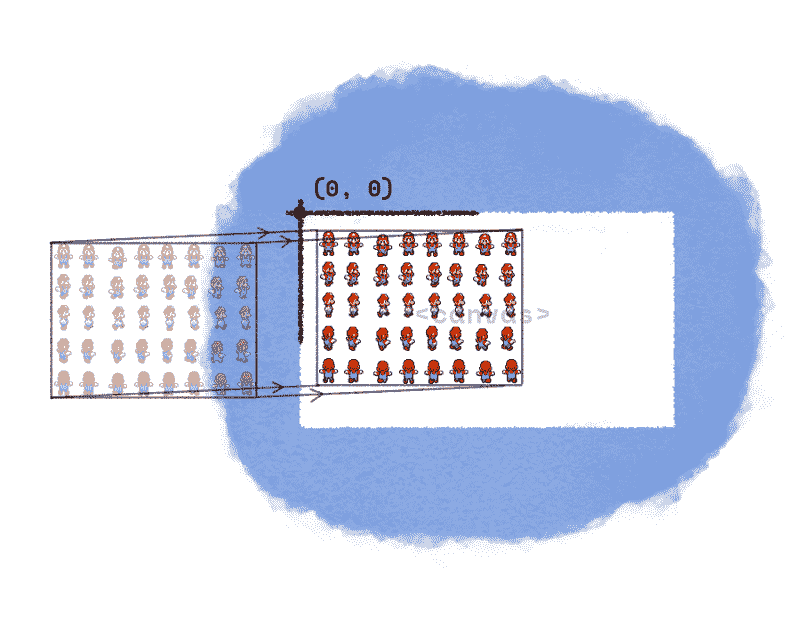

Drawing the entire sprite on canvas

首先，我们要做的是只选择网格中的一个单元格，并只绘制这一个单元格。让我们首先对代码进行调整，选择第三行的第一个单元格，Mario 面朝东站着。一旦我们完成了，我们将会考虑如何制作动画。听起来不错？可爱！

让我们对代码进行必要的修改。

```
const canvas = document.getElementById('canvas'); const ctx = canvas.getContext('2d'); 
```

```
// Mario variables const MARIO_WIDTH = 32; const MARIO_HEIGHT = 39; 
```

```
const mario = new Image(); mario.src = './mario.png'; mario.onload = () => {   ctx.drawImage(     // Image     mario,     // ---- Selection ----     0, // sx     MARIO_HEIGHT * 2, // sy     MARIO_WIDTH, // sWidth     MARIO_HEIGHT, // sHeight     // ---- Drawing ----     0, // dx     0, // dy    MARIO_WIDTH, // dWidth     MARIO_HEIGHT // dHeight   ); };
```

首先，注意两个变量`MARIO_WIDTH`和`MARIO_HEIGHT`。它们是网格单元的维度，仅此而已。我们定义它们是为了让我们更容易使用这些常数的倍数来遍历网格。有道理？

很好。

接下来，在`// Selection`块中，我们定义了我们想要选择的图像区域，在`// Drawing`部分，我们定义了宽度和高度以及在画布上开始绘制的位置……就这样，我们成功地绘制了整个虚拟网格的一个单元格。

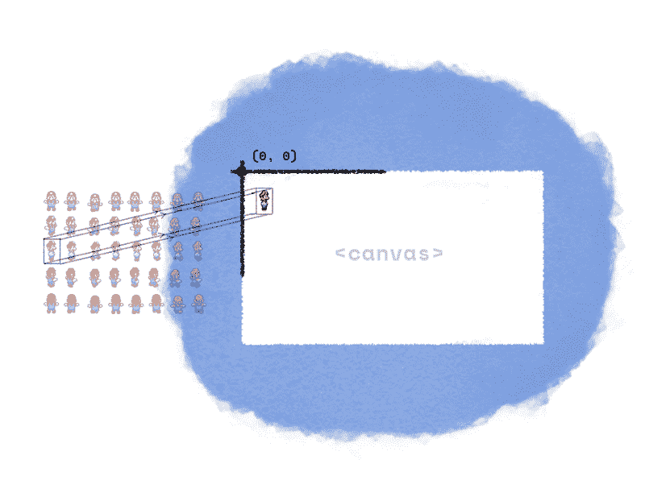

Drawing just one portion of the sprite on canvas.

相当简单，只是选择和绘制。现在，在这一点上，我想离题到一个关于长宽比的老话题。“纳什！又来了？“我知道我知道。但是很酷！看啊！

如果我改变`dWidth`或`dHeight`的值，或者两者都改变，看看图像是如何拉伸和挤压的。

```
... ctx.drawImage(   // Image    mario,   // ---- Selection ----    0, // sx    MARIO_HEIGHT * 2, // sy    MARIO_WIDTH, // sWidth    MARIO_HEIGHT, // sHeight    // ---- Drawing ----    0, // dx    0, // dy    MARIO_WIDTH * 2, // dWidth    MARIO_HEIGHT * 1.5 // dHeight  ); ...
```

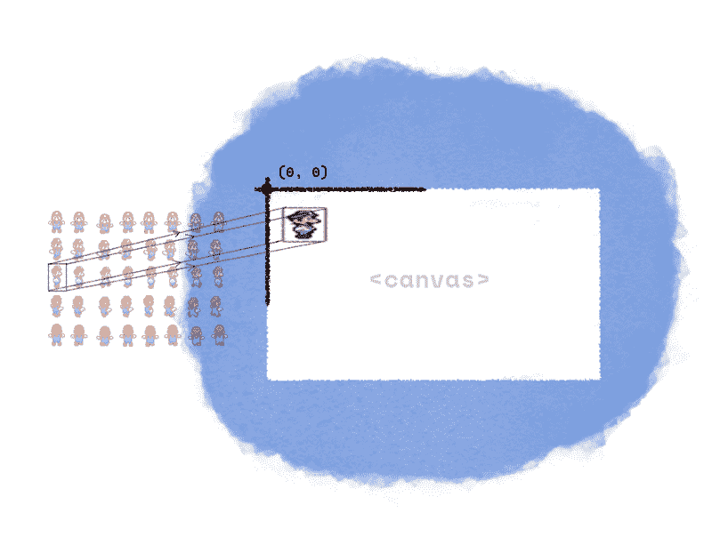

哈！看吧！这就是为什么我建议你保持纵横比，选择和绘制的值没有真正的联系。

好吧，回到我们正在做的。

现在我们在画布上有了马里奥，小小的。我们需要制作动画，或者换句话说，在同一位置连续显示不同的帧，并产生运动的错觉。我说得太具体了吗？真见鬼。

我们可以通过选择想要连续绘制的网格单元来做到这一点。我们只需要将`sx`的值改变`MARIO_WIDTH`的倍数即可。

现在这样做将需要使用`requestAnimationFrame`，我已经在[这篇](https://uxdesign.cc/how-you-can-use-simple-trigonometry-to-create-better-loaders-32a573577eb4)文章和[这篇](https://uxdesign.cc/how-to-fix-dragging-animation-in-ui-with-simple-math-4bbc10deccf7)文章中解释过了。

作为一个小小的挑战，你为什么不试着自己完成呢？无论如何，你可以看看这个代码笔，我让马里奥这样运行。这支笔有足够的注释来帮助你理解用于制作动画的一点点高中数学知识。

可爱的小东西！

至此，我们完成了对`drawImage`的全面解释。希望你喜欢。

如果你已经做到了这一步，给我一些反馈或者在 Twitter 上给我发一些#goodvibes 怎么样？

> 本文原载于 [www.nashvail.me](http://www.nashvail.me/blog/canvas-image) 。

我跟你说过我的新网站吗？我告诉过你它也有一份[时事通讯](http://eepurl.com/gehwqP)吗？如果你订阅的话，我会很高兴，这样我就可以在每次我发布新东西或者在[我的商店](http://nashvail.me/shop)出售新东西的时候通知你。我会继续在 Medium 上发表文章，但在它第一次出现在我的网站上和出现在这里之间会有两周的间隔。

非常感谢您的阅读，非常感谢您的支持。祝你愉快！:)