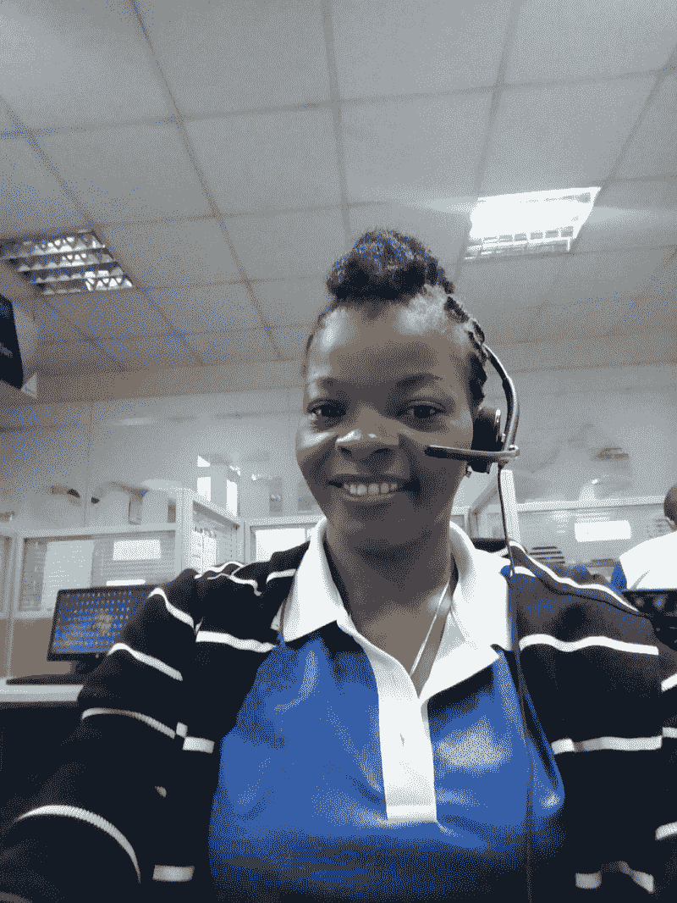
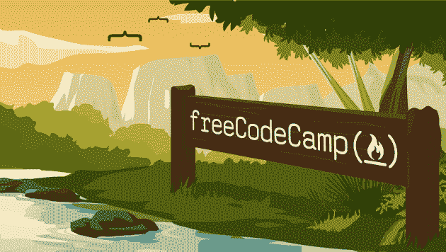
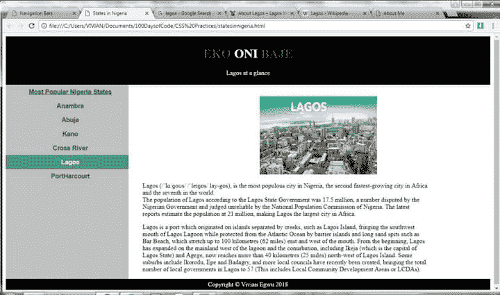
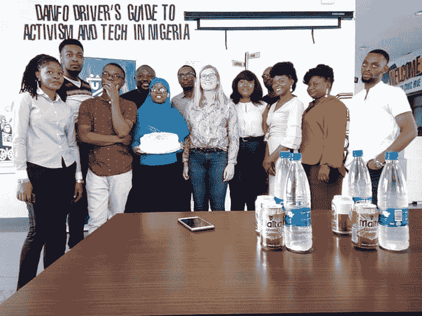
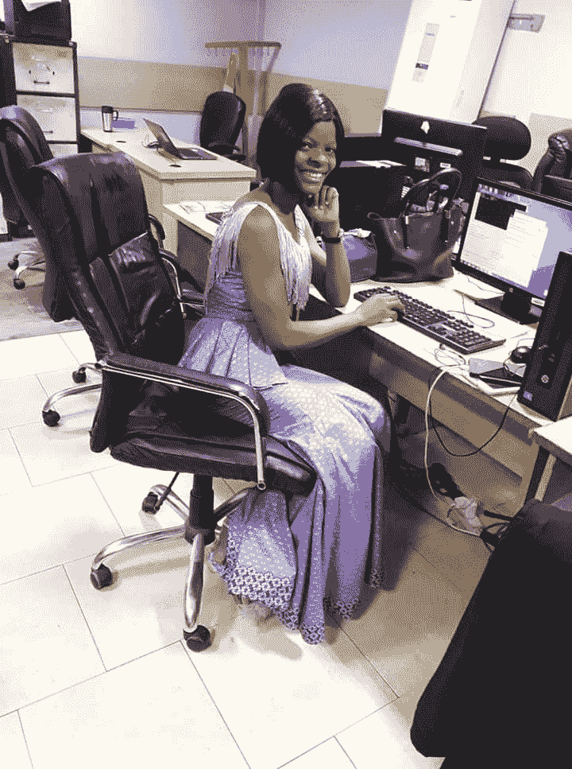
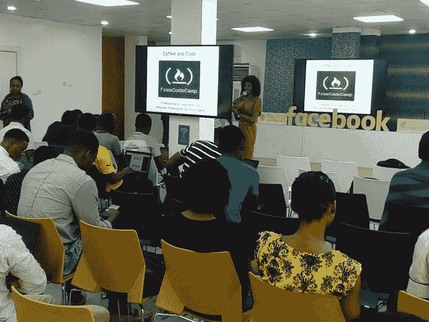

# 我如何通过#100DaysofCode 挑战成为一名程序员

> 原文：<https://www.freecodecamp.org/news/how-i-became-a-programmer-with-the-100daysofcode-challenge-19b01f17bca1/>

薇薇安·埃格武

# 我如何通过#100DaysofCode 挑战成为一名程序员

作为一个在农村长大的孩子，没有正常的电力供应或互联网，在很小的时候就失去了父亲，现代世界的想法从未离开过我。

作为一个寡妇，我妈妈知道我作为一个女孩在村子里唯一的机会就是教育。和教育，她给了我。我在尼日利亚东部的村庄长大，有机会上学。

即使当我在外婆家和妈妈家之间穿梭时，我也能从他们眼中看到给我最好的东西的决心。当我在村子里种田帮助奶奶的时候，我会在假期在拉各斯的街上卖充值卡，这样妈妈就会知道并理解她并不孤单。

这个旅程是一个女孩和她的寡妇母亲的生存。我毕业了，但找工作却成了另一段旅程。我最终找到了一份客户服务代表的工作。

Me on duty as a customer service officer.

对我来说，公司的突然改组，导致我的同事们纷纷离职，是一个关键时刻。这让我大开眼界，原因有很多，但只有一个最突出。我需要创造就业机会，而不是被解雇。

这开始了我的软件开发之旅。当我发现我负担不起拉各斯不同培训中心的专业培训时，我发誓要自学。这并不重要，因为我热衷于通过简单的技术解决方案创造财富和工作机会。

我上网搜索学习资料。2018 年 1 月 3 日，我偶然发现了 [freeCodeCamp](https://www.freecodecamp.org/) ，并决定尝试一下。

我从 HTML 开始，在经历了一些编码挑战后，我被引导加入了他们的一个脸书小组。我加入了拉各斯自由代码营组织。

在滚动页面时，我注意到 Hector Okolo(管理员)发了一个帖子，要求那些尚未配对参加# 100DaysCodeChallenge 的人进行配对。

我问# 100 日挑战是什么意思，整个想法看起来很棒。我表示感兴趣，并被配对。当时我还在做客户代表。这是一份 7 小时的工作，可以是早班也可以是下午班。我决定每天花两个小时的时间参加代码挑战。

如果我上下午班，我会在家写代码；如果我上早班，我会在下班后花两个小时完成两个小时的代码挑战。我把我每天学到的东西贴在脸书自由代码营的页面上，并贴在我的 T2 推特页面上，希望能得到比我了解得更多的人的指正。

我这样做了一个月，设计出了一个我称之为 Naijapedia 的单页无响应网站。

Screenshot of the Naijepedia website

我们的想法是自己讲述尼日利亚的故事。我希望其他大陆知道，非洲并不像大多数人所说的那样是一个黑暗的大陆，而是由各种“灰色”(坏的、好的和最好的)组成，包括聪明和创新的年轻人。

现在，我已经加入了脸书开发商 Lagos 的脸书页面。我将这一页的截图发布在脸书开发者小组上，并解释了其背后的想法。

从那一页中我得到的鼓励的话语是惊人的。一些人问这个项目是否是开源的，这样他们就可以做出贡献。当时，我不知道什么是开源和 Github，所以我把它们加入了我的学习清单。

那天我遇到的一个令人惊奇的人是约瑟夫·琼斯·阿贡比耶德。在看到我在脸书开发商 Circle Lagos 上的帖子后，他开始和我聊天。

我们谈论了很多围绕我的工作和对编程的热情的事情。得知我在自学，负担不起从编程学校学习的费用，他给了我一份奖学金，让我去他位于尼日利亚拉各斯 Yaba 的编程学校[Univelcity](http://univelcity.com/)参加他的前端开发课程。

那天我做了一生中最大的决定。我决定接受奖学金并辞职。这是一个艰难的决定，但无论如何我做了，我今天不后悔。

Graduation Day at Univelcity Programming School Yaba Lagos.

经过三个月的实践，我获得了三家不同公司的带薪实习机会([公民媒体实验室](http://www.civicmedialab.ng/)、[科技发展](https://www.techadvance.ng/)和[机器人系统](https://sci.ng/))。我在机器人系统实习，也就是尼日利亚拉各斯的计算智能学院 Yaba。

这是报酬最低的实习机会，但是当我知道 18 个不同团队的年轻开发人员正在开发两个很棒的应用程序时，我选择了它。

在 Robotics，我与开发 Secapay(一种金融科技解决方案)和伊菲(一种活动管理系统)的团队一起工作。实习结束后，我作为[的主持人](https://twitter.com/CodeLagos/status/1001841998930825216)加入了 [CodeLagos](https://codelagos.org/) ，这是由拉各斯州州长安博德发起的一项培训年轻人编程的计划。

其余的，正如他们所说，都是历史了。今天，我正在为尼日利亚一家领先的银行开发一个应用程序，目前正在使用 [GreyAfricaHub](https://www.facebook.com/greyafricahub/?ref=br_rs) 免费培训同一领域的年轻人。

GreyAfricaHub Free Web Design training at DevamplifyHub Awka Anambra State Nigeria.

我还没有到那一步，我每天都在学习和进化。

New office as a Software Developer

我 2019 年的目标是成为一名高级开发者。我的激情和灵感来自内心。为年轻人创造就业机会和帮助遏制尼日利亚失业的雄心让我继续前进。

我目前是拉各斯自由代码营[的撰稿人、](https://www.facebook.com/groups/free.code.camp.lagos/)[拉各斯](https://www.facebook.com/groups/DevCLagos/)脸书开发者圈的版主和[greyafcahub](https://www.facebook.com/greyafricahub/)的创始人。我的目标是指导、培训和帮助培养能够自给自足、自力更生和自主创业的年轻人。

我组织了聚会、研讨会、讲习班，并在一些活动中与这些团体进行了平等的交流。

Speaking at freeCodeCamp Lagos Meet-Up.

我期待着有一天能有一个最好的软件解决方案，其唯一的目标是遏制非洲的青年失业。我还承诺在 2019 年指导 7 名有抱负的女性开发人员。

我不确定我会是最好的导师，但我保证我们会一起学习，直到我们都达到我们作为软件开发人员的目标。

我可能还没有创造 1000 万个工作岗位，但是，嘿，我在这条路上，我很开心。